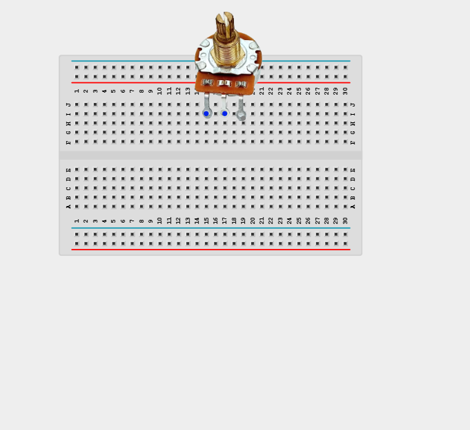
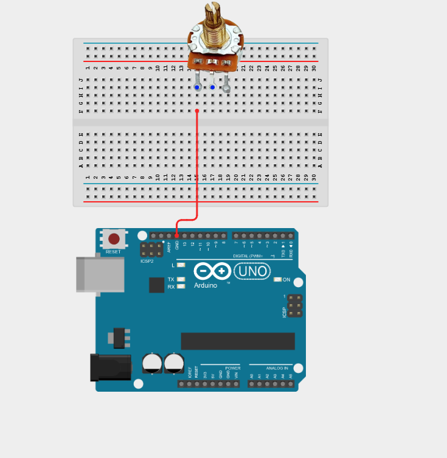
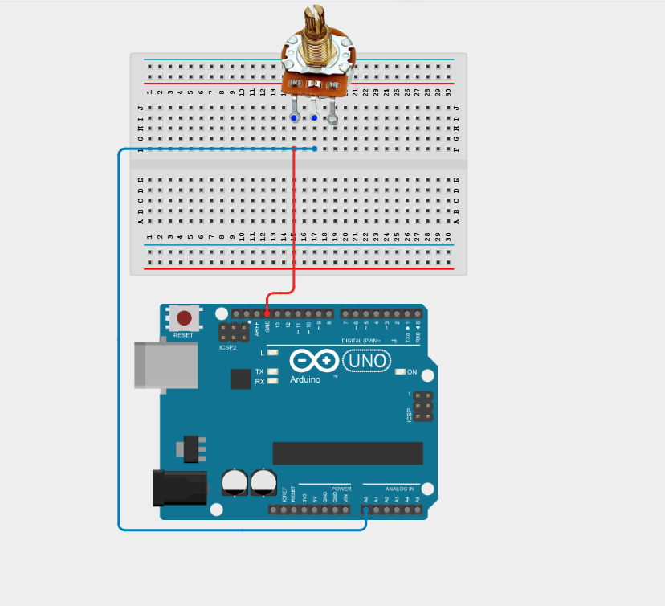
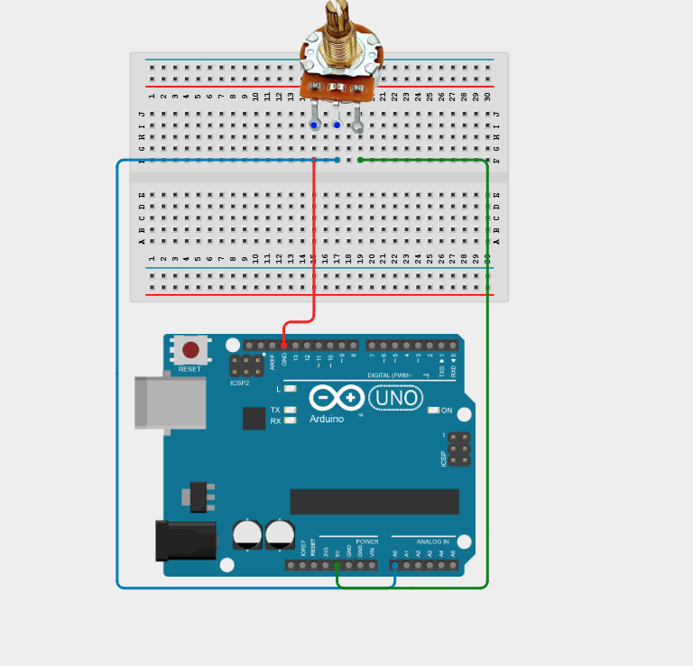
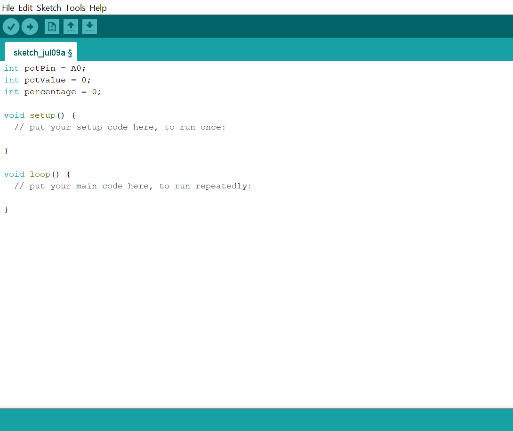
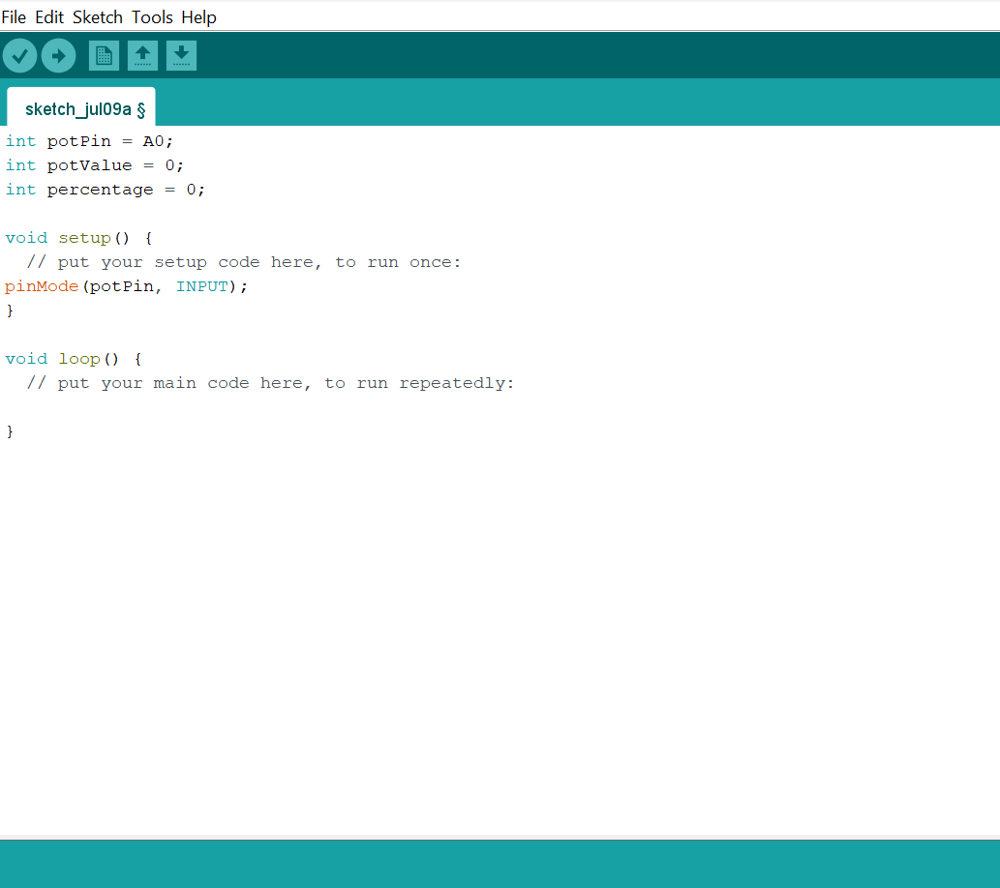
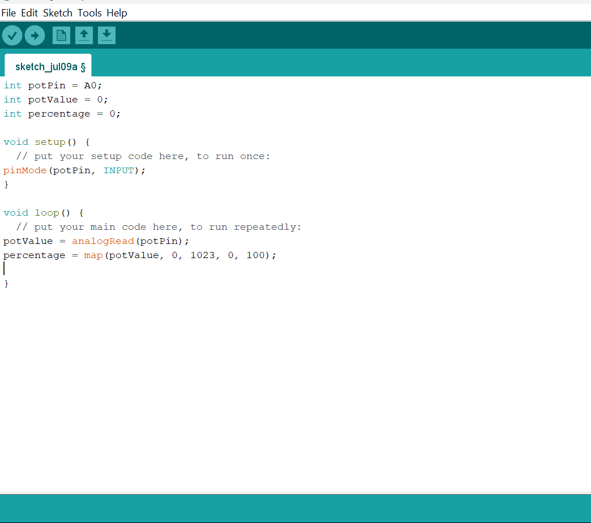
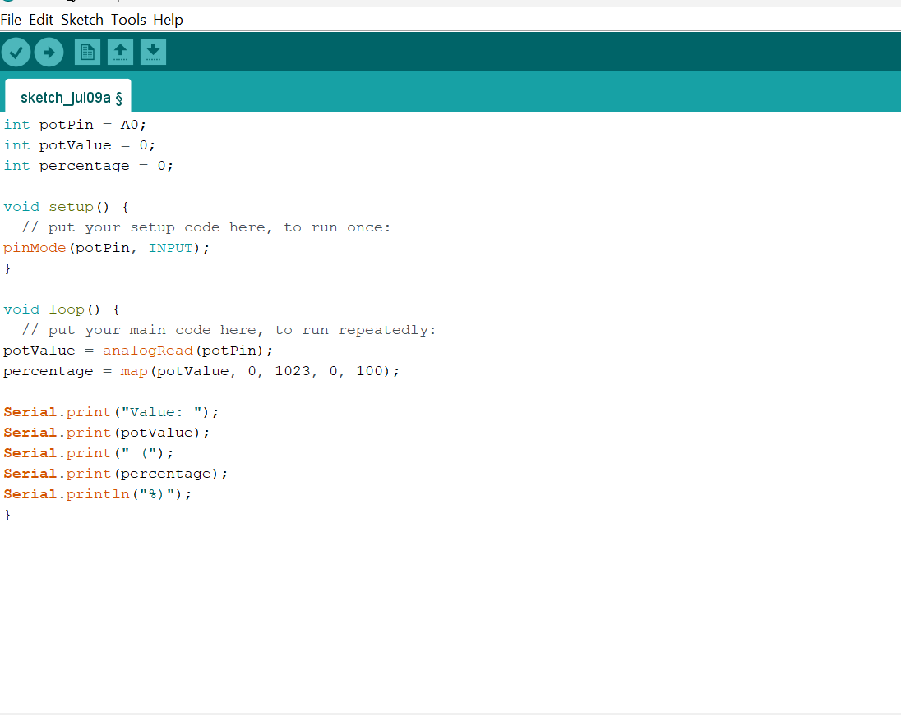

# Project 1.12.2: Analog Dial Positioner

| **Description** | This project shows how to read the analog output of a rotary potentiometer and map the value to a meaningful scale such as percentage displayed on the Serial Monitor. |
|------------------|----------------------------------------------------------------|
| **Use case**     | This project can be used in volume control knobs, dimmer switches, and any application requiring variable analog input. |

## Components (Things You will need)

| | | | | |
|-------------------------|-------------------------|-------------------------|-------------------------|-------------------------|

## Building the circuit

Things Needed:

- Arduino Uno = 1
- Arduino USB cable = 1
- Potentiometer = 1
- Red jumper wires = 1
- Blue jumper wires = 1
- Green jumper wires = 1

## Mounting the component on the breadboard

**Step 1:** Place the potentiometer on the breadboard.

_**NB:** Make sure you identify the correct pin connections for the component._

## WIRING THE CIRCUIT

**Step 2:** Connect the red jumper wire from the left pin (Pin 1) of the potentiometer to a GND pin on your Arduino Uno.

**Step 3:** Connect the blue jumper wire from the middle pin (Pin 2) of the potentiometer to the A0 pin on the analog side of your Arduino Uno.

**Step 4:** Connect the green jumper wire from the right pin (Pin 3) of the potentiometer to the 5V pin on your Arduino Uno.

_Make sure to connect the Arduino USB cable to the Arduino board._

## PROGRAMMING

**Step 1:** Open your Arduino IDE. See how to set up here: [Getting Started](../../Getting Started/Arduino_IDE_Setup.md).

**Step 2:** Type `int potPin = A0;`, `int potValue = 0;`, `int percentage = 0;` as shown in the image below.

**Step 3:** Type `pinMode(potPin, INPUT);` inside the void setup() as shown in the image below.

**Step 4:** Type `potValue = analogRead(potPin);`, `percentage = map(potValue, 0, 1023, 0, 100);` inside the void loop() as shown in the image below.

**Step 5:** Type `Serial.print("Value: "); Serial.print(potValue);`  `Serial.print(" ("); Serial.print(percentage); Serial.println("%)");` as shown in the image below.

**Step 4:** Save your code. _See the [Getting Started](../../Getting Started/Arduino_IDE_Setup.md) section_

**Step 5:** Select the Arduino board and port. _See the [Getting Started](../../Getting Started/Arduino_IDE_Setup.md) section_

**Step 6:** Upload your code.

**Step 7:** Open the Serial Monitor (Tools > Serial Monitor) to view the output.

This project helps learners understand how to interface with Potentiometer using Arduino. It introduces essential concepts in electronic circuits and embedded system programming.

