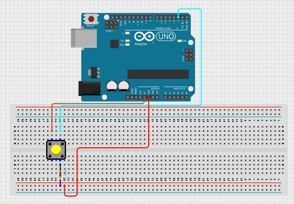
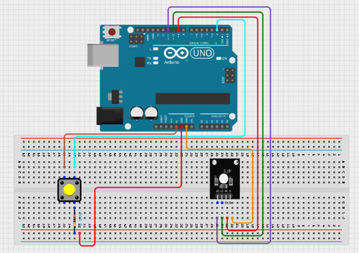
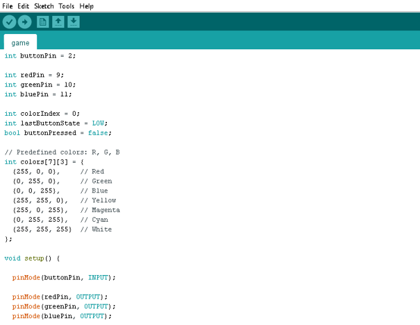
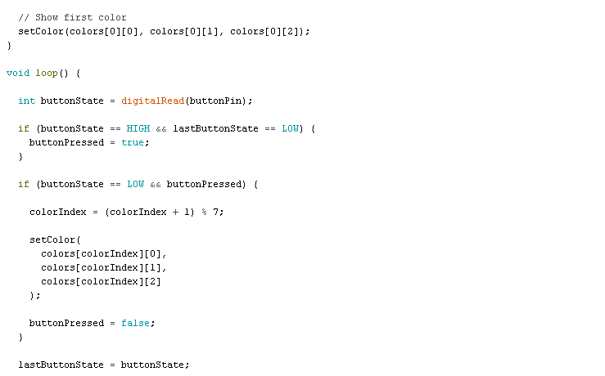
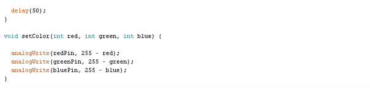

# Project 1.13.1:Push Button RGB Selector

| **Description** | This project uses a push button to cycle through different RGB LED colours. Each time the button is pressed, the RGB LED changes to the next preset colour in the sequence. After the last colour is displayed, the cycle starts again from the first colour.
| --------------- | -------------------------------------------------------------------------------------------------------------------------------------------------------------------------------------------------------------- |
| **Use case** | Colour selection systems, mood lighting, user interface indicators, RGB LED control demonstrations.|

## Components (Things You will need)

|  |  |  |  | | |
| ---------------------------------------- | --------------------------------------------------- | ----------------------------------------------------------- | ----------------------------------------------------- | ------------------------------------------------------ | ------------------------------------------------------ | 

## Mounting the component on the breadboard

**Step 1:**
 Place the RGB LED on the breadboard.
Connect the RGB LED:
•	Red pin → Pin 9 
•	Green pin → Pin 10 
•	Blue pin → Pin 11 
•	Common Cathode (-) → GND 

.

**Step 2:** 
Place the RGB LED on the breadboard.
Connect the RGB LED:
•	Red pin → Pin 9 
•	Green pin → Pin 10 
•	Blue pin → Pin 11 
•	Common Cathode (-) → GND 

.

**Step 3:** After completing the wiring, connect the Arduino Uno to the computer using the USB cable.

## PROGRAMMING

**Step 1:** Open your Arduino IDE. See how to set up here: [Getting Started](../../Getting Started/Arduino_IDE_Setup.md).

**Step 2:** Type the following codes;

.

.

.

## Uploading the code

**Step 1:** Save your code. _See the [Getting Started](../../Getting Started/Arduino_IDE_Setup.md) section_

**Step 2:** Select the arduino board and port _See the [Getting Started](../../Getting Started/Arduino_IDE_Setup.md) section:Selecting Arduino Board Type and Uploading your code_.

**Step 3:** Upload your code. _See the [Getting Started](../../Getting Started/Arduino_IDE_Setup.md) section:Selecting Arduino Board Type and Uploading your code_

## OBERVATION
When the button is pressed:
-	First press → Green 
-	Second press → Blue 
-	Third press → Yellow 
-	Fourth press → Magenta 
-	Fifth press → Cyan 
-	Sixth press → White 
-	Seventh press → Red (cycle repeats) 
The RGB LED changes colour every time the button is pressed.

## CONCLUSION

This project demonstrates digital input handling, button debouncing, arrays, RGB LED control, PWM output, and colour cycling techniques. It provides a practical introduction to user-controlled interfaces and colour selection systems commonly used in lighting projects, indicators, and interactive electronic devices.
