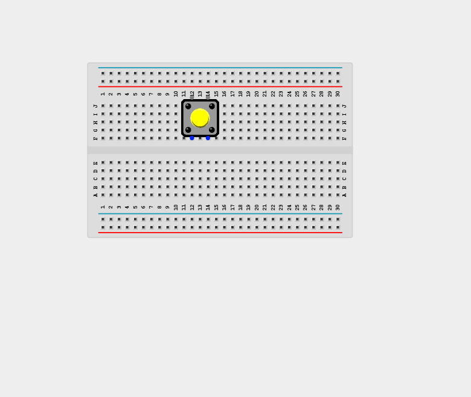
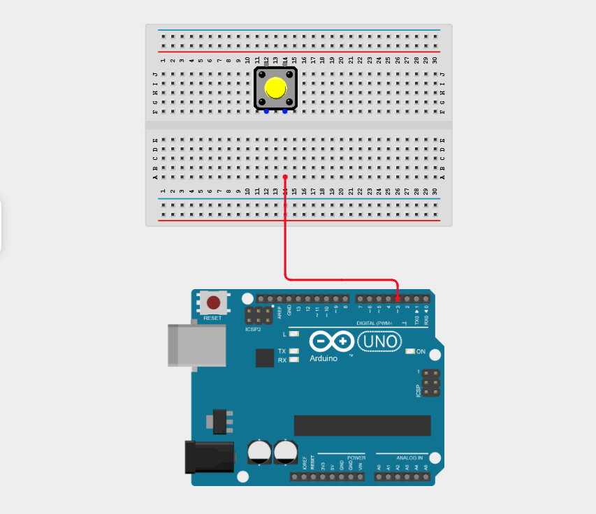
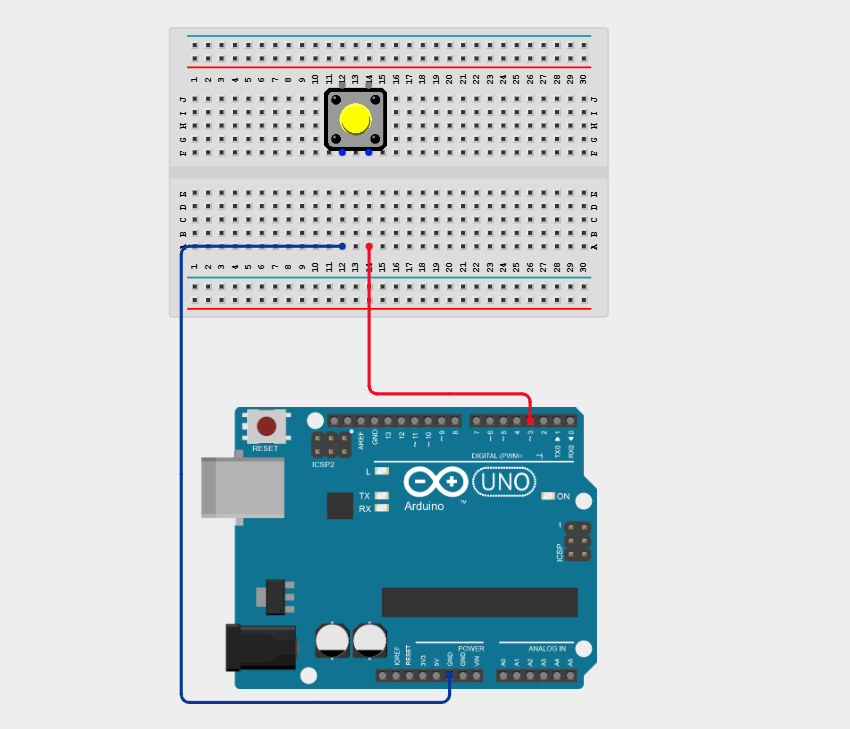
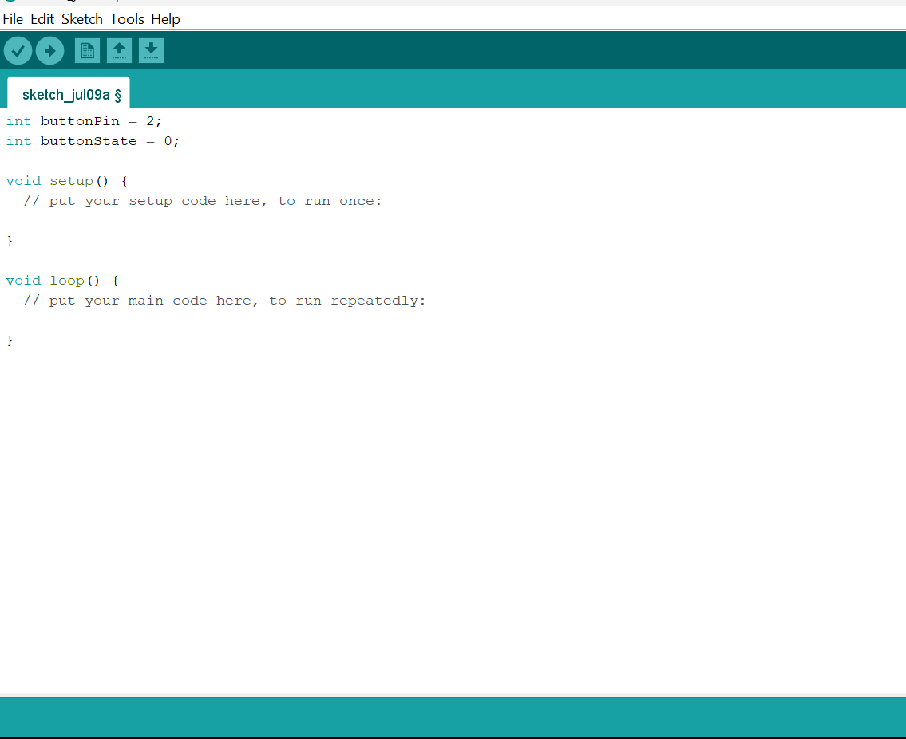
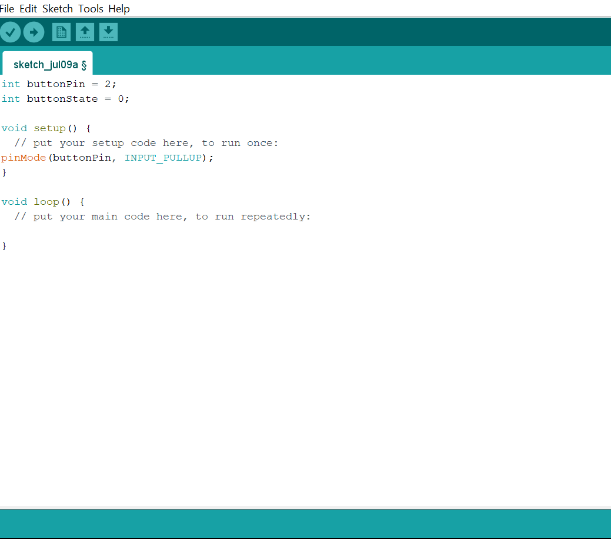
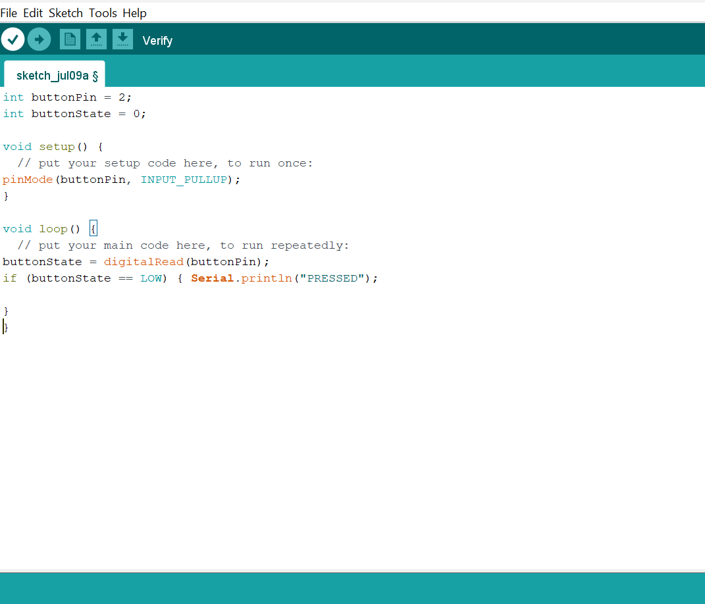
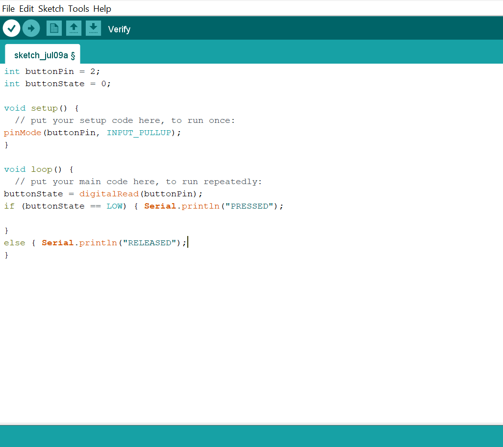

# Project 1.13.2: Serial Button Terminal

| **Description** | This project shows how to read the state of a push button using the Arduino internal pull-up resistor and displays "PRESSED" or "RELEASED" on the Serial Monitor. |
|------------------|----------------------------------------------------------------|
| **Use case**     | This project can be used in control panels and user input interfaces where button presses need to be detected and logged. |

## Components (Things You will need)

| | | | | |
|-------------------------|-------------------------|-------------------------|-------------------------|-------------------------|

## Building the circuit

Things Needed:

- Arduino Uno = 1
- Arduino USB cable = 1
- Push button = 1
- Red jumper wires = 1
- Blue jumper wires = 1

## Mounting the component on the breadboard

**Step 1:** Place the push button on the breadboard.

_**NB:** Make sure you identify the correct pin connections for the component._

## WIRING THE CIRCUIT

**Step 2:** Connect the red jumper wire from one pin of the push button to Digital Pin 2 on your Arduino Uno.

**Step 3:** Connect the blue jumper wire from the pin directly diagonal or opposite to the first pin on the push button to a GND pin on the Arduino Uno.

_Make sure to connect the Arduino USB cable to the Arduino board._

## PROGRAMMING

**Step 1:** Open your Arduino IDE. See how to set up here: [Getting Started](../../Getting Started/Arduino_IDE_Setup.md).

**Step 2:** Type `int buttonPin = 2;`, `int buttonState = 0;` as shown in the image below.

**Step 3:** Type `pinMode(buttonPin, INPUT_PULLUP);` inside the void setup() as shown in the image below.

**Step 4:** Type `buttonState = digitalRead(buttonPin);` , `if (buttonState == LOW) { Serial.println("PRESSED"); }` inside the void loop() as shown in the image below.

**Step 5:** Type `else { Serial.println("RELEASED"); }` as shown in the image below.

_**NB:** Check if button is released_

**Step 6:** Save your code. _See the [Getting Started](../../Getting Started/Arduino_IDE_Setup.md) section_

**Step 7:** Select the Arduino board and port. _See the [Getting Started](../../Getting Started/Arduino_IDE_Setup.md) section_

**Step 8:** Upload your code.

**Step 9:** Open the Serial Monitor (Tools > Serial Monitor) to view the output.

## CONCLUSION

This project helps learners understand how to interface with Push Button using Arduino. It introduces essential concepts in electronic circuits and embedded system programming.

