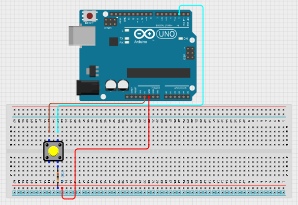
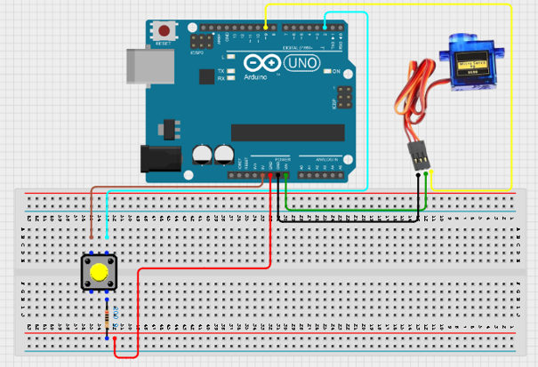
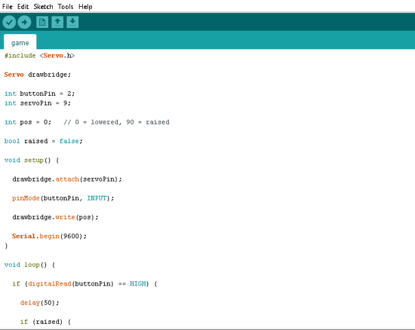

# Project 1.14.1:Servo-Controlled Drawbridge

| **Description** | This project simulates a drawbridge using a servo motor. A push button is used to raise and lower the bridge manually. Each press of the button changes the bridge position between lowered and raised states.
| --------------- | -------------------------------------------------------------------------------------------------------------------------------------------------------------------------------------------------------------- |
| **Use case** | Bridge automation systems, mechanical movement demonstrations, smart transportation models, STEM engineering projects.|

## Components (Things You will need)

|  |  |  |  | | | |
| ---------------------------------------- | --------------------------------------------------- | ----------------------------------------------------------- | ----------------------------------------------------- | ------------------------------------------------------ | ------------------------------------------------------ | ------------------------------------------------------ | 

## Mounting the component on the breadboard

**Step 1:**
Place the push button on the breadboard.
Connect the push button:
•	One leg → 5V 
•	Opposite leg → Digital Pin 2 
•	Connect one leg of a resistor to the same row as the push button leg connected to Pin 2 
•	Connect the other leg of the resistor → GND 

.

**Step 2:** 
Connect the servo motor:
•	Brown wire → GND 
•	Red wire → 5V or VIN (Also use for 5V) 
•	Orange wire → Digital Pin 9

.

**Step 3:** After completing the wiring, connect the Arduino Uno to the computer using the USB cable.

## PROGRAMMING

**Step 1:** Open your Arduino IDE. See how to set up here: [Getting Started](../../Getting Started/Arduino_IDE_Setup.md).

**Step 2:** Type the following codes;

.

.

.

## Uploading the code

**Step 1:** Save your code. _See the [Getting Started](../../Getting Started/Arduino_IDE_Setup.md) section_

**Step 2:** Select the arduino board and port _See the [Getting Started](../../Getting Started/Arduino_IDE_Setup.md) section:Selecting Arduino Board Type and Uploading your code_.

**Step 3:** Upload your code. _See the [Getting Started](../../Getting Started/Arduino_IDE_Setup.md) section:Selecting Arduino Board Type and Uploading your code_

## OBERVATION
-	The bridge starts in the lowered position. 
-	Pressing the button raises the bridge smoothly. 
-	Pressing the button again lowers the bridge smoothly. 
-	The servo rotates approximately 90° during each movement. 
-	The Serial Monitor displays the bridge status. 

## CONCLUSION

This project demonstrates servo motor control, digital input handling, mechanical movement simulation, and state-based operation. It provides a practical introduction to automated bridge systems and real-world engineering mechanisms used in transportation and infrastructure.
