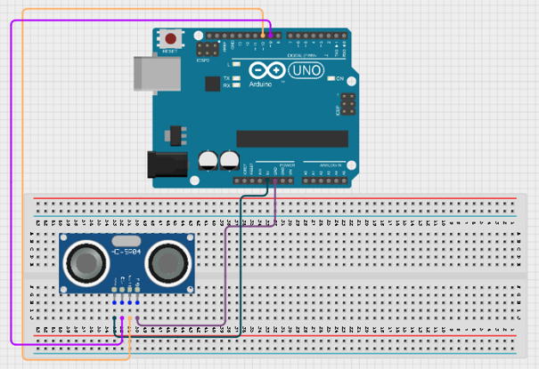
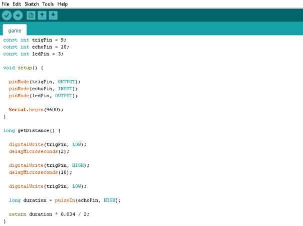
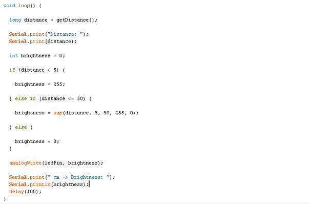

# Project 1.15.1:DISTANCE-BASED LED BRIGHTNESS CONTROL

| **Description** | This project uses an ultrasonic sensor to control the brightness of an LED. As an object moves closer to the sensor, the LED becomes brighter. As the object moves farther away, the LED gradually becomes dimmer.
| --------------- | -------------------------------------------------------------------------------------------------------------------------------------------------------------------------------------------------------------- |
| **Use case** | Touchless lighting systems, proximity-based indicators, parking assistance systems, interactive STEM demonstrations.|

## Components (Things You will need)

|  |  |  |  | | |
| ---------------------------------------- | --------------------------------------------------- | ----------------------------------------------------------- | ----------------------------------------------------- | ------------------------------------------------------ | ------------------------------------------------------ | 

## Mounting the component on the breadboard

**Step 1:**
Place the HC-SR04 Ultrasonic Sensor on the breadboard.
Connect the ultrasonic sensor:
•	VCC → 5V 
•	GND → GND 
•	TRIG → Digital Pin 9 
•	ECHO → Digital Pin 10 

.

**Step 2:** 
Place the LED on the breadboard.
Connect the LED:
•	Longer leg (anode) → through One leg of a resistor 
•	Other leg of the resistor → Digital Pin 3 
•	Shorter leg (cathode) → GND 

.

**Step 3:** After completing the wiring, connect the Arduino Uno to the computer using the USB cable.

## PROGRAMMING

**Step 1:** Open your Arduino IDE. See how to set up here: [Getting Started](../../Getting Started/Arduino_IDE_Setup.md).

**Step 2:** Type the following codes;

.

.

## Uploading the code

**Step 1:** Save your code. _See the [Getting Started](../../Getting Started/Arduino_IDE_Setup.md) section_

**Step 2:** Select the arduino board and port _See the [Getting Started](../../Getting Started/Arduino_IDE_Setup.md) section:Selecting Arduino Board Type and Uploading your code_.

**Step 3:** Upload your code. _See the [Getting Started](../../Getting Started/Arduino_IDE_Setup.md) section:Selecting Arduino Board Type and Uploading your code_

## OBERVATION
-	When your hand is very close to the sensor, the LED shines at maximum brightness. 
-	As your hand moves away, the LED becomes dimmer. 
-	At distances greater than 50 cm, the LED turns off. 
-	The Serial Monitor displays both the measured distance and the LED brightness value. 

## CONCLUSION

This project demonstrates ultrasonic distance measurement, PWM-based brightness control, analog output simulation, and real-time sensor interaction. It provides a practical introduction to touchless control systems and shows how sensor data can be used to dynamically adjust electronic outputs.
