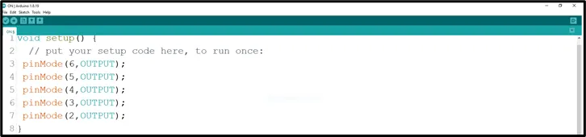
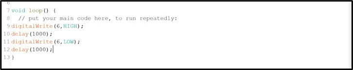
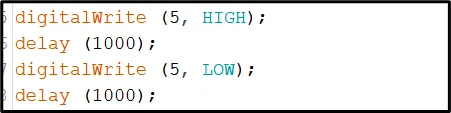
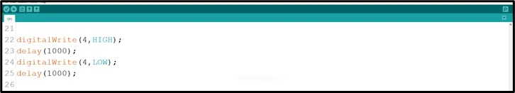
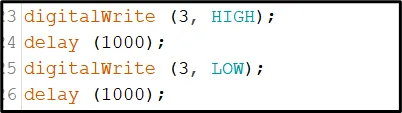
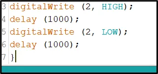

# Project 1.1.10: PARTY LIGHTNENING

| **Description** | This project shows how to make five LEDs turn on and off one after the other using an Arduino Uno. It introduces light sequencing and timing control.|
|------------------|----------------------------------------------------------------|
| **Use case**     | This project can be used to create decorative lighting effects, such as party lights that blink in a repeated pattern. |

## Components (Things You will need)

|  |  |  |  |||
|-------------------------|-------------------------|-------------------------|-------------------------|-------------------------|-------------------------|

## Building the circuit

Things Needed:

-	Arduino Uno = 1
-	Arduino USB cable = 1
-	LED = 5
-	Jumper wires = 10
-  Resistor = 5

## Mounting the component on the breadboard

**Step 1:** Place the five LEDs on the breadboard. For each LED, the longer leg is the positive pin, while the shorter leg is the negative pin.


_**NB:** Make sure you identify where the positive pin (+) and the negative pin (-) is connected to on the breadboard. The longer pin of the LED is the positive pin and the shorter one, the negative PIN_.

## WIRING THE CIRCUIT


**Step 2:** Connect the positive leg of the first LED to pin 6 on the Arduino through a 220Ω resistor. Connect its negative leg to GND.


**Step 3:** Connect the positive leg of the second LED to pin 5 on the Arduino through a 220Ω resistor. Connect its negative leg to GND.


**Step 4:** Connect the positive leg of the third LED to pin 4 on the Arduino through a 220Ω resistor. Connect its negative leg to GND.


**Step 5:** Connect the positive leg of the fourth LED to pin 3 on the Arduino through a 220Ω resistor. Connect its negative leg to GND.


**Step 6:** Connect the positive leg of the fifth LED to pin 2 on the Arduino through a 220Ω resistor. Connect its negative leg to GND.


_make sure you connect the arduino usb use blue cable to the Arduino board_.

## PROGRAMMING

**Step 1:** Open your Arduino IDE. See how to set up here: [Getting Started](../../Getting Started/Arduino_IDE_Setup.md).

**Step 2:** Type the following codes in the void setup function as shown in the image below.
   
   ```cpp
   pinMode(6, OUTPUT); // sets pin 6 as an output pin for the first LED.
   pinMode(5, OUTPUT); // sets pin 5 as an output pin for the second LED.
   pinMode(4, OUTPUT); // sets pin 4 as an output pin for the third LED.
   pinMode(3, OUTPUT); // sets pin 3 as an output pin for the fourth LED.
   pinMode(2, OUTPUT); // sets pin 2 as an output pin for the fifth LED.
   ```



_**NB:** pinMode will help the Arduino board to decide which port should be activated.  The code below will turn off the three light bulbs._

**Step 3:** Type the following codes in the void loop function.as shown in the image below;
   ```cpp
   digitalWrite (6, HIGH);
   delay (1000);
   digitalWrite (6, LOW);
   delay (1000);
   ```


**Step 4:** Let's continue by typing the following code:
   ```cpp
   digitalWrite (5, HIGH);
   delay (1000);
   digitalWrite (5, LOW);
   delay (1000);
   ```


**Step 5:** Let's continue by typing the following code:
   ```cpp
   digitalWrite (4, HIGH);
   delay (1000);
   digitalWrite (4, LOW);
   delay (1000);

   ```


**Step 6:** Let's continue by typing the following code:
   ```cpp
   digitalWrite (3, HIGH);
   delay (1000);
   digitalWrite (3, LOW);
   delay (1000);
   ```


**Step 7:** Let's finish by typing the following code:
   ```cpp
   digitalWrite (2, HIGH);
   delay (1000);
   digitalWrite (2, LOW);
   delay (1000);
   ```



**Step 8:** Save your code. _See the [Getting Started](../../Getting Started/Arduino_IDE_Setup.md) section_

<!-- **Step 6:** Select the arduino board and port _See the [Getting Started](../../Getting Started/Arduino_IDE_Setup.md) section:Selecting Arduino Board Type and Uploading your code_.

**Step 7:** Upload your code. _See the [Getting Started](../../Getting Started/Arduino_IDE_Setup.md) section:Selecting Arduino Board Type and Uploading your code_ -->

## CONCLUSION

This project helps learners understand how to control five LEDs in a sequence using Arduino. It is a simple introduction to decorative lighting, timing, and multiple output control.

