# Project 1.2.3: Piezo Beep Code Generator

| **Description** | This project shows how to play alternating high and low frequency tones on a piezo buzzer using the tone() function to generate different sound patterns. |
|------------------|----------------------------------------------------------------|
| **Use case**     | This project can be used in sound notification systems, alarm devices, and audio feedback applications. |

## Components (Things You will need)

|  |  |  |  | |
|-------------------------|-------------------------|-------------------------|-------------------------|-------------------------|

## Building the circuit

Things Needed:

- Arduino Uno = 1
- Arduino USB cable = 1
- Buzzer = 1
- Red jumper wires = 1
- Blue jumper wires = 1

## Mounting the component on the breadboard

**Step 1:** Place the buzzer on the breadboard. The longer pin is the positive pin.

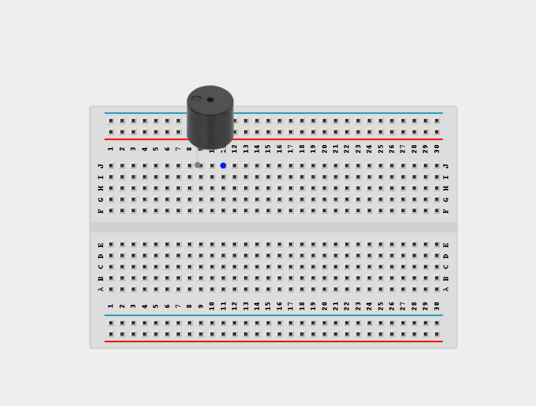

_**NB:** Make sure you identify the correct pin connections for the component._

## WIRING THE CIRCUIT

**Step 2:** Connect the component to the appropriate pins on the Arduino Uno using jumper wires. Using the red jumper wire, connect the positive pin to digital pin 3 on the Arduino Uno board.

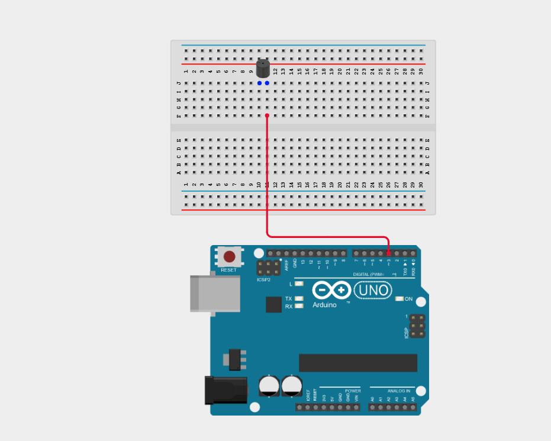

**Step 3:** Connect the negative pin to the GND on the Arduino Uno board using the blue jumper wire.

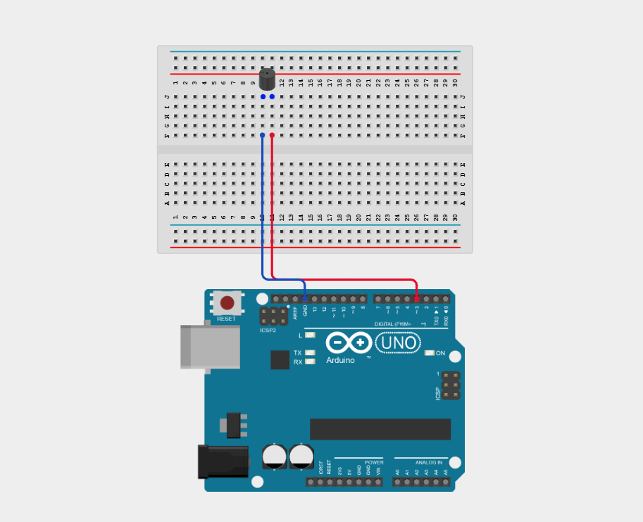

_Make sure to connect the Arduino USB cable to the Arduino board._

## PROGRAMMING

**Step 1:** Open your Arduino IDE. See how to set up here: [Getting Started](../../Getting Started/Arduino_IDE_Setup.md).

**Step 2:** Type `int buzzerPin = 3;`

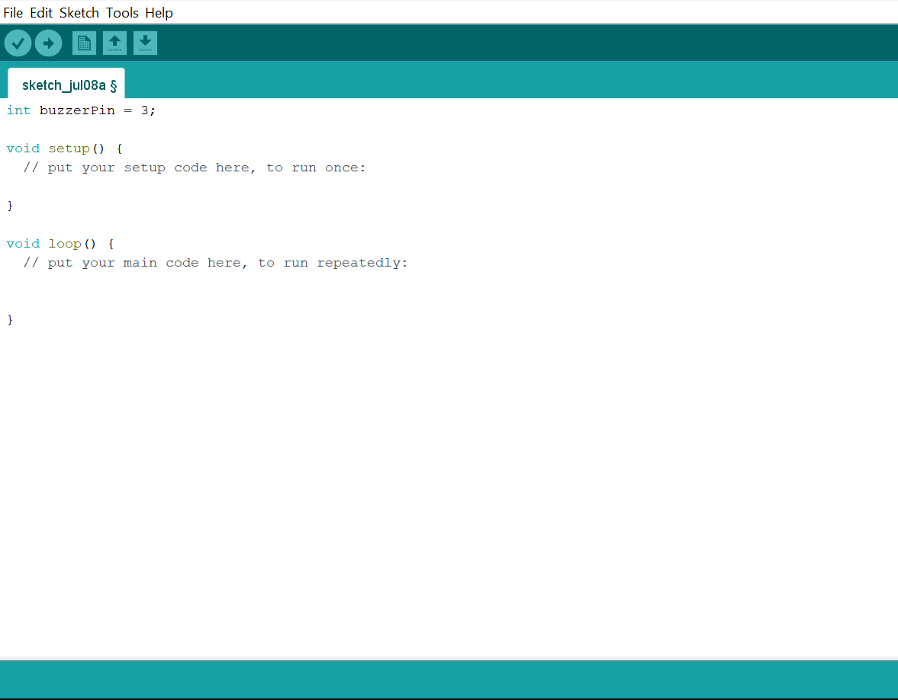

_**NB:** Declare the buzzer pin_

**Step 3:** Type `pinMode(buzzerPin, OUTPUT);` inside the void setup(){} function.

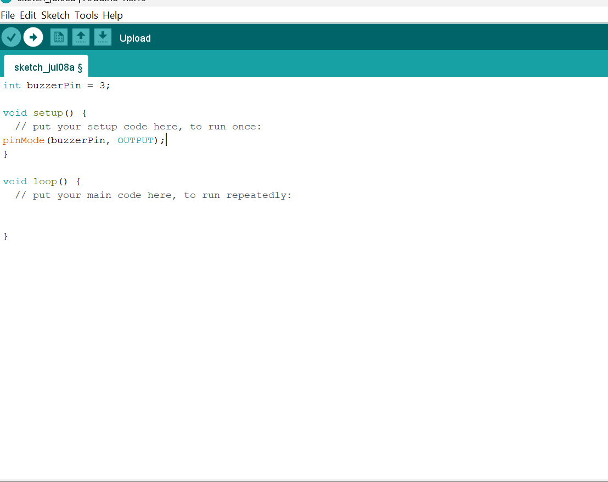

_**NB:** Set buzzer pin as output_

**Step 4:** Type `tone(buzzerPin, 1000);` inside the void loop(){} function.

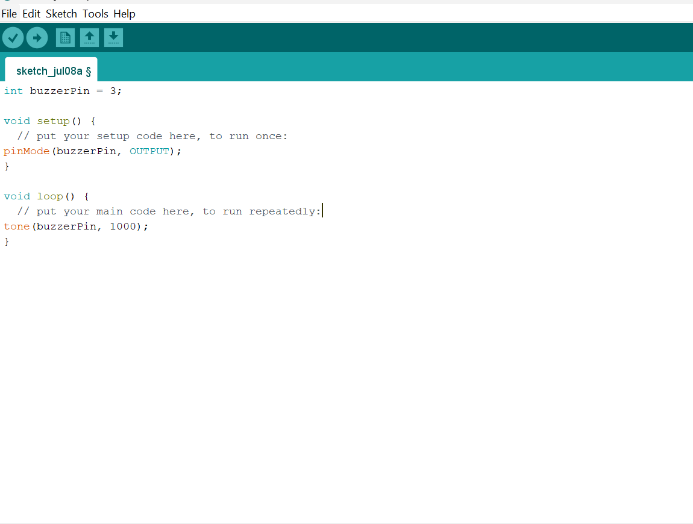

_**NB:** Play a 1000 Hz tone_

**Step 5:** Type `delay(500);`

_**NB:** Wait for 500ms_

**Step 6:** Type `noTone(buzzerPin);`

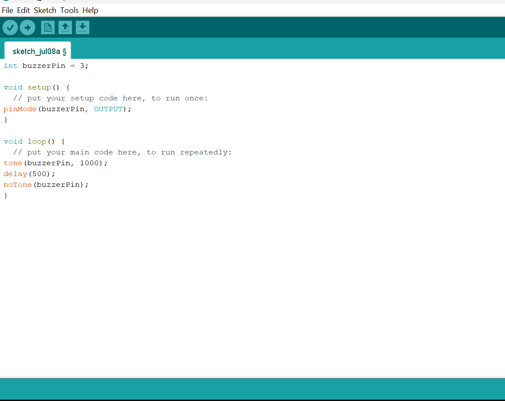

_**NB:** Stop the tone_

**Step 7:** Type `delay(500);`

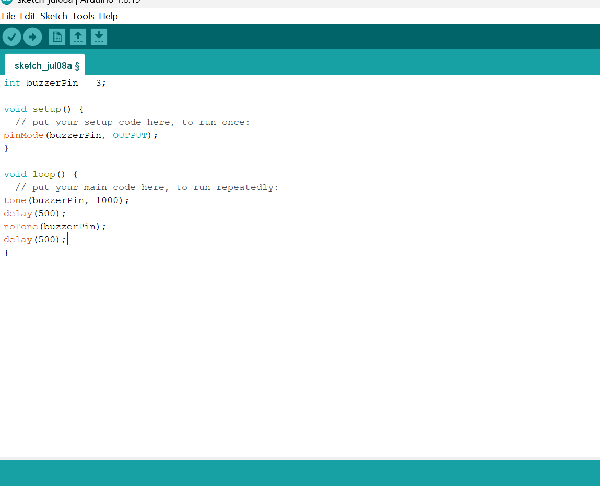

_**NB:** Wait for 500ms_

**Step 8:** Type `tone(buzzerPin, 2000);`

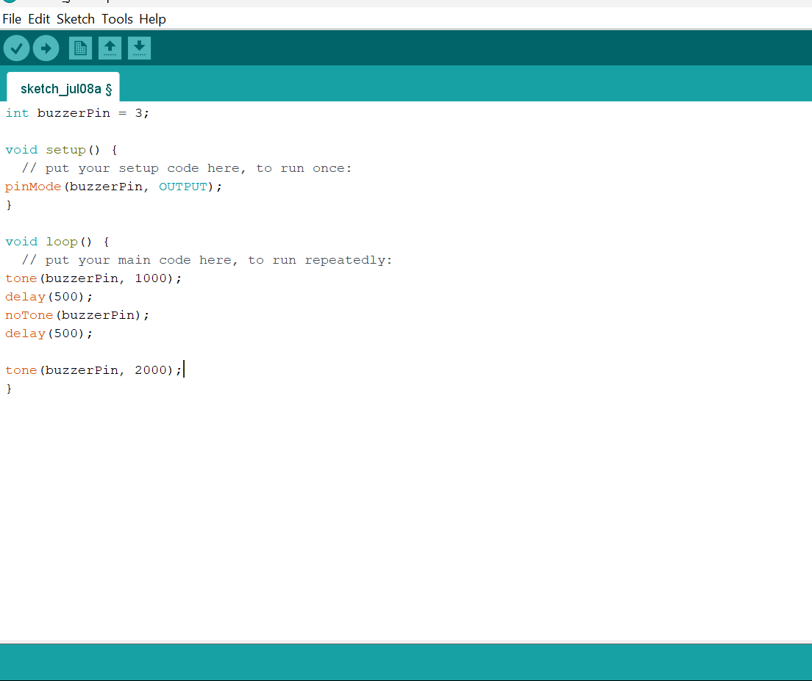

_**NB:** Play a 2000 Hz tone_

**Step 9:** Type `delay(500);`

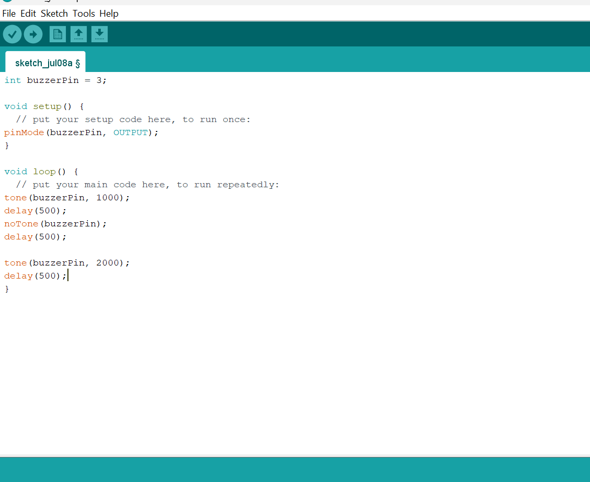

_**NB:** Wait for 500ms_

**Step 10:** Type `noTone(buzzerPin);`

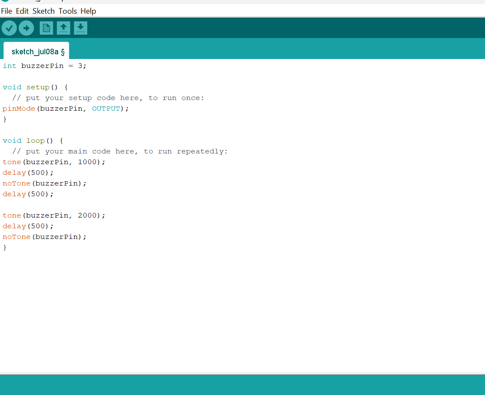

_**NB:** Stop the tone_

**Step 11:** Type `delay(500);`

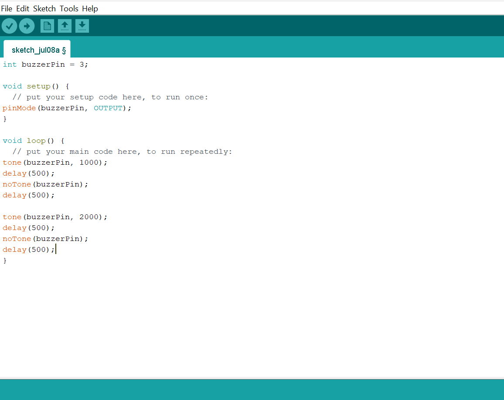

_**NB:** Wait for 500ms_

**Step 4:** Save your code. _See the [Getting Started](../../Getting Started/Arduino_IDE_Setup.md) section_

**Step 5:** Select the Arduino board and port. _See the [Getting Started](../../Getting Started/Arduino_IDE_Setup.md) section_

**Step 6:** Upload your code.

**Step 7:** Open the Serial Monitor (Tools > Serial Monitor) to view the output.

## CONCLUSION

This project helps learners understand how to interface with Buzzer using Arduino. It introduces essential concepts in electronic circuits and embedded system programming.

