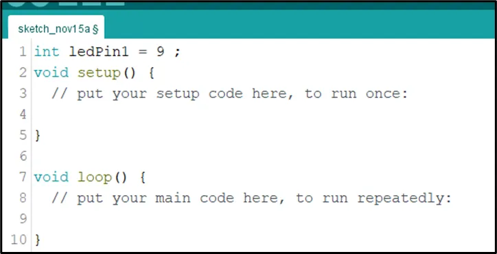
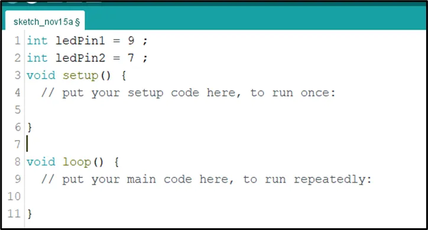
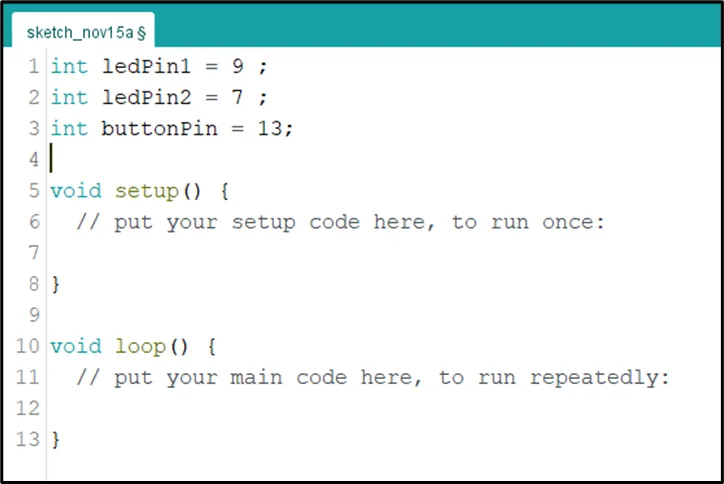
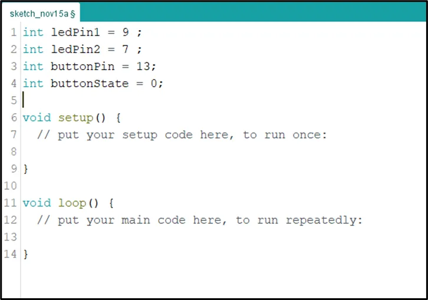
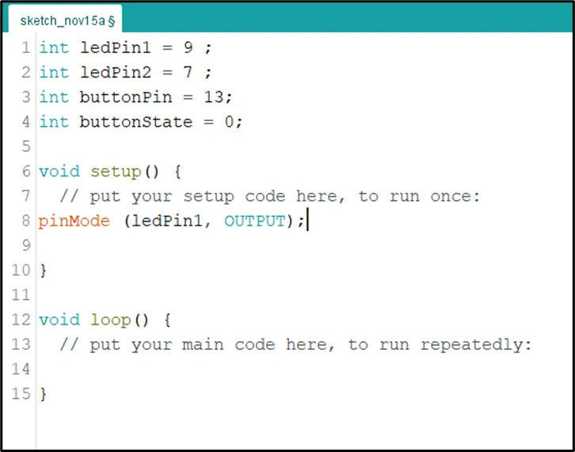
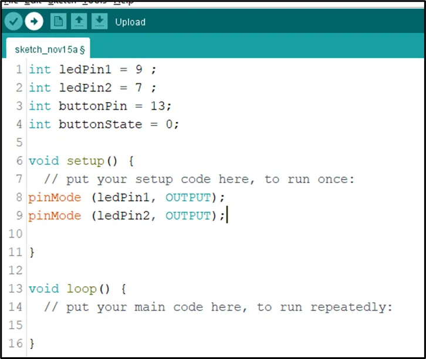
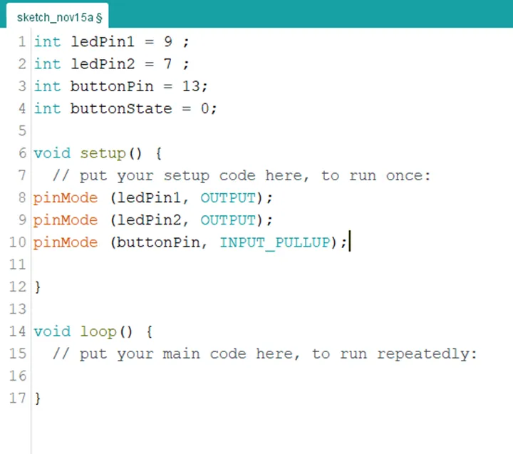
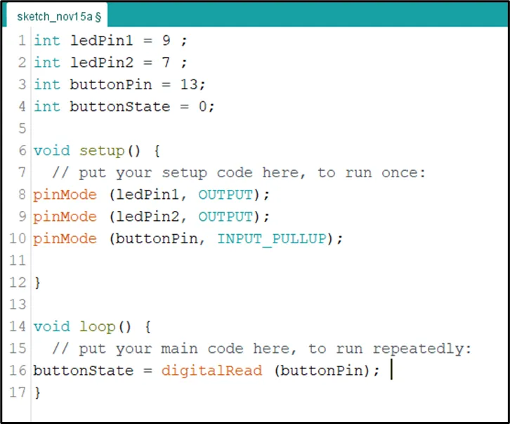
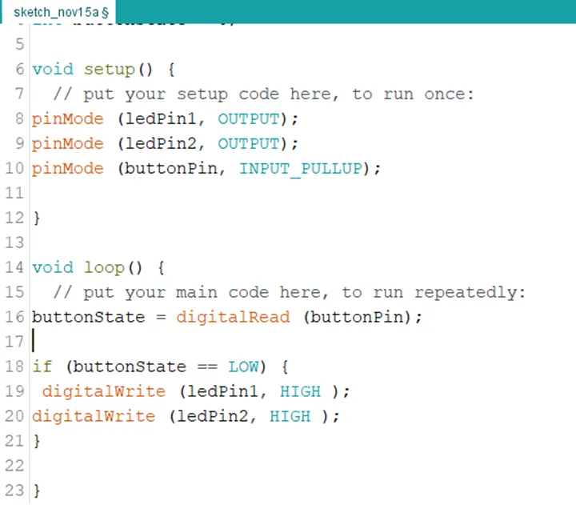
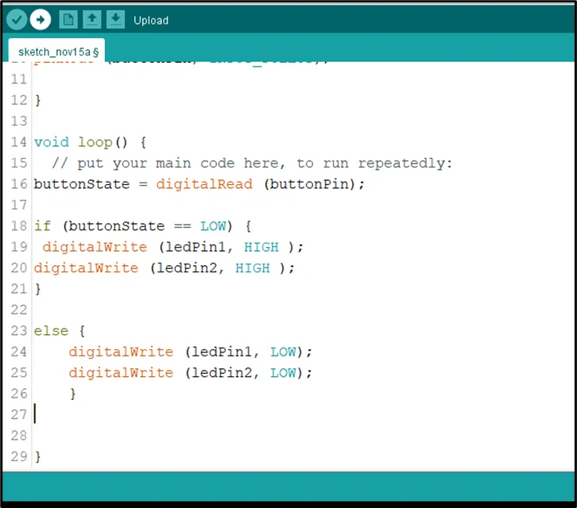

# Project 1.3.2: TWIN LIGHT

| **Description** | This project shows how to control two LEDs using a push button with an Arduino Uno. When the button is pressed, both LEDs turn on at the same time. When the button is released, both LEDs turn off. |
|------------------|----------------------------------------------------------------|
| **Use case**     | This project can be used as a simple signal system where two lights work together to show notifications or indicate someone's presence. |

## Components (Things You will need)

|  |  |  |  | | |
|-------------------------|-------------------------|-------------------------|-------------------------|-------------------------|-------------------------|

## Building the circuit

Things Needed:

-   Arduino Uno = 1
-	Arduino USB cable = 1
-	Resistor = 1
-	Push button = 1
-	LED = 2
-	Red jumper wires = 1
-	Black jumper wires = 1
-	Yellow jumper wires = 1
-	Blue jumper wires = 1


## Mounting the component on the breadboard

**Step 1:** Place the two LEDs on the breadboard. The longer legs are the positive pins, while the shorter legs are the negative pins.

.


**Step 2:** Connect the positive leg of the first LED to pin 9 on the Arduino through a 220Ω resistor.

.


## WIRING THE CIRCUIT

### Things Needed:

- Red male-male-to-male jumper wires = 1
- Black male-to-male jumper wires = 1
- Yellow male-to-male jumper wires = 1
- Blue male-to-male jumper wires = 1
- White male-to-male jumper wires = 1
- Green male-to-male jumper wires = 1

**Step 3:** Connect the negative leg of the first LED to GND on the Arduino Uno.


**Step 4:** Connect the positive leg of the second LED to pin 7 on the Arduino through a 220Ω resistor.


**Step 5:** Connect the negative leg of the second LED to GND on the Arduino Uno.


**Step 6:** Place the push button on the breadboard.


**Step 7:** Connect one side of the push button to GND on the Arduino Uno.


**Step 8:** Connect the other side of the push button to pin 13 on the Arduino Uno.


_Make sure to connect the Arduino USB blue cable to the Arduino board_.


## PROGRAMMING

**Step 1:** Open your Arduino IDE. See how to set up here: [Getting Started](../../Getting Started/Arduino_IDE_Setup.md).

**Step 2:** Type ``` int ledPin1 = 9;``` as shown in the picture below.

.

**Step 3:** Type ``` const int LedPin2 = 7;``` as shown in the picture below.

.

**Step 4:** Type ``` int buttonPin = 13;``` as shown in the picture below.

.

**Step 5:** Type ``` int buttonState = 0;``` as shown in the picture below.

.

**Step 6:** Inside the (void setup()) function, type ``` pinMode (ledPin1, OUTPUT);``` as shown in the picture below.

.

**NB:** pinMode will help the Arduino board to decide which port should be activated.

**Step 7:** Inside the (void setup()) Type ``` pinMode (ledPin2, OUTPUT);``` as shown in the picture below.

.

**Step 8:** Type ``` pinMode (buttonPin, INPUT_PULLUP);``` as shown in the picture below.

.

**Step 9:** Scroll down and click inside the void loop() function  and Type ``` buttonState = digitalRead (buttonPin);``` as shown in the picture below.

.

**Step 10:** Type this conditional statement ``` if (buttonState == LOW) { digitalWrite (LedPin1, HIGH); digitalWrite (ledPin2, HIGH); } ``` as shown in the picture below.

.

**Step 11:** Type ``` else { digitalWrite (LedPin1, LOW); digitalWrite (ledPin2, LOW); } ``` as shown in the picture below.

.

## Explanation

int ledPin1 = 9; stores the pin number for the first LED.
int ledPin2 = 7; stores the pin number for the second LED.
int buttonPin = 13; stores the push button pin number.
int buttonState = 0; stores the current state of the push button.
pinMode(ledPin1, OUTPUT); sets the first LED pin as an output pin.
pinMode(ledPin2, OUTPUT); sets the second LED pin as an output pin.
pinMode(buttonPin, INPUT_PULLUP); sets the push button pin as an input pin.
digitalRead(buttonPin); reads the state of the push button.
digitalWrite(ledPin1, HIGH); turns the first LED on.
digitalWrite(ledPin2, HIGH); turns the second LED on.
digitalWrite(ledPin1, LOW); turns the first LED off.
digitalWrite(ledPin2, LOW); turns the second LED off.

## CONCLUSION
This project helps learners understand how to control multiple LEDs using a push button with Arduino. It introduces input devices, output devices, and simple control logic in programming.
