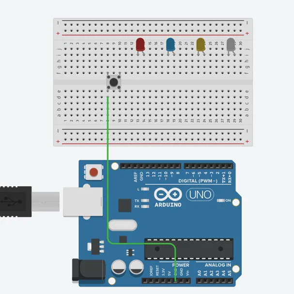
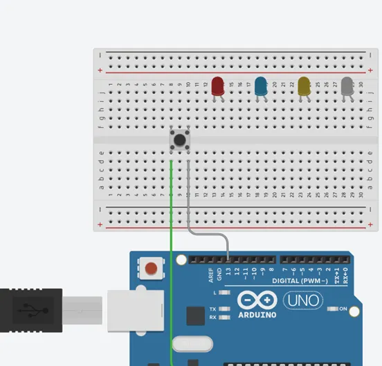
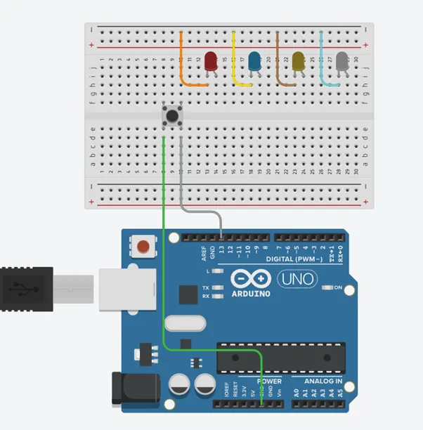
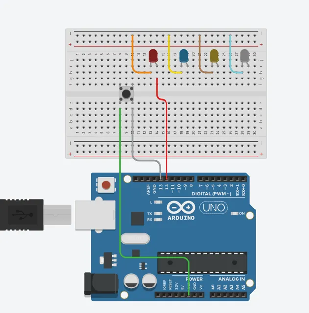
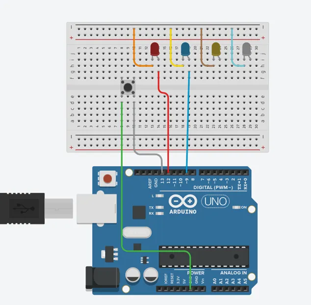
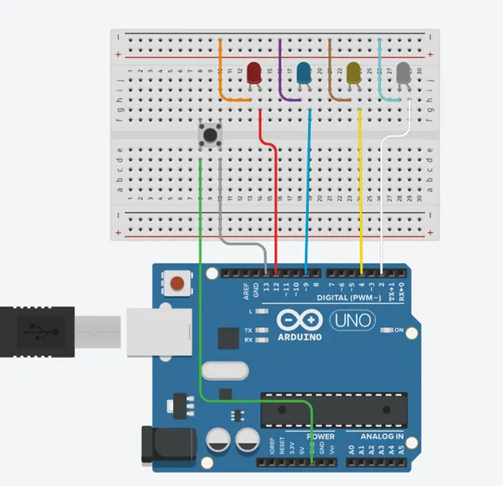
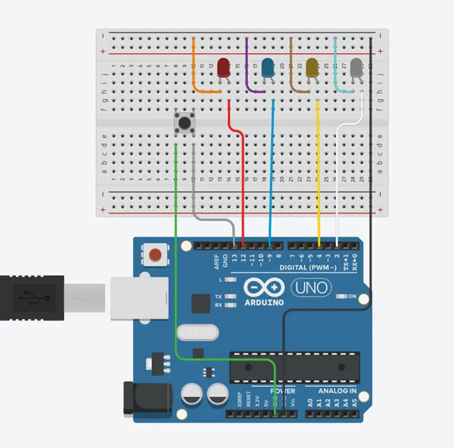
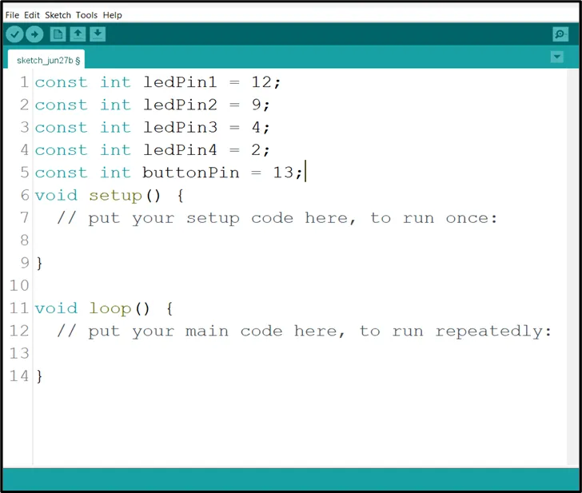
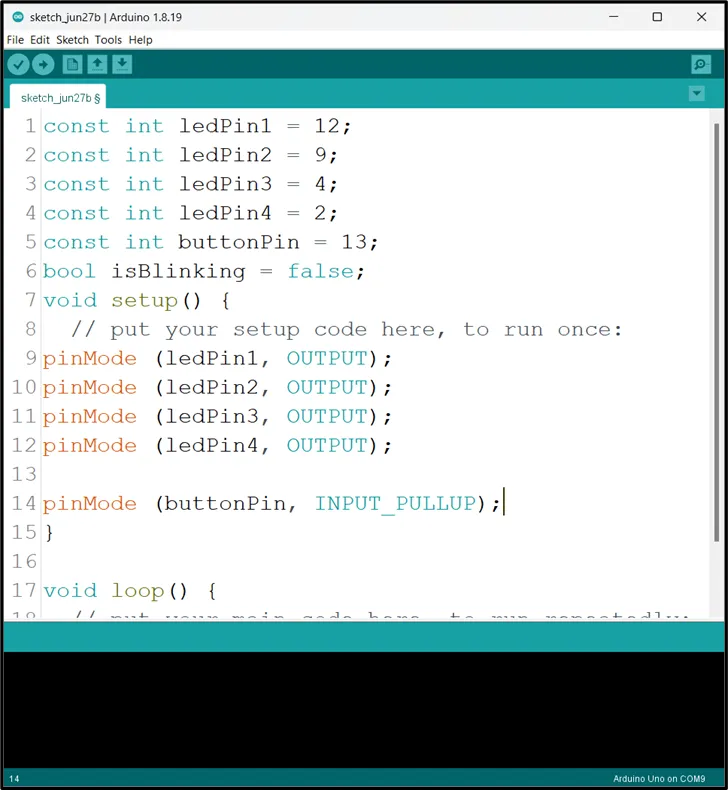
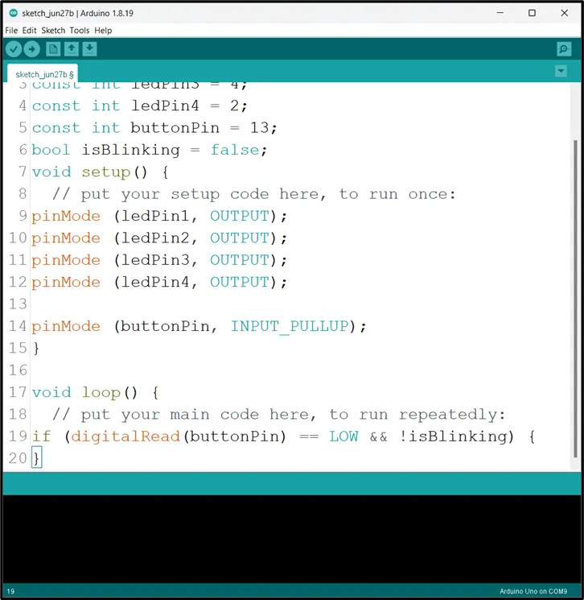

# Project 1.3.4:LED Control with Arduino and Push Button

| **Description** | In this project, you will learn how to use a push button to control four LEDs with an Arduino Uno. The push button acts as an input switch that sends a signal to the Arduino, which then controls the four LEDs by turning them on or off based on programmed instructions. This helps to demonstrate how a single input device can manage multiple outputs in a simple electronic control system, improving understanding of digital input and output operations.|
| --------------- | -------------------------------------------------------------------------------------------------------------------------------------------------------------------------------------------------------------- |
| **Use case** | This project can be used in simple control and indicator systems where multiple status signals are required. For example, the push button can be used to cycle through four LED states such as system modes, progress indicators, or warning levels (low, medium, high, and critical). It can also be applied in automation systems, control panels, and educational models where users need visual feedback from multiple outputs based on a single input.|

## Components (Things You will need)

|  |  |  |  |  |  |
| ---------------------------------------- | --------------------------------------------------- | ----------------------------------------------------------- | ----------------------------------------------------- | ------------------------------------------------------ | ------------------------------------------------------- |

## Building the circuit

Things Needed:

- Arduino Uno = 1
- Arduino USB cable = 1
- Resistor = 1
- Push button = 1
- Red LED = 1
- Yellow LED = 1
- Green LED = 1
-Jumper Wires 

## Mounting the component on the breadboard

**Step 1:** Connect the push button and 4 leds onto the breadboard as shwon below. And connect one pin of the push button to GND on the Arduino Uno as shown below.

.

## WIRING THE CIRCUIT

**step 1:** Connect the other pin to 13 on the arduino Uno as shown below.

.

**step 2:** Connect all the negative pins of the leds to the negative section on the Arduino Uno as shown below.

.

**step 3:** Connect the positive pin of the red led to 12 on the arduino uno as shown below.

.

**step 4:** Connect the positive leg of the blue LED to pin 9 on the Arduino as shown below.

.

**step 5:**Connect the positive leg of the yellow LED to pin 4 and the postive pin on the white led to 2 on the Arduino as shown below.

.

**step 6:** Connect the negative section on the breadboard on which all the negative pins of the led are connected to GND on the arduino Uno as shown below.



## PROGRAMMING

**Step 1:** Open your Arduino IDE. See how to set up here: [Getting Started](../../Getting Started/Arduino_IDE_Setup.md).

**Step 2:** Type the following codes before the void setup function.

``` cpp

const int ledPin1 = 12;
const int ledPin2 = 9;
const int ledPin3 = 4;
const int ledPin4 = 2;
bool isBlinking = False;
```

.

**Step 3:** After the void setup ()within the curly brackets type the following codes.

``` cpp
pinMode (ledPin1, OUTPUT);
pinMode (ledPin2, OUTPUT);
pinMode (ledPin3, OUTPUT);
pinMode (ledPin4, OUTPUT);
pinMode (buttonPin, INTPUT_PULLUP);
```

.

**Step 4:** : After the (void loop ()) within the curly brackets type

``` cpp
buttonState = digitalRead(buttonPin);
if (buttonState == LOW) {
digitalWrite (red, HIGH);
delay (500);
digitalWrite (red, LOW);
delay (500);
digitalWrite (yellow, HIGH);
delay (500);
digitalWrite (yellow, LOW);
delay (500);
digitalWrite (green, HIGH);
delay (500);
digitalWrite (green, LOW);
delay (500);
digitalWrite (blue, HIGH);
delay (500);
digitalWrite (blue, LOW);
delay (500);
}
```

.

## Uploading the code

**Step 1:** Save your code. _See the [Getting Started](../../Getting Started/Arduino_IDE_Setup.md) section_

**Step 2:** Select the arduino board and port _See the [Getting Started](../../Getting Started/Arduino_IDE_Setup.md) section:Selecting Arduino Board Type and Uploading your code_.

**Step 3:** Upload your code. _See the [Getting Started](../../Getting Started/Arduino_IDE_Setup.md) section:Selecting Arduino Board Type and Uploading your code_

## CONCLUSION

If you encounter any problems when trying to upload your code to the board, run through your code again to check for any errors or missing lines of code. If you did not encounter any problems and the program ran as expected, Congratulations on a job well done.
