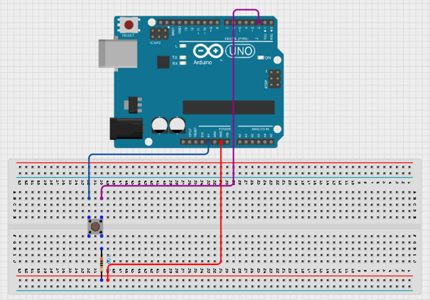
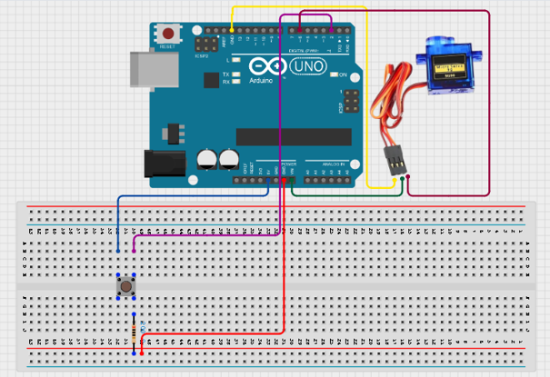
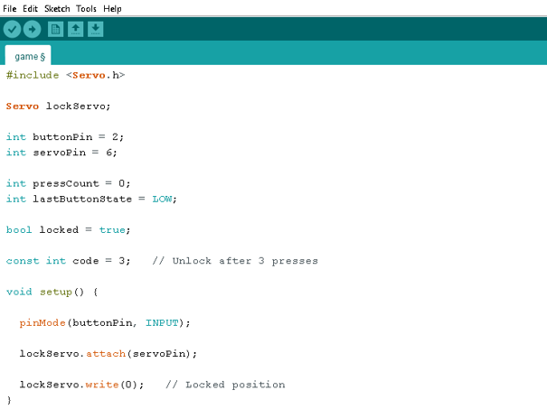
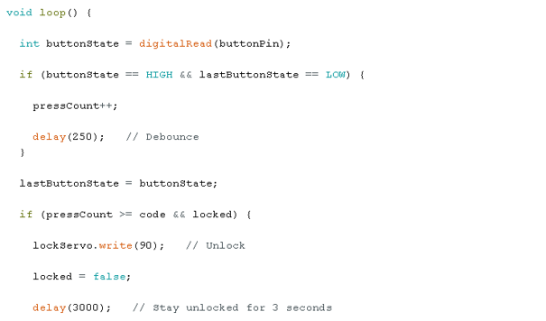
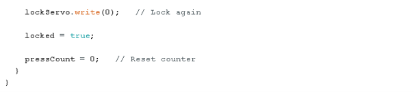

# Project 1.3.5:Push-Button Door Lock

| **Description** | This project creates a simple digital door lock using a push button and a servo motor. The Arduino counts the number of button presses, and when the correct number of presses is entered, the servo unlocks the door for a few seconds before automatically locking again.
|
| --------------- | -------------------------------------------------------------------------------------------------------------------------------------------------------------------------------------------------------------- |
| **Use case** | Electronic door locks, access control systems, cabinet security, and basic password-protected mechanisms.|

## Components (Things You will need)

|  |  |  |  |  |  | |
| ---------------------------------------- | --------------------------------------------------- | ----------------------------------------------------------- | ----------------------------------------------------- | ------------------------------------------------------ | ------------------------------------------------------- |------------------------------------------------------- |

## Mounting the component on the breadboard

**Step 1:** Place the push button on the breadboard.
Connect the push button:
•	One leg → 5V 
•	Opposite leg → Digital Pin 2 
•	Connect a resistor from the same row as Pin 2 to GND (pull-down resistor) 

.

**Step 2:** Connect the servo motor:
•	Signal → Pin 6 
•	VCC → 5V (VIN can also be used as a 5V)
•	GND → GND 

.

**Step 3:** After completing the wiring, connect the Arduino Uno to the computer using the USB cable.

## PROGRAMMING

**Step 1:** Open your Arduino IDE. See how to set up here: [Getting Started](../../Getting Started/Arduino_IDE_Setup.md).

**Step 2:** Type the following codes before the void setup function.

``` cpp

#include <Servo.h>

Servo lockServo;

int buttonPin = 2;
int servoPin = 6;
int pressCount = 0;
int lastButtonState = LOW;

bool locked = true;
const nt code = 3;

```

**Step 3:** After the void setup ()within the curly brackets type the following codes.

``` cpp
pinMode(buttonPin,INPUT);
lockServo.attach(servoPin);
lockServo.write(0);

```

**Step 4:** : After the (void loop ()) within the curly brackets type

``` cpp
int buttonState = digitalRead(buttonPin);
if (buttonState == HIGH && lastButtonState == LOW){
    pressCount++;
    delay(250);
}
lastButtonState = buttonState;
if ( presscount >= code && locked){
    lockServor.write(90);
    locked = false;
    delay(3000);
    lockedServo.write(0);
    locked = true;
    pressCount = 0;
}

```

.

.

.

## Uploading the code

**Step 1:** Save your code. _See the [Getting Started](../../Getting Started/Arduino_IDE_Setup.md) section_

**Step 2:** Select the arduino board and port _See the [Getting Started](../../Getting Started/Arduino_IDE_Setup.md) section:Selecting Arduino Board Type and Uploading your code_.

**Step 3:** Upload your code. _See the [Getting Started](../../Getting Started/Arduino_IDE_Setup.md) section:Selecting Arduino Board Type and Uploading your code_


## OBSERVATION
-	Each button press increases the internal counter. 
-	The servo remains locked until the correct number of presses is reached. 
-	After three presses, the servo rotates to the unlock position. 
-	The servo stays unlocked for 3 seconds. 
-	The servo automatically returns to the locked position. 
-	The counter resets after each successful unlock. 

## CONCLUSION

This project introduces button input detection, counting mechanisms, servo motor control, and simple password-based access systems. It demonstrates how digital inputs can be used to trigger mechanical actions and serves as a foundation for more advanced electronic locking systems.
