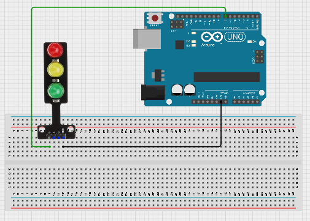
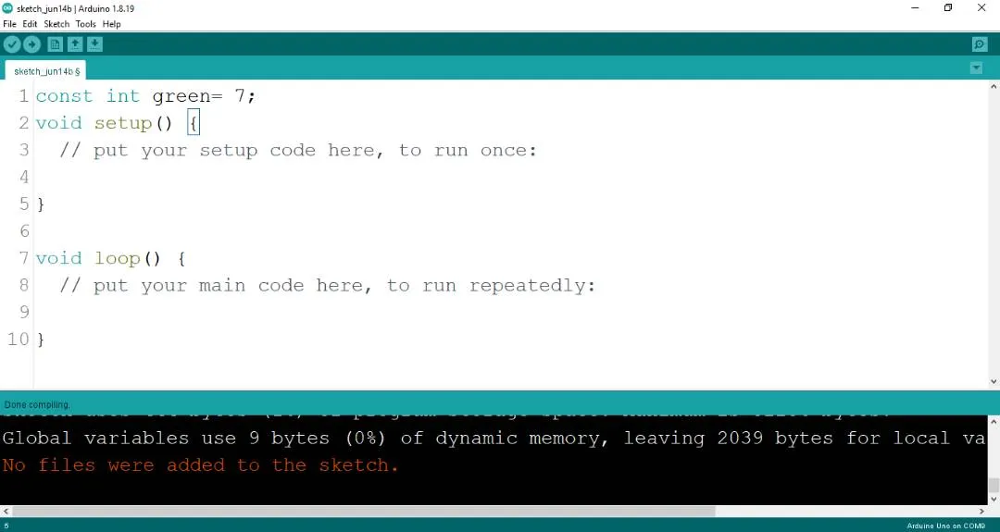
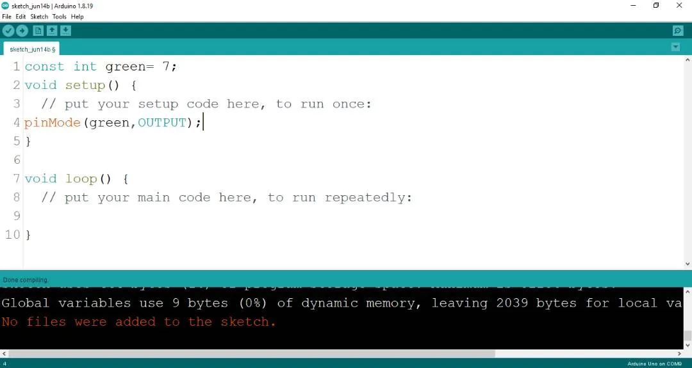
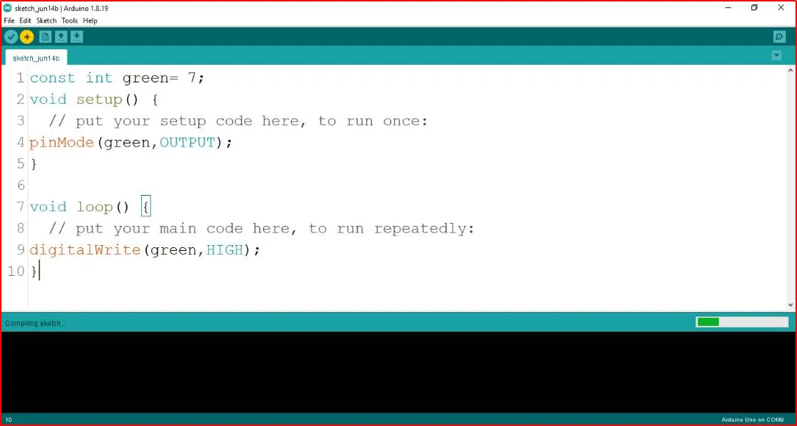
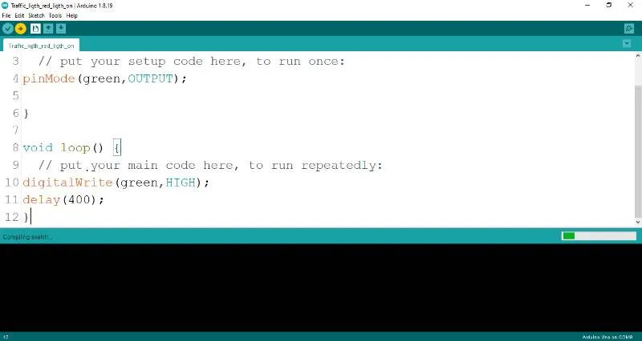
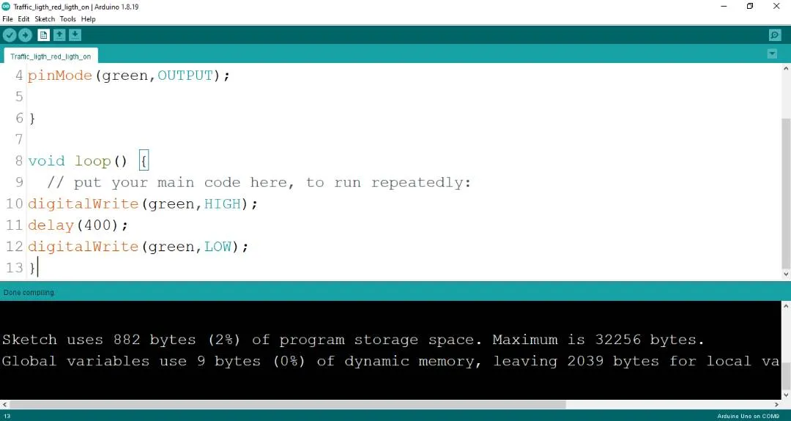
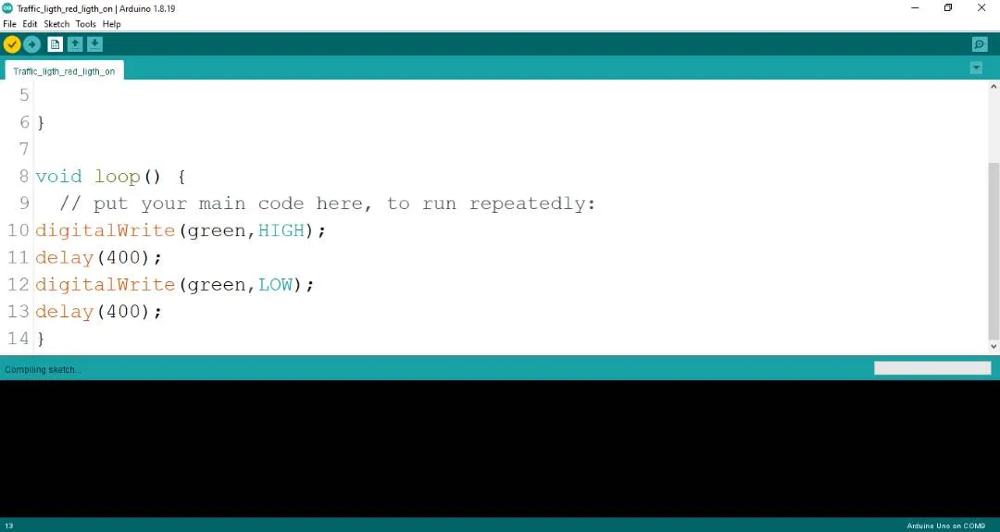

# Project 1.4.6: Trafic Light Green Blink Only

| **Description** | This is where you will learn how to make the green LED blink.                                                                                                                                                |
| --------------- | ------------------------------------------------------------------------------------------------------------------------------------------------------------------------------------------------------------ |
| **Use case**    | This could be a system that would make the green LED on the traffic light blink to create more awareness or signal that it’s time to move since sometimes, drivers have their attention off when in traffic. |

## Components (Things You will need)

|  |  |  |  |  |
| ------------------------------------------------------------------- | --------------------------------------------------- | ----------------------------------------------------------- | ----------------------------------------------------- | ------------------------------------------------------ |

## Building the circuit

Things Needed:

- Arduino Uno = 1
- Arduino USB cable = 1
- Traffic light module = 1
- green jumper wires = 1
- White jumper wire= 1

## Mounting the component on the breadboard

## Mounting the component on the breadboard

**Step 1:** Place the traffic light module on the breadboard.

**step 2:**Connect the G pin of the traffic light module to pin 7 on the Arduino Uno using a jumper wire.

**step 3:**Connect the GND pin of the traffic light module to GND on the Arduino Uno.

**step 4:**After wiring, connect the Arduino Uno to the computer using the USB cable.

.


## PROGRAMMING

**Step 1:** Open your Arduino IDE. See how to set up here: [Getting Started](../../Getting Started/Arduino_IDE_Setup.md).

**Step 2:** Type `   const int green = 7;` before the void setup function.

.

**Step 3:** Type the following codes in the void setup function as shown below;

``` cpp
pinMode (green, OUTPUT);
```

.

**Step 4:** Type the following codes in the void loop function as shown below;

``` cpp
digitalWrite (green, HIGH);
```

.

The digitalWrite () function controls the state of the pin. The pin can either be HIGH or LOW. The HIGH state turns on the LED. As a result, the code below turns on the LED.

**Step 5:** Now, let's introduce a delay by typing `delay(400);` exactly as shown in the image below.
.

**Step 6:** : Type `digitalWrite (green, LOW);` exactly as shown in the image below.
.

**Step 7:** Now, let's finish up with a delay by typing `delay(400);` exactly as shown in the image below.
.

## Uploading the code

**Step 1:** Save your code. _See the [Getting Started](../../Getting Started/Arduino_IDE_Setup.md) section_

**Step 2:** Select the arduino board and port _See the [Getting Started](../../Getting Started/Arduino_IDE_Setup.md) section:Selecting Arduino Board Type and Uploading your code_.

**Step 3:** Upload your code. _See the [Getting Started](../../Getting Started/Arduino_IDE_Setup.md) section:Selecting Arduino Board Type and Uploading your code_

## OBSERVATION

When the circuit is functioning, observe the green LED of the traffic light blinking as expected. This indicates that the LED is receiving the signal correctly from the Arduino and is operating as intended.

## CONCLUSION

In brief, the project centered on creating a blinking green light within a simulated traffic light system provides an instructive introduction to controlled visual signaling. By programming the green LED to blink, participants gain insights into timing control, code logic, and the role of dynamic visual cues. This endeavor serves as a cornerstone in electronics exploration, showcasing the concept of rhythmic signaling and fostering curiosity about practical applications, such as traffic flow management and automation.
