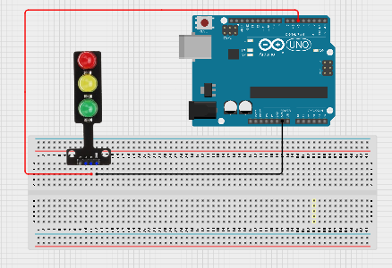
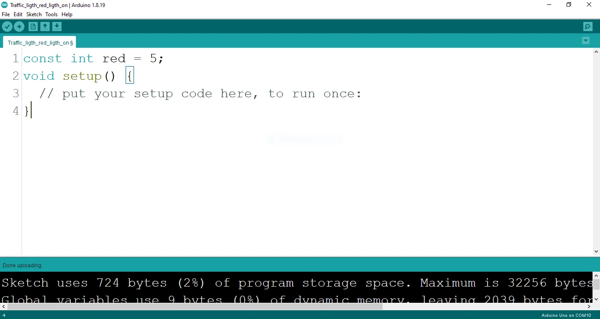
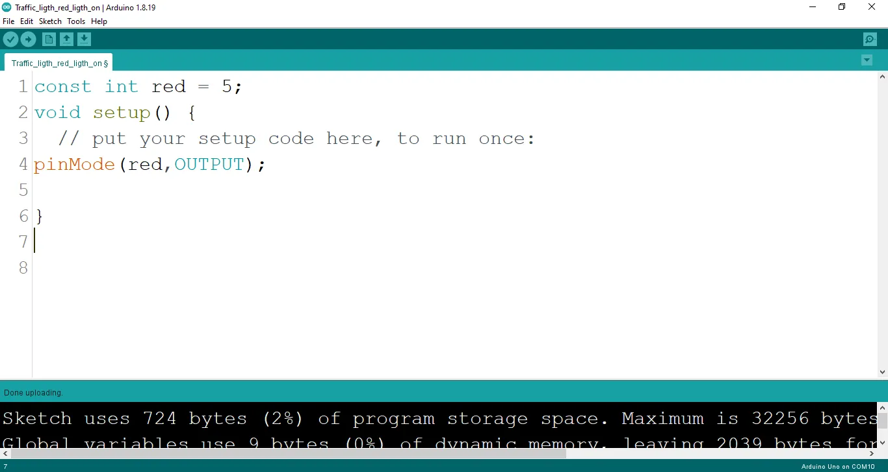
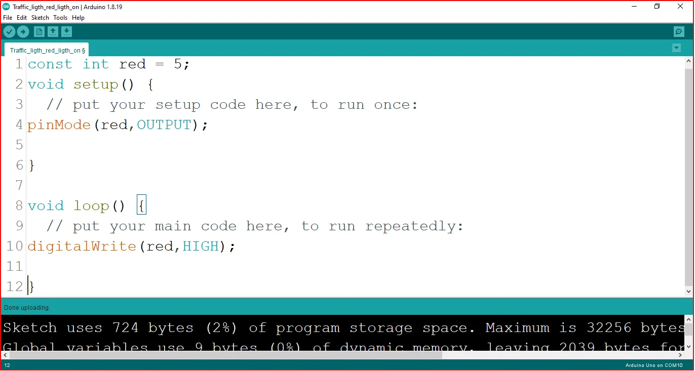

# Project 1.4.1: RED MEANS STOP

| **Description** | This teaches you how to turn ON and also turn OFF the red light only on the traffic light module. |
| --------------- | ------------------------------------------------------------------------------------------------- |
| **Use case**    | Programming the red light on the traffic to turn ON which will signal drivers and riders to stop. |

## Components (Things You will need)

|  |  |  |  |  |
| ------------------------------------------------------------------- | --------------------------------------------------- | ----------------------------------------------------------- | ----------------------------------------------------- | ------------------------------------------------------ |

## Building the circuit

Things Needed:

- Arduino Uno = 1
- Arduino USB cable = 1
- Traffic light module = 1
- Red jumper wires = 1
- White jumper wire= 1

## Mounting the component on the breadboard

**Step 1:** Take the Traffic light and the breadboard, insert the Traffic light into the horizontal connectors on the breadboard.

**step 2:** Connect the R pin of the traffic light module to pin 5 on the Arduino Uno using a jumper wire.

**step 3:** Connect the GND pin of the traffic light module to GND on the Arduino Uno.

**step 4:** After wiring, connect the Arduino Uno to the computer using the USB cable.

.

## PROGRAMMING

**Step 1:** Open your Arduino IDE. See how to set up here: [Getting Started](../../Getting Started/Arduino_IDE_Setup.md).

**Step 2:** Type `   const int red = 5;` before the void setup function.

.

**Step 3:** Type the following codes in the void setup function as shown below;

``` cpp
pinMode (red, OUTPUT);
```

.

**Step 4:** Type the following codes in the void loop function as shown below;

``` cpp
digitalWrite (red, HIGH);
```

.

The digitalWrite () function controls the state of the pin. The pin can either be HIGH or LOW. The HIGH state turns on the LED. As a result, the code below turns on the LED.

_**NB:** To turn off the traffic light_
**Step 5:** Change the ` digitalWrite (red, HIGH);` into ` digitalWrite (red, LOW);`.

## Uploading the code

**Step 1:** Save your code. _See the [Getting Started](../../Getting Started/Arduino_IDE_Setup.md) section_

**Step 2:** Select the arduino board and port _See the [Getting Started](../../Getting Started/Arduino_IDE_Setup.md) section:Selecting Arduino Board Type and Uploading your code_.

**Step 3:** Upload your code. _See the [Getting Started](../../Getting Started/Arduino_IDE_Setup.md) section:Selecting Arduino Board Type and Uploading your code_

## CONCLUSION

summary, the project centered on the illumination of a red light in a simulated traffic light system provides a fundamental understanding of basic electronics and visual signaling. By lighting the red LED, participants grasp the concept of circuit connections, output control, and the role of color-coded signals. This undertaking serves as a cornerstone in electronics exploration, illustrating the significance of clear visual cues and sparking interest in practical applications, such as traffic management and safety systems.
