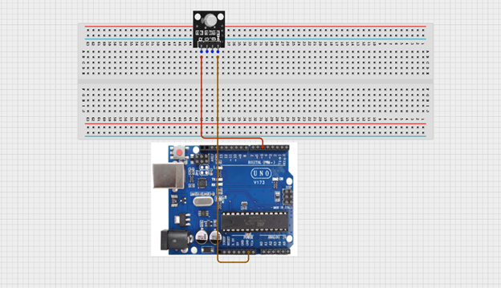
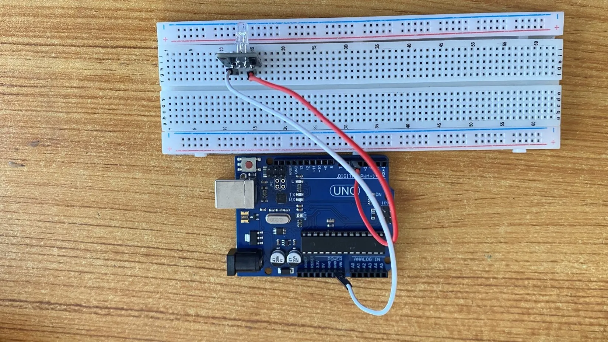
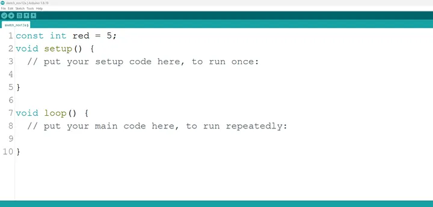
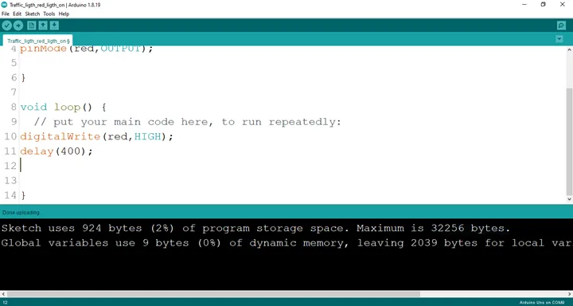
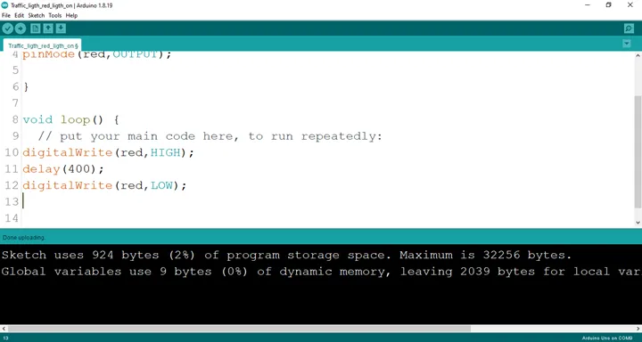
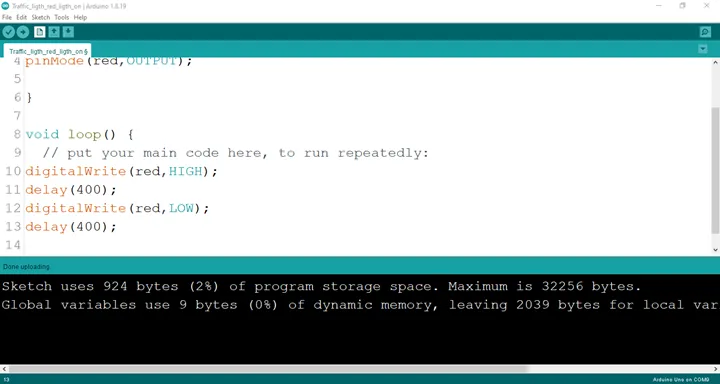

# Project 1.5.2: Red Blink

| **Description** | This project teaches how to connect and program an RGB LED so that only the red-light blinks using an Arduino. |
|------------------|----------------------------------------------------------------|
| **Use case**     | The red light on an RGB LED blinking can be used as a warning or alert indicator, such as showing an error, danger, or system malfunction that requires immediate attention.

 |

## Components (Things You will need)

|  |  |  |  ||
|-------------------------|-------------------------|-------------------------|-------------------------|-------------------------|-------------------------|

## Building the circuit

Things Needed:

-	Arduino Uno Board = 1
-	Arduino USB cable = 1
-	RGB= 1
-	Red jumper wires = 1
-	White jumper wires = 1

## Mounting the component on the breadboard

**Step 1:** Insert the RGB module into the middle section of the breadboard horizontally. Make sure you identify the R pin (Red) and the – pin (GND).

 _**NB:** Take note of where each of the pins of the RGB are placed on the bread board._


.


## WIRING THE CIRCUIT

Things Needed:

-	Red jumper wire = 1
-	white jumper wire = 1

**Step 2:** Connect the red jumper wire from the G pin of the RGB module to pin 6 on the Arduino UNO.
Then connect the white jumper wire from the – (GND) pin of the RGB module to the GND pin on the Arduino UNO.


<!-- - Connect one end of the red jumper wire to R pin of RGB module on the breadboard. Ensure you put the pin in the right hole.

- Connect the other end of the red jumper wire to pin number 5 on the Arduino UNO. -->


.

<!-- **Step 3:** Take the white jumper wire and connect one end to the GND or the - pin of the RGB module.

- Connect the other end of the white jumper wire to GND on the Arduino UNO. -->


<!-- . -->

## PROGRAMMING

**Step 1:** Open your Arduino IDE. See how to set up here: [Getting Started](../../Getting Started/Arduino_IDE_Setup.md).

**Step 2:** Type ```const int red = 5;``` as shown below in the image.

_**NB:** Make sure you avoid errors when typing. Do not omit any character or symbol especially the bracket { }  and semicolons ;  and put them as you see in the image. The code that comes after the two ash backslashes “//” are called comments. They are not part of the code that will be run, they only explain the lines of code. You can avoid typing them._

.

**Step 3:** Type ```pinMode (red, OUTPUT);``` as shown below in the image.

.

_**NB:** The code below sets the pin names “red” as an output pin. An output pin helps send signals from the microcontroller to other components in the circuit. The pinMode () function, helps determine and control the behavior of a specific pin on the board_

**Step 4:** Type ```digitalWrite (red, HIGH);``` as shown below in the image.

.

The digitalWrite () function controls the state of the pin. The pin can either be HIGH or LOW. The HIGH state turns on the LED. As a result, the code below turns on the LED.

**Step 5:** Type  ```delay (400);``` as shown below 

.

**Step 6:** Type ```digitalWrite (red, LOW);``` as seen below:

.

**Step 7:** Type ```delay (400);``` as shown below.

.

**Step 8:** Save your code. _See the [Getting Started](../../Getting Started/Arduino_IDE_Setup.md) section_

**Step 9:** Select the arduino board and port _See the [Getting Started](../../Getting Started/Arduino_IDE_Setup.md) section:Selecting Arduino Board Type and Uploading your code_.

**Step 10:** Upload your code. _See the [Getting Started](../../Getting Started/Arduino_IDE_Setup.md) section:Selecting Arduino Board Type and Uploading your code_

## CONCLUSION

In summary, the project centered on creating a blinking red light within an RGB configuration provides an illuminating introduction to color manipulation and electronic control. By programming the red LED component to blink, participants acquire insights into timing control, code logic, and the dynamic visual effects of a single color. This endeavor serves as a pivotal step in exploring RGB color variation, showcasing the rhythmic potential of individual color components, and sparking interest in practical applications such as decorative lighting and visual aesthetics.
