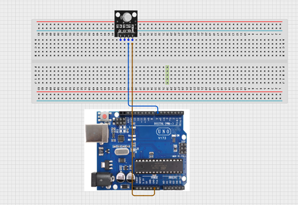
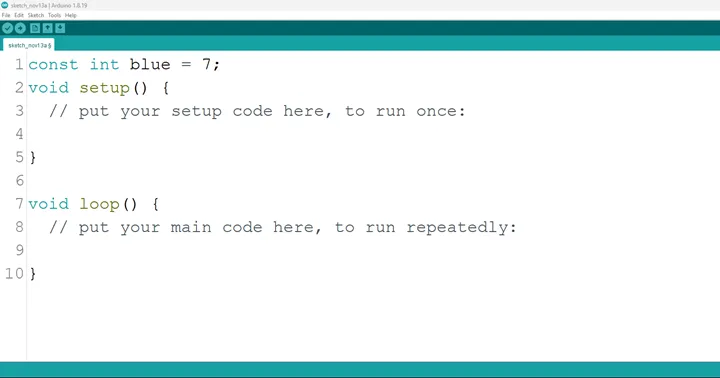
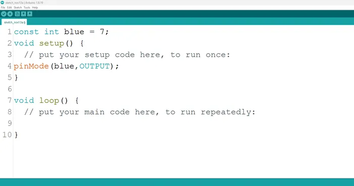
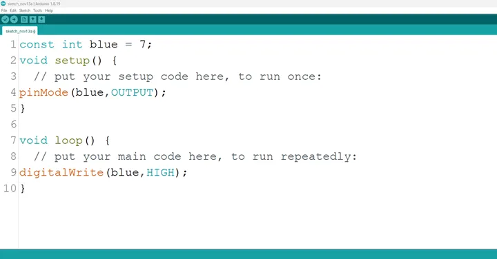
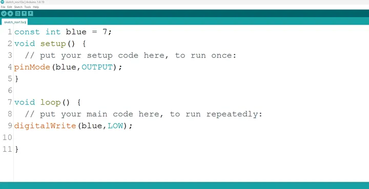

# Project 1.5.5: R -G-Blue

| **Description** | This project teaches how to connect and program an RGB LED so that only the blue light turns on/off using an Arduino.|
|------------------|----------------------------------------------------------------|
| **Use case**     | In real-life engineering systems, the blue LED on an RGB indicator is often used to show communication or connectivity status, such as when a device has successfully connected to Bluetooth, Wi-Fi, or a control network. For example, in smart home devices or industrial controllers, a blue light can indicate that the system is paired, linked to a server, or actively exchanging data without errors. |

## Components (Things You will need)

|  |  |  |  ||
|-------------------------|-------------------------|-------------------------|-------------------------|-------------------------|-------------------------|

## Building the circuit

Things Needed:

-	Arduino Uno Board = 1
-	Arduino USB cable = 1
-	RGB= 1

## Mounting the component on the breadboard

**Step 1:** Insert the RGB module into the middle section of the breadboard horizontally. Make sure you identify the B pin (Blue) and the – pin (GND).

 _**NB:** Take note of where each of the pins of the RGB are placed on the bread board._


.


## WIRING THE CIRCUIT

Things Needed:

-	Blue jumper wire = 1
-	Orange jumper wire = 1

**Step 2:** Connect the blue jumper wire from the B pin of the RGB module to pin 6 on the Arduino UNO.
Then connect the orange jumper wire from the – (GND) pin of the RGB module to the GND pin on the Arduino UNO.

.


## PROGRAMMING

**Step 1:** Open your Arduino IDE. See how to set up here: [Getting Started](../../Getting Started/Arduino_IDE_Setup.md).

**Step 2:** Type ```const int blue = 7;``` as shown below in the image.

_**NB:** Make sure you avoid errors when typing. Do not omit any character or symbol especially the bracket { }  and semicolons ;  and put them as you see in the image. The code that comes after the two ash backslashes “//” are called comments. They are not part of the code that will be run, they only explain the lines of code. You can avoid typing them._

.

**Step 3:** Type ```pinMode (blue, OUTPUT);``` as shown below in the image.

.

_**NB:** The code below sets the pin names “blue” as an output pin. An output pin helps send signals from the microcontroller to other components in the circuit. The pinMode () function, helps determine and control the behavior of a specific pin on the board_

**Step 4:** Type ```digitalWrite (blue, HIGH);``` as shown below in the image.

.

The digitalWrite () function controls the state of the pin. The pin can either be HIGH or LOW. The HIGH state turns on the LED. As a result, the code below turns on the LED.

_**NB:** To turn off the green light,_
**Step 5:** Type ```digitalWrite (blue, LOW);``` as shown below in the image.

.

_**NB:** The LOW state turns off the LED. Hence, you can include the code below in your main code if you want to turn your light off but you are not required to do so._

**Step 8:** Save your code. _See the [Getting Started](../../Getting Started/Arduino_IDE_Setup.md) section_

**Step 9:** Select the arduino board and port _See the [Getting Started](../../Getting Started/Arduino_IDE_Setup.md) section:Selecting Arduino Board Type and Uploading your code_.

**Step 10:** Upload your code. _See the [Getting Started](../../Getting Started/Arduino_IDE_Setup.md) section:Selecting Arduino Board Type and Uploading your code_

## CONCLUSION

To conclude, the project focusing on turning on the blue LED within an RGB configuration provides a fundamental understanding of color representation and electronic control. By activating the blue LED component, participants grasp the concept of color channels, circuit connections, and the visual expression of a single color. This endeavor serves as a pivotal step in comprehending RGB color manipulation, emphasizing the distinct role of each color component, and inspiring curiosity in practical applications such as display technologies and customized lighting solutions.
