# Project 1.6.1: LIGHT INTENSITY CHECKER

| **Description** | This is a simple project that measures how bright or dark an environment is using an LDR (Light Dependent Resistor). It helps detect light levels and shows whether a place has high light intensity (bright) or low light intensity (dark), making it useful for automatic lighting systems and simple environmental monitoring. |
|------------------|----------------------------------------------------------------|
| **Use case**     |  An LDR (Light Dependent Resistor) is used in engineering systems to detect light levels and control devices automatically, such as turning street lights or home lights on at night and off during the day to save energy. In simple terms, it works like a small “eye” that senses brightness or darkness, helping systems react automatically to changes in light, like switching lights on when it gets dark. |

## Components (Things You will need)

|  |  |  |  ||
|-------------------------|-------------------------|-------------------------|-------------------------|-------------------------|

## Building the circuit

Things Needed:


-  Arduino Uno = 1
-  Arduino USB cable = 1
-  Light dependent resistor   = 1
-  Jumper Wires
-  Breadboard


## Mounting the component on the breadboard

**Step 1:** Place the LDR (light sensor) onto the breadboard, making sure all the pins are inserted properly into separate rows.

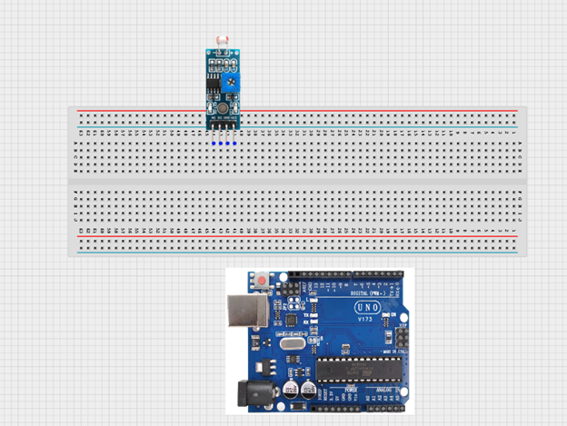.


## WIRING THE CIRCUIT

**Step 2:** Use jumper wires to connect:
•	VCC on the LDR → 5V on the Arduino 
•	GND on the LDR → GND on the Arduino
NB: VCC is the power supply pin that provides electricity to the sensor, while GND (Ground) completes the circuit and allows the sensor to work properly. The GND is the negative terminal.

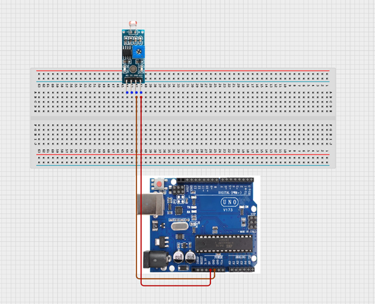

**Step 3:** Connect:
•	DO on the LDR → Pin 2 on the Arduino 
•	AO on the LDR → AO pin on the Arduino

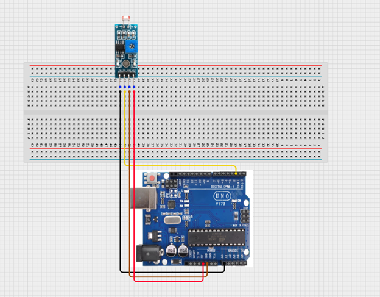.

_make sure you connect the arduino usb use blue cable to the Arduino board_.

## PROGRAMMING

**Step 1:** Open your Arduino IDE. See how to set up here: [Getting Started](../../Getting Started/Arduino_IDE_Setup.md).

**Step 2:** Type ``` const int LDR_PIN = A0; ``` as shown below in the image.

_**NB:** Make sure you avoid errors when typing. Do not omit any character or symbol especially the bracket { }  and semicolons ;  and place them as you see in the image . The code that comes after the two ash backslashes “//” are called comments. They are not part of the code that will be run, they only explain the lines of code. You can avoid typing them._
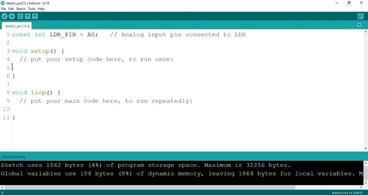.

**Step 3:** Type ``` const int DO_PIN = 2;``` as shown below in the image.

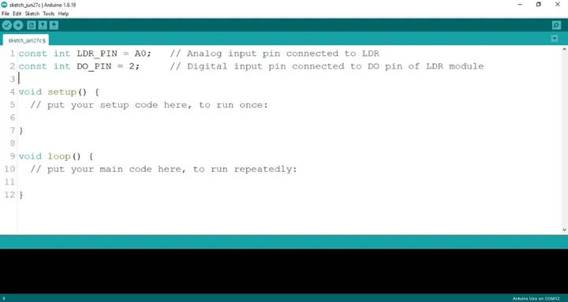.
_**NB:** The code below sets the pin names as an output pin. An output pin helps send signals from the microcontroller to other components in the circuit. The pinMode () function, helps determine and control the behavior of a specific pin on the board._

**Step 4:** Type ``` pinMode (DO_PIN, INPUT); ``` as shown below in the image.

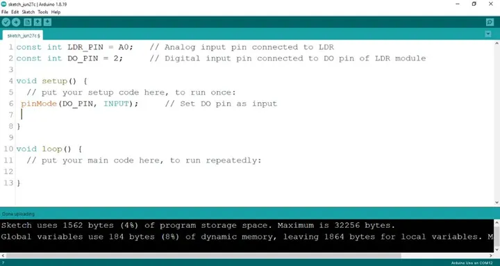.

**Step 5:** Type ``` Serial.begin(9600); ;``` as shown below in the image.

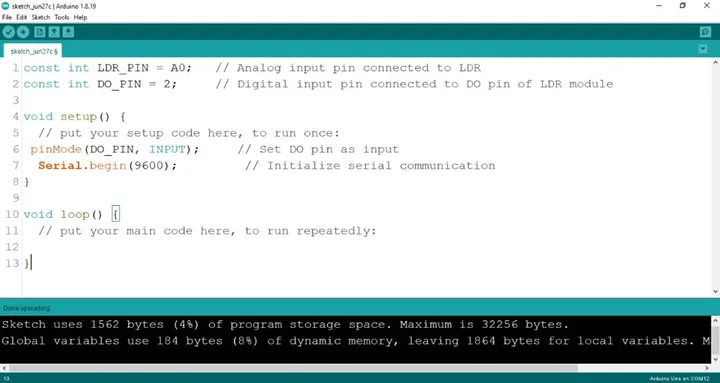.

**Step 6:** Type ``` int 1drValue = analogRead (LDR_PIN); ``` as shown below in the image.

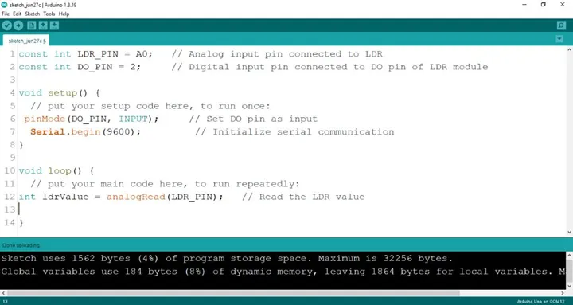.

**Step 7:** Type ``` int digitalValue = digitalRead (DO_PIN); ``` as shown below in the image.

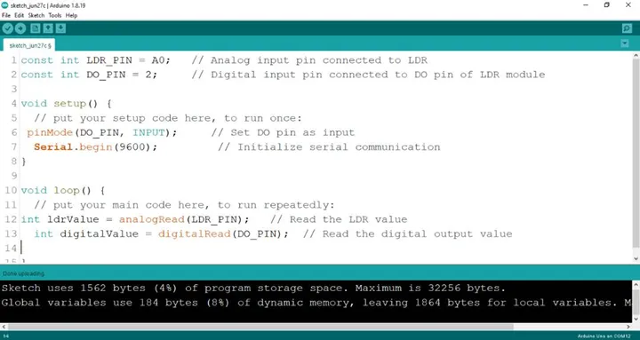.

**Step 8:** Type ``` Serial.print(“Analog Value:”); ``` as shown below in the image.

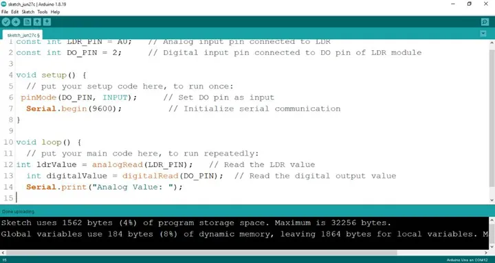.

**Step 9:** Type ``` Serial.printIn(ldrValue); ``` as shown below in the image.

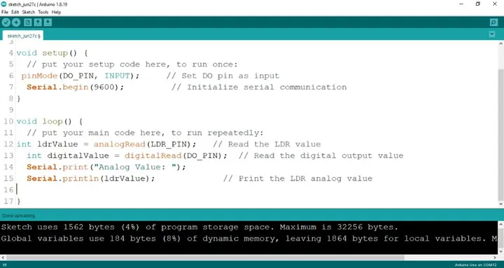.

**Step 10:** Type ``` Serial.print(“Digital Value:”); ``` as shown below in the image.

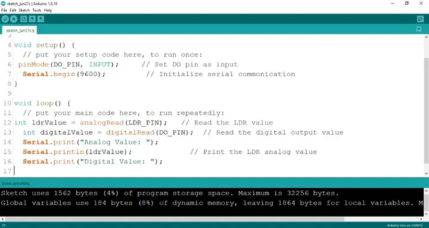.

**Step 11:** Type ``` Serial.printIn(digitalValue); ``` as shown below in the image.

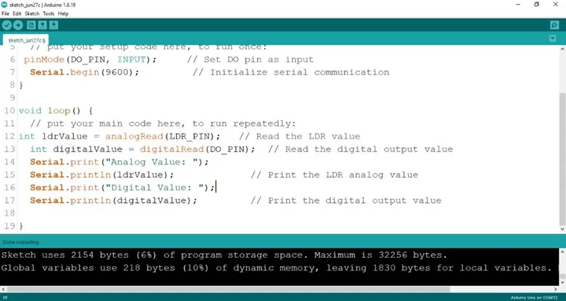.


**Step 12:** Save your code. _See the [Getting Started](../../Getting Started/Arduino_IDE_Setup.md) section_

**Step 13:** Select the arduino board and port _See the [Getting Started](../../Getting Started/Arduino_IDE_Setup.md) section:Selecting Arduino Board Type and Uploading your code_.

**Step 14:** Upload your code.

## CONCLUSION
This project demonstrated how an LDR sensor can be used with an Arduino to detect and measure light intensity. It helped in understanding how analog and digital signals work, how sensor data is read and displayed, and how programming controls hardware response. From an engineering perspective, this system reflects the basic principle used in automatic lighting and smart control systems, where light sensors are used for energy-efficient and responsive environmental monitoring.


