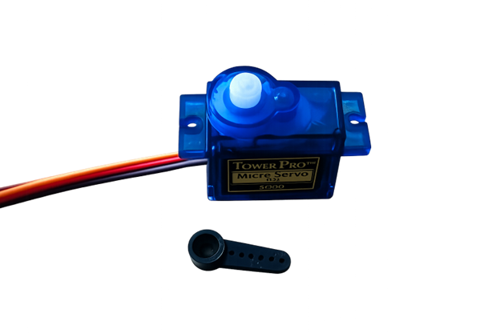
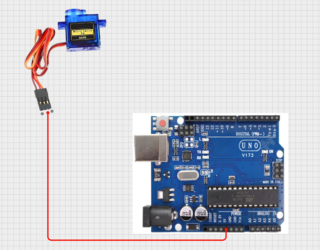
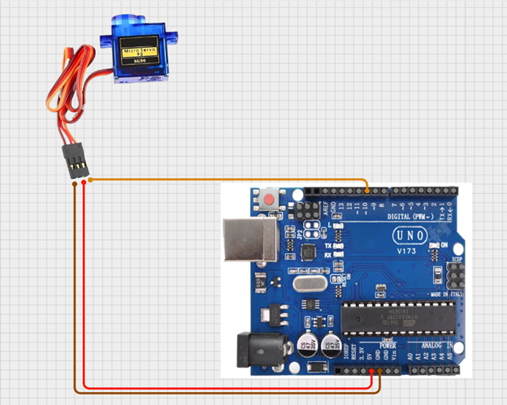
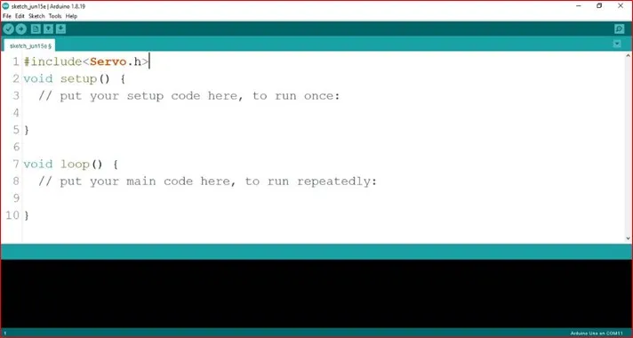
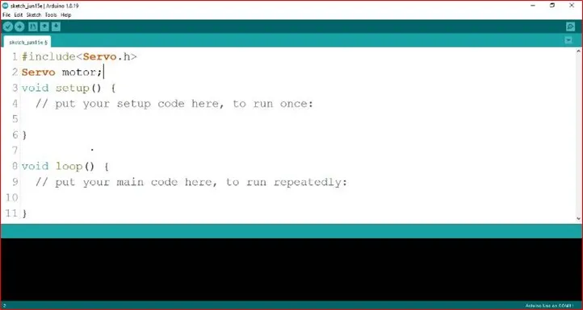
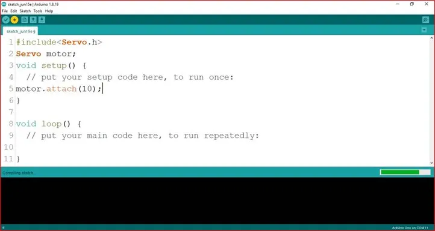
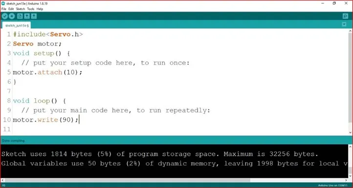
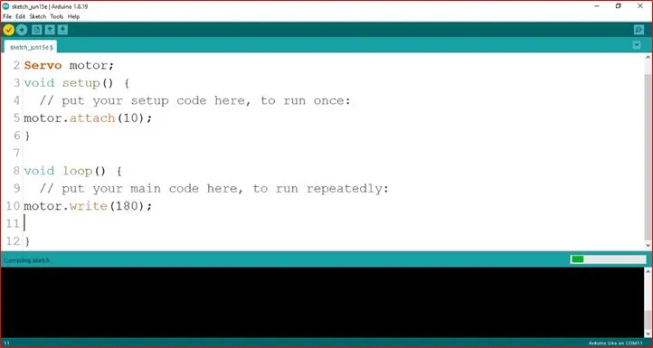

# Project 1.7.1: ROBOT ARM-UP

| **Description** | In this project, you will learn how to control a servo motor using an Arduino Uno by setting it to move to one specific angle. This project introduces the basic concept of servo motor positioning and controlled movement used in simple automation systems.|
| --------------- | ------------------------------------------------------------------------------------------------------------------------------------------------------------------------------------------------------------------ |
| **Use case**| Servo motors set to one angle can be used in systems such as automatic doors, camera stands, robotic arms, and car side mirrors where a fixed and accurate position is needed.                                                               |

## Components (Things You will need)

|  |  |  |  |
| --------------------------------------------------- | ----------------------------------------------------------- | ------------------------------------------------------- | ------------------------------------------------------ |

## Building the circuit

Things Needed:

- Arduino Uno = 1
- Arduino USB cable = 1
- Servo Motor = 1
- Servo Motor blade =1
- Jumper Wires 
- Breadboard

## Mounting the component on the breadboard

**Step 1:** Attach the Servo Arm
Fix the servo arm (swing arm) onto the white rotating shaft of the servo motor and press it gently until it is firmly attached.

.

## WIRING THE CIRCUIT

### Things Needed:

- Red male-male-to-male jumper wires = 1
- Brown male-to-male jumper wires = 1
- Yellow male-to-male jumper wires = 1

**Step 2:** Connect the servo power wires
Attach a red jumper wire to the servo’s red wire and connect the other end to the 5V pin on the Arduino. This supplies power to the servo motor. 

.

**Step 3:** Connect the ground wire
Attach a brown jumper wire to the servo’s brown wire and connect the other end to the GND pin on the Arduino. This completes the electrical circuit.

.

**Step 4:**  Connect the control wire
Attach an orange jumper wire to the servo’s orange wire and connect the other end to Digital Pin 10 on the Arduino. This wire sends movement commands from the Arduino to the servo motor.

.

.

_just as shown above, connect your USB cable to the Arduino board and to your laptop._

## PROGRAMMING

**Step 1:** Open your Arduino IDE. See how to set up here: [Getting Started](../../Getting Started/Arduino_IDE_Setup.md).

**Step 2:** Type ` #include <Servo.h>;` on line one before void Setup() function.

.

**Step 3:** Type ` Servo motor;` on line two before void Setup() function.

.

**Step 4:** Type `motor.attach(10);` inside the void Setup() function.

.

**Step 5:** Type `motor.write (90); ` inside the void loop() function.

.

_**NB:** The swing arm can only turn up to 180 degrees. It will not turn to an angle about 180. You can change the angle by adjusting the number in the bracket. Example: motor.write(180); as seen below:_

.

_**NB:** Here, motor.write(90); sets the servo to 90 degrees. You can change the angle by adjusting the number (from 0 to 180) in parentheses, such as motor.write(180);_

**Step 6:** Save your code. _See the [Getting Started](../../Getting Started/Arduino_IDE_Setup.md) section_

**Step 7:** Select the arduino board and port _See the [Getting Started](../../Getting Started/Arduino_IDE_Setup.md) section:Selecting Arduino Board Type and Uploading your code_.

**Step 8:** Upload your code. _See the [Getting Started](../../Getting Started/Arduino_IDE_Setup.md) section:Selecting Arduino Board Type and Uploading your code_

## CONCLUSION

This project demonstrated how to control a servo motor using an Arduino to achieve precise angle movements. It helped in understanding the basics of motion control, programming, and how servo motors are used in real-life engineering and automation systems such as robotic arms, automatic doors, and smart devices

