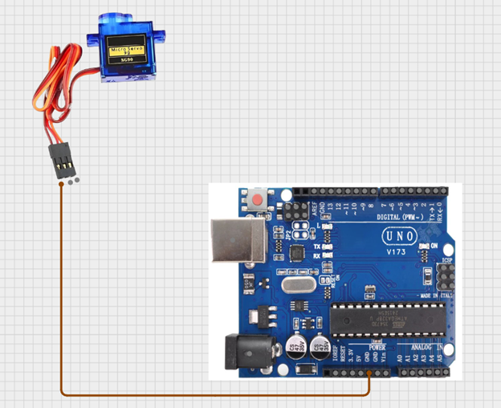
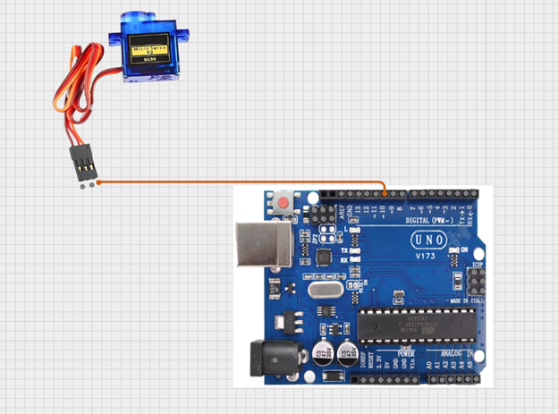
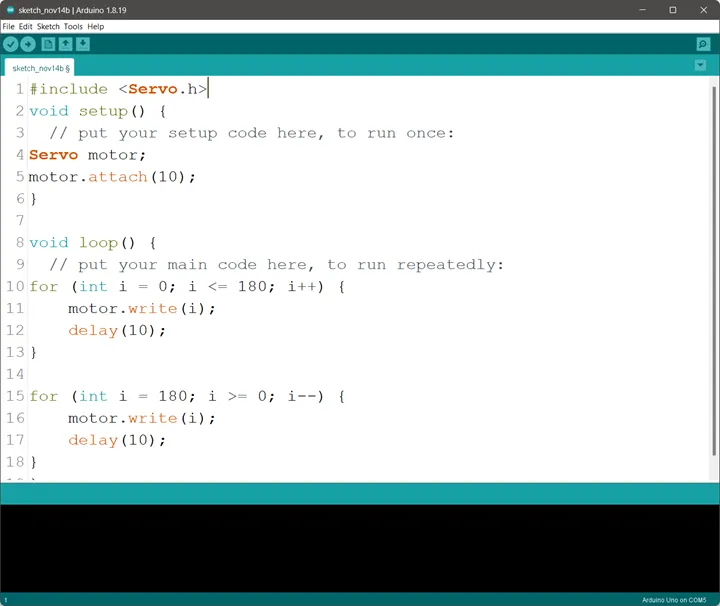

# Project 1.7.2: Car windshield wiper

| **Description** | In this project, you will learn how to control a servo motor using an Arduino to rotate to different angles with precision. This project introduces the basic concept of controlled movement, which is commonly used in systems such as robotic arms, automatic doors, camera positioning systems, and car windscreen wipers. |
| --------------- | ------------------------------------------------------------------------------------------------------------------------------------------------------------------------------------------------------------------------------------------------------- |
| **Use case**    | In engineering, they are commonly found in robotic arms, automated machines, and camera tracking systems, while in daily life they are used in automatic gates, remote-controlled cars, toy robots, and car windscreen wipers to perform accurate and controlled movements. |

## Components (Things You will need)

|  |  |  |  |
| --------------------------------------------------- | ----------------------------------------------------------- | ------------------------------------------------------- | ------------------------------------------------------ |

## Building the circuit

Things Needed:

- Arduino Uno = 1
- Arduino USB cable = 1
- Servo Motor = 1
- Servo Motor blade =1
- Jumper Wire 

## Mounting the component on the breadboard

**Step 1:** Attach the Servo Arm
Fix the servo arm (swing arm) onto the white rotating shaft of the servo motor and press it gently until it is firmly attached.


.

## WIRING THE CIRCUIT

**Step 2:** Connect the servo power wires
Attach a red jumper wire to the servo’s red wire and connect the other end to the 5V pin on the Arduino. This supplies power to the servo motor. 


.

**Step 3:** Connect the ground wire
Attach a brown jumper wire to the servo’s brown wire and connect the other end to the GND pin on the Arduino. This completes the electrical circuit.

.

**Step 4:**  Connect the control wire
Attach an orange jumper wire to the servo’s orange wire and connect the other end to Digital Pin 10 on the Arduino. This wire sends movement commands from the Arduino to the servo motor.


.

.

_just as shown above, connect your USB cable to the Arduino board and to your laptop._

## PROGRAMMING

**Step 1:** Open your Arduino IDE. See how to set up here: [Getting Started](../../Getting Started/Arduino_IDE_Setup.md).

**Step 2:** Type ` #include <Servo.h>;` on line one before void Setup() function.

.

**Step 3:** Type ` Servo motor;` on line two before void Setup() function.

.

**Step 4:** Type `motor.attach(10);` inside the void Setup() function.

.

**Step 5:** Type

``` cpp
for (int i = 0; i <= 180; i++) {
motor.write (i);
delay (10);
}
for (int i = 180; i >= 0; i--) {
motor.write (i);
	delay (10).
}

```

inside the void loop() function.

.

**NB:**

- In this loop:
- The first for loop gradually moves the servo from 0° to 180°, creating an upward sweep.
- The second for loop moves the servo back from 180° to 0°, creating a downward sweep.

.

**NB:** Here, motor.write(90); sets the servo to 90 degrees. You can change the angle by adjusting the number (from 0 to 180) in parentheses, such as motor.write(180);

**Step 6:** Save your code. _See the [Getting Started](../../Getting Started/Arduino_IDE_Setup.md) section_

**Step 7:** Select the arduino board and port _See the [Getting Started](../../Getting Started/Arduino_IDE_Setup.md) section:Selecting Arduino Board Type and Uploading your code_.

**Step 8:** Upload your code. _See the [Getting Started](../../Getting Started/Arduino_IDE_Setup.md) section:Selecting Arduino Board Type and Uploading your code_

## CONCLUSION

This project demonstrated how to control a servo motor using an Arduino to achieve precise angle movements. It helped in understanding the basics of motion control, programming, and how servo motors are used in real-life engineering and automation systems such as robotic arms, automatic doors, and smart devices

