# Project 2.4.1: Smart lightening system with RGB module.

| **Description** | This project shows how to use an ultrasonic sensor and an RGB module with an Arduino Uno. The RGB lights change when an object comes close to the ultrasonic sensor. |
| --------------- | --------------------------------------------------------------------------------------------------------------------------------------------- |
| **Use case**    | This project can be used as a smart lighting system where different colours appear depending on the distance detected by the ultrasonic sensor.                                  |

## Components (Things You will need)

|  |  |  |  |  |  |
| --------------------------------------------------- | ------------------------------------------------------ | ----------------------------------------------------------- | --------------------------------------------------------- | ------------------------------------------------------ | ------------------------------------------------------ |

## Mounting the component on the breadboard

- Breadboard = 1
- RGB Module = 1
- Ultrasonic sensor = 1

**Step 1:** • Place the ultrasonic sensor on the breadboard.

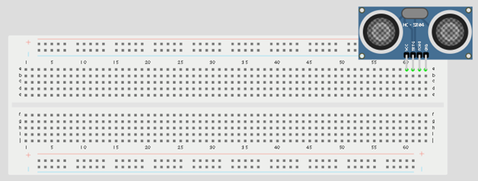.

**Step 2:** Connect the Echo pin of the ultrasonic sensor to pin 2 on the Arduino Uno.

## Wiring the Circuit

.

**NB:**Take note of where each of the pins are placed on the bread board.

**Step 3:** Connect the Trig pin of the ultrasonic sensor to pin 3 on the Arduino Uno.

.

**NB:**Take note of the digital pin you allocated to the trig pin.

**Step 4:** Connect the VCC pin of the ultrasonic sensor to the 5V pin on the Arduino Uno.

.

**Step 5:** Connect the GND pin of the ultrasonic sensor to GND on the Arduino Uno.

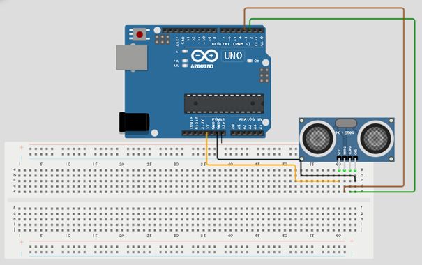.

**Step 6:** Place the RGB module on the breadboard.

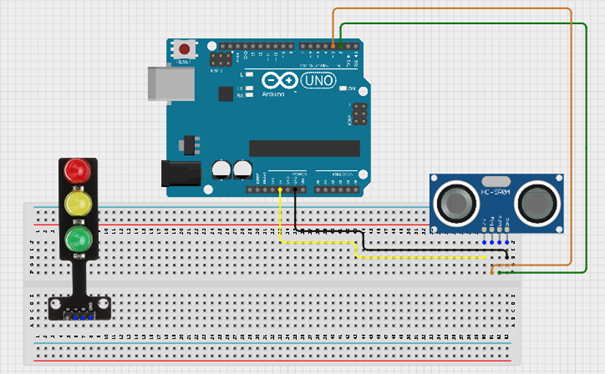.

**Step 7:** Connect the Red pin of the RGB module to pin 4 on the Arduino Uno.

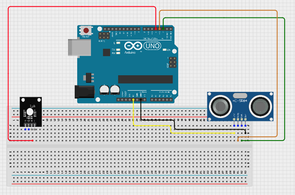.

**Step 8:** Connect the Green pin of the RGB module to pin 5 on the Arduino Uno.

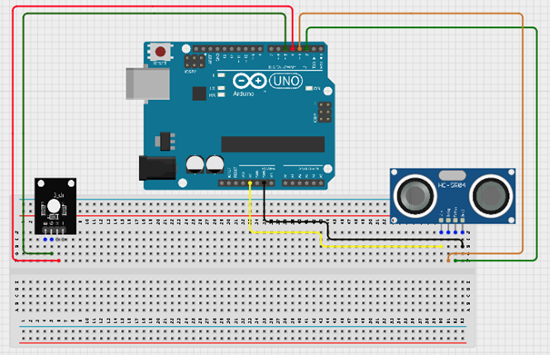.

**Step 9:** Connect the Blue pin of the RGB module to pin 6 on the Arduino Uno.

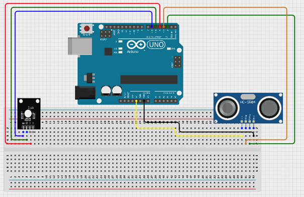.

**Step 10:** Connect the GND pin of the RGB module to GND on the Arduino Uno.

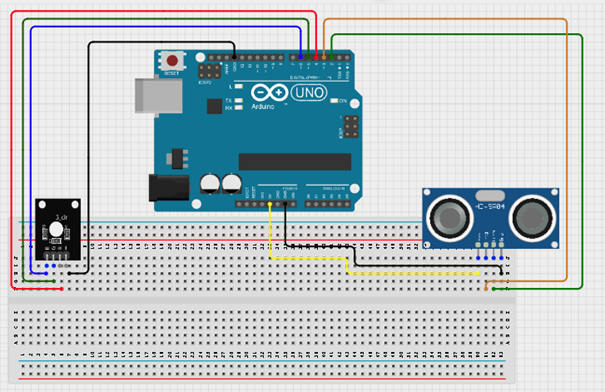.

Step11:  After wiring, connect the Arduino Uno to the computer using the USB cable.

## PROGRAMMING

**Step 1:** Open your Arduino IDE. See how to set up here: [Getting Started](../../Getting Started/Arduino_IDE_Setup.md).

**Step 2:** Type `const int Echo = 2; `
as shown below in the picture below: on line one before void Setup() function.

**Step 3:** Type `int Trig = 3;  `
as shown below in the picture below: on line one before void Setup() function.

**Step 4:** Type `int Red = 4; `
as shown below in the picture below: on line one before void Setup() function.

**Step 5:** Type `int Green  = 5; `
as shown below in the picture below: on line one before void Setup() function.

**Step 6:** Type `int Blue = 6; `
as shown below in the picture below: on line one before void Setup() function.

**Step 7:** Type `long duration; ` and Type ` long distance;`
as shown below in the picture below: on line one before void Setup() function.

**Step 8:** Type
`const int dis_threshold = 15;`

as shown below in the picture below: on line one before void Setup() function.

**NB:** Make sure you avoid errors when typing. Do not omit any character or symbol especially the bracket {} and semicolons; and place them as you see in the image. The code that comes after the two ash backslashes “//” are called comments. They are not part of the code that will be run, they only explain the lines of code. You can avoid typing them.

**Step 9:** In the {} after the void setup
`pinMode (Echo, INTPUT);`
`pinMode (Trig, OUTPUT); `
`Serial.begin (9600);`
`pinMode (Red, OUTPUT);`
`pinMode (Blue, OUTPUT);`
`pinMode (Green, OUTPUT);`

as shown below in the picture below:

**Step 10:** In the {} after the void loop
`digitalWrite (Trig, LOW); `
`delay (2);`
`digitalWrite (Trig, HIGH); `
`delay (10);`
`digitalWrite (Trig, LOW);`
`duration = pulseIn (Echo, HIGH);`
`distance = duration * 0.034/2;`
as shown below in the picture below:

**Step 11:** Type This Function as shown in the image below.

`if (distance < dis_threshold) {`
`digitalWrite (Red, HIGH); `
`delay(200)`
`digitalWrite (Red, LOW); `
`delay(200)`
`digitalWrite (Blue, HIGH); `
`delay(200)`
`digitalWrite (Blue, LOW); `
`delay(200)`
`digitalWrite (Green, HIGH); `
`delay(200)`
`digitalWrite (Green, LOW); `
`else{`
`digitalWrite (Red, LOW);`
`digitalWrite (Blue, LOW);`
`digitalWrite (Green, LOW);`
`}`
`Serial.print (distance);`
`Serial.println (“cm”);`
`delay (100);`
`distance = duration * 0.034/2;} `
as shown in the picture below.

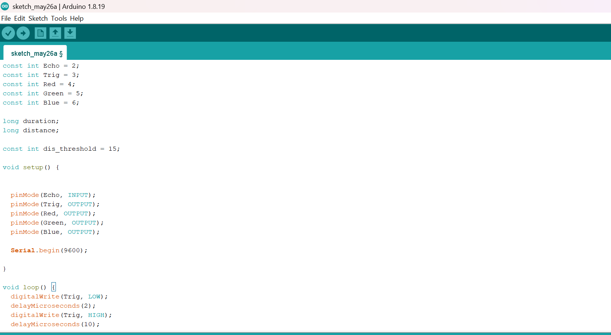.

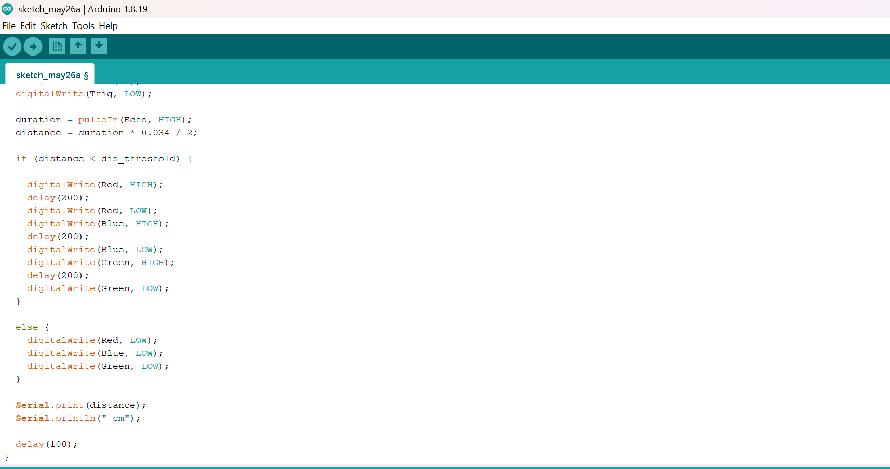.

**Step 12:** Save your code. _See the [Getting Started](../../Getting Started/Arduino_IDE_Setup.md) section_

**Step 13:** Select the arduino board and port _See the [Getting Started](../../Getting Started/Arduino_IDE_Setup.md) section:Selecting Arduino Board Type and Uploading your code_.

**Step 14:** Upload your code. _See the [Getting Started](../../Getting Started/Arduino_IDE_Setup.md) section:Selecting Arduino Board Type and Uploading your code_

**Step 15:** Click on the serial monitor icon to view the amount of sound being recorded as shown in the picture below:

.

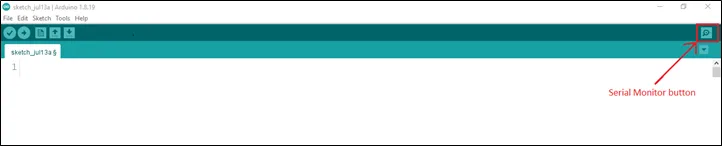

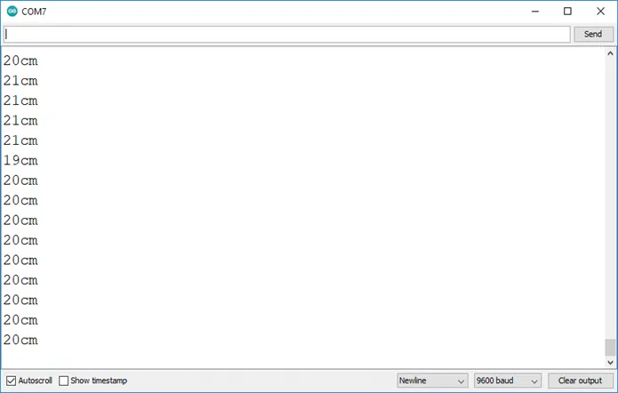

## OBSERVATION
The Serial Monitor displays distance values continuously. When an object comes close to the ultrasonic sensor, the RGB module lights up in different colours.

## CONCLUSION

This project helps learners understand how to combine sensors and RGB modules using Arduino. It introduces distance measurement, smart lighting systems, and colour control in electronics and programming.

