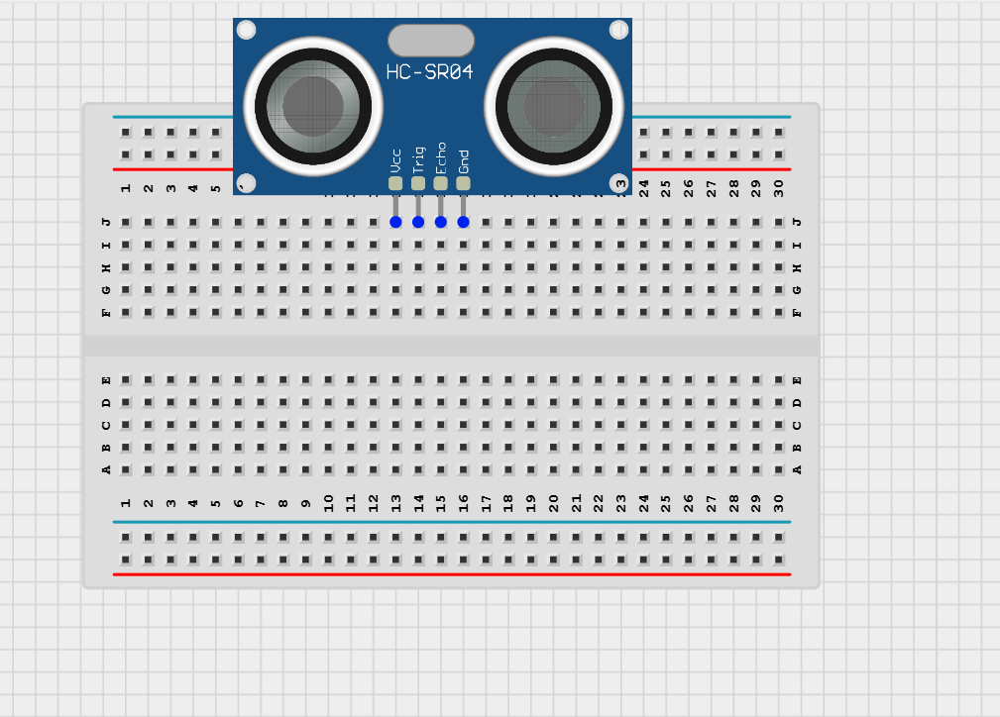
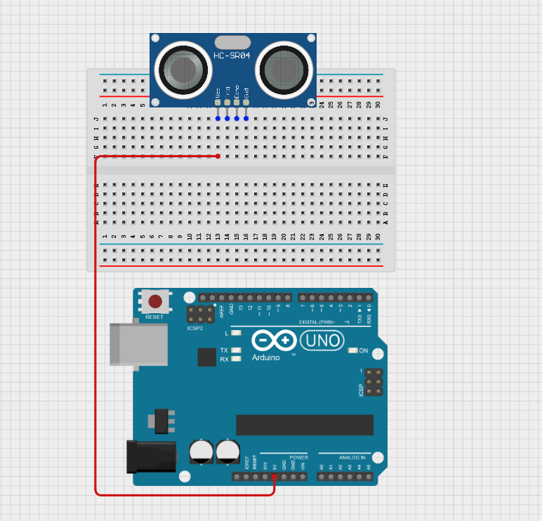
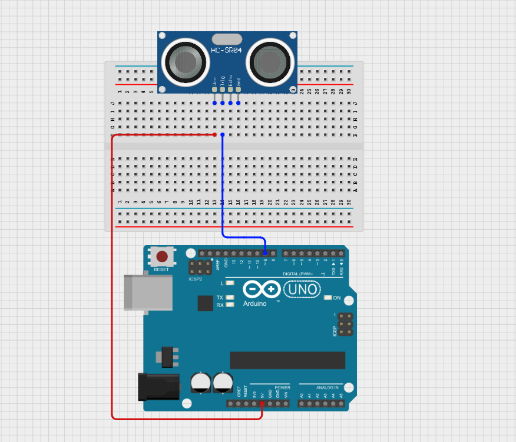
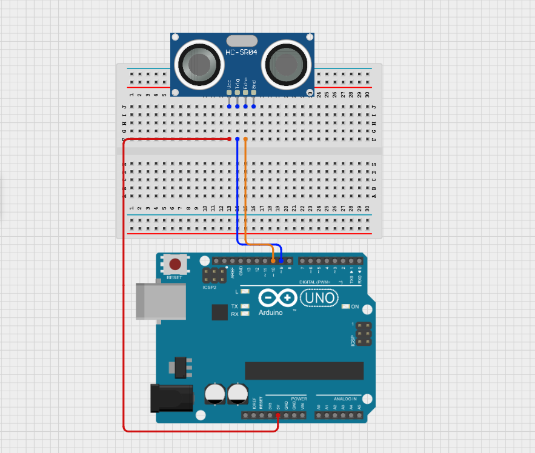
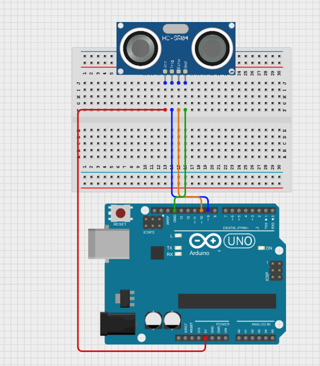
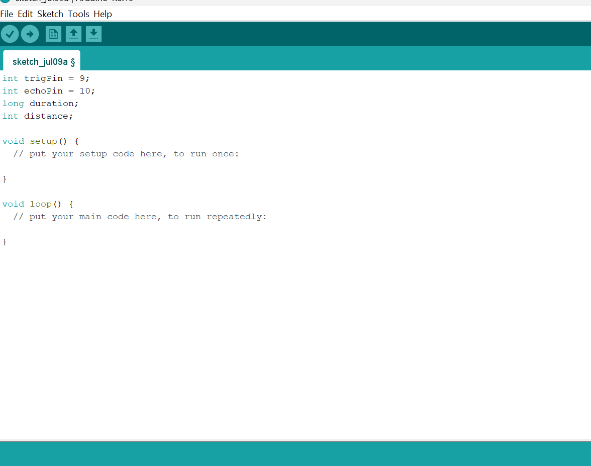
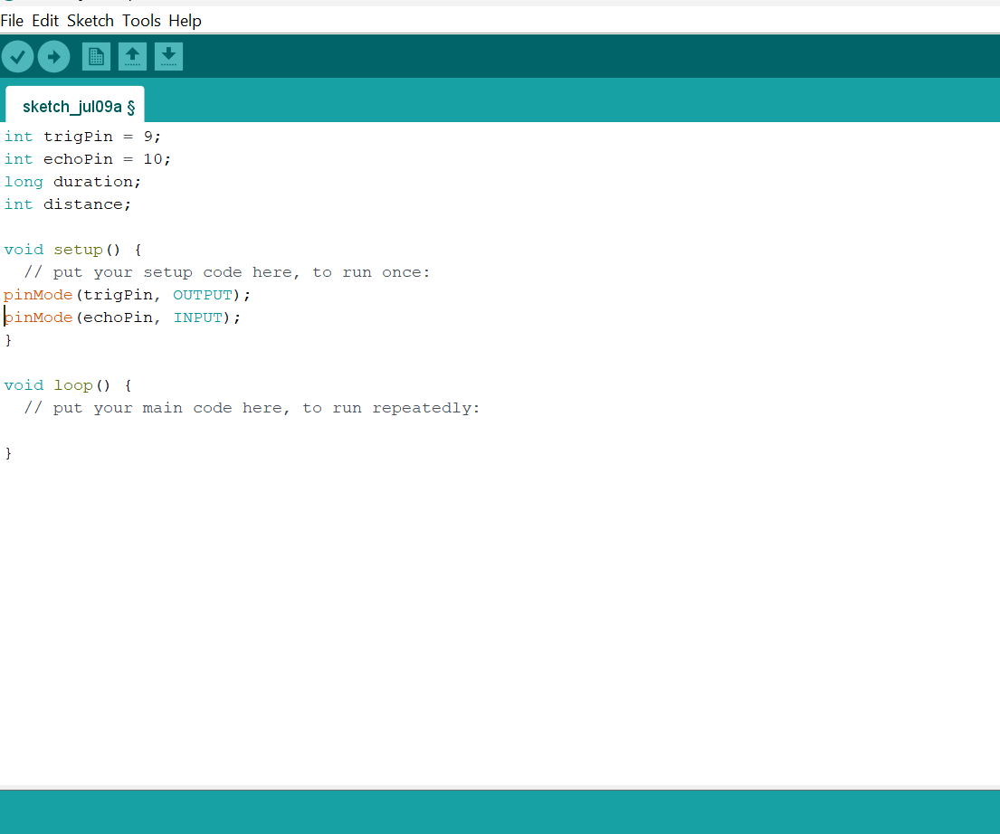
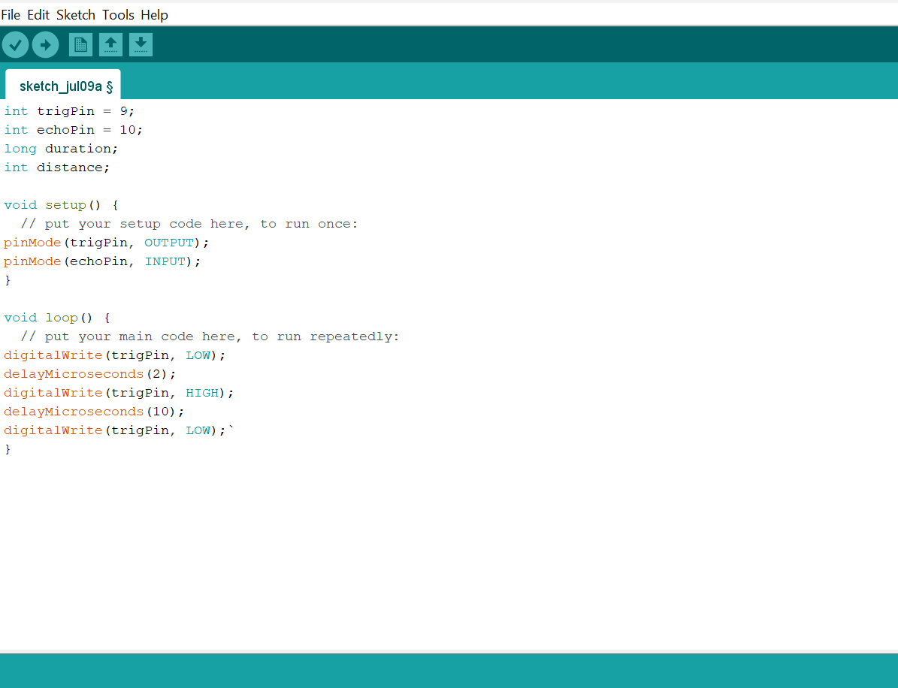
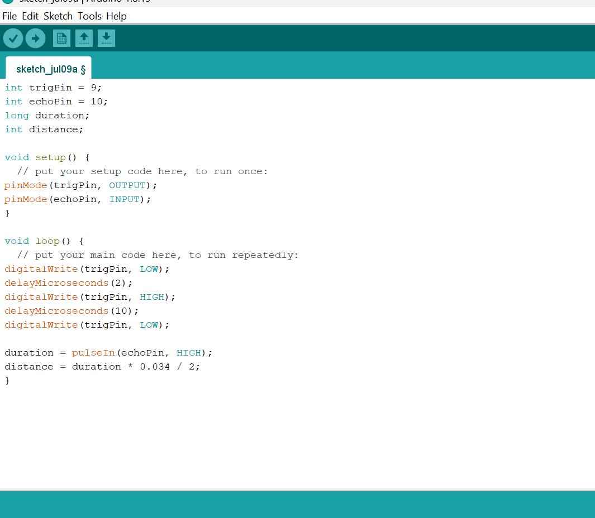
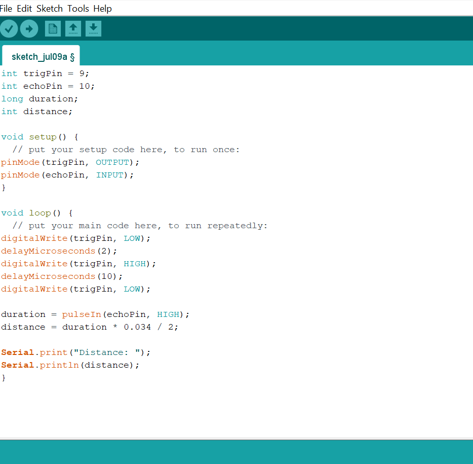

# Project 1.8.2: Ultrasonic Distance Monitor

| **Description** | This project shows how to use the HC-SR04 ultrasonic sensor to measure distance to the nearest obstacle and display the result in centimeters on the Serial Monitor. |
|------------------|----------------------------------------------------------------|
| **Use case**     | This project can be used in distance measurement applications, obstacle detection systems, and parking assistance tools. |

## Components (Things You will need)

| | | | | |
|-------------------------|-------------------------|-------------------------|-------------------------|-------------------------|

## Building the circuit

Things Needed:

- Arduino Uno = 1
- Arduino USB cable = 1
- Ultrasonic sensor = 1
- Red jumper wires = 1
- Blue jumper wires = 1
- Orange jumper wires = 1
- Green jumper wires = 1

## Mounting the component on the breadboard

**Step 1:** Mount the ultrasonic sensor on the breadboard.

_**NB:** Make sure you identify the correct pin connections for the component._

## WIRING THE CIRCUIT

**Step 2:** Connect the red jumper wire from the VCC pin on the sensor to the 5V pin on your Arduino Uno.

**Step 3:** Connect the blue jumper wire from the Trig pin on the sensor to Digital Pin 9 on your Arduino Uno.

**Step 4:** Connect the orange jumper wire from the Echo pin on the sensor to Digital Pin 10 on your Arduino Uno.

**Step 5:** Connect the green jumper wire from the GND pin on the sensor to any of the GND pins on your Arduino Uno.

_Make sure to connect the Arduino USB cable to the Arduino board._

## PROGRAMMING

**Step 1:** Open your Arduino IDE. See how to set up here: [Getting Started](../../Getting Started/Arduino_IDE_Setup.md).

**Step 2:** Type `int trigPin = 9;` , `int echoPin = 10;`, `long duration;` , `int distance;` as shown in the image below.

**Step 3:** Type `pinMode(trigPin, OUTPUT);` , `pinMode(echoPin, INPUT);` inside the void setup(){} as shown in the image below.

**Step 4:** Type `digitalWrite(trigPin, LOW); delayMicroseconds(2);` `digitalWrite(trigPin, HIGH);delayMicroseconds(10); digitalWrite(trigPin, LOW);` inside the void loop(){} as shown in the image below.

**Step 5:** Type `duration = pulseIn(echoPin, HIGH);`, `distance = duration * 0.034 / 2;` as shown in the image below.

**Step 6:** Type `Serial.print("Distance: "); , Serial.println(distance);` as shown in the image below.

**Step 7:** Save your code. _See the [Getting Started](../../Getting Started/Arduino_IDE_Setup.md) section_

**Step 8:** Select the Arduino board and port. _See the [Getting Started](../../Getting Started/Arduino_IDE_Setup.md) section_

**Step 9:** Upload your code.

**Step 10:** Open the Serial Monitor (Tools > Serial Monitor) to view the output.

## CONCLUSION

This project helps learners understand how to interface with Ultrasonic Sensor using Arduino. It introduces essential concepts in electronic circuits and embedded system programming.

