# Project 1.9.2: Sound Level Trigger

| **Description** | This project shows how to monitor audio amplitude spikes using the sound sensor module and log threshold crossings to the Serial Monitor. |
|------------------|----------------------------------------------------------------|
| **Use case**     | This project can be used in noise monitoring systems, clap detection, and sound-activated triggers. |

## Components (Things You will need)

|  |  |  |  | |
|-------------------------|-------------------------|-------------------------|-------------------------|-------------------------|

## Building the circuit

Things Needed:

- Arduino Uno = 1
- Arduino USB cable = 1
- Sound sensor module = 1
- Red jumper wires = 1
- Blue jumper wires = 1
- Green jumper wires = 1

## Mounting the component on the breadboard

**Step 1:** Place the sound sensor module on the breadboard.

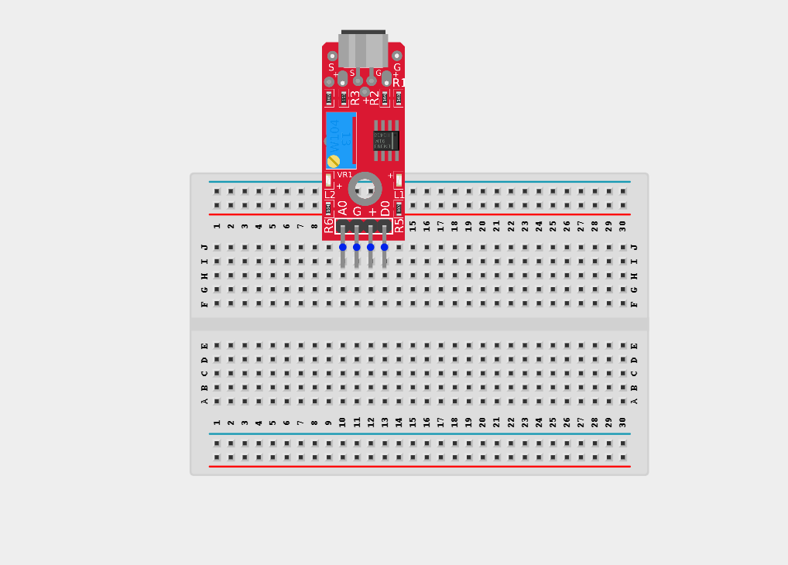

_**NB:** Make sure you identify the correct pin connections for the component._

## WIRING THE CIRCUIT

**Step 2:** Connect the red jumper wire to the positive pin (+)/ VCC of the sound sensor and the other end to 5V on the Arduino Uno.

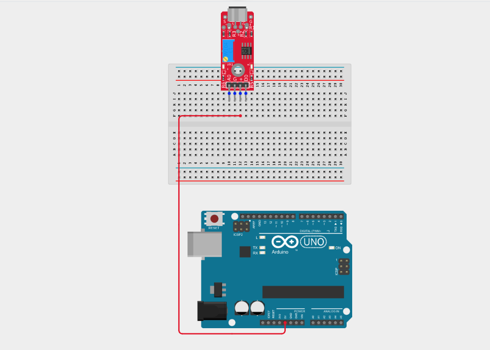

**Step 3:** Connect the blue jumper wire to the negative pin (-)/ GND of the sound sensor and the other end to GND on the Arduino Uno.

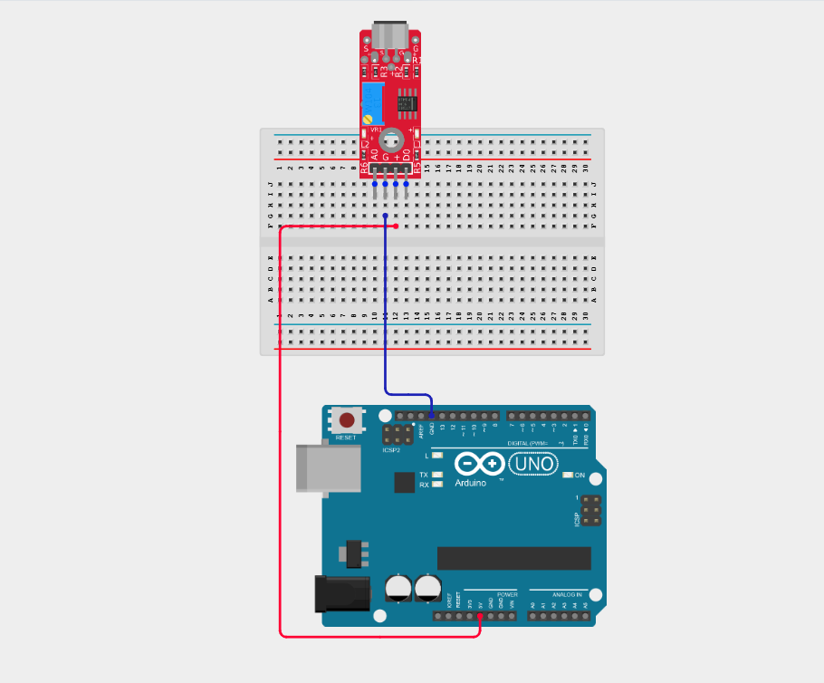

**Step 4:** Connect the green jumper wire to the D0 of the sound sensor and the other end to digital pin 4 on the Arduino Uno.

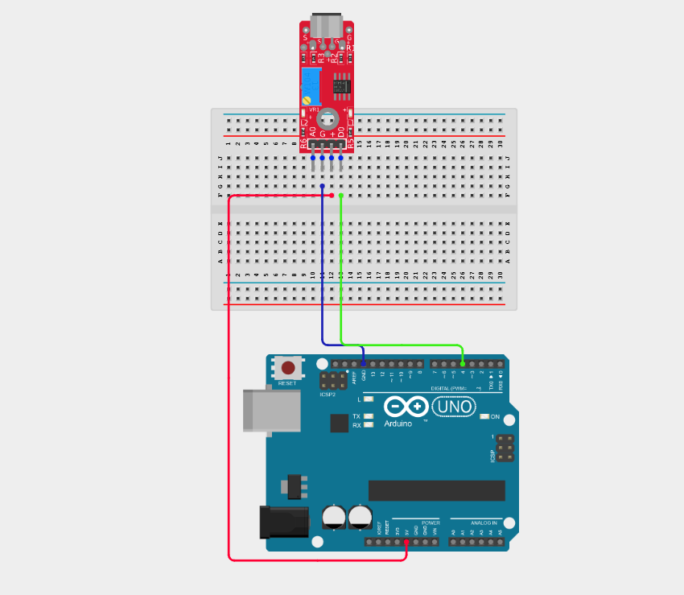

_Make sure to connect the Arduino USB cable to the Arduino board._

## PROGRAMMING

**Step 1:** Open your Arduino IDE. See how to set up here: [Getting Started](../../Getting Started/Arduino_IDE_Setup.md).

**Step 2:** Type `int soundPin = 4;` as shown in the image below.

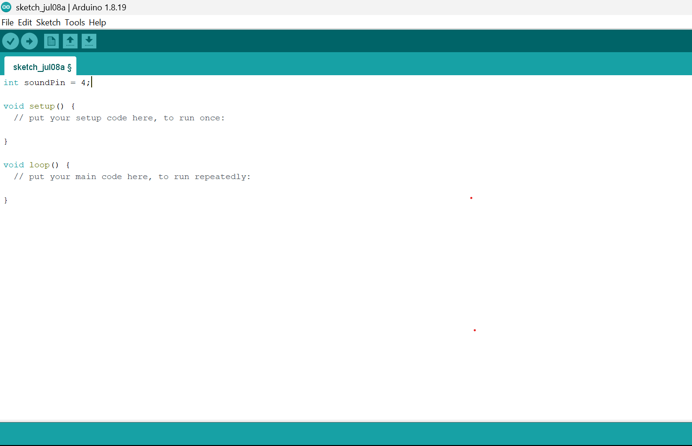

**NB:** Declare the sound sensor analog pin

**Step 3:** Type `int threshold = 600;` as shown in the image below.

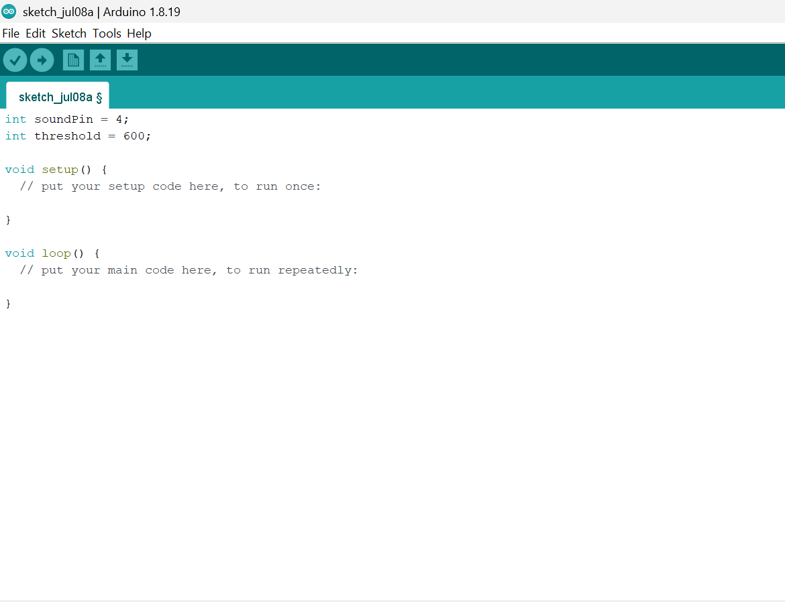

**NB:** Set noise threshold value

**Step 4:** Type `int soundValue = 0;` as shown in the image below.

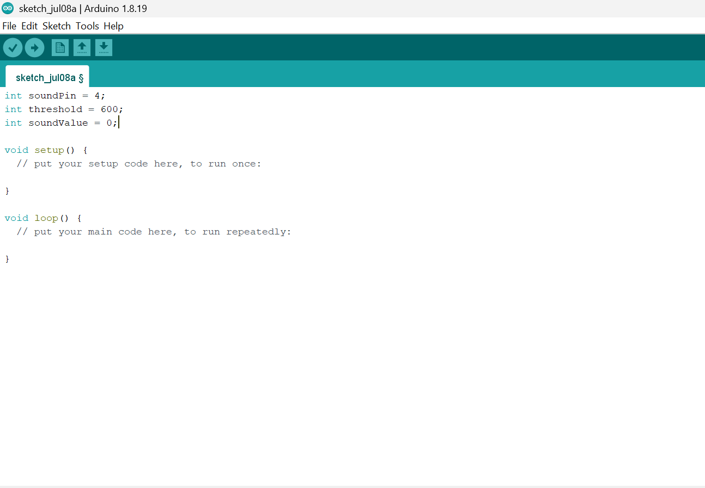

**NB:** Variable to store sound reading

**Step 5:** Type the following code inside the void setup(){} function `pinMode(soundPin, INPUT);`

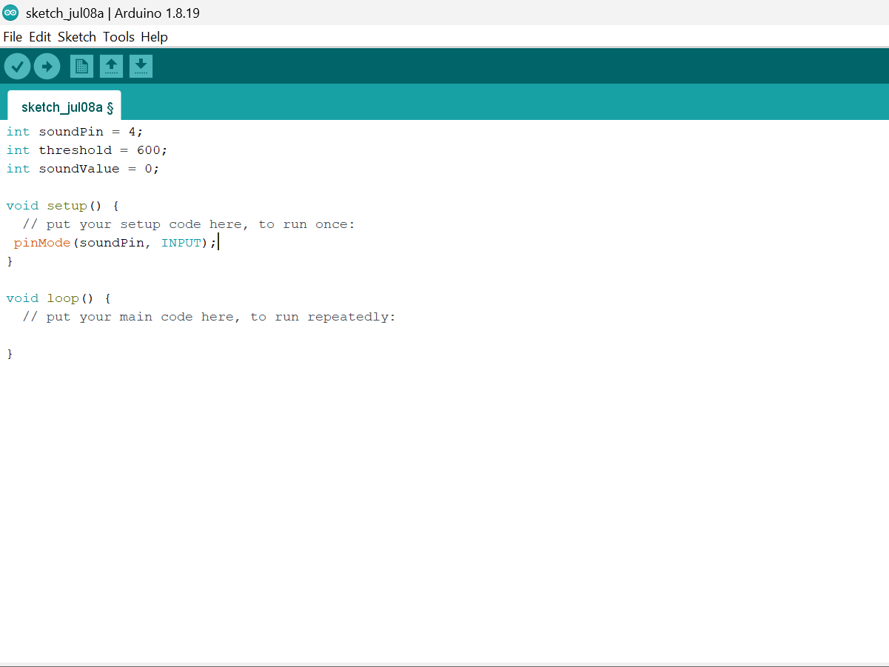

**NB:** Set sound pin as input

**Step 6:** Type the following code inside the void loop(){} `soundValue = analogRead(soundPin);`

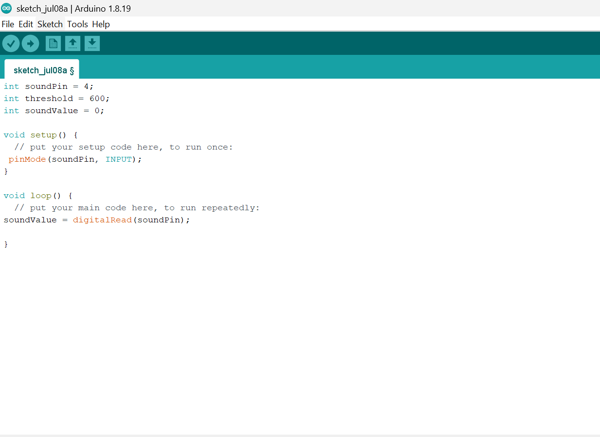

**NB:** Read sound sensor value

**Step 7:** Type `Serial.print("Sound: "); Serial.println(soundValue);` as shown in the image below.

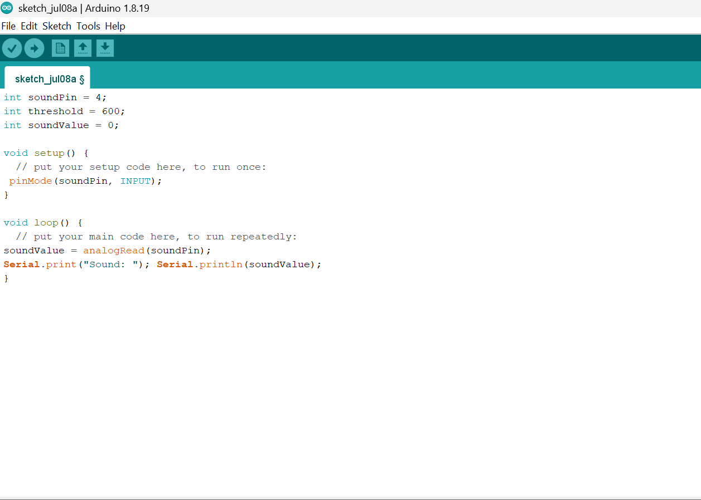

**NB:** Print sound level

**Step 8:** Type `if (soundValue > threshold) {` as shown in the image below.

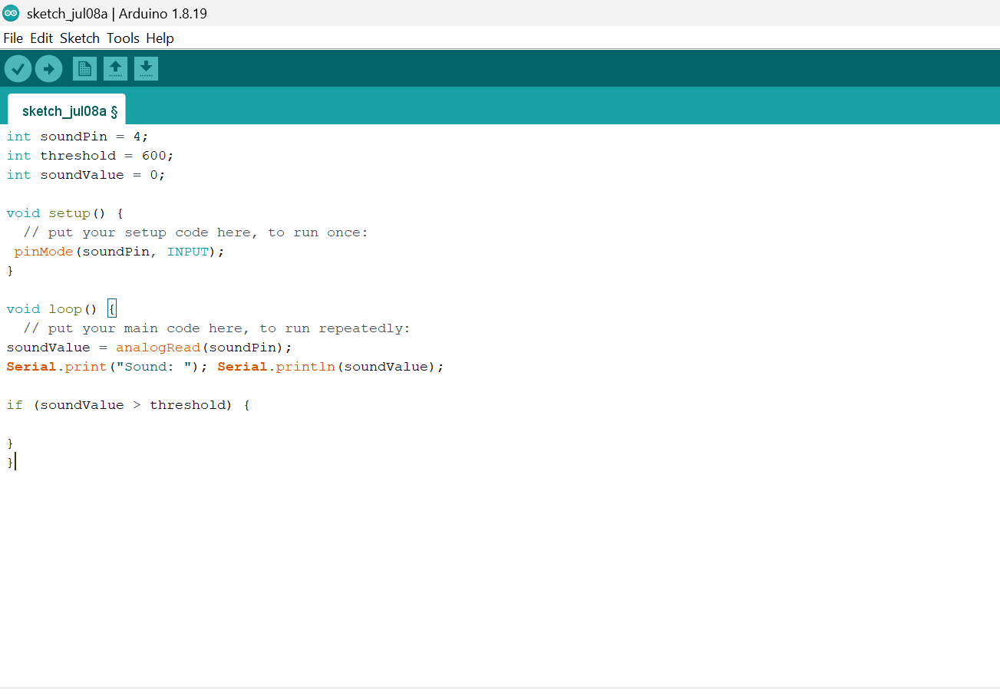

**NB:** Check if threshold exceeded

**Step 9:** Type `Serial.println("NOISE DETECTED!");` as shown in the image below.

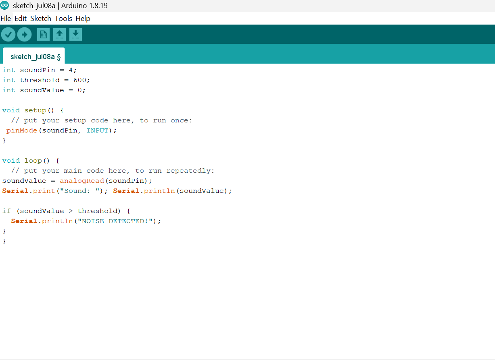

**NB:** Alert message

**Step 10:** Type `delay(200); }` as shown in the image below.

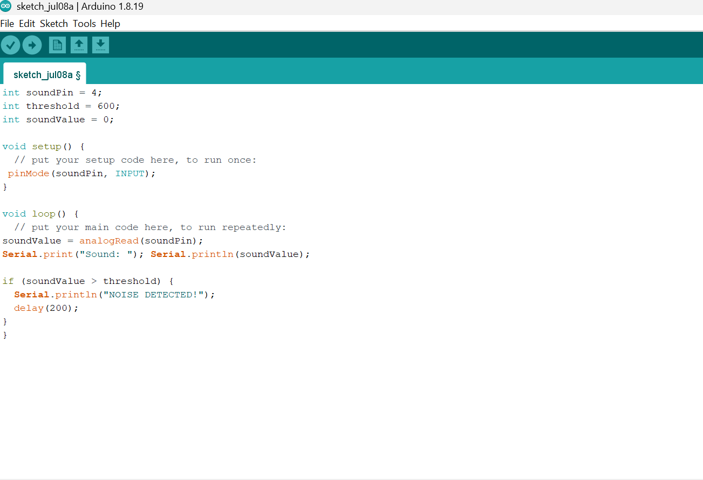

**NB:** Cooldown to prevent repeated triggers

**Step 11:** Save your code. _See the [Getting Started](../../Getting Started/Arduino_IDE_Setup.md) section_

**Step 12:** Select the Arduino board and port. _See the [Getting Started](../../Getting Started/Arduino_IDE_Setup.md) section_

**Step 13:** Upload your code.

**Step 14:** Open the Serial Monitor (Tools > Serial Monitor) to view the output.

## EXPLANATION

soundPin = 4; reads digital sound values from the sensor.
threshold sets the sensitivity level for detection.
digitalRead(soundPin) returns a value proportional to sound amplitude.
When a loud sound occurs, the value spikes above the threshold.
## CONCLUSION

This project helps learners understand how to interface with Sound Sensor using Arduino. It introduces essential concepts in electronic circuits and embedded system programming.

