# Getting Started
Here's a quick overview of what you can expect from our guides:

## Basic C++ Concepts for Arduino

Arduino is programmed using a language based on C++. Here are a few essential concepts you will use in almost every project:

### Variables
A **variable** is like a labeled container that stores information for your program to use or change. When you create a variable, you must tell the Arduino what kind of data it will hold (its **Data Type**).

Common data types include:
- `int` (Integer): Stores whole numbers. Example: `int ledPin = 13;`
- `float`: Stores numbers with decimals. Example: `float temperature = 25.5;`
- `String`: Stores text. Example: `String message = "Hello!";`
- `bool` (Boolean): Stores `true` or `false`. Example: `bool isLightOn = true;`

**Example:** By writing `int ledPin = 13;` at the very top of your code, you create a variable named `ledPin` and store the number `13` inside it. Now, instead of remembering the number 13, you can just use `ledPin`!

### The Two Main Functions: setup() and loop()
Every Arduino program relies on two main blocks of code:
- `void setup()`: This block runs **only once** when you power on or reset the Arduino. We use it for initial configurations, such as setting a pin as an `OUTPUT` or `INPUT`.
- `void loop()`: After the setup finishes, the `loop()` block runs over and over again forever. This is where the main instructions for your project live (like turning an LED on and off).

## The Arduino IDE and Basic Set Up
**Step 1:** Double click on the Arduino IDE icon on your computer / laptop to open Arduino IDE.

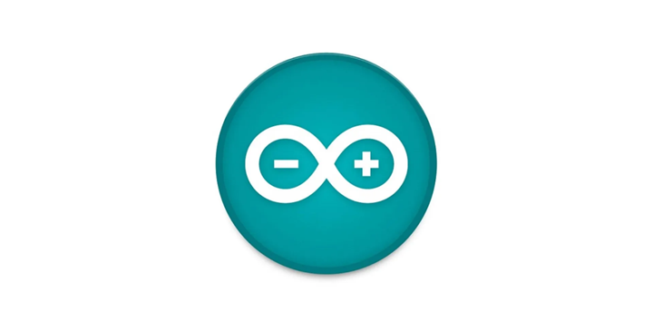.

**Step 2:** Find the three buttons in the top right corner of the window.

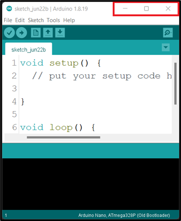

**Step 3:** Click the middle button "Maximize" in the top right corner of the window to maximize its size.

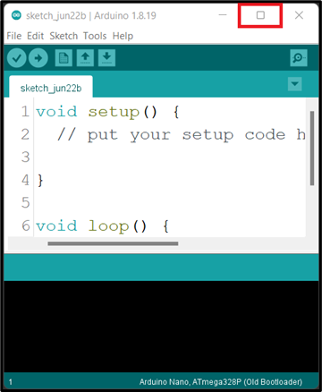.

At the point you should see the code below on your computer / laptop.

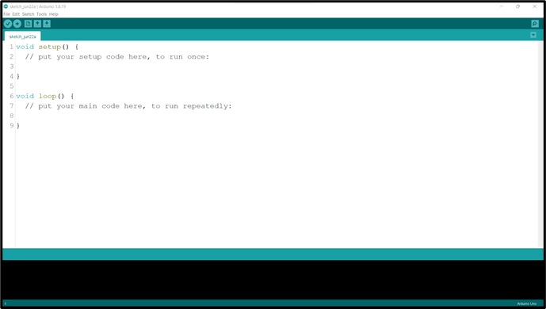

**Step 4:** Left Click before the ( void setup () ) and click on the Enter key on your keyboard to get space at the top of the void setup(). Then click above the void setup().

|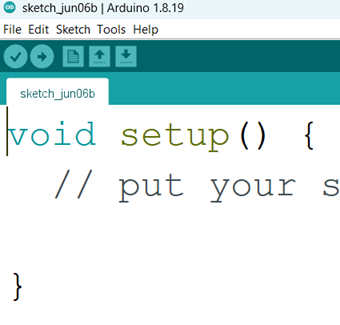 | 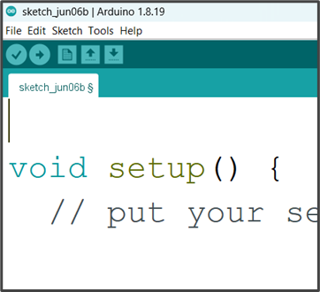 |
|----------------------------------|----------------------------------|

_**NB:** we will write the necessary code and comment at the space we created above the void setup ()._

## Comment
In programming, a comment is a piece of text that is added to the source code of a program to provide information or explanations. Comments are intended for human readers and are ignored by the compiler or interpreter when the program is executed.

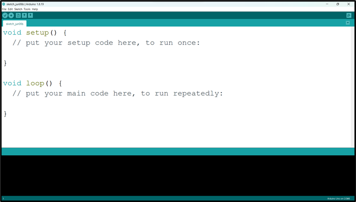.

_**NB:** before you type a comment, type two slash (//) before you complete your sentence._

 Selecting Arduino Board Type and Uploading your code

**Step 1:** Select the Board type. 
Click on tools on the menu bar hover your mouse on Board, a new window will appear. Look through and click on Arduino UNO.

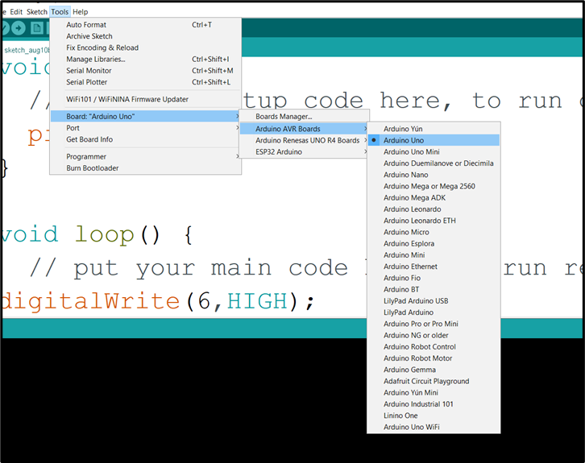.

**Step 2:** Select the Port.

Click on tools on the menu bar and hover your mouse on Port, a new window will appear. Look through and click on COM which has Arduino Uno  attached to it.

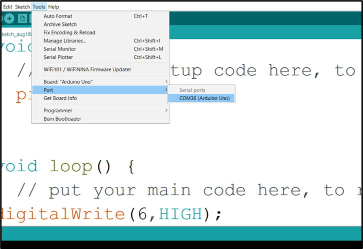.

_**NB:** Your COM number may be different. In this example we have COM36 (Arduino Uno)_

**Step 3:**  Click Control S (CTRL S) on your keyboard or click Save on the Arduino task bar.

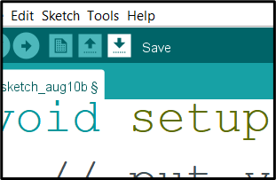.

A new window will pop up, type the project name and click save.

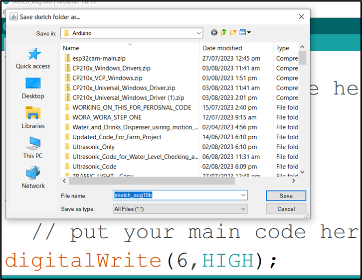.

**Step 4:** Click Verify. 

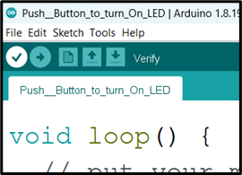.

**Step 5:** Click Upload. 

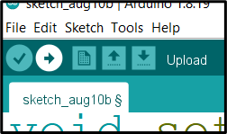.

_**NB:** Make sure there is no error in your code and the Arduino USB cable is connected to your laptop / desktop before you click **Upload**._

**WAIT** _Done uploading_

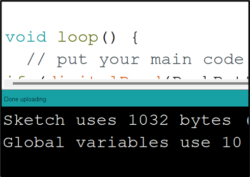.

