# Project 2.10.1: SMART SOUND ALERT SYSTEM 

| **Description** | This project demonstrates how to build a smart sound alert system using an LDR (Light Dependent Resistor) module and a buzzer. The Arduino continuously monitors the surrounding light level and automatically activates the buzzer when the environment becomes dark and turns it off when sufficient light is detected. Through this project, you will learn how sensors and output devices can work together to create simple automated alert systems. |
|------------------|----------------------------------------------------------------|
| **Use case**     | Automatic security alarms, intrusion detection systems, dark-environment warning systems, smart safety devices, and automated alert systems that respond to changes in ambient light conditions.  |

## Components (Things You will need)

|  |  |  |  || |
|-------------------------|-------------------------|-------------------------|-------------------------|-------------------------|-------------------------|

## Building the circuit

Things Needed:

-	Arduino Uno = 1
-	Arduino USB cable = 1
-	Light dependent resistor   = 1
-	Jumper Wires 

## Mounting the component on the breadboard

**Step 1:** Take the LDR module, buzzer and the breadboard, insert the LDR module into the horizontal connectors on the breadboard.

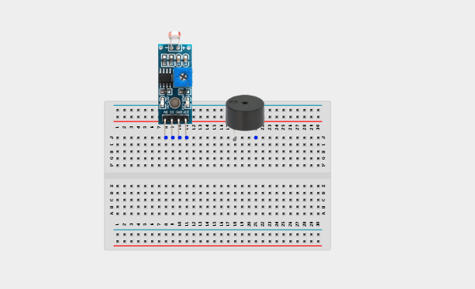.

## WIRING THE CIRCUIT

**Step 1:** Connect one end of the wire to the “VCC” port on the light dependent resistor and the other end to the “5V” port on the Arduino UNO.

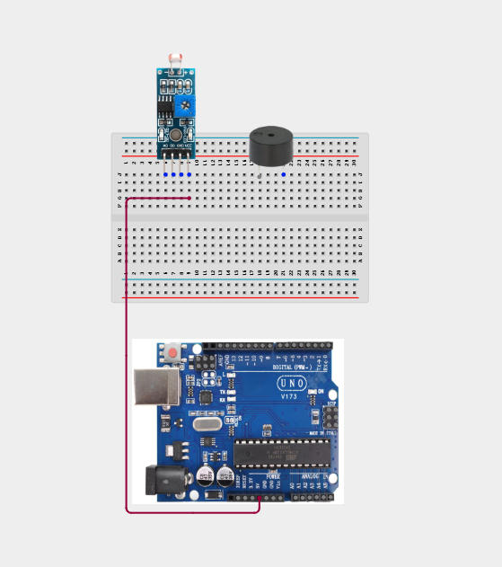.

**Step 2:** Connect one end of the wire to the “GND” hole on the Arduino UNO and the other end to the “GND” port on the light dependent resistor.

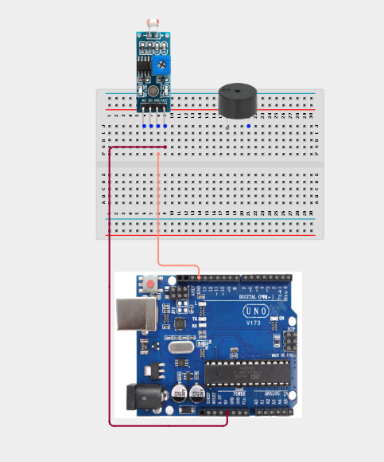.

**Step 3:** Connect one end of the wire to the “DO” hole on the resistor and the other end to hole number 2 on the Arduino UNO.

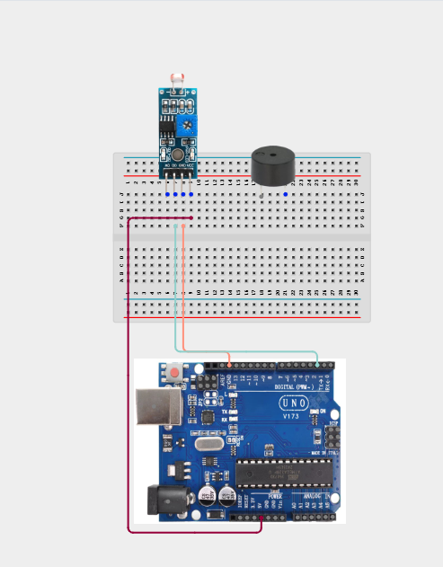.

**Step 4:** Connect one end of the wire to the “AO” port on the Arduino UNO to the “AO” port on the light dependent resistor.

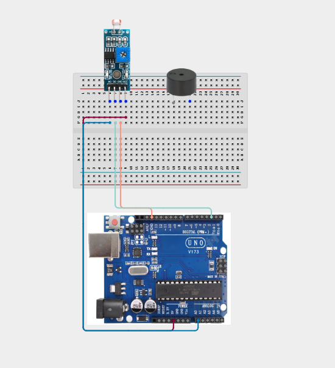.

**Step 5:** Connect one end of the wire to one of the ports of the longer pin of the Buzzer and connect the other end to hole number 6 on the Arduino UNO.

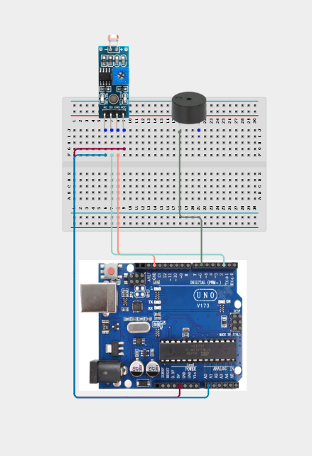.

**Step 6:** Connect one end of the wire to the negative (-) pin of the buzzer and the other end to the GND pin on the Arduino Uno.

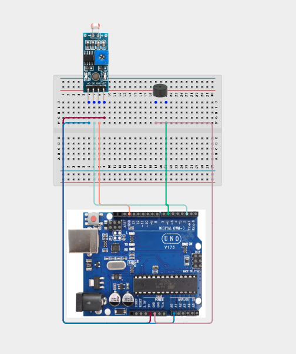.

## PROGRAMMING

**Step 1:** Open your Arduino IDE. See how to set up here: [Getting Started](../../../Getting Started/Arduino_IDE_Setup.md).

**Step 2:** Type ```const int LDR_PIN = A0.```   as shown below in the image 
_**NB:** Make sure you avoid errors when typing. Do not omit any character or symbol especially the bracket { }  and semicolons ;  and place them as you see in the image . The code that comes after the two ash backslashes “//” are called comments. They are not part of the code that will be run, they only explain the lines of code. You can avoid typing them._

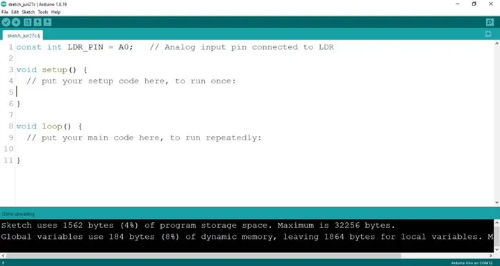.

**Step 3:** Type ```const int DO_PIN = 2;``` as shown below in the image

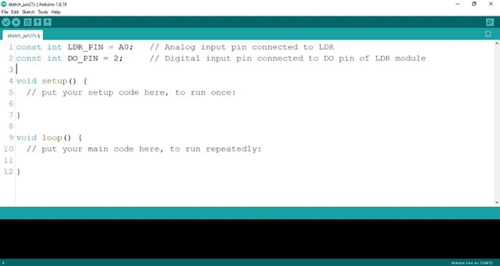.

**Step 4:** Type ```const int LED = 6;``` as shown below in the image

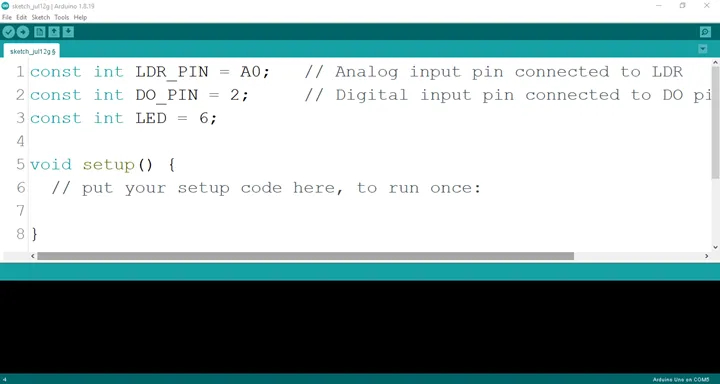.

**Step 5:** Type ```pinMode (DO_PIN, INPUT);``` as shown below in the image

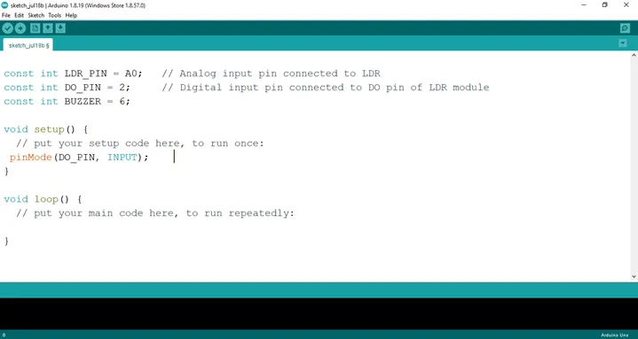.

**Step 6:** Type ```Serial.begin(9600);``` as shown below in the image

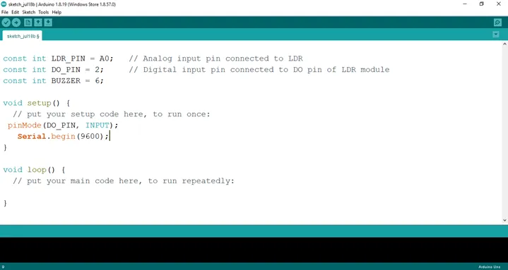.

**Step 7:** Type ```int ldrValue = analogRead (LDR_PIN); ``` as shown below in the image

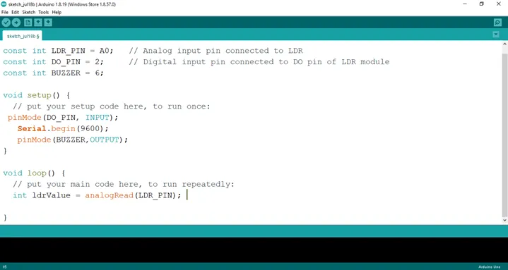.

**Step 8:** Type ```int digitalValue = digitalRead (DO_PIN);  ``` as shown below in the image

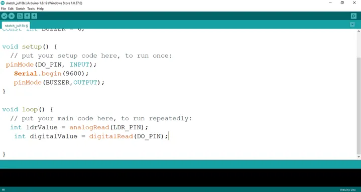.

**Step 9:** Type ```Serial.print(“Analog Value:”);``` as shown below in the image

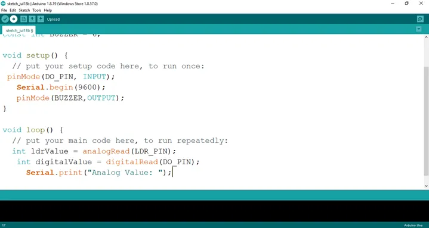.

**Step 10:** Type ```Serial.printIn(ldrValue);``` as shown below in the image

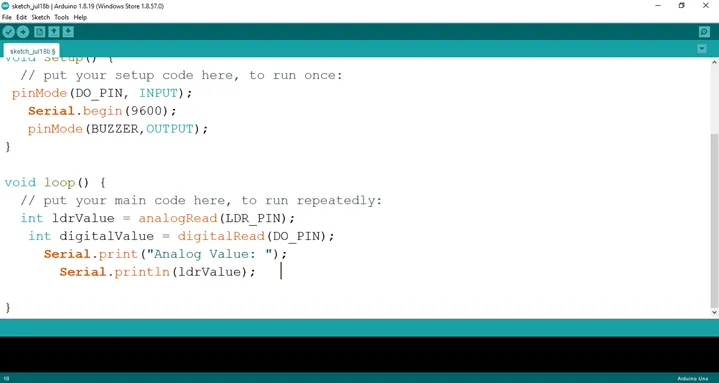.

**Step 11:** Type ```Serial.print(“Digital Value:”);``` as shown below in the image

.

**Step 12:** Type ```Serial.println(digitalValue);``` as shown below in the image

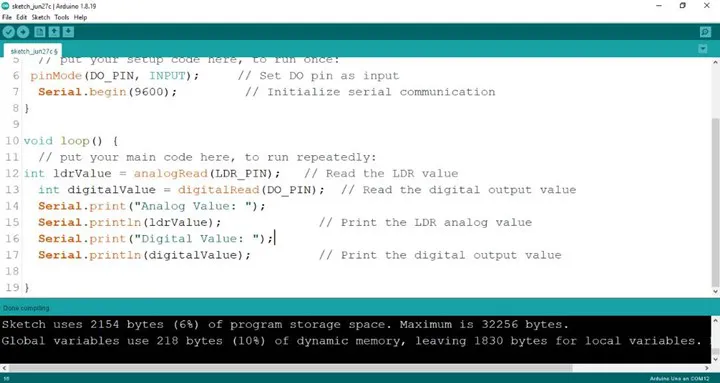.

**Step 13:** Type ```if(ldrValue < 100){``` as shown below in the image

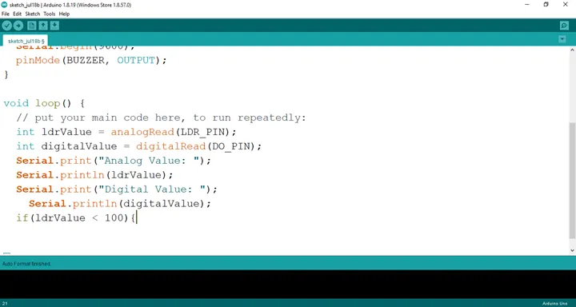.

**Step 14:** Type ```digitalWrite(BUZZER, HIGH);}``` as shown below in the image

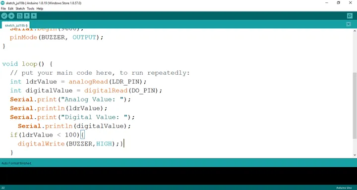.

**Step 15:** Type ```else{digitalWrite(BUZZER, LOW);}``` as shown below in the image

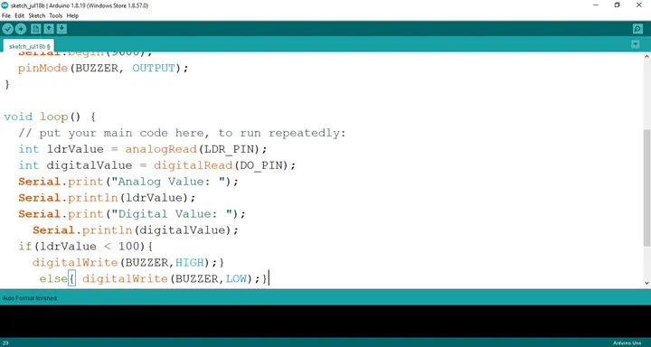.

**Step 16:** Save your code. _See the [Getting Started](../../../Getting Started/Arduino_IDE_Setup.md) section_

**Step 17:** Select the arduino board and port _See the [Getting Started](../../../Getting Started/Arduino_IDE_Setup.md) section:Selecting Arduino Board Type and Uploading your code_.

**Step 18:** Upload your code. _See the [Getting Started](../../../Getting Started/Arduino_IDE_Setup.md) section:Selecting Arduino Board Type and Uploading your code_

## Conclusion

If you encounter any problems when trying to upload your code to the board, run through your code again to check for any errors or missing lines of code. If you did not encounter any problems and the program ran as expected, Congratulations on a job well done. You have now learnt how to program a buzzer to go off  in the absence of light. Practice, as they say makes perfect. Continue to work hard and in time you’ll master it.
