# Project 2.10.22: Diagnostic Mode Display

| **Description** | This project coordinates an LED and RGB LED to show system status - the LED blinks steadily while the RGB cycles through diagnostic colors. |
|------------------|----------------------------------------------------------------|
| **Use case**     | This project can be used in automation systems, interactive installations, and embedded control applications. |

## Components (Things You will need)

| | | | | | |
|-------------------------|-------------------------|-------------------------|-------------------------|-------------------------|-------------------------|

## Building the circuit

Things Needed:

- Arduino Uno = 1
- Arduino USB cable = 1
- LED = 1
- RGB LED module = 1
- Breadboard = 1
- Jumper wires 
- 220Ω resistor

## Mounting the component on the breadboard

**Step 1:** Place the RGB, LED and the Resistor on the breadboard as shown in the  the circuit diagram.

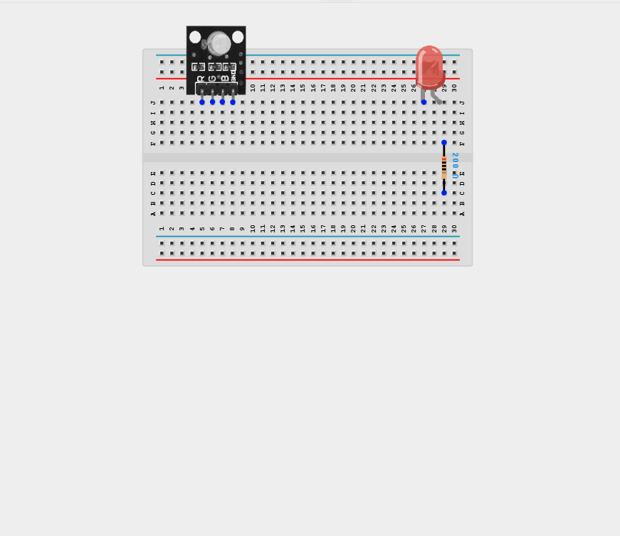

_**NB:** Make sure all components are securely placed on the breadboard with correct orientation._

## WIRING THE CIRCUIT

**Step 2:** Connect the anode (long leg) of the LED to one end of a 220 Ω resistor. Connect the other end of the resistor to Digital Pin 7 on the Arduino using male-to-male jumper wire.

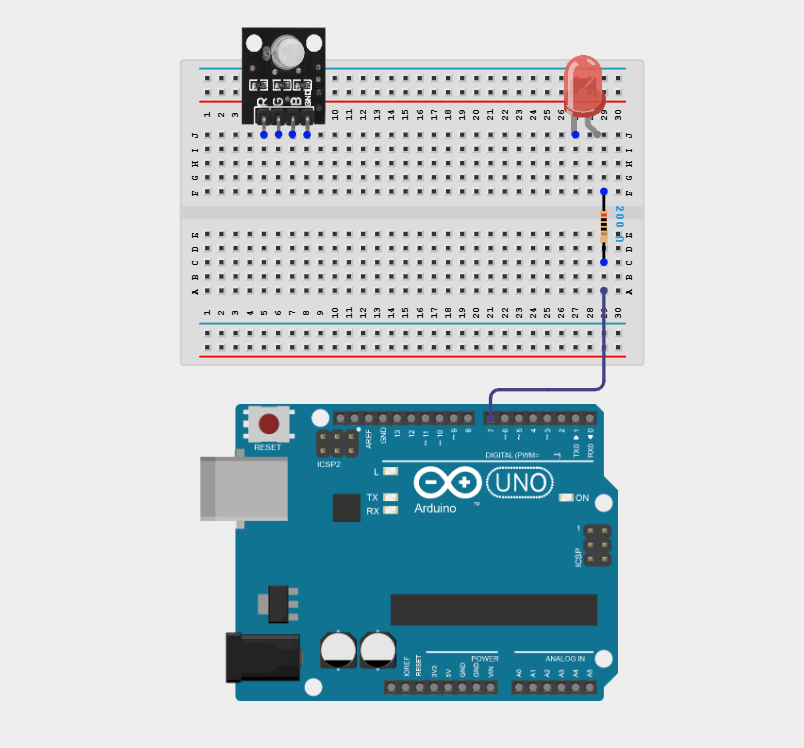

**Step 3:** Connect the cathode (short leg) of the LED to the GND pin on the Arduino using male-to-male jumper wire.

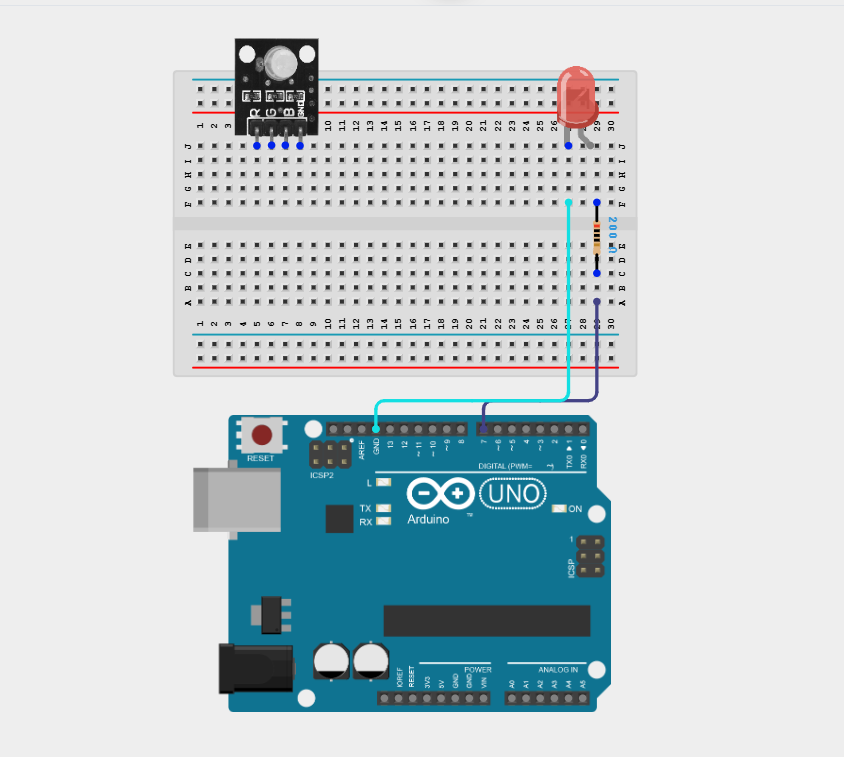

**Step 4:** Connect the Red (R) pin of the RGB Module to Digital pin 9 on the Arduino using male-to-male jumper wire.

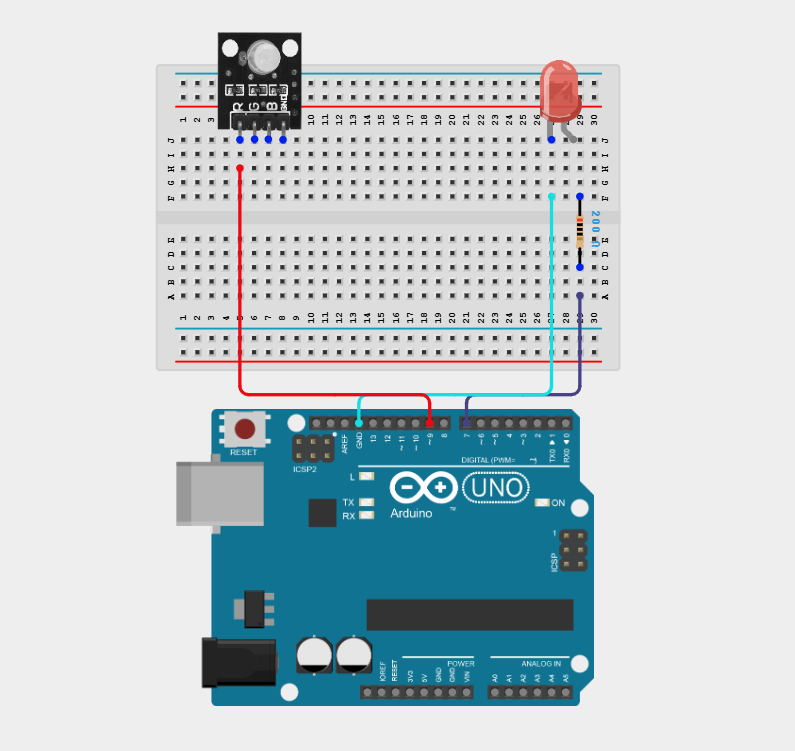

**Step 5:** Connect the Green (G) pin of the RGB Module to Digital pin 10 on the Arduino using male-to-male jumper wire.

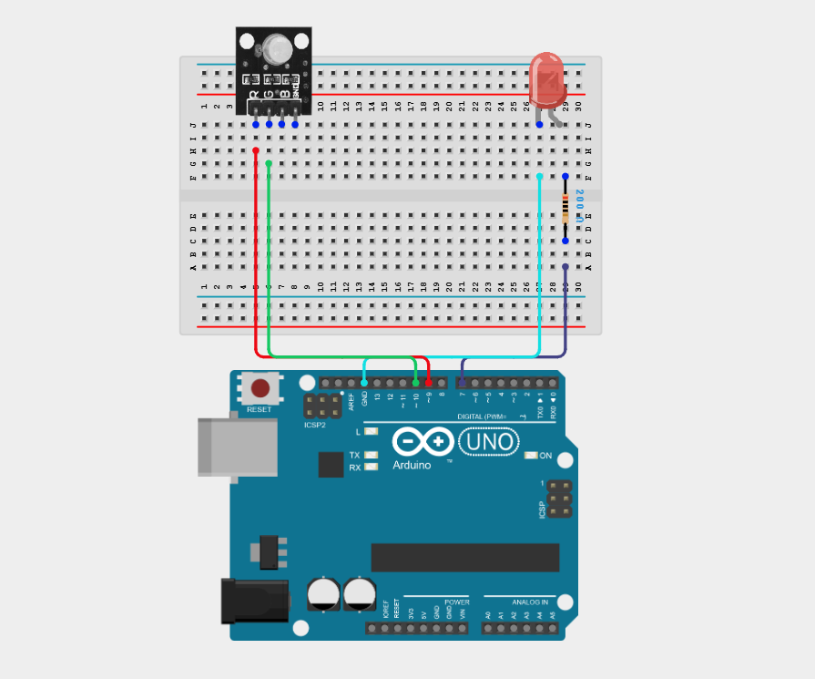

**Step 6:** Connect the Blue (B) pin of the RGB module to Digital pin 11 on the Arduino using male-to-male jumper wire.

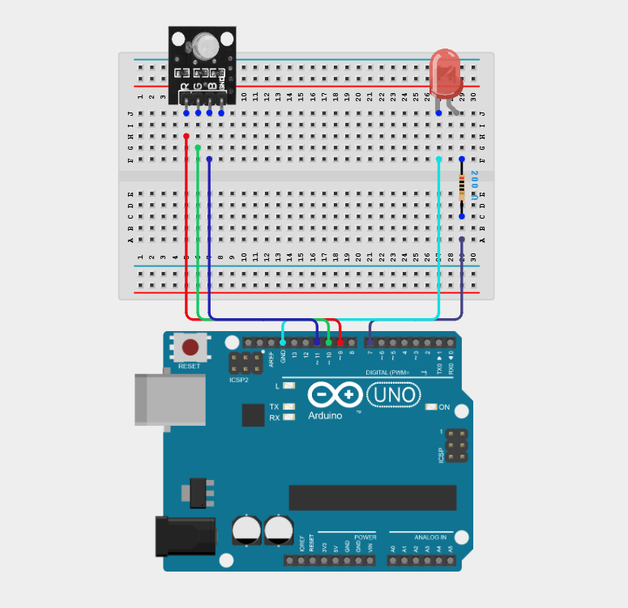

**Step 7:** Connect the GND pin of the RGB module to GND on the Arduino using male-to-male jumper wire.

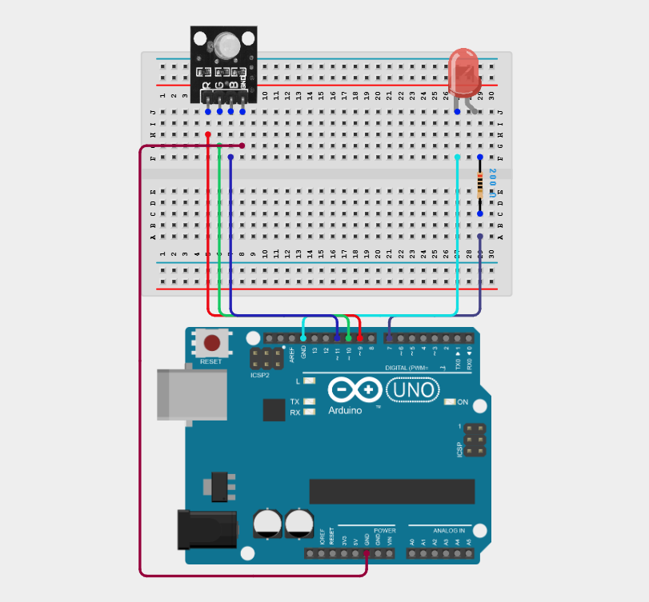

_Make sure to connect the Arduino USB cable to the Arduino board._

## PROGRAMMING

**Step 1:** Open your Arduino IDE. See how to set up here: [Getting Started](../../Getting Started/Arduino_IDE_Setup.md).

**Step 2:** Type the following code in your Arduino IDE: `const int ledPin = 7;`, `const int redPin = 9;`, `const int greenPin = 10;`, `const int bluePin = 11;` as shown in the image below.

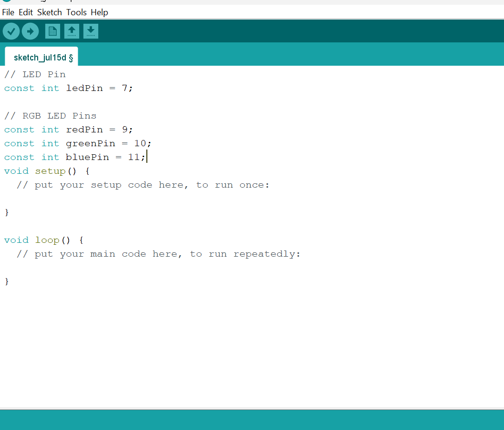

**Step 3:** Type the following code in your Arduino IDE inside the void setup() `pinMode(ledPin, OUTPUT);`, `pinMode(redPin, OUTPUT);`, `pinMode(greenPin, OUTPUT);`, `pinMode(bluePin, OUTPUT);` as shown in the image below.

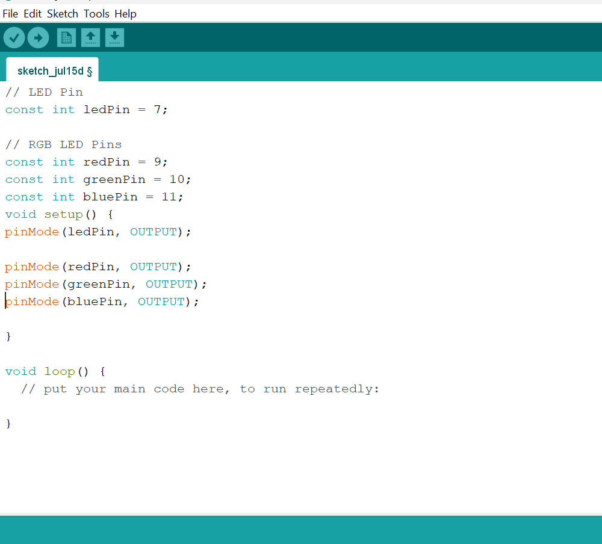

**Step 4:** Type the following code in your Arduino IDE inside the void loop() `digitalWrite(ledPin, HIGH);`, `setColor(0, 255, 0);`, `delay(500);`, `digitalWrite(ledPin, LOW);`, `delay(500);`, `digitalWrite(ledPin, HIGH);`, `setColor(0, 0, 255);`, `delay(500);`, `digitalWrite(ledPin, LOW);`, `delay(500);`, `digitalWrite(ledPin, HIGH);` as shown in the image below.
 
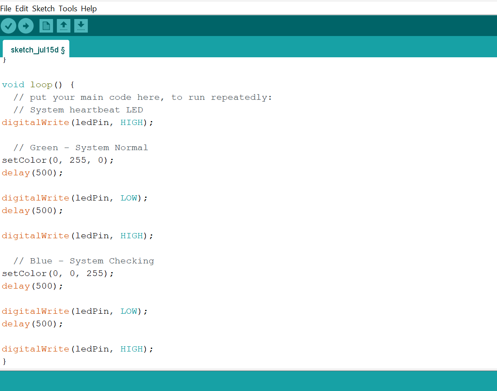

**Step 5:** Type the following code in your Arduino IDE inside the void loop() `setColor(255, 255, 0);`, `delay(500);`, `digitalWrite(ledPin, LOW);`, `delay(500);`, `delay(500);`, `digitalWrite(ledPin, HIGH);`, `setColor(255, 0, 0);`, `delay(500);`, `digitalWrite(ledPin, LOW);`, `delay(500);`, `void setColor(int red, int green, int blue) {`, `analogWrite(redPin, red);`, `analogWrite(greenPin, green);`, `analogWrite(bluePin, blue);` as shown in the image below.
 
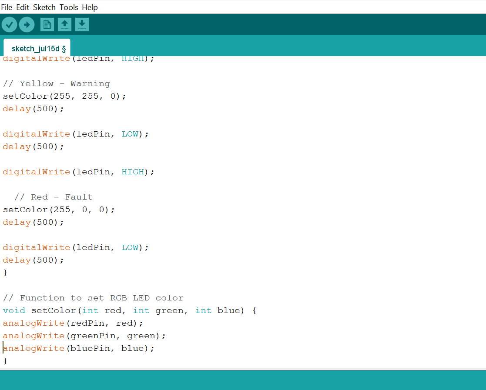

**Step 6:** Save your code. _See the [Getting Started](../../Getting Started/Arduino_IDE_Setup.md) section_

**Step 7:** Select the Arduino board and port. _See the [Getting Started](../../Getting Started/Arduino_IDE_Setup.md) section_

**Step 8:** Upload your code.

## CONCLUSION

This project helps learners understand how to combine multiple components with Arduino to create more complex interactive systems and automation solutions.

