# Project 2.10.23: Crosswalk Hazard Warning

| **Description** | This project uses an LED flash warning alongside a cycling Traffic Light Module to simulate a pedestrian crosswalk hazard alert. |
|------------------|----------------------------------------------------------------|
| **Use case**     | This project can be used in automation systems, interactive installations, and embedded control applications. |

## Components (Things You will need)

| | | | | | |
|-------------------------|-------------------------|-------------------------|-------------------------|-------------------------|-------------------------|

## Building the circuit

Things Needed:

- Arduino Uno = 1
- Arduino USB cable = 1
- LED = 1
- Traffic light module = 1
- Breadboard = 1
- Jumper wires 
- 220Ω resistor

## Mounting the component on the breadboard

**Step 1:** Place the Traffic Light Module, Resistor and the LED on the breadboard as shown in the circuit diagram.

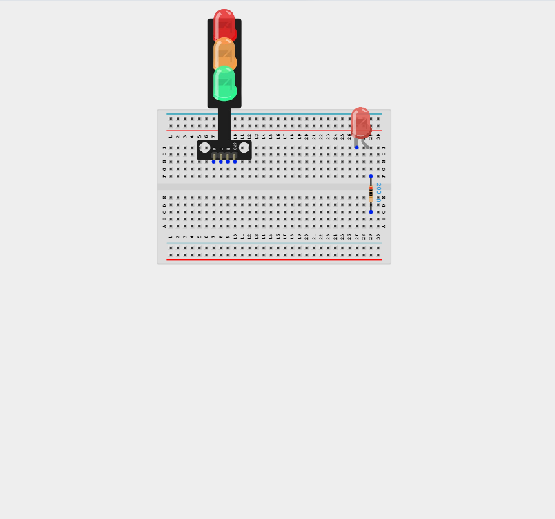

## WIRING THE CIRCUIT

**Step 2:** Connect the anode (long leg) of the LED to one end of a 220 Ω resistor. Connect the other end of the resistor to Digital Pin 7 on the Arduino using male-to-male jumper wire.

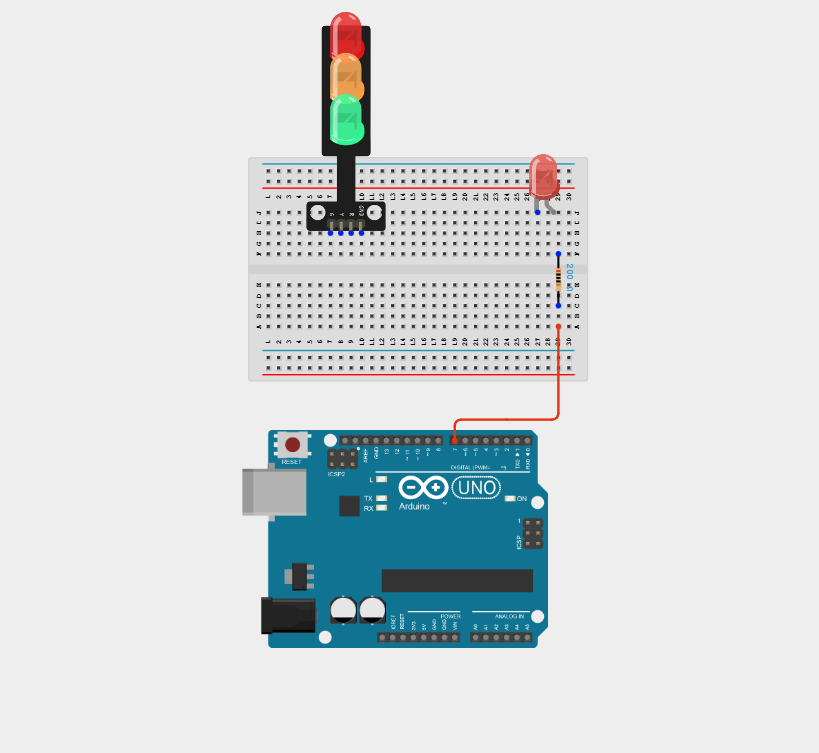

**Step 3:** Connect the cathode (short leg) of the LED to the GND pin on the Arduino using male-to-male jumper wire.

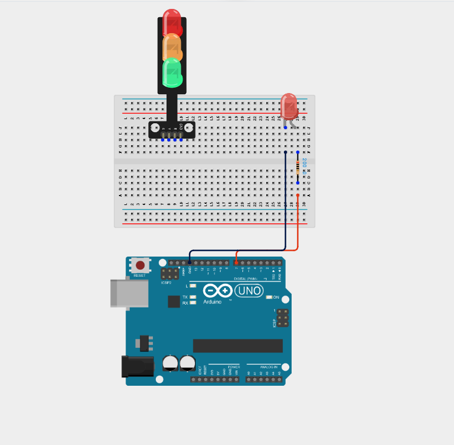

**Step 4:** Connect the Green LED (G) pin of the Traffic Light Module to Digital Pin 4 on the Arduino using male-to-male jumper wire.

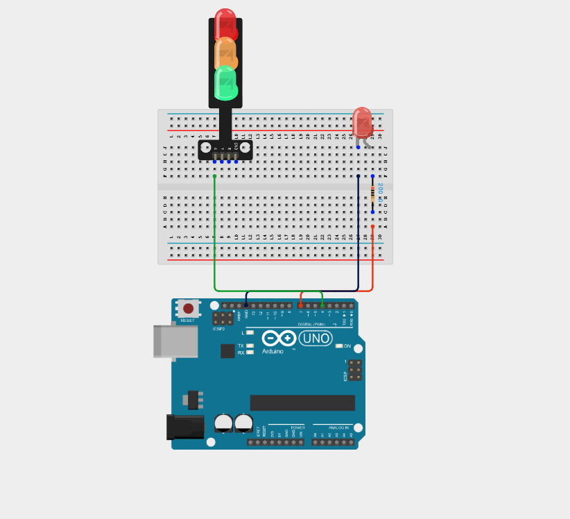

**Step 5:** Connect the Yellow LED (Y) pin of the Traffic Light Module to Digital Pin 5 on the Arduino using male-to-male jumper wire.

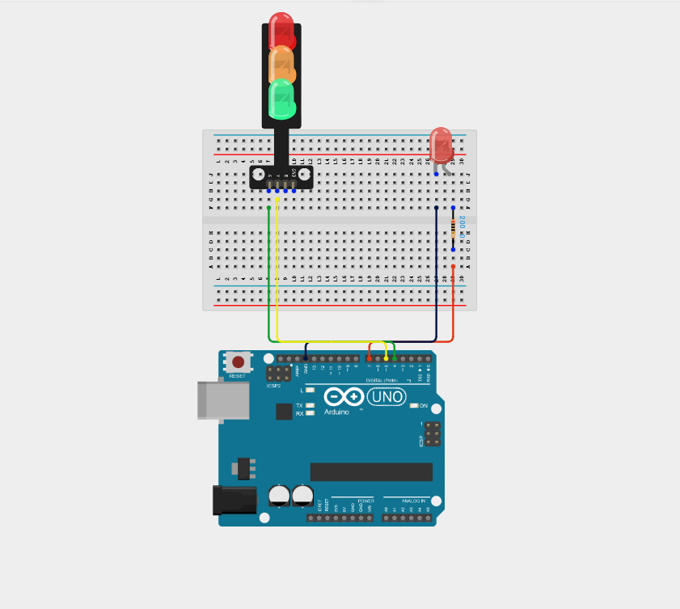

**Step 6:** Connect the Red LED (R) pin of the Traffic Light Module to Digital Pin 6 on the Arduino using male-to-male jumper wire.

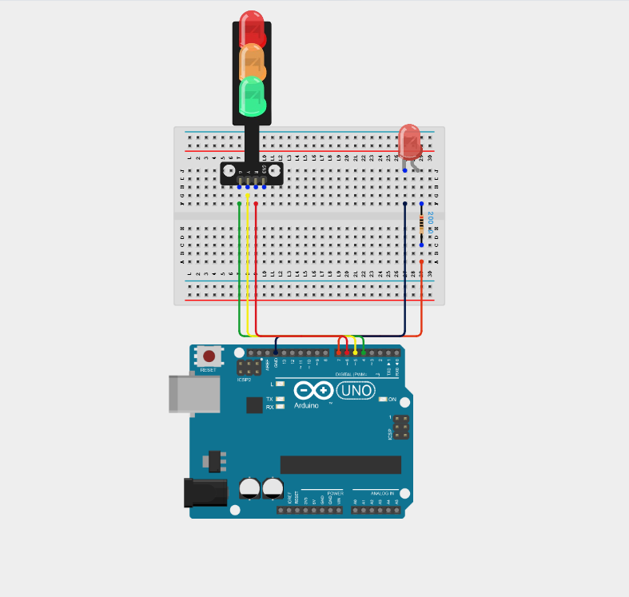

**Step 7:** Connect the GND pin of the Traffic Light Module to GND on the Arduino using male-to-male jumper wire.

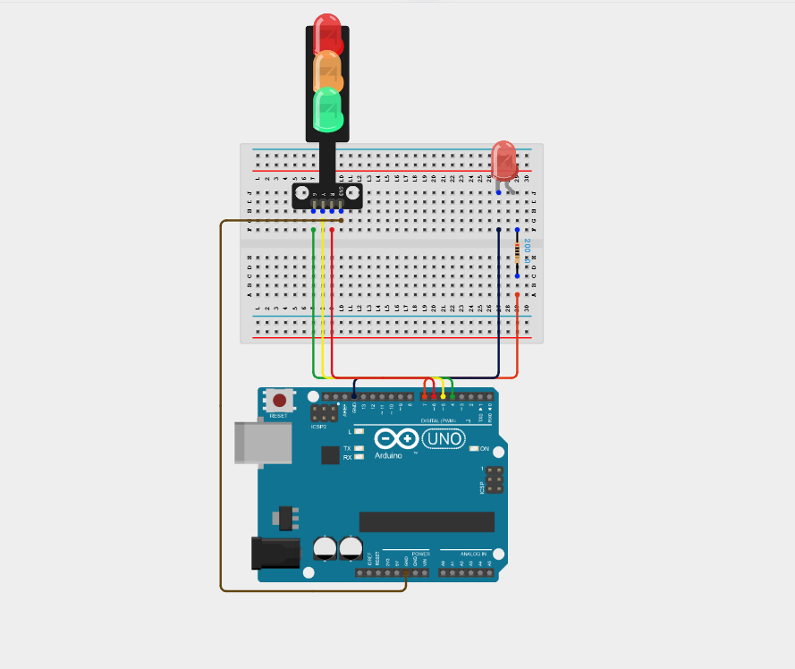

_**NB:** Make sure all components are securely placed on the breadboard with correct orientation._

_Make sure to connect the Arduino USB cable to the Arduino board._

## PROGRAMMING

**Step 1:** Open your Arduino IDE. See how to set up here: [Getting Started](../../Getting Started/Arduino_IDE_Setup.md).

**Step 2:** Type the following code in your Arduino IDE: `const int greenLED = 4;`, `const int yellowLED = 5;`, `const int redLED = 6;`, `const int warningLED = 7;` as shown in the image below.

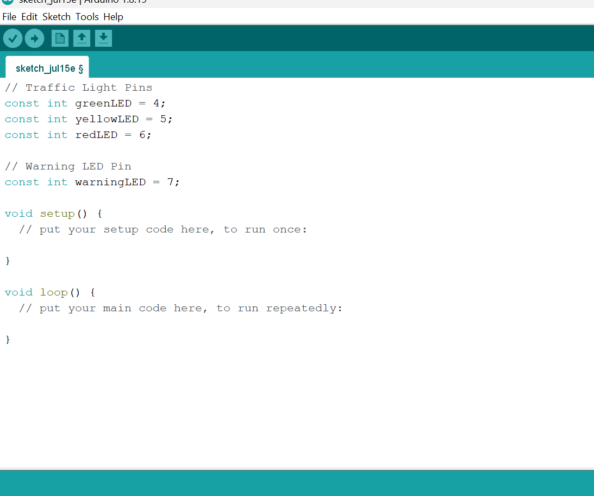

**Step 3:** Type the following code in your Arduino IDE inside the void setup() `pinMode(greenLED, OUTPUT);`, `pinMode(yellowLED, OUTPUT);`, `pinMode(redLED, OUTPUT);`, `pinMode(warningLED, OUTPUT);` as shown in the image below.

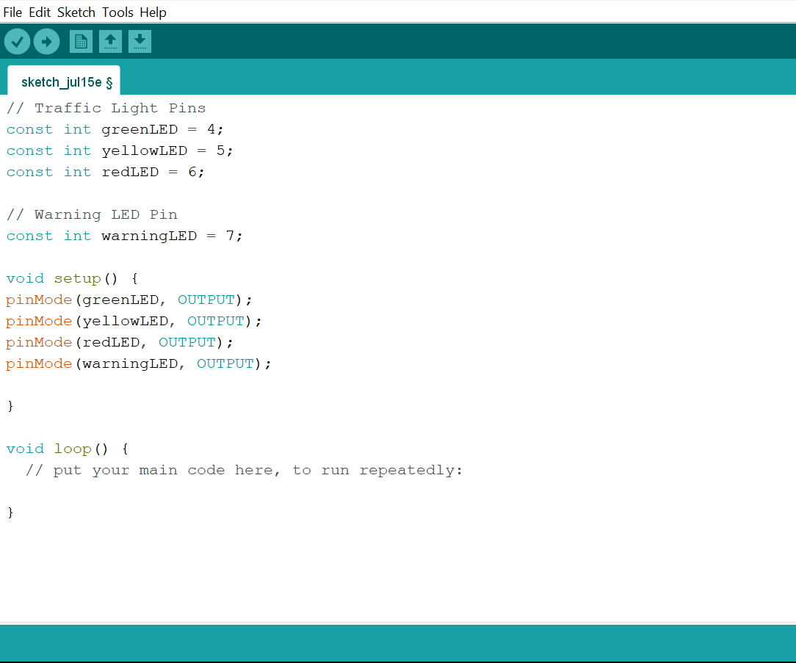

**Step 4:** Type the following code in your Arduino IDE inside the void loop() `digitalWrite(greenLED, HIGH);`, `digitalWrite(yellowLED, LOW);`, `digitalWrite(redLED, LOW);`, `flashWarningLED(3000);`, `digitalWrite(greenLED, LOW);`,`digitalWrite(yellowLED, HIGH);`, `digitalWrite(redLED, LOW);`, `flashWarningLED(1000);` as shown in the image below.

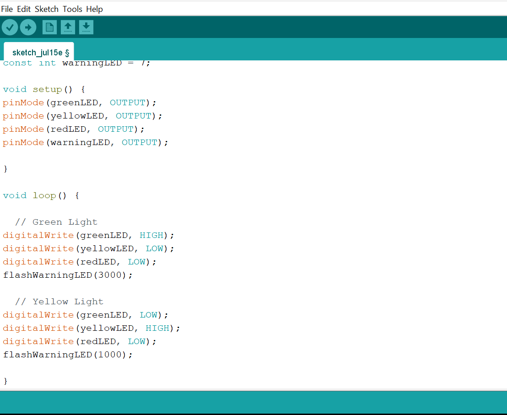

**Step 5:** Type the following code in your Arduino IDE inside the void loop() `digitalWrite(greenLED, LOW);`, `digitalWrite(yellowLED, LOW);`, `digitalWrite(redLED, HIGH);`, `flashWarningLED(3000); }`, `void flashWarningLED(int duration) { `,`unsigned long startTime = millis();`, `while (millis() - startTime < duration) {`, `digitalWrite(warningLED, HIGH);`, `delay(250);`, `digitalWrite(warningLED, LOW);`, `delay(250); }` as shown in the image below.

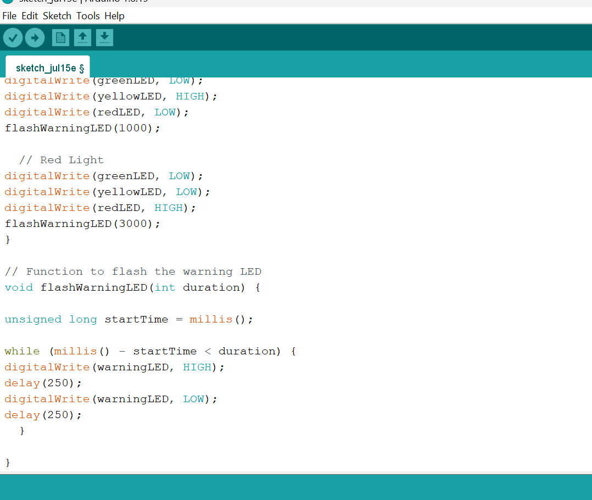

**Step 6:** Save your code. _See the [Getting Started](../../Getting Started/Arduino_IDE_Setup.md) section_

**Step 7:** Select the Arduino board and port. _See the [Getting Started](../../Getting Started/Arduino_IDE_Setup.md) section_

**Step 8:** Upload your code.

## CONCLUSION

This project helps learners understand how to combine multiple components with Arduino to create more complex interactive systems and automation solutions.

