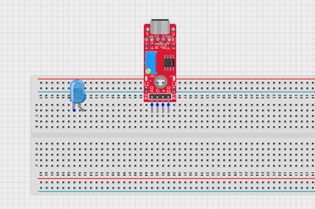
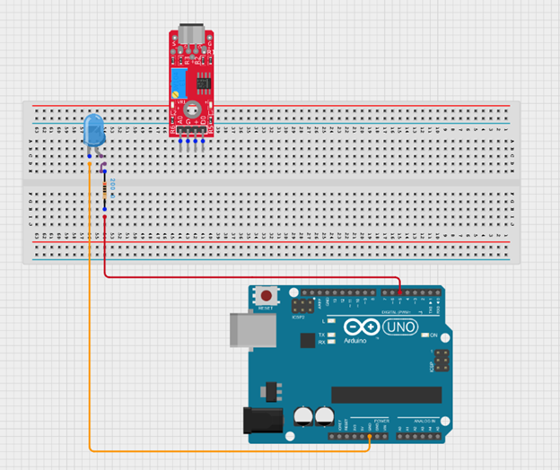
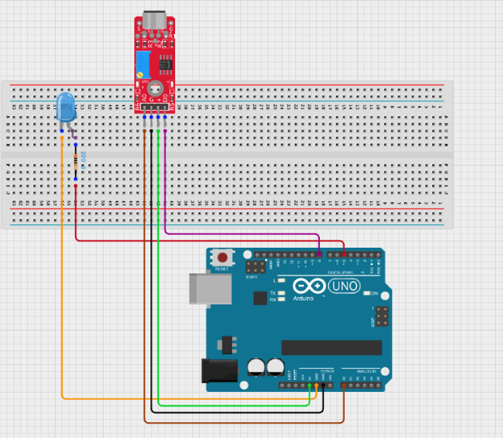
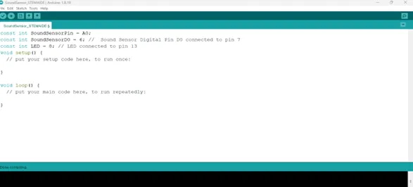
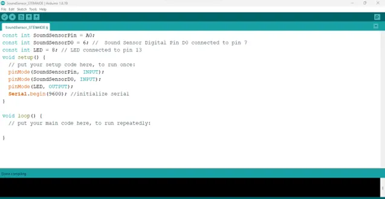
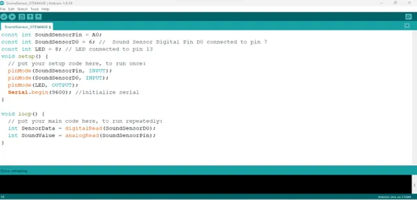
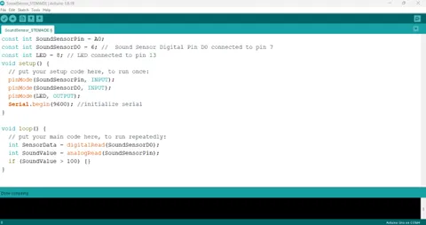
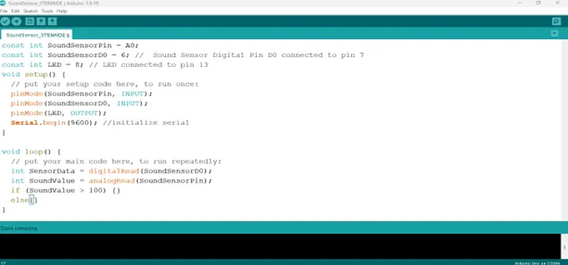
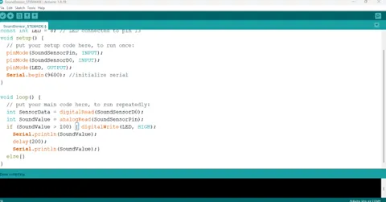
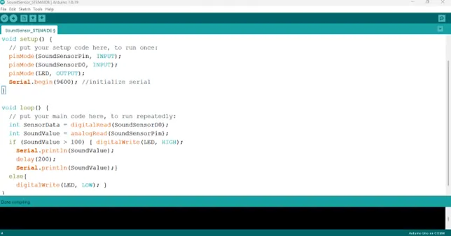

# Project 2.13.1: OPERATING A SOUND SENSOR WIITH ONE LED

| **Description** | This project demonstrates how to use a sound sensor and an LED with an Arduino Uno to detect sound and respond by turning on the LED. It helps in understanding how sensors can be used to create sound-activated systems. |
|------------------|----------------------------------------------------------------|
| **Use case**     | This project can be used in a clap-activated lighting system where the LED turns on when a sound such as a clap is detected. For example, a person can clap to activate a light in a room without using a switch. |

## Components (Things You will need)

|  |  |  |  || |
|-------------------------|-------------------------|-------------------------|-------------------------|-------------------------|-------------------------|

## Building the circuit

Things Needed:

-	Arduino Uno = 1
-	Arduino USB cable = 1
-	Sound sensor = 1
-	Jumper Wires 
-	Breadboard = 1


## Mounting the component on the breadboard

**Step 1:** Insert the sound sensor into the breadboard. Then place the red LED into the breadboard beside the sound sensor, making sure to identify the positive (long pin) and negative (short pin) correctly.

.

## WIRING THE CIRCUIT

**Step 2:** Connect the negative pin of the orange LED to GND on the Arduino Uno using an red jumper wire. Then connect the positive pin of the LED to one end of a resistor, and connect the other end of the resistor to Digital Pin 5 on the Arduino Uno using a red jumper wire.

.


**Step 3:** Connect the sound sensor to the Arduino Uno by linking the VCC pin to 5V using a green jumper wire, the GND pin to GND using a black jumper wire, the DO pin to Digital Pin 8 using a violet jumper wire, and the AO pin to the A0 pin on the Arduino Uno using a brown jumper wire.



_make sure you connect the arduino usb blue cable to the Arduino board_.

## PROGRAMMING

**Step 1:** Open your Arduino IDE. See how to set up here: [Getting Started](../../../Getting Started/Arduino_IDE_Setup.md).

**Step 2:** Type

``` cpp
const int SoundSensorPin = A0; 
const int SoundSensorD0 = 6;
const int LED = 8; 
 ``` 

.

**Step 3:** In the {} after the void setup (), Type

``` cpp
 pinMode (LED, OUTPUT); 
pinMode (soundSensorDOPin, INPUT);  
pinMode(SoundSensorPin, INPUT);
Serial.begin (9600); 
```
.

**Step 4:** In the {} after the void loop (), Type

``` cpp
int SensorData= digitalRead(SoundSensorDO); 
int SoundValue = analogRead (SoundSensorPin); 

```
as shown below; The below code reads data from the soundSensorPin.

.

**Step 5:** Type ```if (soundValue > 100 ) {  }``` as shown below; 

.

**Step 6:** Type ```else { } ; ``` as shown in the image below; 

.

**Step 7:** Type
``` cpp
digitalWrite(LED, HIGH); 
Serial.println(SoundValue);
delay(200);
Serial.printIn (SoundValue); 
 ``` 
 as shown in the picture below.

.

**Step 8:** Type ``` digitalWrite (LED, LOW); ```  as shown in the image below; 

.

**Step 9:** Save your code. _See the [Getting Started](../../../Getting Started/Arduino_IDE_Setup.md) section_

**Step 10:** Select the arduino board and port _See the [Getting Started](../../../Getting Started/Arduino_IDE_Setup.md) section:Selecting Arduino Board Type and Uploading your code_.

**Step 11:** Upload your code. _See the [Getting Started](../../../Getting Started/Arduino_IDE_Setup.md) section:Selecting Arduino Board Type and Uploading your code_


## CONCLUSION
The project demonstrated how an LDR sensor can detect light levels and automatically control an LED using an Arduino Uno. It helped in understanding sensor input, automatic lighting systems, and basic Arduino programming for real-life applications such as smart streetlights.


 

