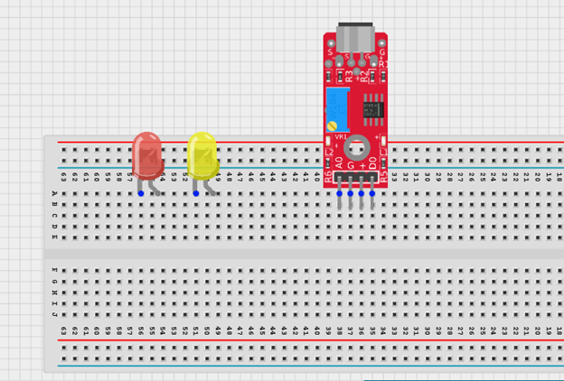
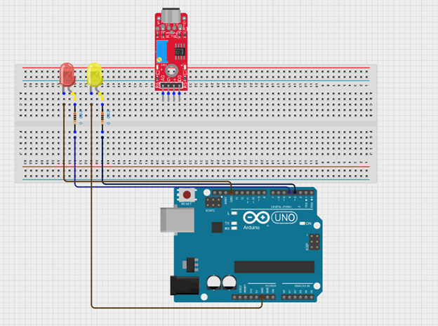
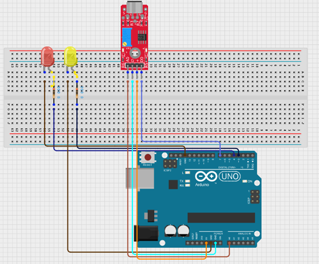
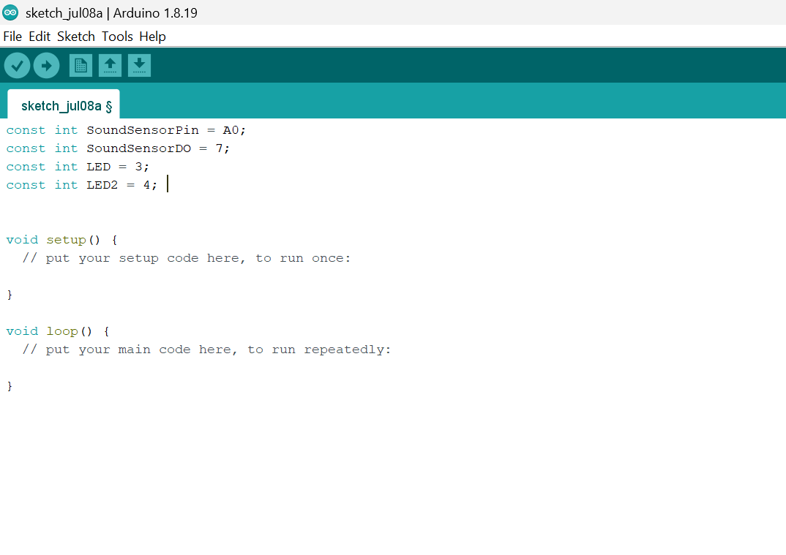
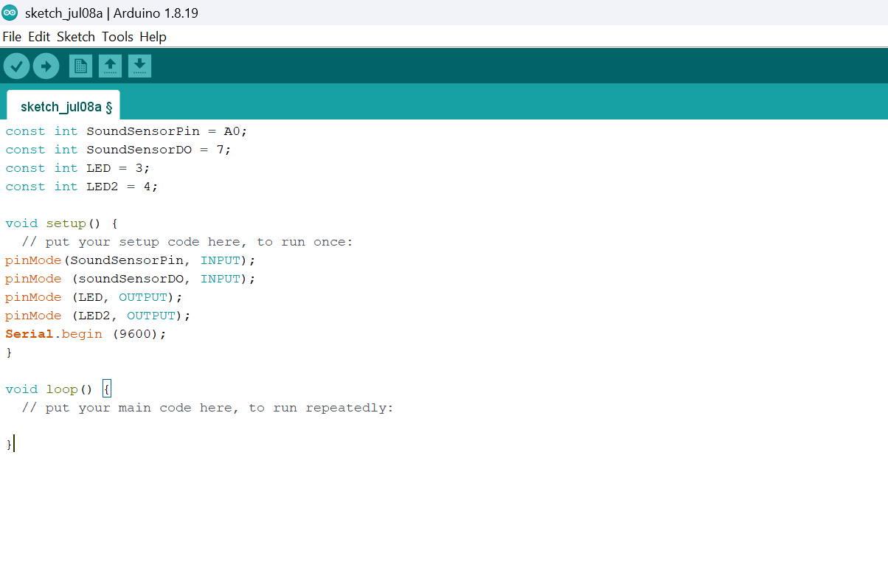
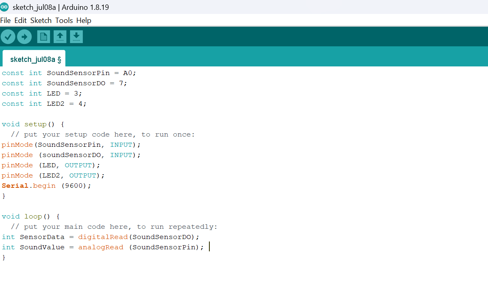
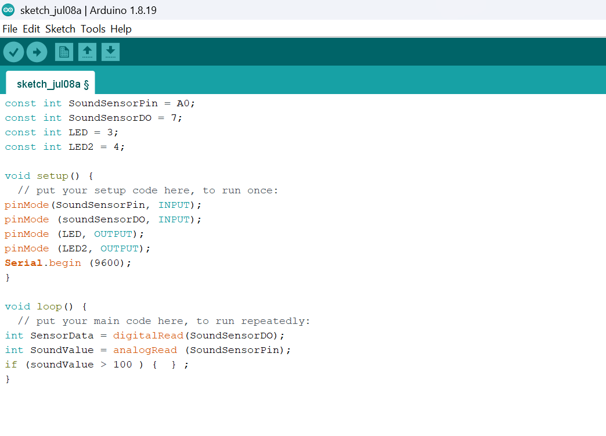
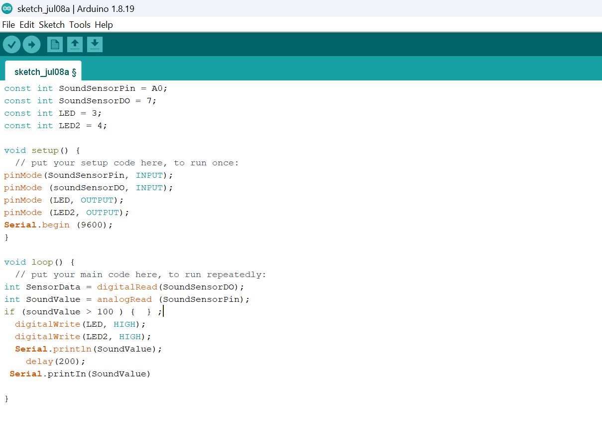
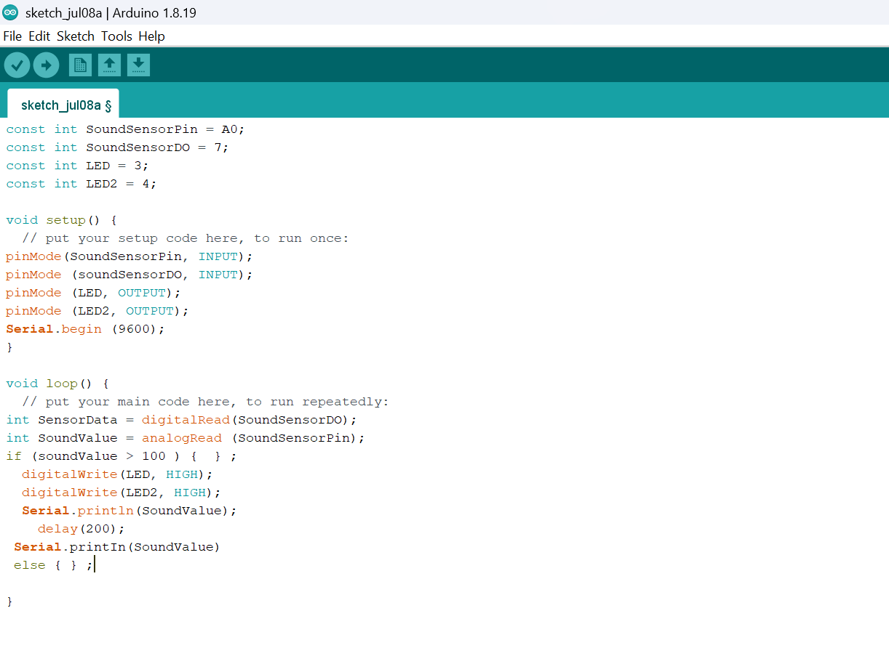
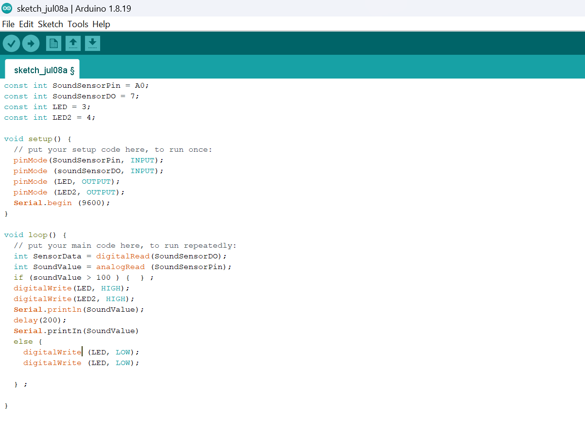

# Project 2.10.17: OPERATING A SOUND SENSOR WITH TWO LEDs

| **Description** |This project uses a sound sensor with an Arduino Uno to detect sound levels in the environment. The sensor reads analog sound signals and responds by controlling two LEDs to indicate sound intensity. The red LED shows high sound levels, while the yellow LED indicates medium sound levels, demonstrating how sound can be monitored and visualized using simple electronic components. |
|------------------|----------------------------------------------------------------|
| **Use case**     | This project can be used in a clap-activated lighting system where the LED turns on when a sound such as a clap is detected. For example, a person can clap to activate a light in a room without using a switch. |

## Components (Things You will need)

|  |  |  |||||
|-------------------------|-------------------------|-------------------------|-------------------------|------------------------|--------------------------|--------------------------|

## Building The Circuit(Things You Will Need)

- Arduino Uno = 1  
- Arduino USB cable = 1
- Sound Sensor  = 1
- LED = 2
- Jumper Wires
- Breadboard = 1


## Mounting The Component On The Breadboard

**Step 1:** Insert the sound sensor into the breadboard. Then place the red and yellow LED into the breadboard beside the sound sensor, making sure to identify the positive (long pin) and negative (short pin) correctly.




## WIRING THE COMPONENTS

**Step 2:** Connect the negative pins of both LEDs to the GND on the Arduino Uno using a red jumper wire. Then connect the positive pin of the first LED through a resistor to Digital Pin 3, and connect the positive pin of the second LED through another resistor to Digital Pin 4 on the Arduino Uno using red jumper wires.




**Step 3:** Connect the sound sensor to the Arduino Uno by linking the VCC pin to 5V, the GND pin to GND, the DO pin to Digital Pin 7, and the AO pin to A0 using jumper wires as shown in the circuit setup.



## PROGRAMMING

**Step 1:** Open your Arduino IDE. See how to set up here: [Getting Started](../../../Getting Started/Arduino_IDE_Setup.md).

**Step 2:** Type 

```cpp
const int SoundSensorPin = A0; 
const int SoundSensorDO = 7;
const int LED = 3;
const int LED2 = 4; 
``` 
as shown in the picture below.



_**NB:** Make sure you avoid errors when typing. Do not omit any character or symbol especially the bracket {} and semicolons; and place them as you see in the image. The code that comes after the two  backslashes “//” are called comments. They are not part of the code that will be run, they only explain the lines of code. You can avoid typing them._

**Step 3:** In the { } after the void setup (),Type as shown below in the image.

 ```cpp
pinMode(SoundSensorPin, INPUT);
pinMode (soundSensorDO, INPUT);  
pinMode (LED, OUTPUT); 
pinMode (LED2, OUTPUT);
Serial.begin (9600); 
```



_The code above activates the serial monitor and LEDS._

**Step 4:** In the {} after the void loop (), Type as shown below in the image.

```cpp
int SensorData = digitalRead(SoundSensorDO); 
int SoundValue = analogRead (SoundSensorPin); 
```



_The above code reads data from the soundSensorPin._

**Step 5:** Type ``` if (soundValue > 100 ) {  } ; ``` as shown below in the image.



**Step 7:** Type  as shown below in the image.
```cpp

  digitalWrite(LED, HIGH); 
  digitalWrite(LED2, HIGH);
  Serial.println(SoundValue);
    delay(200);
 Serial.printIn(SoundValue) 
```



**Step 6:** And on the next line, Type ```else { } ;```



**Step 8:** Type as shown below in the image.

```cpp

     digitalWrite (LED, LOW);
        digitalWrite (LED, LOW);
```



## CONCLUSION

This project demonstrated how a sound sensor can be used with an Arduino Uno to detect sound levels and control two LEDs. It helped in understanding how analog sound signals can trigger different outputs, where one LED indicates low sound levels and the other shows high sound levels, making it useful for simple sound detection and alert systems.


