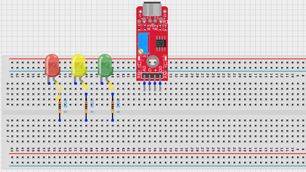
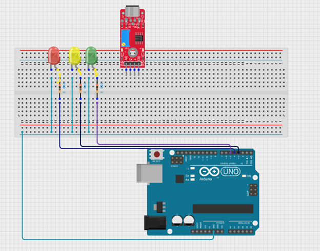
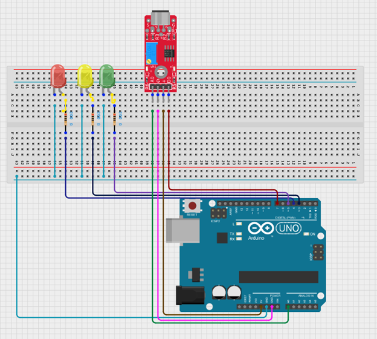
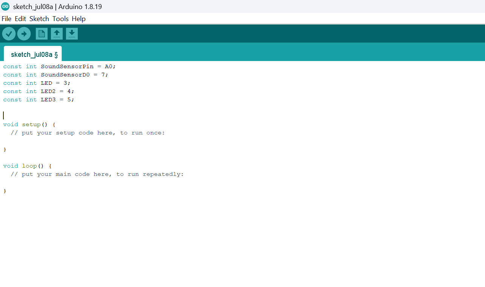
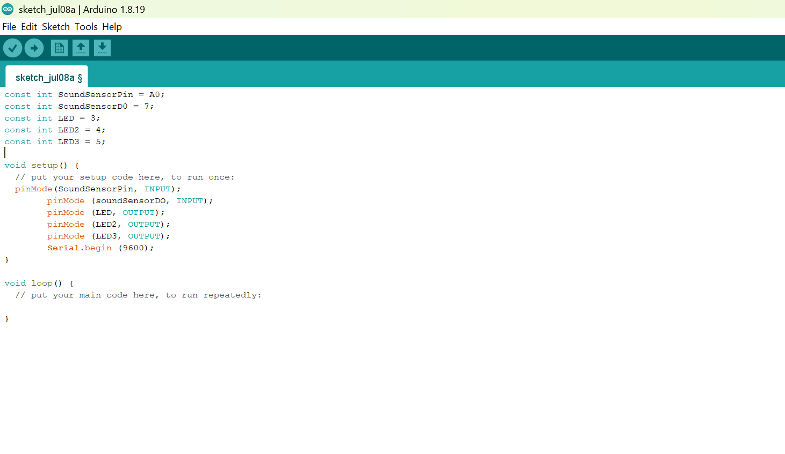
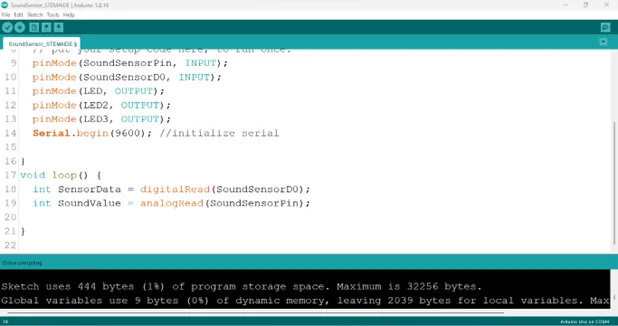
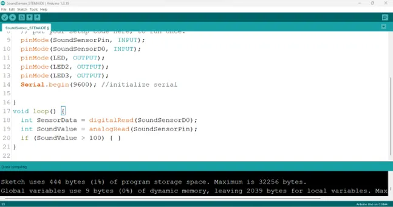
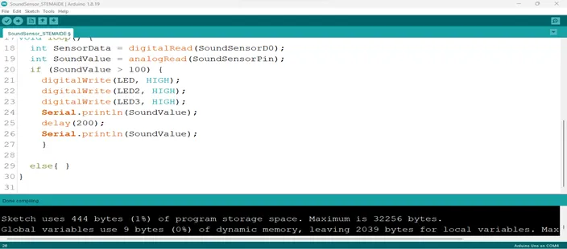
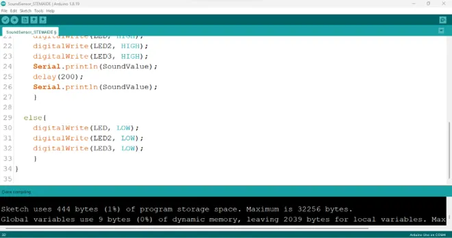

# Project 2.13.3: OPERATING A SOUND SENSOR WITH THREE LEDs

| **Description** | This project uses a sound sensor with an Arduino Uno to detect sound levels in the environment. The sensor reads analog sound signals and responds by controlling three LEDs to indicate sound intensity. The green LED shows low sound levels, the yellow LED indicates medium sound levels, and the red LED represents high sound levels, demonstrating how sound can be monitored and visualized using simple electronic components.  |
|------------------|----------------------------------------------------------------|
| **Use case**     | This project can be used in a sound-based indicator system where different sound levels control three LEDs. Low sound turns on green, medium sound turns on yellow, and high sound activates red as an alert. |

## Components (Things You will need)

|  |  |  || | | |
|-------------------------|-------------------------|-------------------------|-------------------------|------------------------|--------------------------|--------------------------|

## Building The Circuit(Things You Will Need)

- Arduino Uno = 1  
- Arduino USB cable = 1
- Sound Sensor  = 1
- LED = 3
- Jumper Wires 
- Breadboard = 1


## Mounting The Component On The Breadboard

**Step 1:** Insert the sound sensor into the breadboard. Then place the red LED into the breadboard beside the sound sensor, making sure to identify the positive (long pin) and negative (short pin) correctly.




## WIRING THE COMPONENTS


**Step 2:** Connect a jumper wire from the GND on the arduino uno to the negative section on the breadboard.And connect all the negative sections of the led t the negative section on the breadboard. Then connect the positive pin of the first LED through a resistor to Digital Pin 3,4 and 5 on the Arduino Uno using red jumper wires.




**Step 3:** Connect the sound sensor to the Arduino Uno as follows: connect the VCC (+) pin to the 5V pin, the GND (G) pin to the GND pin, the AO (Analog Output) pin to A0, and the DO (Digital Output) pin to digital pin 7 on the Arduino Uno.



## PROGRAMMING

**Step 1:** Open your Arduino IDE. See how to set up here: [Getting Started](../../../Getting Started/Arduino_IDE_Setup.md).

**Step 2:** Type 
``` cpp
            const int SoundSensorPin = A0; 
            const int SoundSensorD0 = 7; 
            const int LED = 3;
            const int LED2 =4; 
            const int LED3 =5;
            
``` 
as shown in the picture below.



_**NB:** Make sure you avoid errors when typing. Do not omit any character or symbol especially the bracket {} and semicolons; and place them as you see in the image. The code that comes after the two  backslashes “//” are called comments. They are not part of the code that will be run, they only explain the lines of code. You can avoid typing them._

**Step 3:** In the { } after the void setup (),Type 
```    cpp
        pinMode(SoundSensorPin, INPUT);
        pinMode (soundSensorDO, INPUT);  
        pinMode (LED, OUTPUT); 
        pinMode (LED2, OUTPUT);
        pinMode (LED3, OUTPUT);
        Serial.begin (9600); 
```
 as shown below in the image.



_The code above activates the serial monitor and LEDS._

**Step 4:** In the {} after the void loop (), Type as shown below in the image.

``` cpp
int SensorData = digitalRead(SoundSensorDO); 
int SoundValue = analogRead (SoundSensorPin); 
``` 



_NB:The above code reads data from the soundSensorPin._

**Step 5:** Type ``` if (soundValue > 100 ) {  } ; ``` as shown below in the image.




**Step 6:** Type 
```  cpp
 digitalWrite(LED, HIGH); 
                   digitalWrite(LED2, HIGH);
                   digitalWrite(LED3, HIGH)
                   Serial.println(SoundValue);
                    delay(200);
                    Serial.printIn(SoundValue)
                     else {  } 
```
 as shown below in the image.



**Step 8:** Type 

    ``` cpp
        digitalWrite (LED, LOW);
        digitalWrite (LED, LOW);
        digitalWrite (LED3, LOW); 
```
     as shown below in the image.



## CONCLUSION

This project demonstrated how a sound sensor can be used with an Arduino Uno to detect and display sound levels using LEDs. It helped in understanding how analog sensor values can control different outputs based on intensity, making it useful for simple sound monitoring and alert systems.

