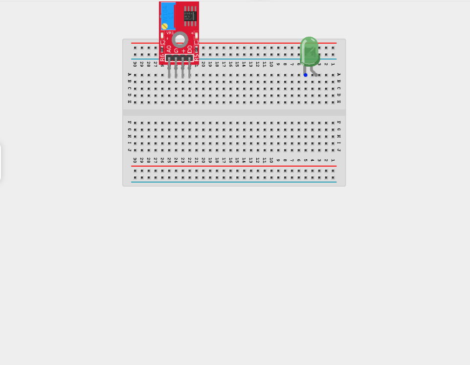
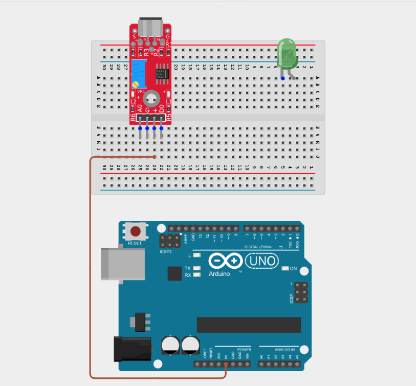
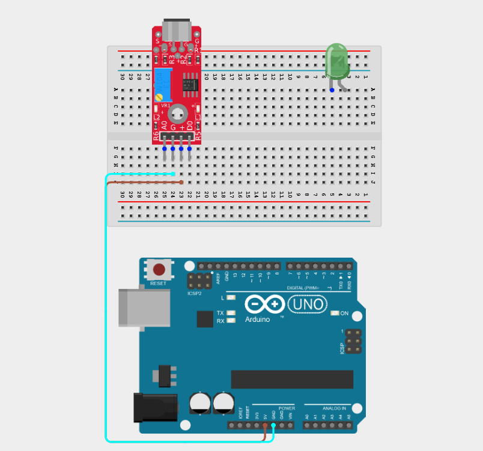
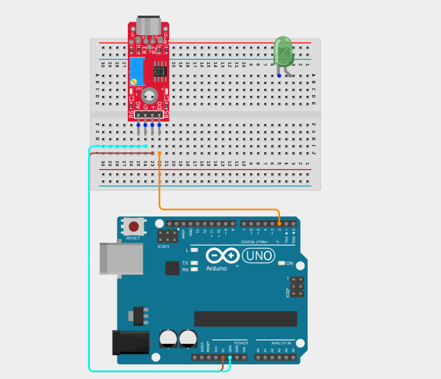
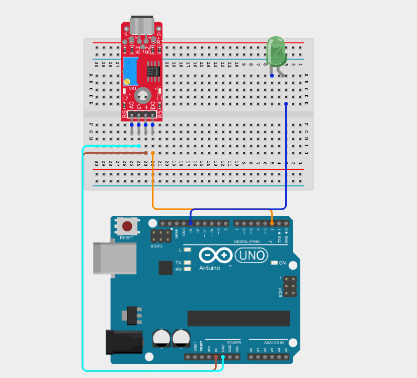
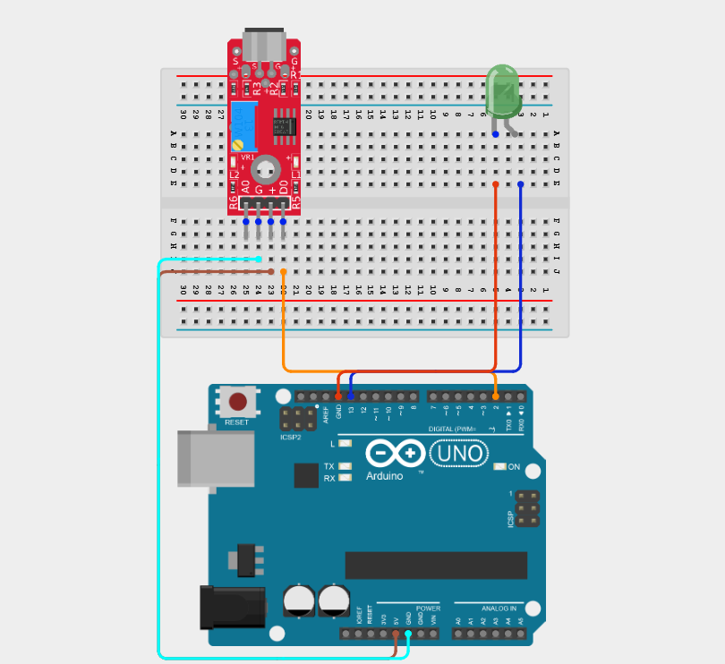
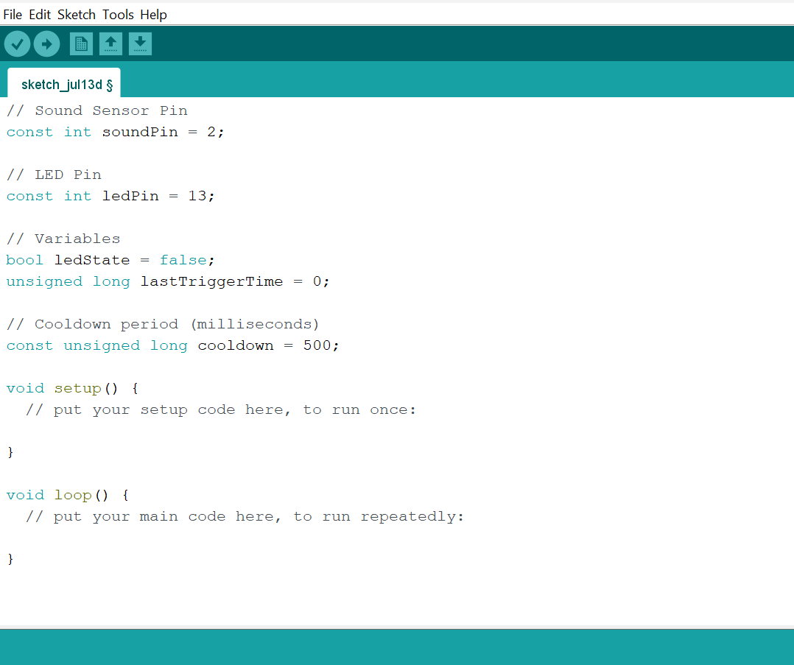
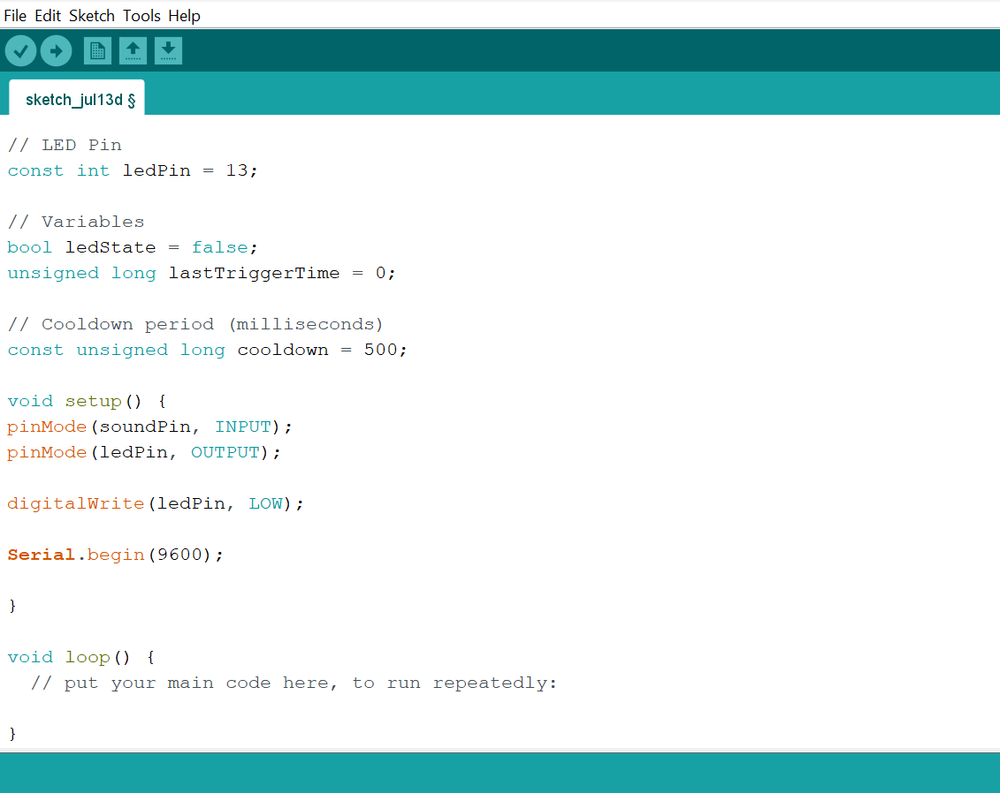
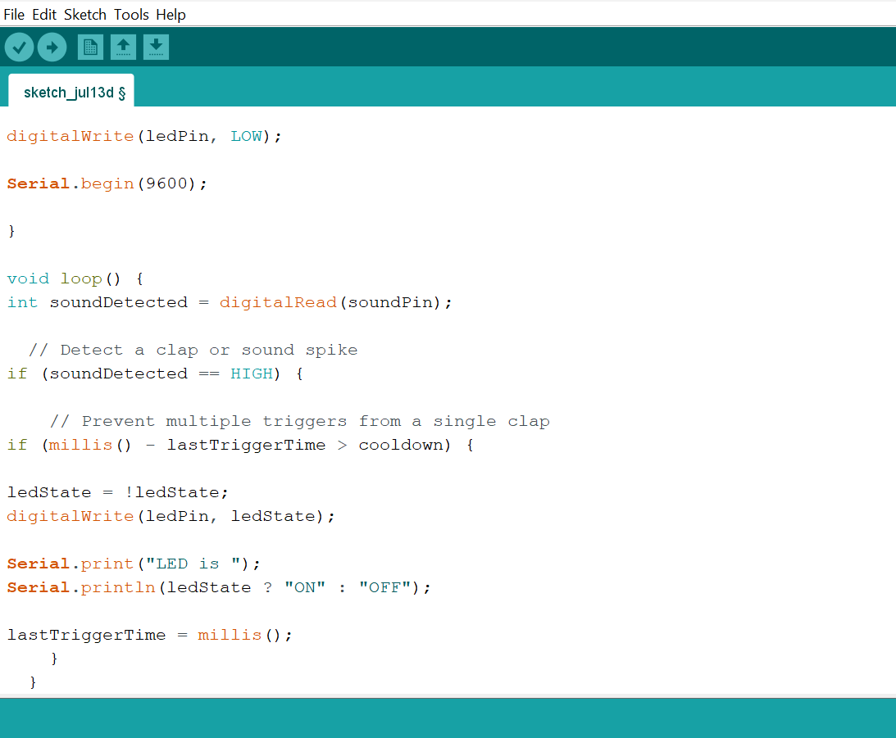

# Project 2.10.19: Clap-to-Toggle Lamp

| **Description** | This project uses a sound sensor to detect claps or sound spikes and toggles an LED ON and OFF with each detection, including a cooldown to prevent double-triggers. |
|------------------|----------------------------------------------------------------|
| **Use case**     | This project can be used in automation systems, interactive installations, and embedded control applications. |

## Components (Things You will need)

| | | | | | |
|-------------------------|-------------------------|-------------------------|-------------------------|-------------------------|-------------------------|

## Building the circuit

Things Needed:

- Arduino Uno = 1
- Arduino USB cable = 1
- Sound sensor module = 1
- LED = 1
- Jumper wires 
- 220Ω resistor 

## Mounting the component on the breadboard

**Step 1:** Place the Sound Sensor and the LED module on the breadboard.

_**NB:** Make sure all components are securely placed on the breadboard with correct orientation._

## WIRING THE CIRCUIT

**Step 2:** Connect the VCC/+ pin of the Sound Sensor to the 5V pin on the Arduino using a male-to-male jumper wire.

**Step 3:** Connect the GND pin of the Sound Sensor to the GND pin on the Arduino using a male-to-male jumper wire.

**Step 4:** Connect the DO pin of the Sound Sensor to the Digital pin 2 on the Arduino using a male-to-male jumper wire.

_Leave the A0 (Analog Output) pin unconnected, as it is not required for this project._

**Step 5:** Connect the positive pin(long leg) of the LED module to the Digital pin 13 on the Arduino using a male-to-male jumper wire.

**Step 6:** Connect the negative pin (short leg) of the LED module to the GND on the Arduino using a male-to-male jumper wire.

_Make sure to connect the Arduino USB cable to the Arduino board._

## PROGRAMMING

**Step 1:** Open your Arduino IDE. See how to set up here: [Getting Started](../../Getting Started/Arduino_IDE_Setup.md).

**Step 2:** Type the following code in your Arduino IDE: `const int soundPin = 2;`, `const int ledPin = 13;`, `bool ledState = false;`, `unsigned long lastTriggerTime = 0;`, `const unsigned long cooldown = 500;` as shown in the image below.

**Step 3:** Type the following code in your Arduino IDE inside the void setup() `pinMode(soundPin, INPUT);`, `  pinMode(ledPin, OUTPUT);`, ` digitalWrite(ledPin, LOW);`, `Serial.begin(9600);` as shown in the image below.

**Step 4:** Type the following code in your Arduino IDE inside the void loop() `print soundDetected = digitalRead(soundPin);`, `if (soundDetected == HIGH) { `, ` if (millis() - lastTriggerTime > cooldown) { `, `ledState = !ledState;`, `digitalWrite(ledPin, ledState);` , `Serial.print("LED is ");` , `Serial.println(ledState ? "ON" : "OFF");`, ` lastTriggerTime = millis();} }` as shown in the image below.
 

**Step 5:** Save your code. _See the [Getting Started](../../Getting Started/Arduino_IDE_Setup.md) section_

**Step 6:** Select the Arduino board and port. _See the [Getting Started](../../Getting Started/Arduino_IDE_Setup.md) section_

**Step 7:** Upload your code.

## CONCLUSION

This project helps learners understand how to combine multiple components with Arduino to create more complex interactive systems and automation solutions.

