# Project 2.10.20: Sound_Reactive_Party_Light

| **Description** | This project uses a sound sensor to detect ambient noise levels and dynamically changes RGB LED colors in sync with music or sound peaks. |
|------------------|----------------------------------------------------------------|
| **Use case**     | This project can be used in automation systems, interactive installations, and embedded control applications. |

## Components (Things You will need)

| | | | | | |
|-------------------------|-------------------------|-------------------------|-------------------------|-------------------------|-------------------------|

## Building the circuit

Things Needed:

- Arduino Uno = 1
- Arduino USB cable = 1
- Sound sensor module = 1
- RGB LED module = 1
- Jumper wires 

## Mounting the component on the breadboard

**Step 1:** Place the Sound Sensor and RGB LED on the breadboard.

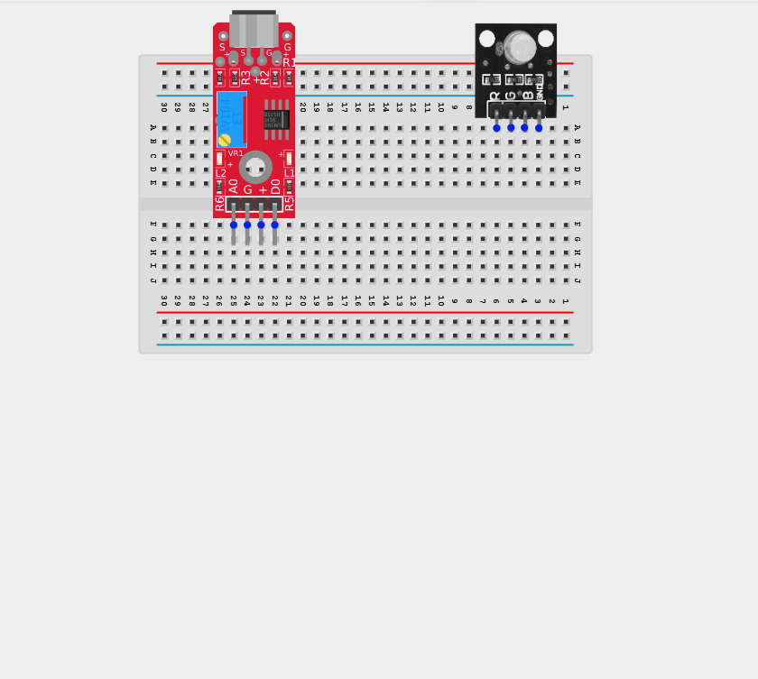

_**NB:** Make sure all components are securely placed on the breadboard with correct orientation._

## WIRING THE CIRCUIT

**Step 2:** Connect the VCC (+) pin of the Sound Sensor to the 5V pin on the Arduino using male-to-male jumper wires.

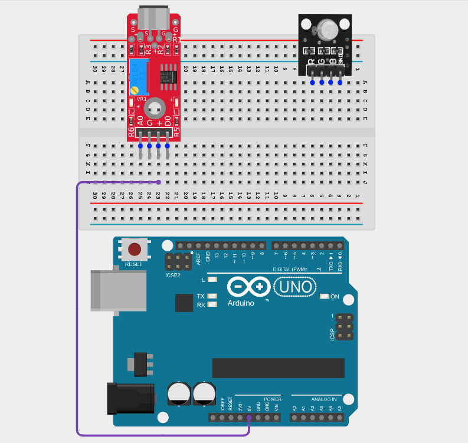

**Step 3:** Connect the GND pin of the Sound Sensor to the GND pin on the Arduino using  male-to-male jumper wires.

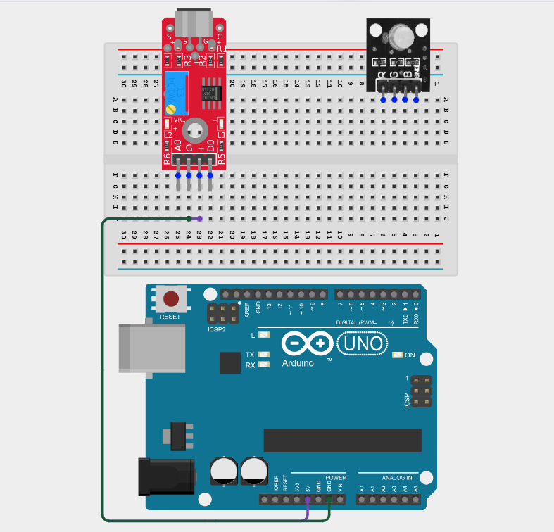

**Step 4:** Connect the AO pin of the Sound Sensor to the AO pin on the Arduino using male-to-male jumper wires.

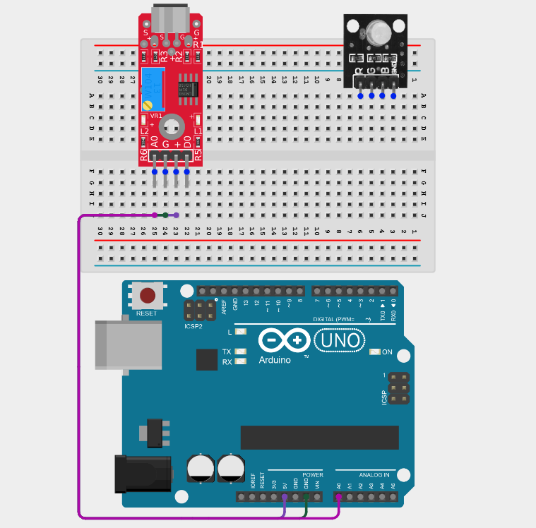

_Leave the D0 (Digital Output) pin unconnected. This project uses the A0 (Analog Output) pin to measure the sound intensity. The D0 (Digital Output) pin is not used._

**Step 5:** Connect the Red (R) pin of the RGB Module to the Digital pin 9 on the Arduino using male-to-male jumper wires.

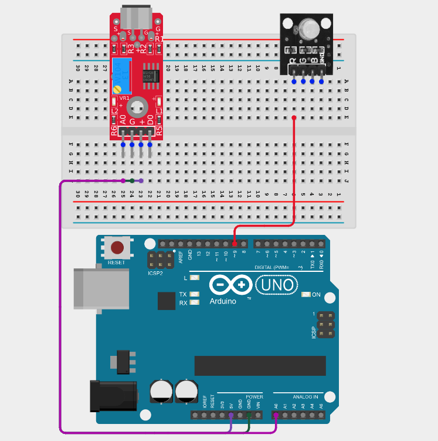

**Step 6:** Connect the Green (G) pin of the RGB Module to the Digital pin 10 on the Arduino using male-to-male jumper wires.

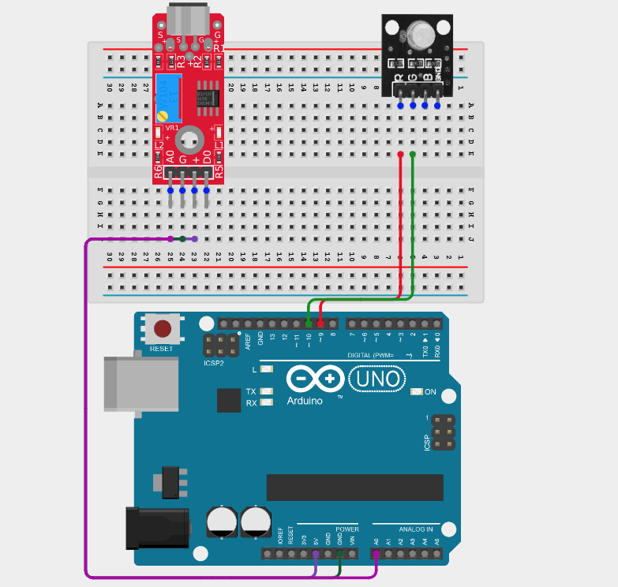

**Step 7:** Connect the Blue (B) pin of the RGB Module to the Digital pin 11 on the Arduino using male-to-male jumper wires.

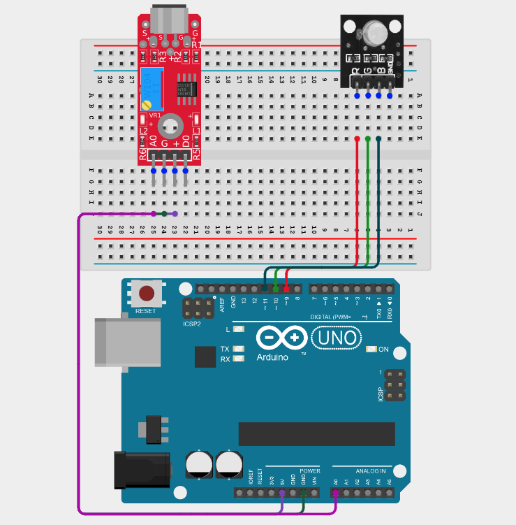

**Step 8:** Connect the GND pin of the RGB LED module to the GND pin on the Arduino using male-to-male jumper wires.

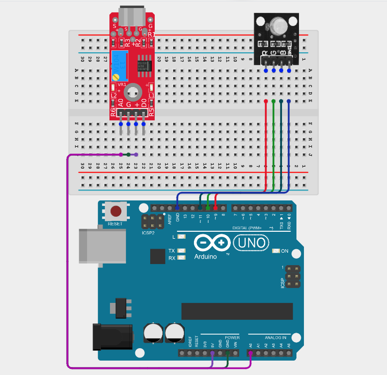

_Make sure to connect the Arduino USB cable to the Arduino board._

## PROGRAMMING

**Step 1:** Open your Arduino IDE. See how to set up here: [Getting Started](../../Getting Started/Arduino_IDE_Setup.md).

**Step 2:** Type the following code in your Arduino IDE: `const int soundPin = A0;`, `const int redPin = 9;`, `const int greenPin = 10;`, `const int bluePin = 11;`, `int soundValue;` as shown in the image below.

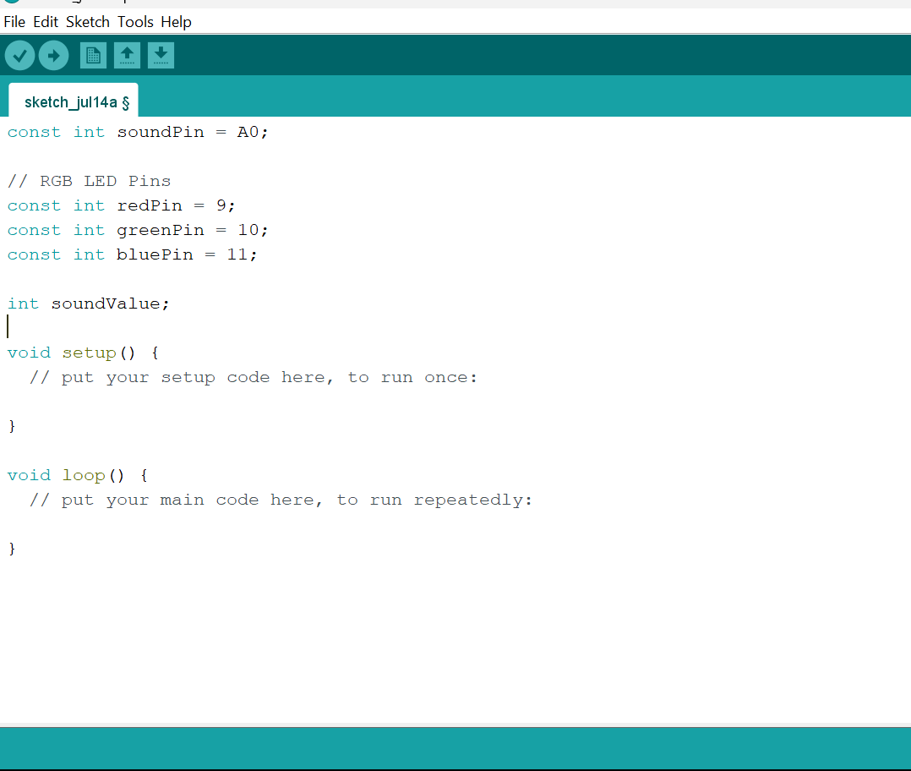

**Step 3:** Type the following code in your Arduino IDE inside the void setup() `pinMode(redPin, OUTPUT);`, `pinMode(greenPin, OUTPUT);`, ` pinMode(bluePin, OUTPUT);`, `  Serial.begin(9600);` as shown in the image below.

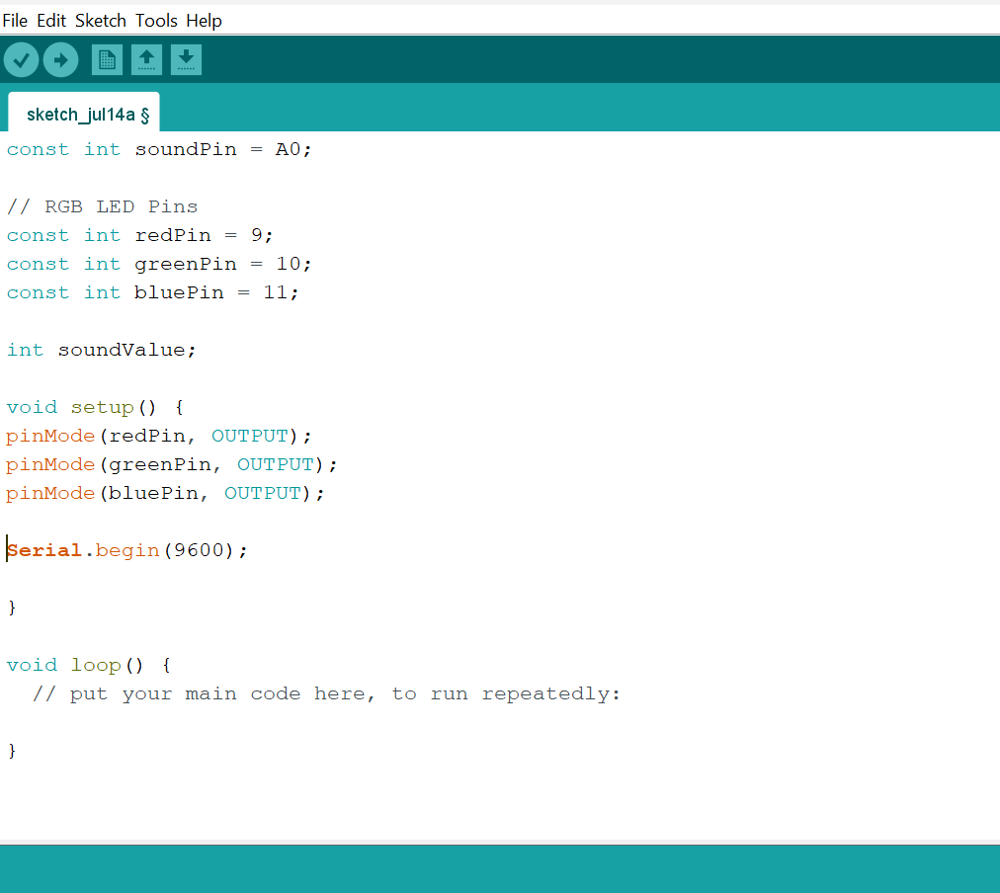

**Step 4:** Type the following code in your Arduino IDE inside the void setup() `soundValue = analogRead(soundPin);`, `Serial.println(soundValue);`, `if (soundValue < 350) { `, `analogWrite(redPin, 0);`, `analogWrite(greenPin, 0);`, `analogWrite(bluePin, 255); }` as shown in the image below.

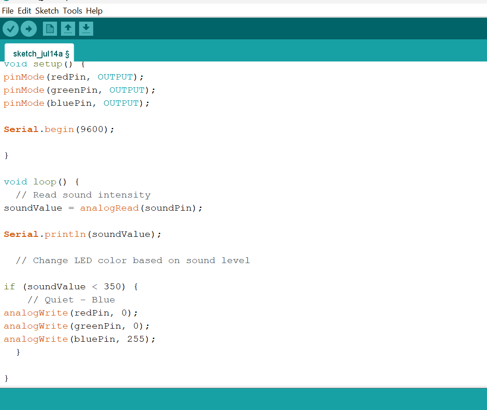

**Step 5:** Type the following code in your Arduino IDE inside the void setup() ` else if (soundValue < 500) {`, ` analogWrite(redPin, 0);`, `analogWrite(greenPin, 255); `, `analogWrite(bluePin, 0); }`, ` else if (soundValue < 700) {`, `analogWrite(redPin, 255);`, `analogWrite(greenPin, 255);`, ` analogWrite(bluePin, 0); }` as shown in the image below.

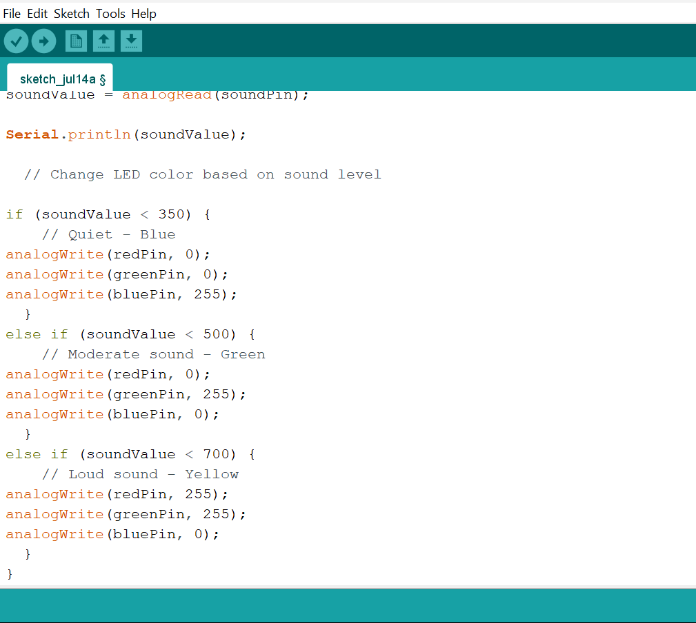

**Step 6:** Type the following code in your Arduino IDE inside the void setup() `else {`, `  analogWrite(redPin, 255);`, `analogWrite(greenPin, 0);`, `analogWrite(bluePin, 0); }`, `delay(50)` as shown in the image below.

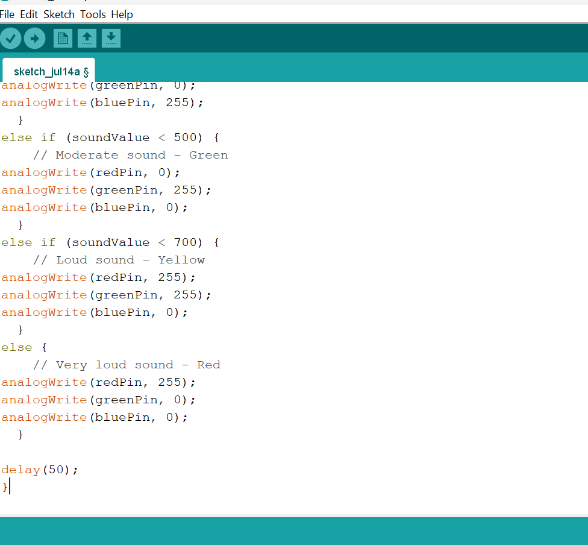

**Step 7:** Save your code. _See the [Getting Started](../../Getting Started/Arduino_IDE_Setup.md) section_

**Step 8:** Select the Arduino board and port. _See the [Getting Started](../../Getting Started/Arduino_IDE_Setup.md) section_

**Step 9:** Upload your code.

## CONCLUSION

This project helps learners understand how to combine multiple components with Arduino to create more complex interactive systems and automation solutions.

