# Project 2.10.21: Decibel Visualizer

| **Description** | This project uses a sound sensor to measure noise levels and displays the result as Green (quiet), Yellow (moderate), or Red (loud) on a Traffic Light Module. |
|------------------|----------------------------------------------------------------|
| **Use case**     | This project can be used in automation systems, interactive installations, and embedded control applications. |

## Components (Things You will need)

|  |  |  |  |  |  |
|-------------------------|-------------------------|-------------------------|-------------------------|-------------------------|-------------------------|

## Building the circuit

Things Needed:

- Arduino Uno = 1
- Breadboard = 1
- Arduino USB cable = 1
- Sound sensor module = 1
- Traffic light module = 1
- Jumper wires 

## Mounting the component on the breadboard

**Step 1:** Place the Sound Sensor and the Traffic Light Module on the breadboard.

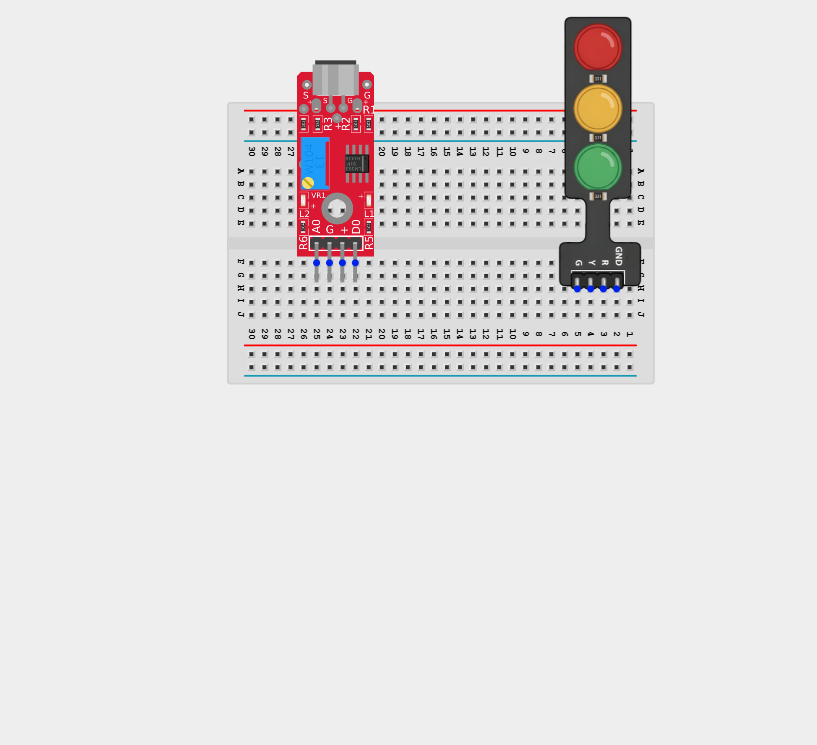

_**NB:** Make sure all components are securely placed on the breadboard with correct orientation._

## WIRING THE CIRCUIT

**Step 2:** Connect the VCC (+) pin of the Sound Sensor to the 5V pin on the Arduino using male-to-male jumper wires.

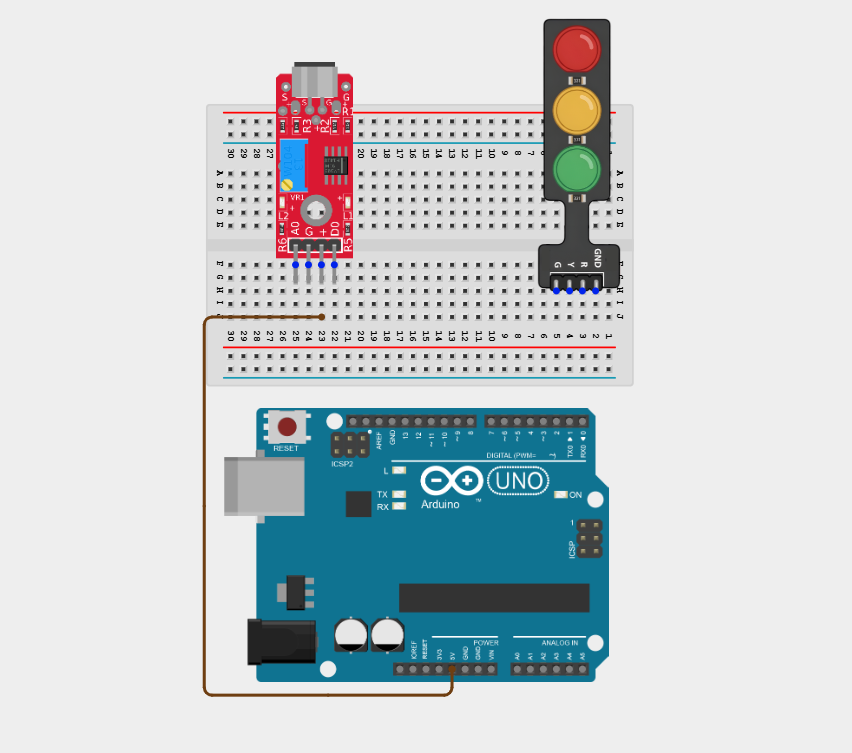

**Step 3:** Connect the GND pin of the Sound Sensor to the GND pin on the Arduino using male-to-male jumper wires.

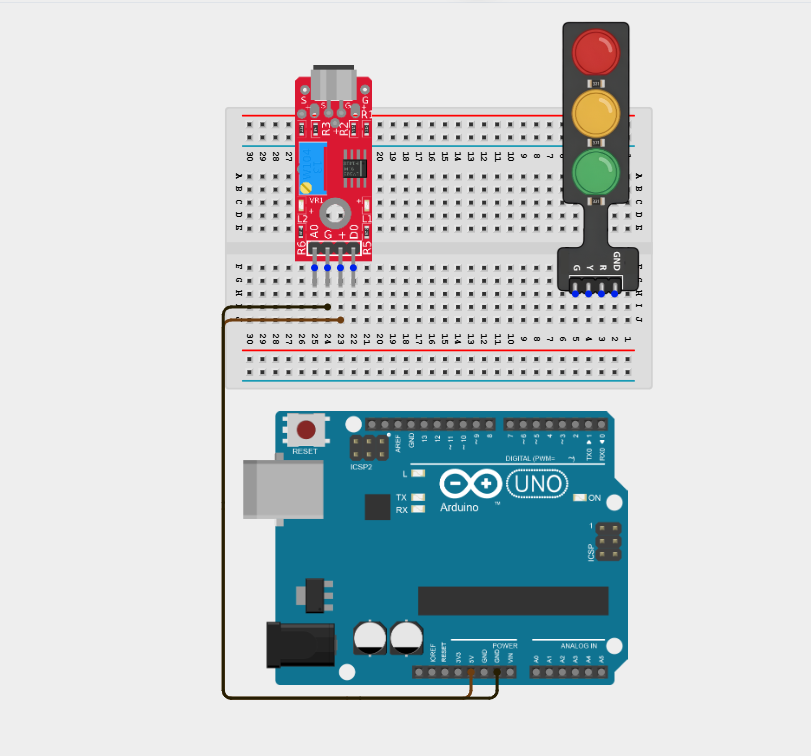

**Step 4:** Connect the A0 pin of the Sound Sensor to the Analog pin A0 on the Arduino using male-to-male jumper wires.

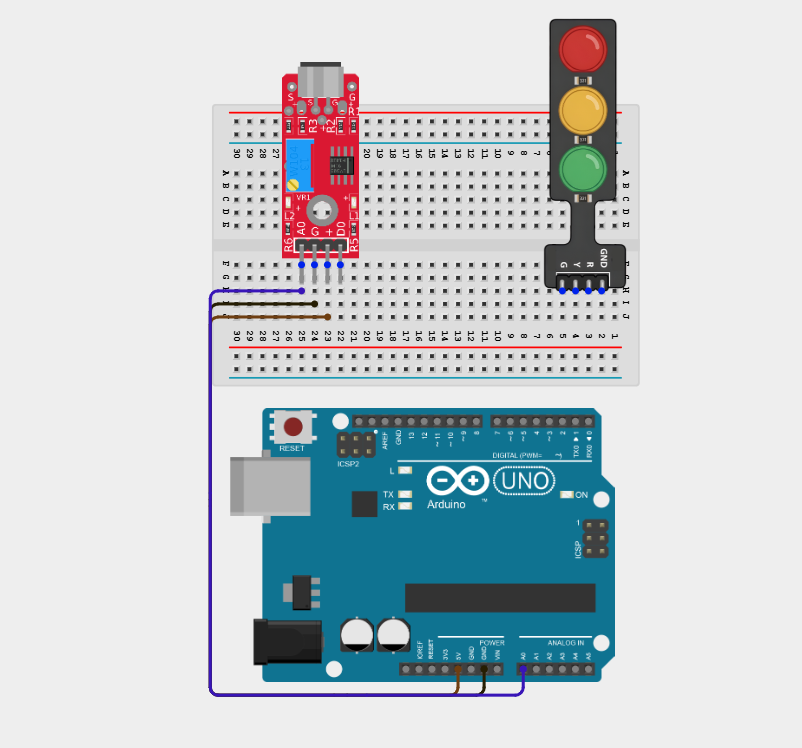

_Leave the D0 (Digital Output) pin unconnected._

**Step 5:** Connect the Green LED (G) pin of the Traffic Light Module to the Digital pin 4 on the Arduino using male-to-male jumper wires.

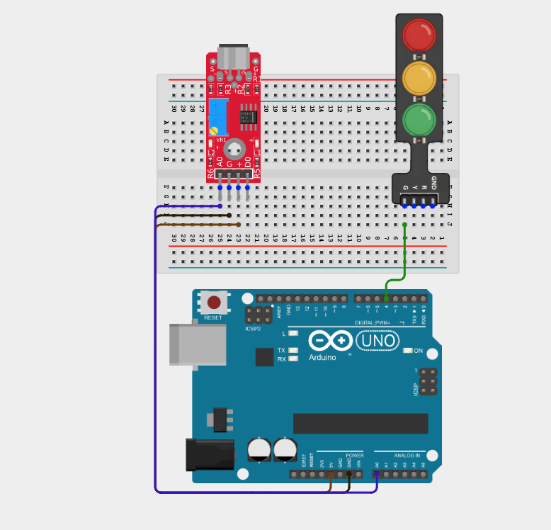

**Step 6:** Connect the Yellow LED (Y) pin of the Traffic Light Module to the Digital pin 5 on the Arduino using male-to-male jumper wires.

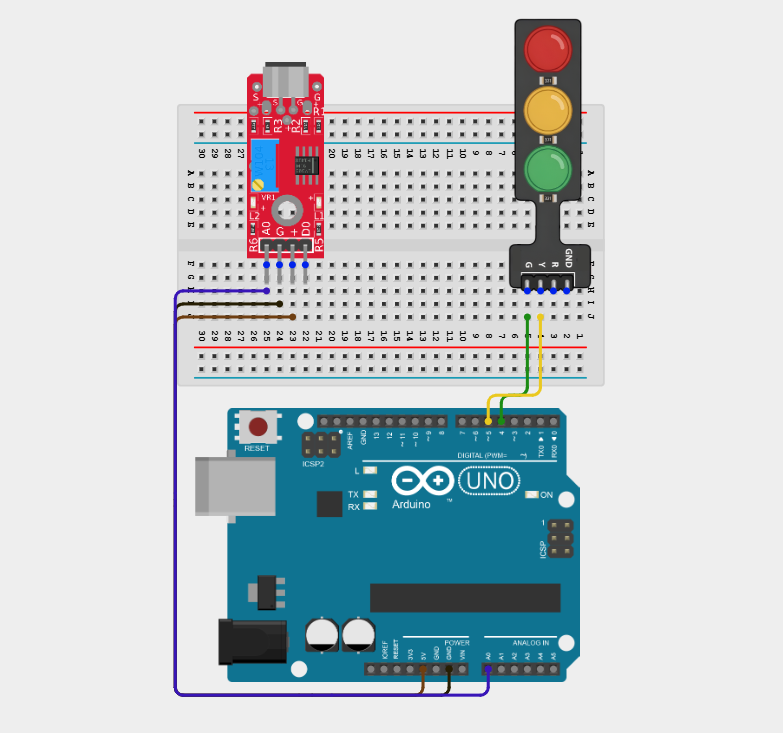

**Step 7:** Connect the Red LED (R) pin of the Traffic Light Module to the Digital pin 6 on the Arduino using male-to-male jumper wires.

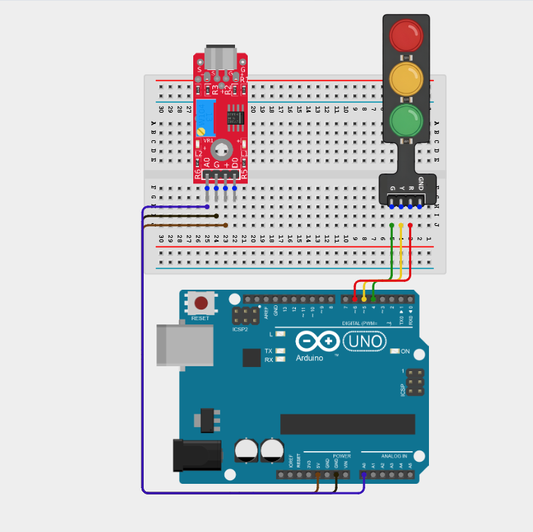

**Step 8:** Connect the GND pin of the Traffic Light Module to the GND pin on the Arduino using male-to-male jumper wires.

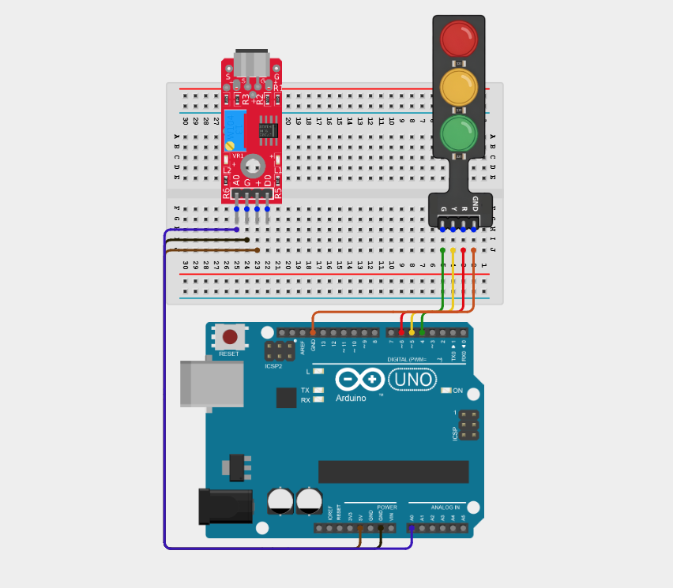

_Make sure to connect the Arduino USB cable to the Arduino board._

## PROGRAMMING

**Step 1:** Open your Arduino IDE. See how to set up here: [Getting Started](../../Getting Started/Arduino_IDE_Setup.md).

**Step 2:** Type the following code in your Arduino IDE: `const int soundPin = A0;`, `const int greenLED = 4;`, `const int greenLED = 4;`, `const int yellowLED = 5;`, `const int redLED = 6;`, `int soundValue;` as shown in the image below.

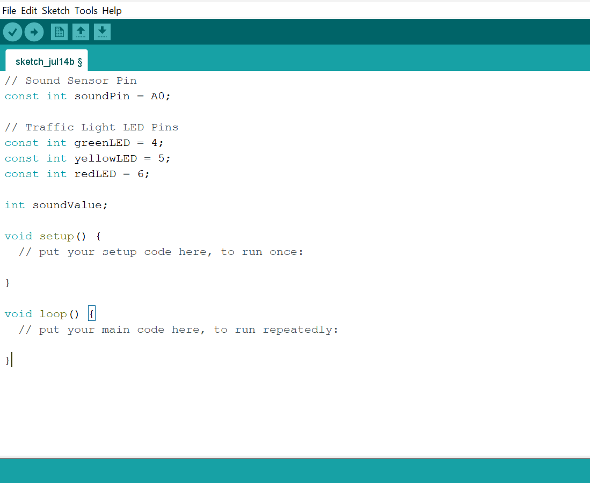

**Step 3:** Type the following code in your Arduino IDE inside the void setup() `pinMode(greenLED, OUTPUT);`, `pinMode(yellowLED, OUTPUT);`, `pinMode(redLED, OUTPUT);`, `Serial.begin(9600);` as shown in the image below.

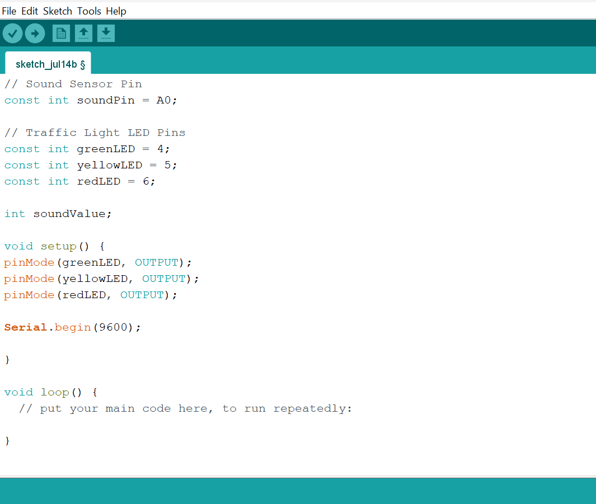

**Step 4:** Type the following code in your Arduino IDE inside the void loop() `soundValue = analogRead(soundPin);`, `Serial.print("Sound Level: ");`, `Serial.println(soundValue);`, `if (soundValue < 350) {`, `digitalWrite(greenLED, HIGH);`, `digitalWrite(yellowLED, LOW);`, ` digitalWrite(redLED, LOW); }` as shown in the image below.

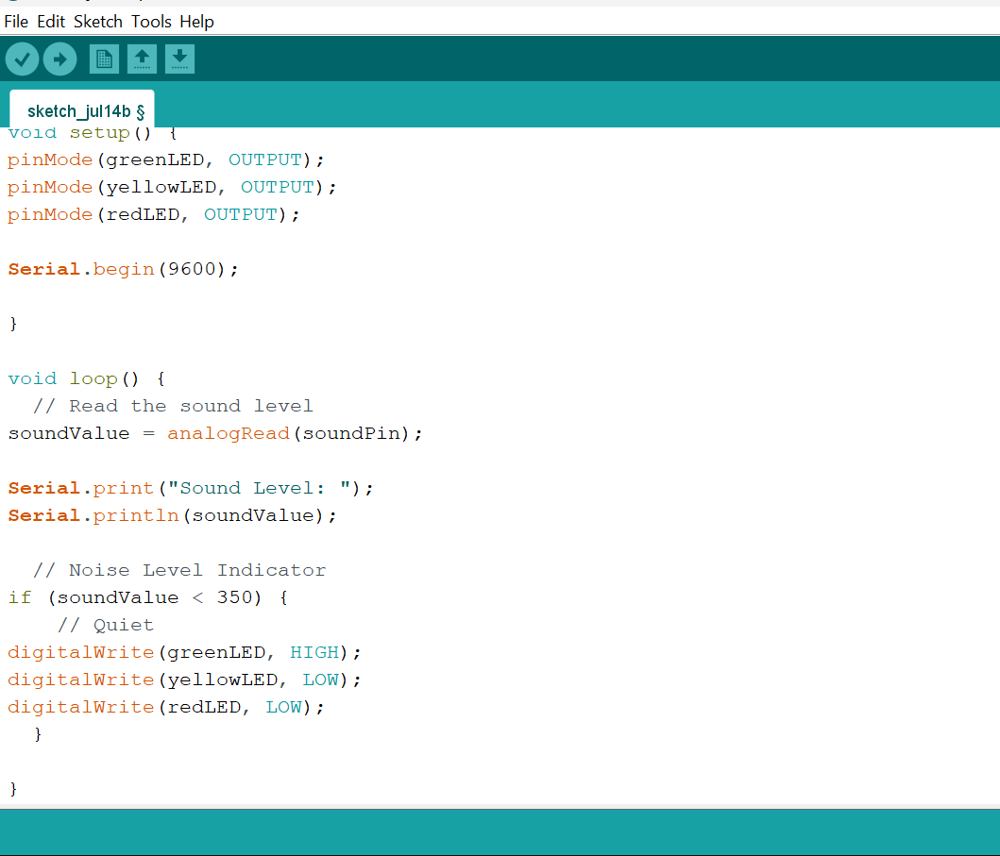

**Step 5:** Type the following code in your Arduino IDE inside the void loop() `else if (soundValue < 600) {`, `digitalWrite(greenLED, LOW);`, `digitalWrite(yellowLED, HIGH);`, `digitalWrite(redLED, LOW); }`, ` else {`, `digitalWrite(greenLED, LOW);`, `digitalWrite(yellowLED, LOW);`, `digitalWrite(redLED, LOW); }`, `delay(100)` as shown in the image below.

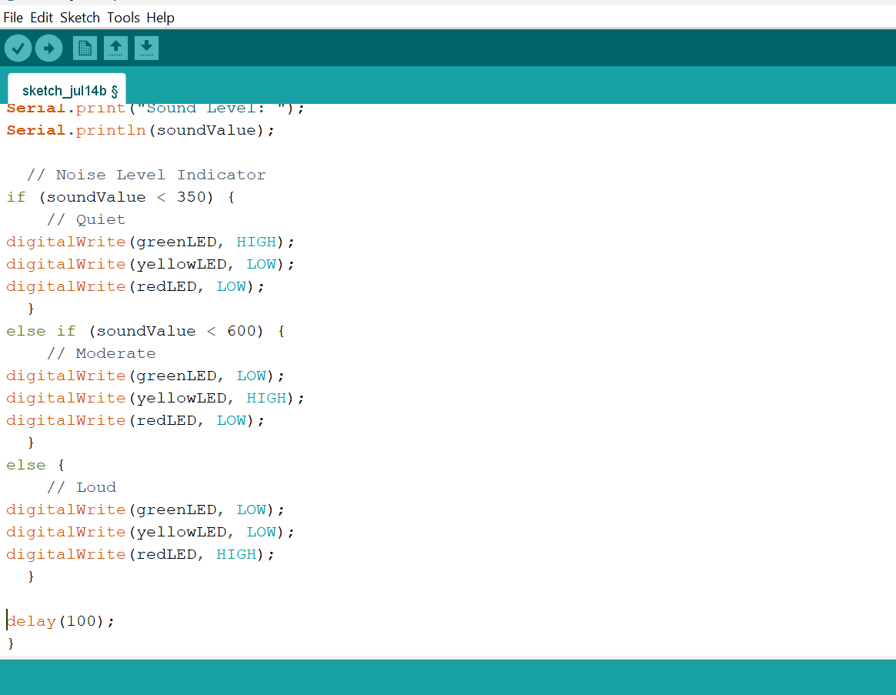

**Step 6:** Save your code. _See the [Getting Started](../../Getting Started/Arduino_IDE_Setup.md) section_

**Step 7:** Select the Arduino board and port. _See the [Getting Started](../../Getting Started/Arduino_IDE_Setup.md) section_

**Step 8:** Upload your code.

## CONCLUSION

This project helps learners understand how to combine multiple components with Arduino to create more complex interactive systems and automation solutions.

