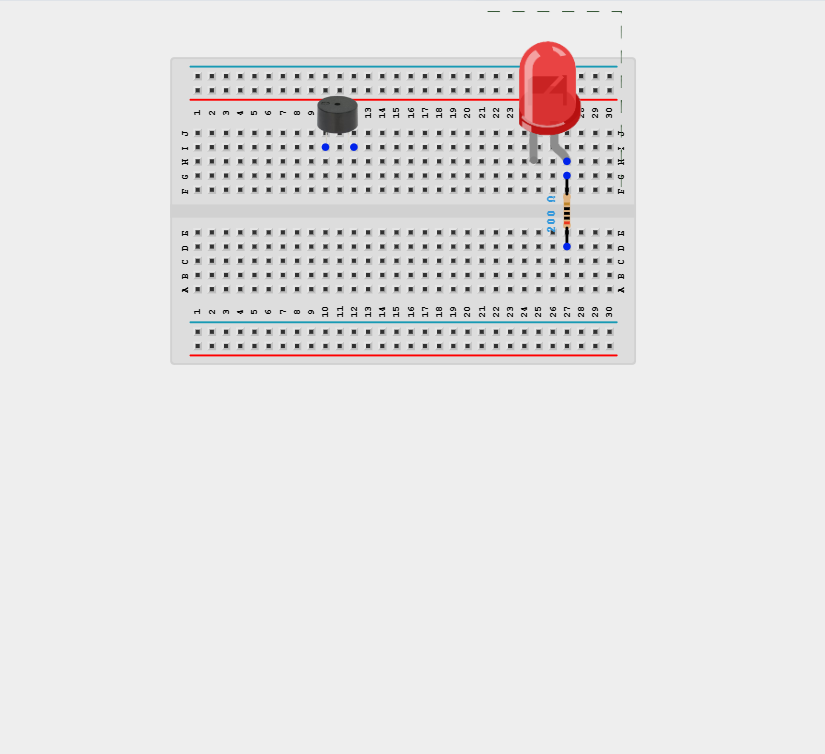
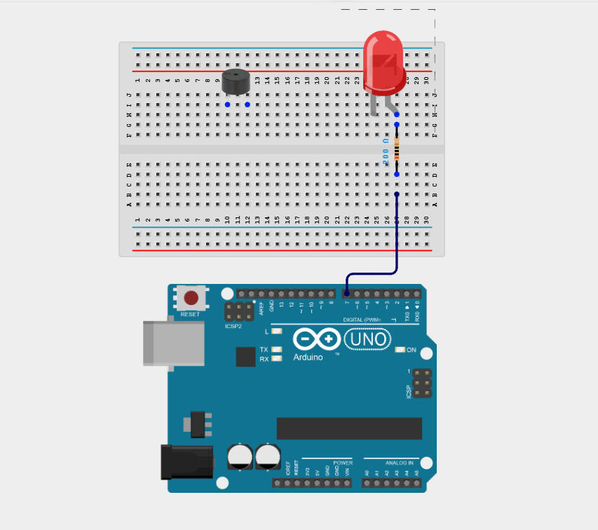
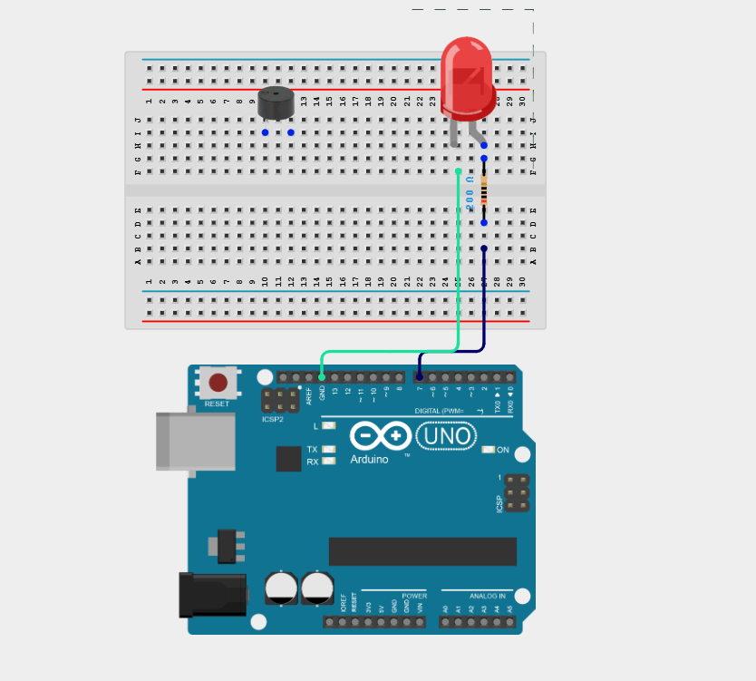
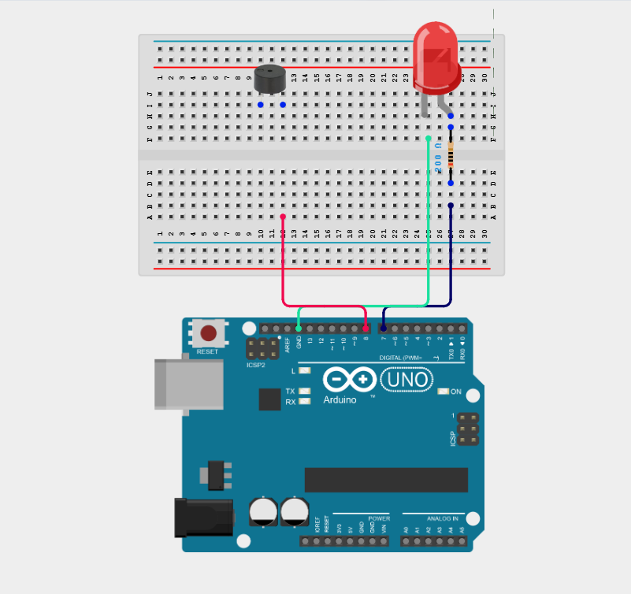
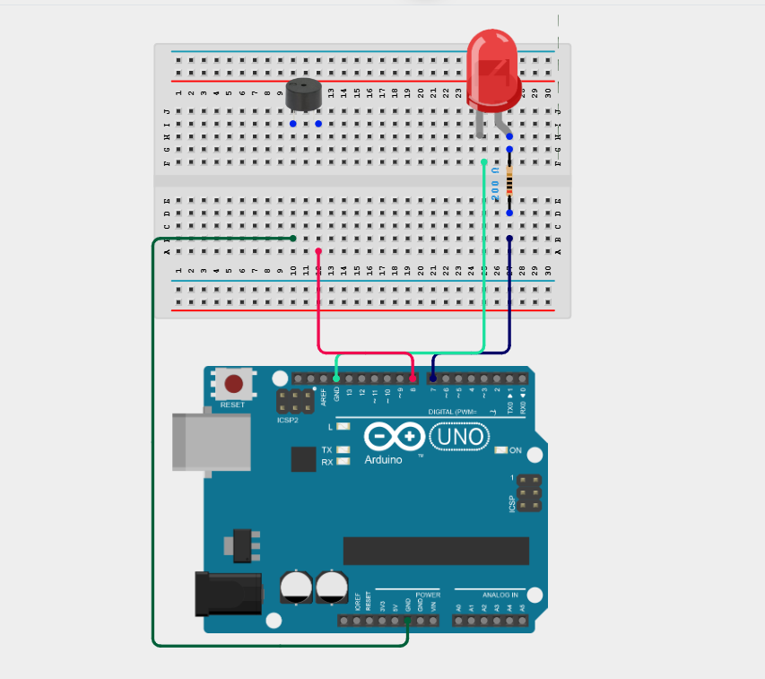
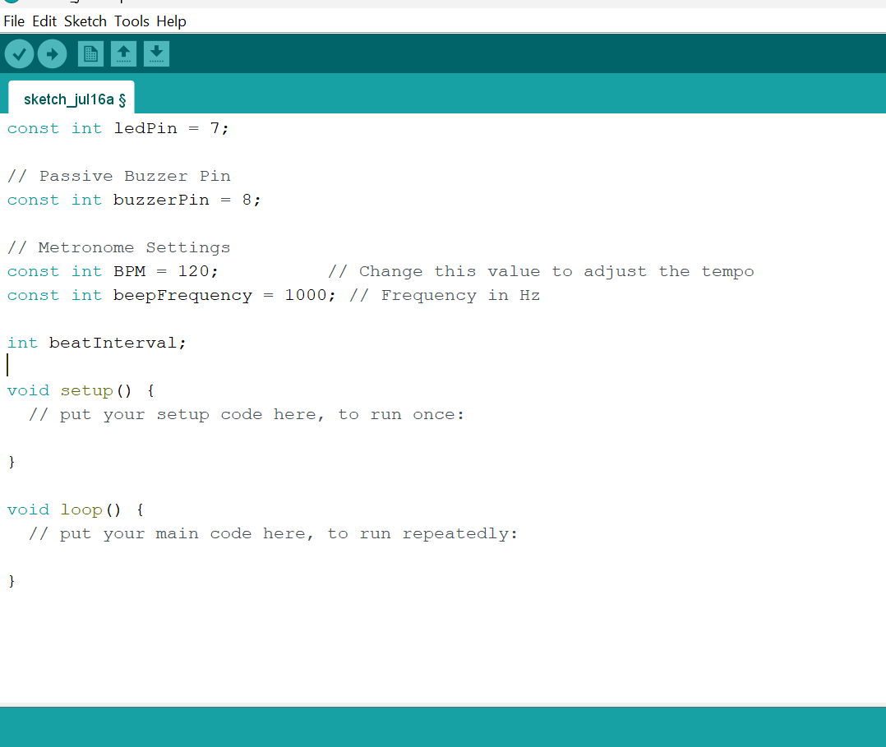
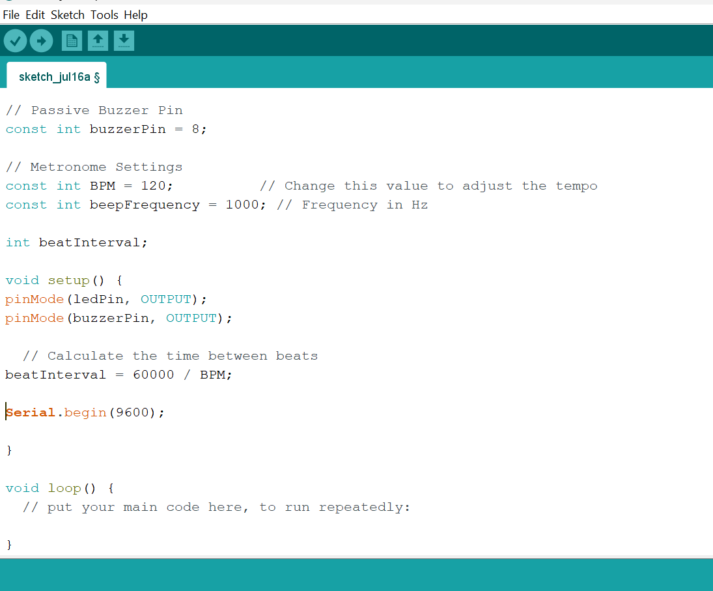
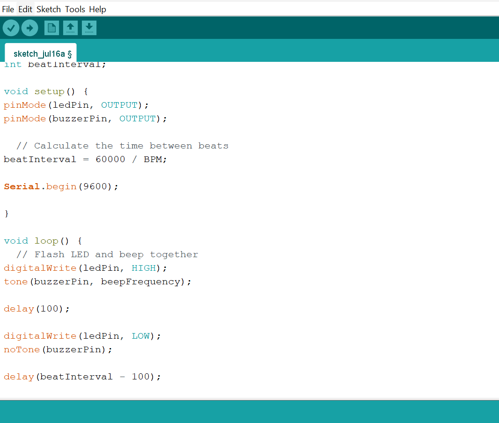

# Project 17: Heartbeat Sync Display

| **Description** | This project flashes an LED and beeps a buzzer synchronously at a configurable BPM rate. |
|------------------|----------------------------------------------------------------|
| **Use case**     | This project can be used in automation systems, interactive installations, and embedded control applications. |

## Components (Things You will need)

| | | | | | |
-------------------------|-------------------------|-------------------------|-------------------------|-------------------------|-------------------------|

## Building the circuit

Things Needed:

- Arduino Uno = 1
- Arduino USB cable = 1
- LED = 1
- Buzzer = 1
- Breadboard = 1
- Jumper wires 
- 220Ω resistor

## Mounting the component on the breadboard

**Step 1:** Place the Buzzer, LED, and the Resistor on the breadboard as shown in the circuit diagram.

_**NB:** Make sure all components are securely placed on the breadboard with correct orientation._

## WIRING THE CIRCUIT

**Step 2:** Connect the anode (long leg) of the LED to one end of a 220 Ω resistor. Connect the other end of the resistor to Digital Pin 7 on the Arduino using male-to-male jumper wire.

**Step 3:** Connect the cathode (short leg) of the LED to the GND pin on the Arduino using male-to-male jumper wire.

**Step 4:** Connect the positive (+) pin of the Buzzer to Digital Pin 8 on the Arduino using male-to-male jumper wire.

**Step 5:** Connect the negative (-) pin of the Buzzer to GND on the Arduino using male-to-male jumper wire.

_Make sure to connect the Arduino USB cable to the Arduino board._

## PROGRAMMING

**Step 1:** Open your Arduino IDE. See how to set up here: [Getting Started](../../Getting Started/Arduino_IDE_Setup.md).

**Step 2:** Type the following code in your Arduino IDE: `const int ledPin = 7;`, `const int buzzerPin = 8;`, `const int BPM = 120;`, `const int beepFrequency = 1000;`, `int beatInterval;` as shown in the image below.

**Step 3:** Type the following code in your Arduino IDE inside the void setup() `pinMode(ledPin, OUTPUT);`, `pinMode(buzzerPin, OUTPUT);`, `beatInterval = 60000 / BPM;`, `Serial.begin(9600);` as shown in the image below.

**Step 4:** Type the following code in your Arduino IDE inside the void loop() `digitalWrite(ledPin, HIGH);`, `tone(buzzerPin, beepFrequency);`, `delay(100);`, `digitalWrite(ledPin, LOW);`, `noTone(buzzerPin);`, `delay(beatInterval - 100);` as shown in the image below.

**Step 5:** Save your code. _See the [Getting Started](../../Getting Started/Arduino_IDE_Setup.md) section_

**Step 6:** Select the Arduino board and port. _See the [Getting Started](../../Getting Started/Arduino_IDE_Setup.md) section_

**Step 7:** Upload your code.

## CONCLUSION

This project helps learners understand how to combine multiple components with Arduino to create more complex interactive systems and automation solutions.

