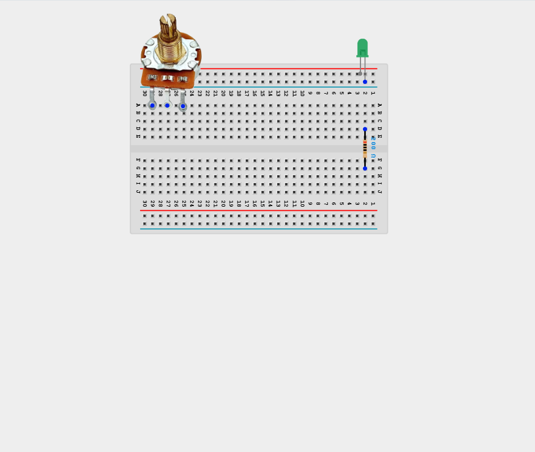
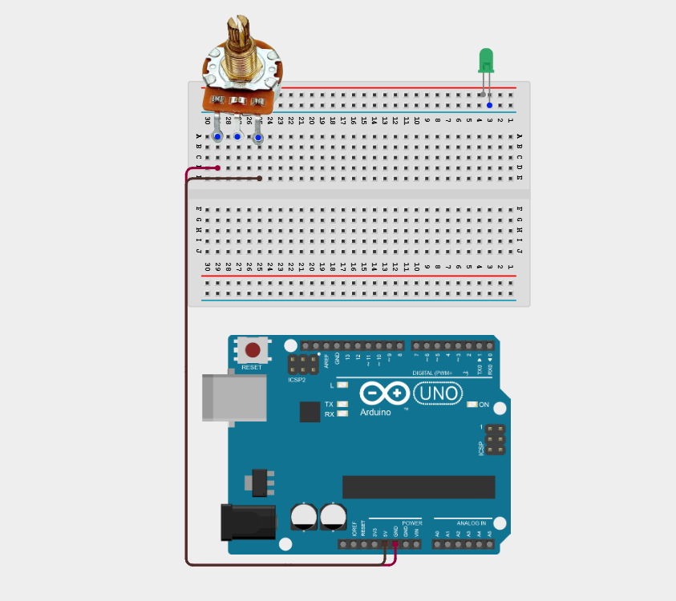
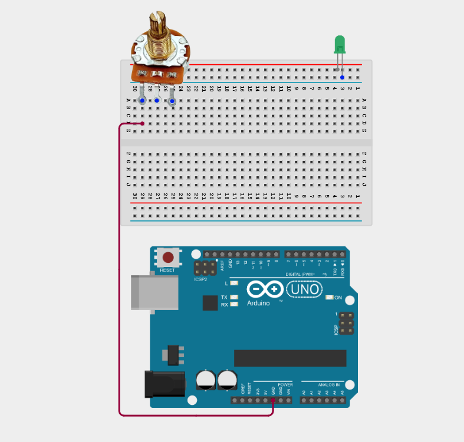
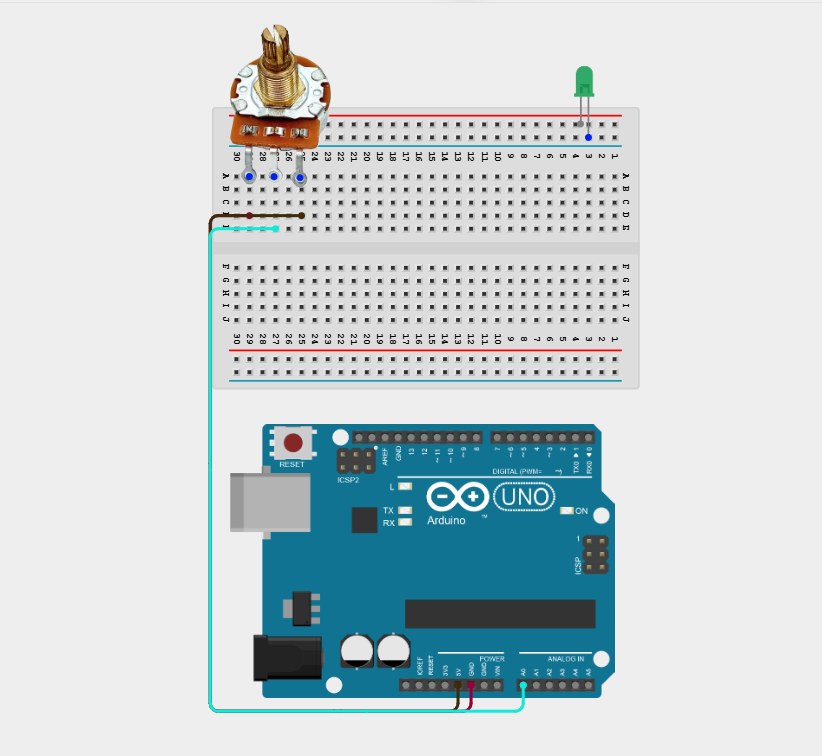
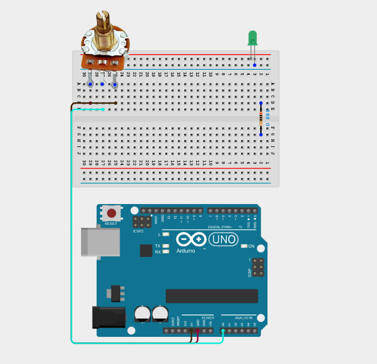
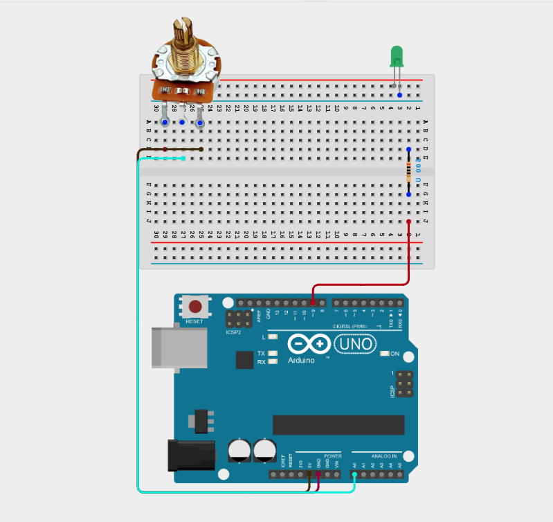
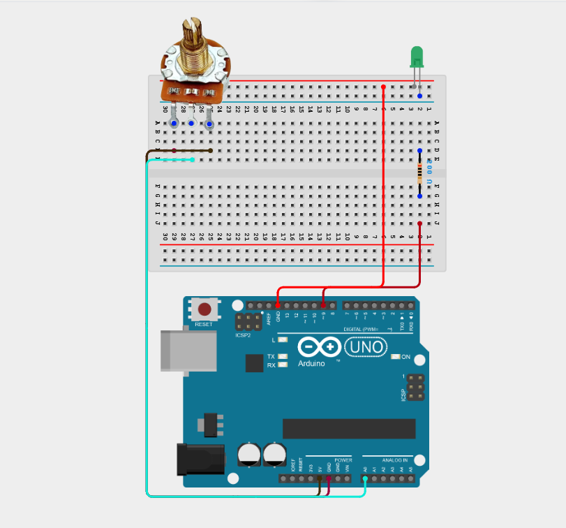
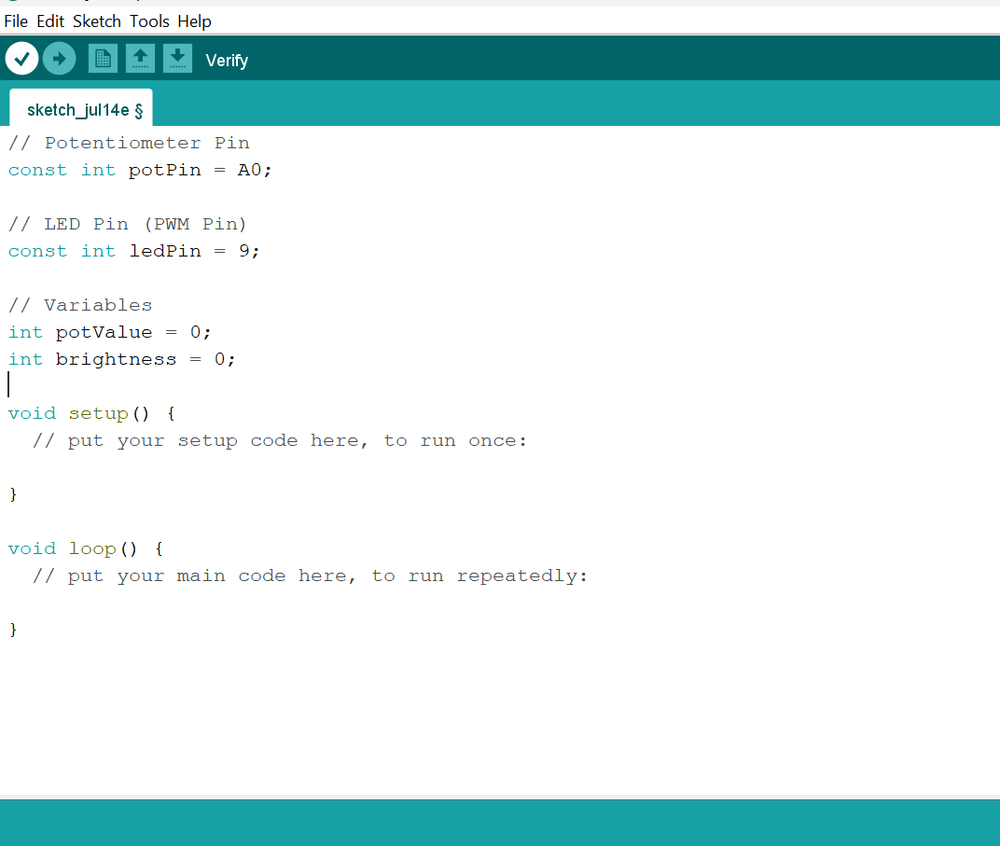
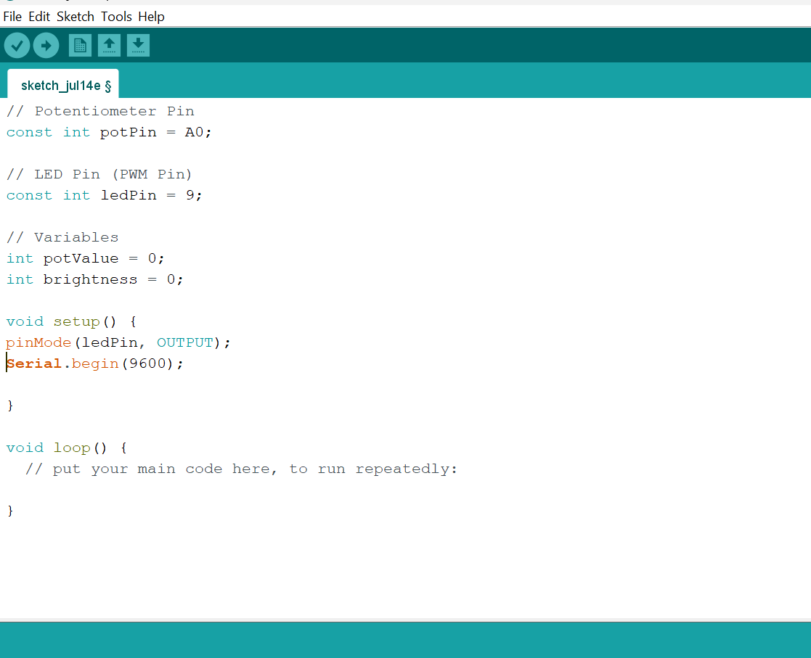
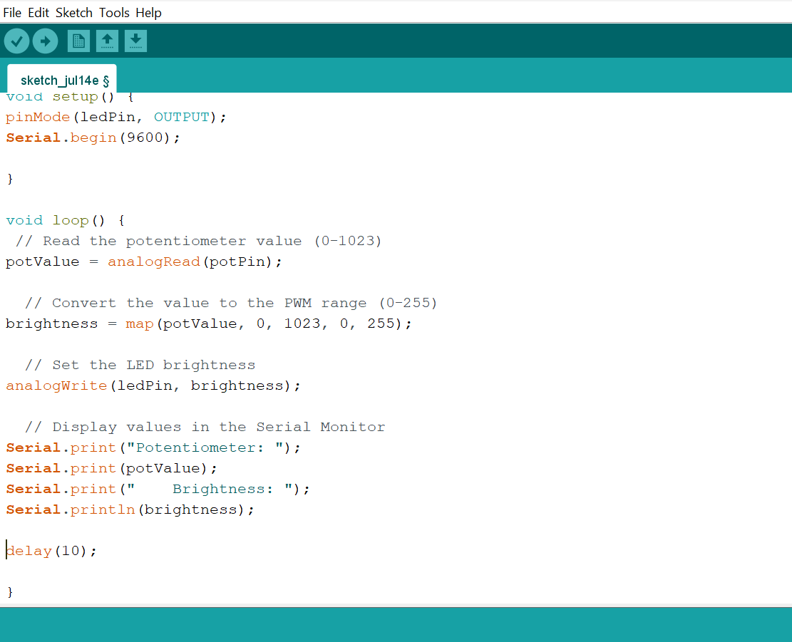

# Project 2.11.2: Potentiometer LED Dimmer

| **Description** | This project uses a potentiometer to control the brightness of an LED through PWM, creating a smooth dimming effect. |
|------------------|----------------------------------------------------------------|
| **Use case**     | This project can be used in automation systems, interactive installations, and embedded control applications. |

## Components (Things You will need)

|  |  |  |  |  |  |
|-------------------------|-------------------------|-------------------------|-------------------------|-------------------------|-------------------------|

## Building the circuit

Things Needed:

- Arduino Uno = 1
- Arduino USB cable = 1
- Potentiometer = 1
- LED = 1
- Breadboard = 1
- Jumper wires 

## Mounting the component on the breadboard

**Step 1:** Place the Potentiometer and the LED on the breadboard.

_**NB:** Make sure all components are securely placed on the breadboard with correct orientation._

## WIRING THE CIRCUIT

**Step 2:** Connect one outer pin of the Potentiometer to GND pin on the Arduino Uno using male-to-male jumper wires.

**Step 3:** Connect the other outer pin of the Potentiometer to 5V pin on the Arduino Uno using male-to-male jumper wires.

**Step 4:** Connect the middle pin of the Potentiometer to Analog pin A0 on the Arduino Uno using male-to-male jumper wires.

**Step 5:**Connect the anode (long leg) of the LED to one end of a 220 Ω resistor.

**Step 6:** Connect the other end of the resistor to Digital Pin 9 on the Arduino.

**Step 7:** Connect the cathode (short leg) of the LED to GND on the Arduino.

_Make sure to connect the Arduino USB cable to the Arduino board._

## PROGRAMMING

**Step 1:** Open your Arduino IDE. See how to set up here: [Getting Started](../../Getting Started/Arduino_IDE_Setup.md).

**Step 2:** Type the following code in your Arduino IDE: `const int potPin = A0;`, `const int soundPin = A0;`, `const int ledPin = 9;`, `int potValue = 0;`, `int brightness = 0;` as shown in the image below.

**Step 3:** Type the following code in your Arduino IDE: `pinMode(ledPin, OUTPUT);`, ` Serial.begin(9600);` as shown in the image below.

**Step 4:** Type the following code in your Arduino IDE inside the void setup() `pinMode(ledPin, OUTPUT);`, ` Serial.begin(9600);` as shown in the image below.

**Step 5:** Type the following code in your Arduino IDE inside the void loop() `potValue = analogRead(potPin);`, `brightness = map(potValue, 0, 1023, 0, 255);`,  `analogWrite(ledPin, brightness);`, `Serial.print("Potentiometer: ");`, `Serial.print(potValue);`, `Serial.print("    Brightness: ");`, `Serial.println(brightness);`, `delay(10);` as shown in the image below.

**Step 6:** Save your code. _See the [Getting Started](../../Getting Started/Arduino_IDE_Setup.md) section_

**Step 7:** Select the Arduino board and port. _See the [Getting Started](../../Getting Started/Arduino_IDE_Setup.md) section_

**Step 8:** Upload your code.

## CONCLUSION

This project helps learners understand how to combine multiple components with Arduino to create more complex interactive systems and automation solutions.

