# Project 2.11.3: Manual Traffic Speed Dial

| **Description** | This project uses a potentiometer to control the cycling speed of a Traffic Light Module, allowing the user to speed up or slow down the light sequence in real-time. |
|------------------|----------------------------------------------------------------|
| **Use case**     | This project can be used in automation systems, interactive installations, and embedded control applications. |

## Components (Things You will need)

| | | | | | |
|-------------------------|-------------------------|-------------------------|-------------------------|-------------------------|-------------------------|

## Building the circuit

Things Needed:

- Arduino Uno = 1
- Arduino USB cable = 1
- Potentiometer = 1
- Traffic light module = 1
- Breadboard = 1
- Jumper wires 

## Mounting the component on the breadboard

**Step 1:** Place the Potentiometer and the Traffic Light Module on the breadboard.

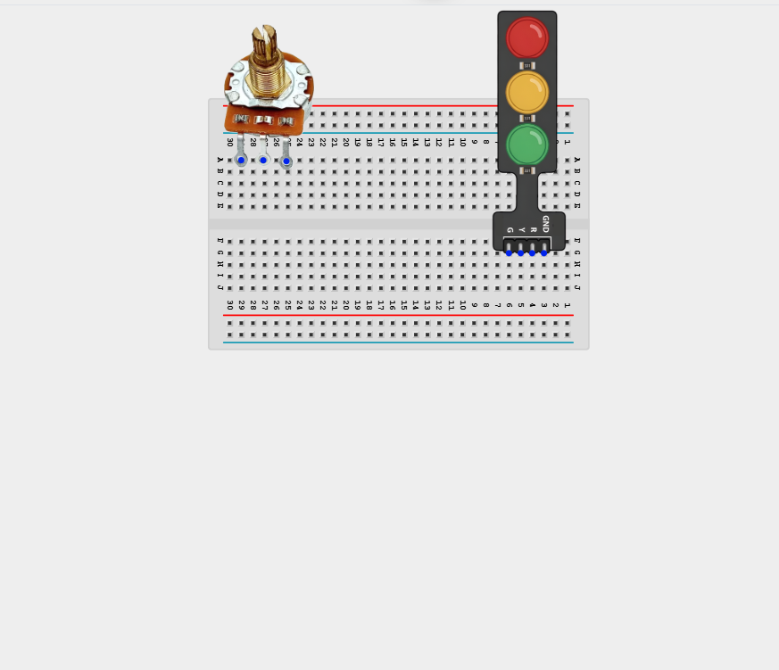

_**NB:** Make sure all components are securely placed on the breadboard with correct orientation._

## WIRING THE CIRCUIT

**Step 2:** Connect one outer pin of the Potentiometer to GND pin on the Arduino Uno using male-to-male jumper wires.

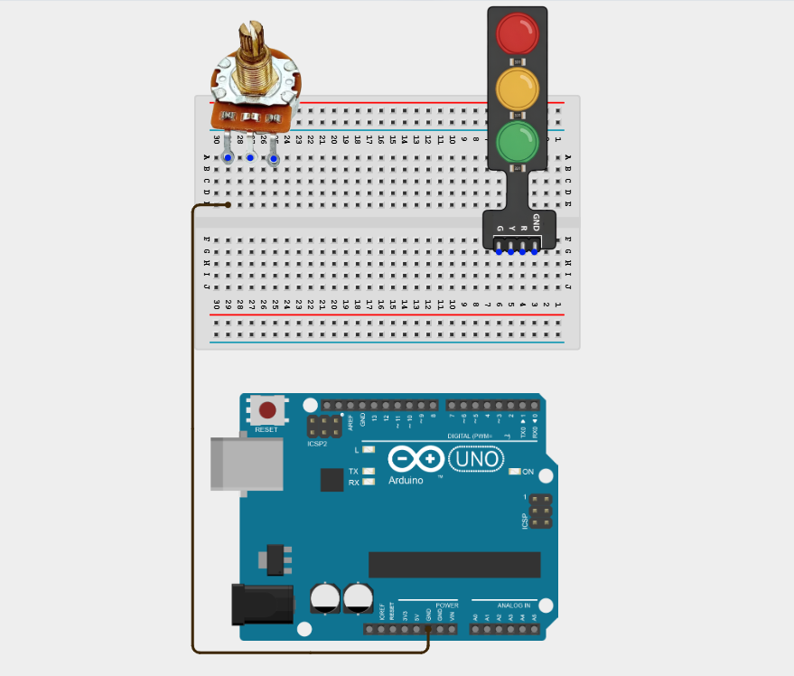

**Step 3:** Connect the other outer pin of the Potentiometer to 5V pin on the Arduino Uno using male-to-male jumper wires.

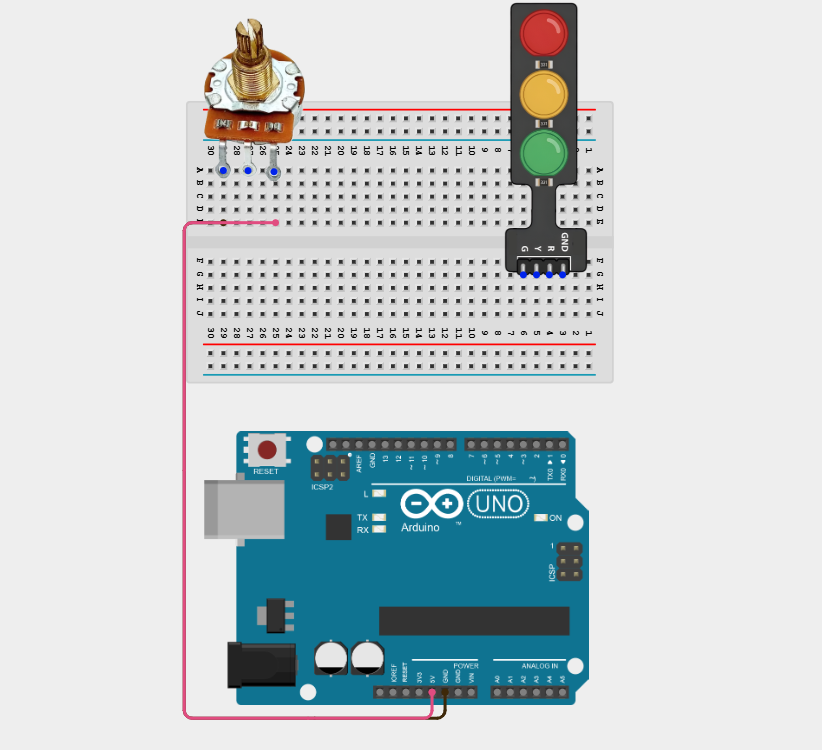

**Step 4:** Connect the middle pin of the Potentiometer to Analog pin A0 on the Arduino Uno using male-to-male jumper wires.

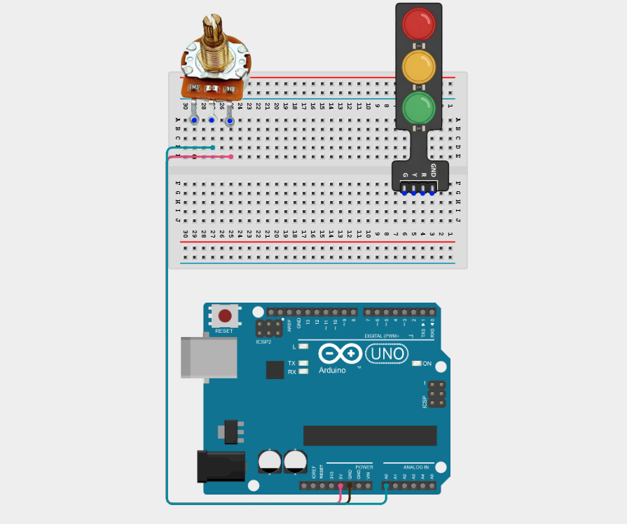

**Step 5:** Connect the Green LED (G) of the Traffic Light Module pin to Digital Pin 4 on the Arduino Uno using male-to-male jumper wires.

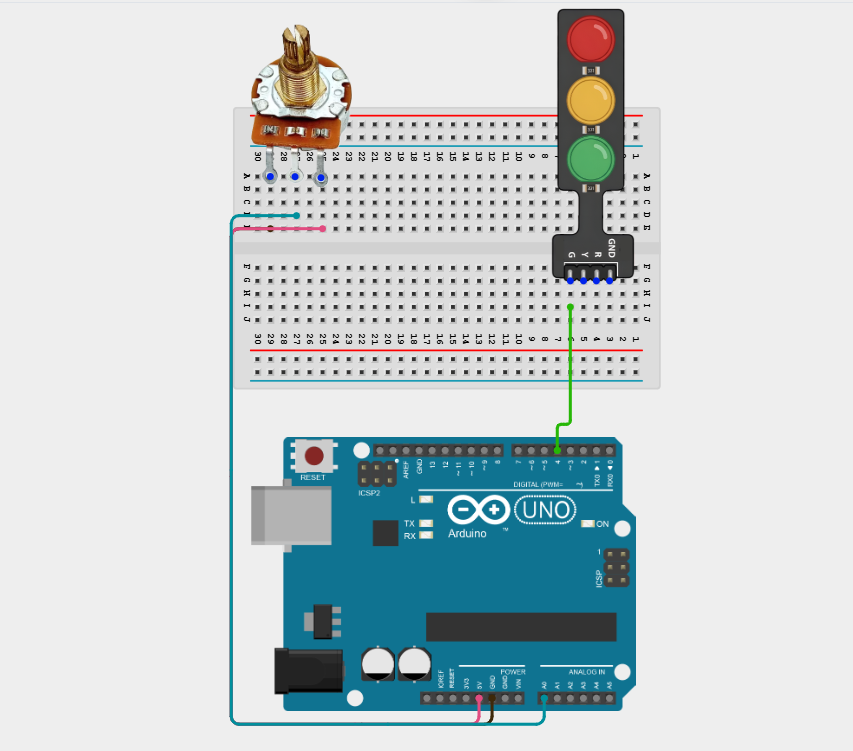

**Step 6:** Connect the Yellow LED (Y) of the Traffic Light Module pin to Digital Pin 5 on the Arduino Uno using male-to-male jumper wires.

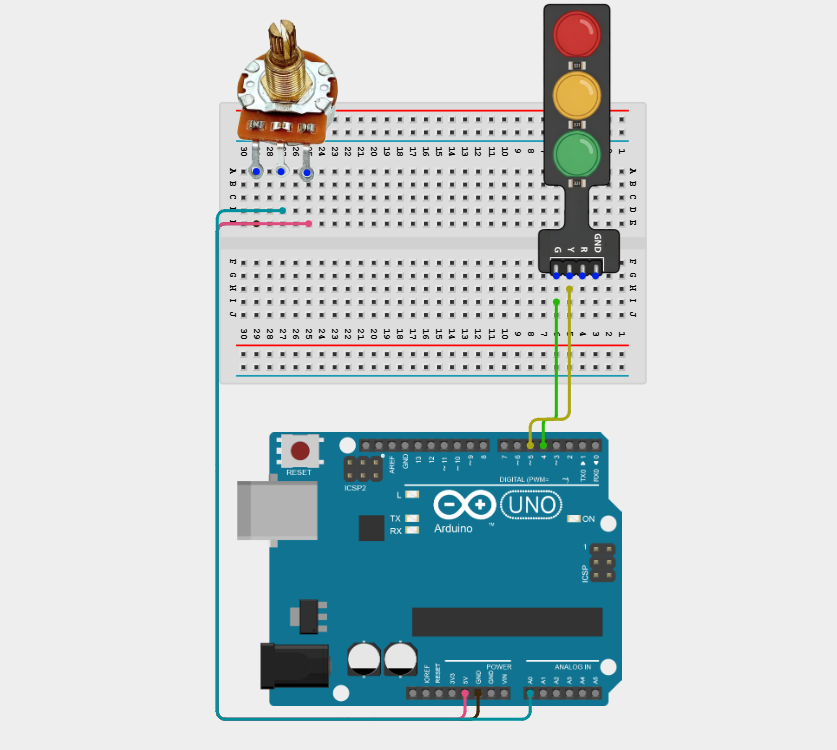

**Step 7:** Connect the Red LED (R) of the Traffic Light Module pin to Digital Pin 6 on the Arduino Uno using male-to-male jumper wires.

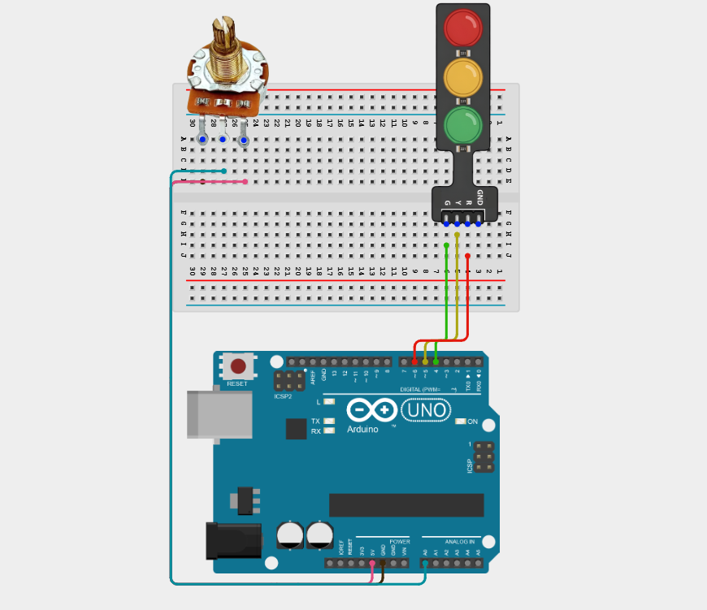

**Step 8:** Connect the GND of the Traffic Light Module pin to GND on the Arduino Uno using male-to-male jumper wires.

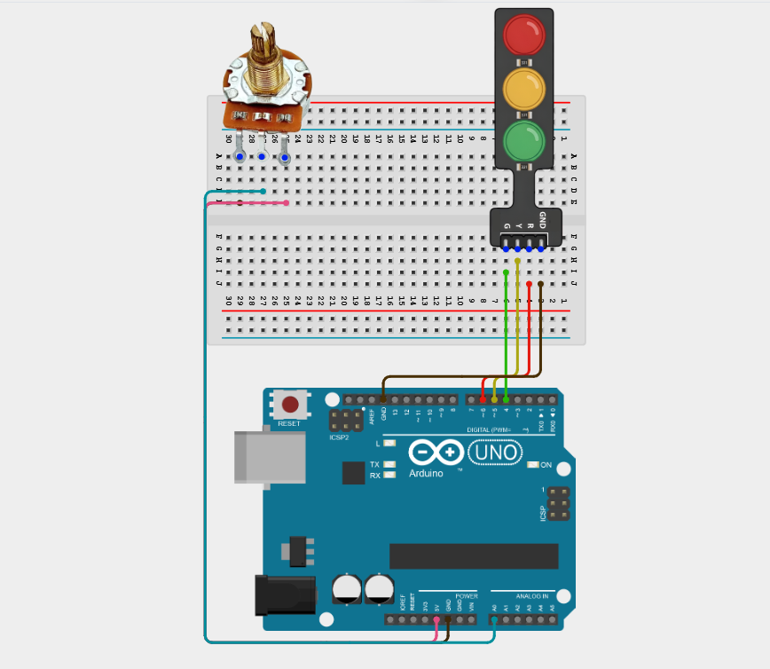

_Make sure to connect the Arduino USB cable to the Arduino board._

## PROGRAMMING

**Step 1:** Open your Arduino IDE. See how to set up here: [Getting Started](../../Getting Started/Arduino_IDE_Setup.md).

**Step 2:** Type the following code in your Arduino IDE: `const int potPin = A0;`, `const int greenLED = 4;`, `const int yellowLED = 5;`, `const int redLED = 6;`, `int potValue;`, `int delayTime;` as shown in the image below.

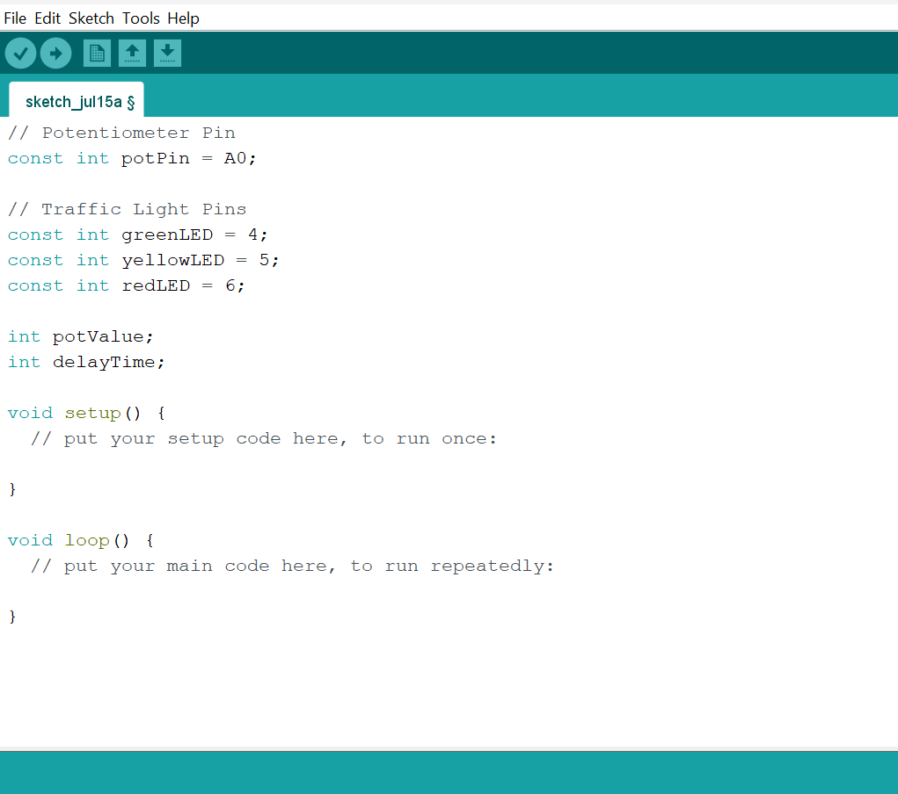

**Step 3:** Type the following code in your Arduino IDE inside the void setup() `pinMode(greenLED, OUTPUT);`, `pinMode(yellowLED, OUTPUT);`, `pinMode(redLED, OUTPUT);`, `Serial.begin(9600);` as shown in the image below.

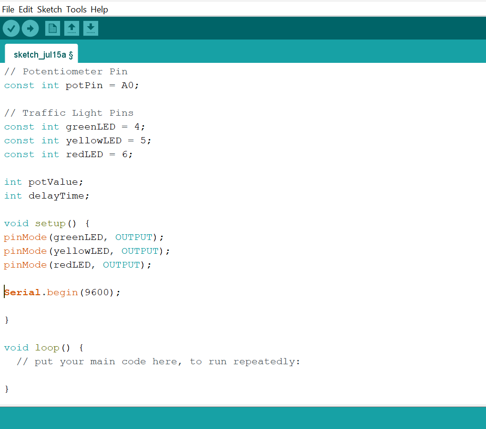

**Step 4:** Type the following code in your Arduino IDE inside the void loop() `potValue = analogRead(potPin);`, `delayTime = map(potValue, 0, 1023, 200, 2000);`, `Serial.print("Delay Time: ");`, `Serial.print(delayTime);`, `Serial.println(" ms");` as shown in the image below.  

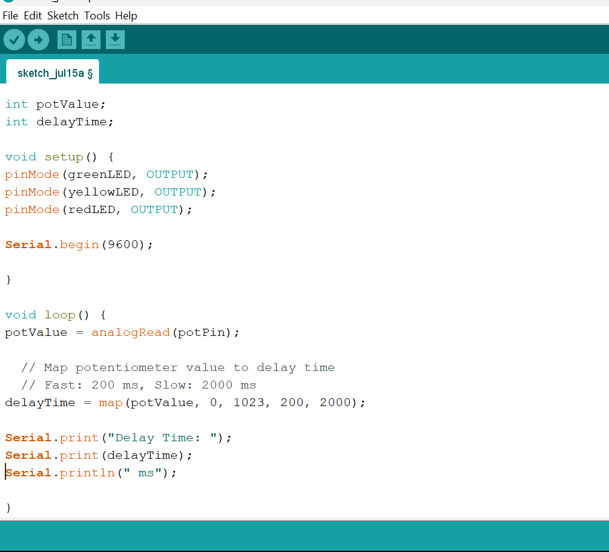

**Step 5:** Type the following code in your Arduino IDE inside the void loop() `digitalWrite(greenLED, HIGH);`, `digitalWrite(yellowLED, LOW);`, `digitalWrite(redLED, LOW);`, `delay(delayTime);` as shown in the image below. 

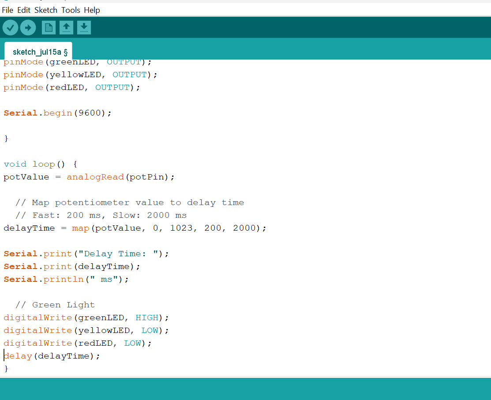

**Step 6:** Type the following code in your Arduino IDE inside the void loop() `digitalWrite(greenLED, LOW);`, `digitalWrite(yellowLED, HIGH);`, `digitalWrite(redLED, LOW);`, `delay(delayTime);` as shown in the image below. 

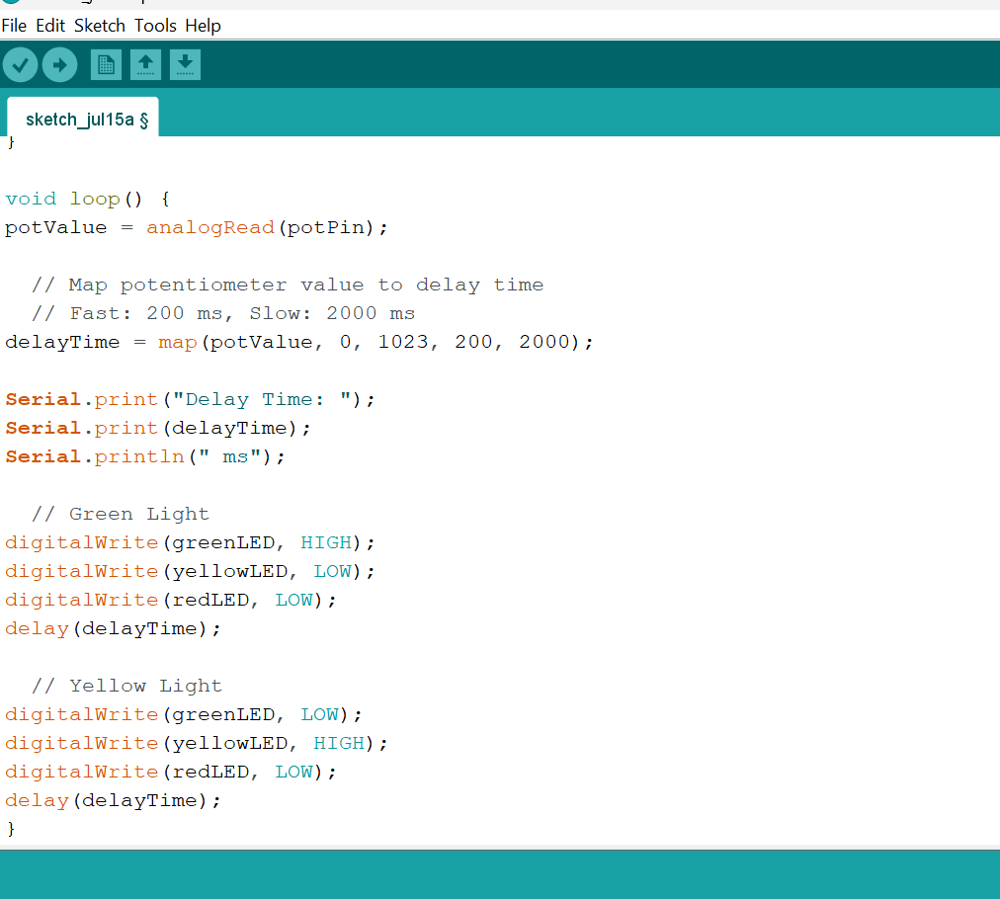

**Step 7:** Type the following code in your Arduino IDE inside the void loop() `digitalWrite(greenLED, LOW);`, `digitalWrite(yellowLED, LOW);`, `digitalWrite(redLED, HIGH);`, `delay(delayTime);` as shown in the image below. 

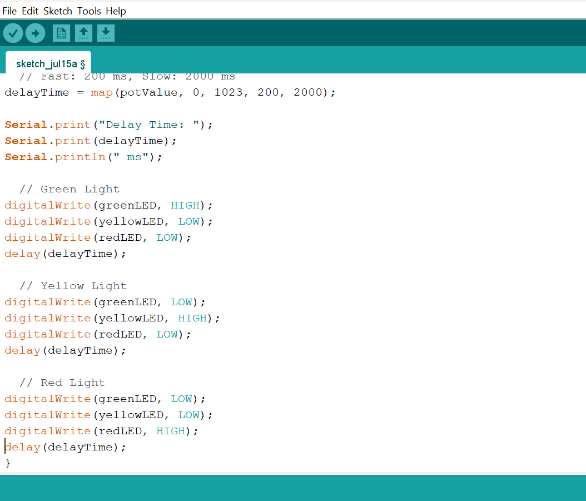

**Step 8:** Save your code. _See the [Getting Started](../../Getting Started/Arduino_IDE_Setup.md) section_

**Step 9:** Select the Arduino board and port. _See the [Getting Started](../../Getting Started/Arduino_IDE_Setup.md) section_

**Step 10:** Upload your code.

## CONCLUSION

This project helps learners understand how to combine multiple components with Arduino to create more complex interactive systems and automation solutions.

