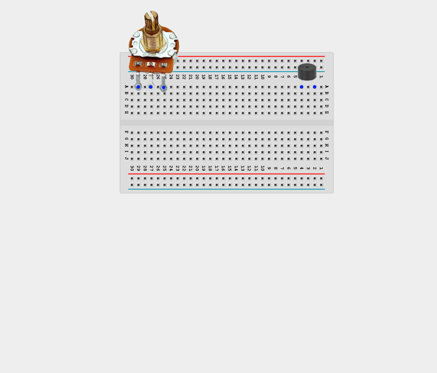
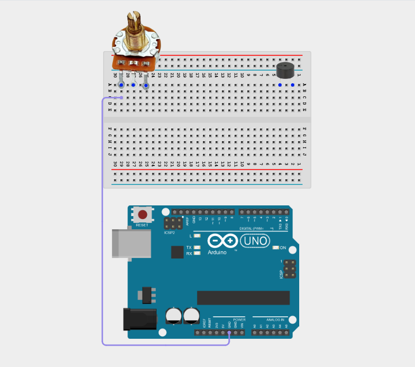
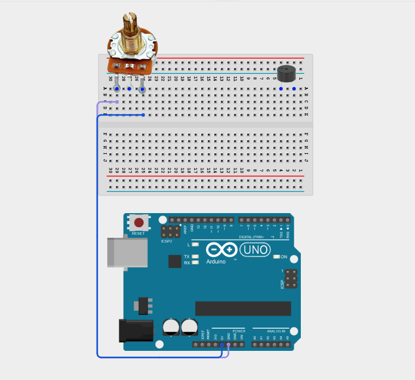
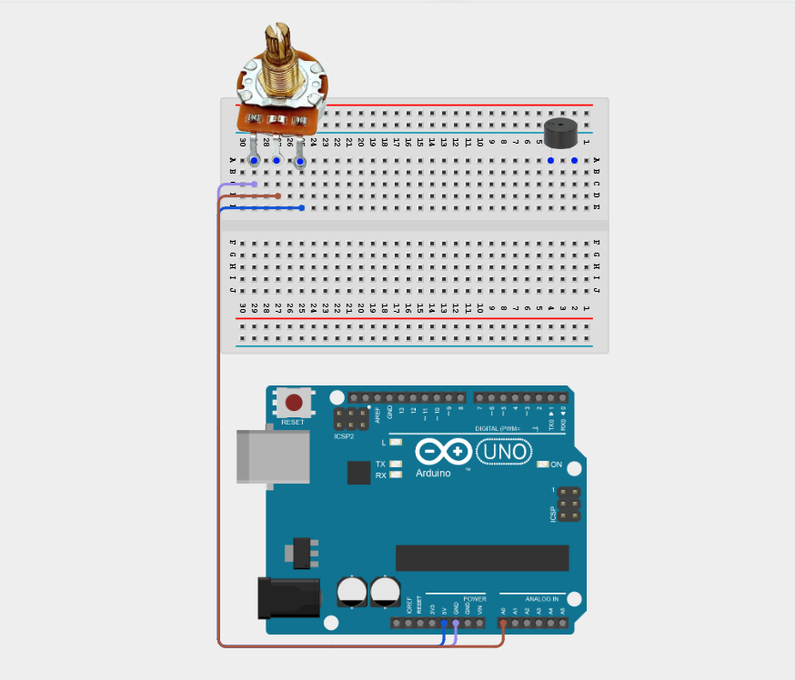
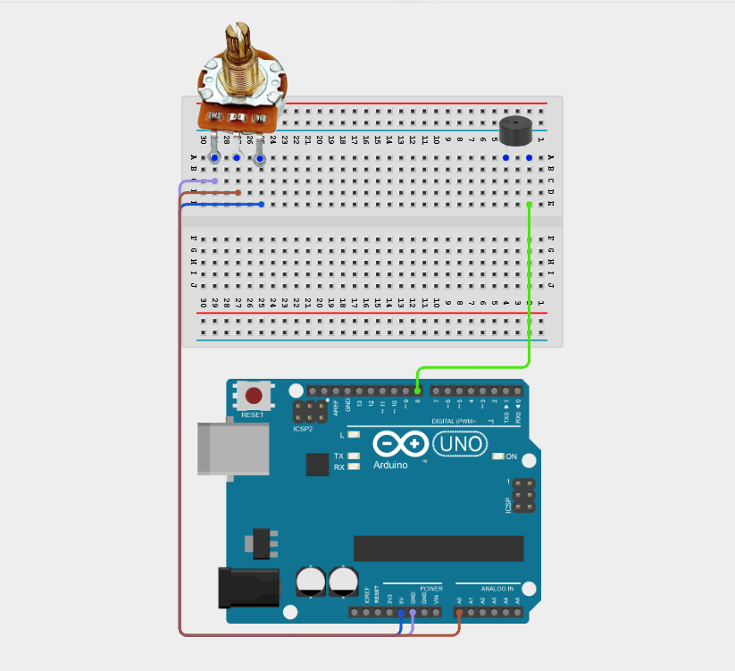
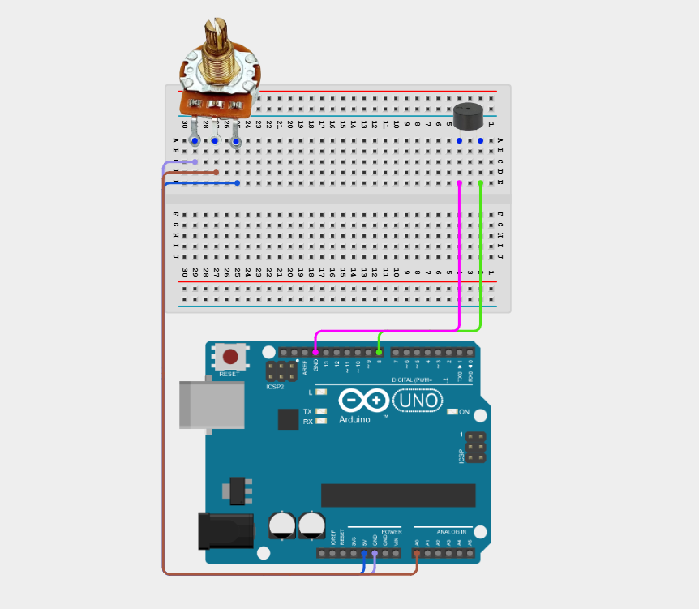
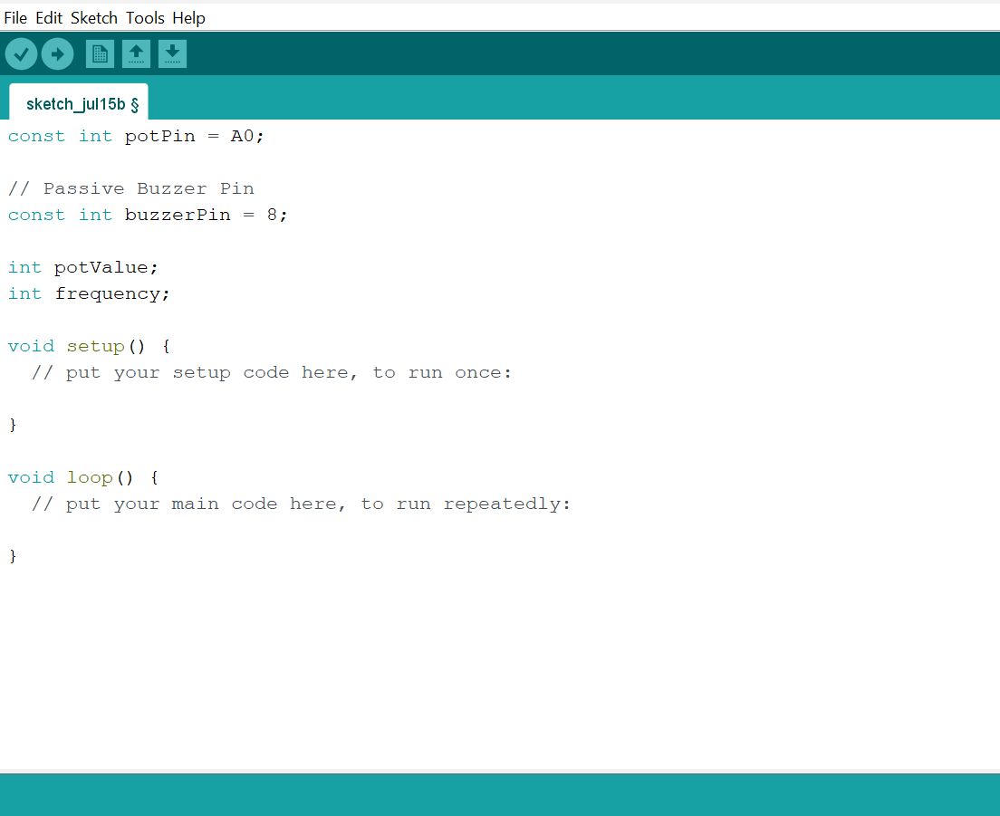
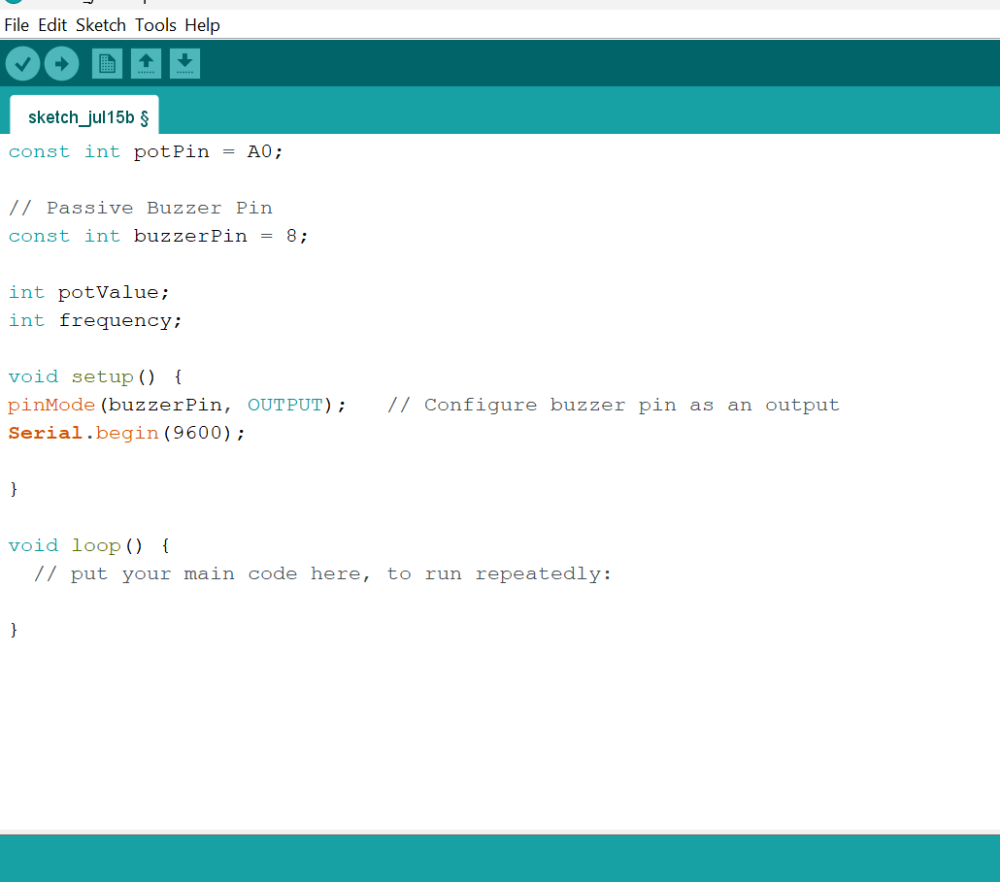
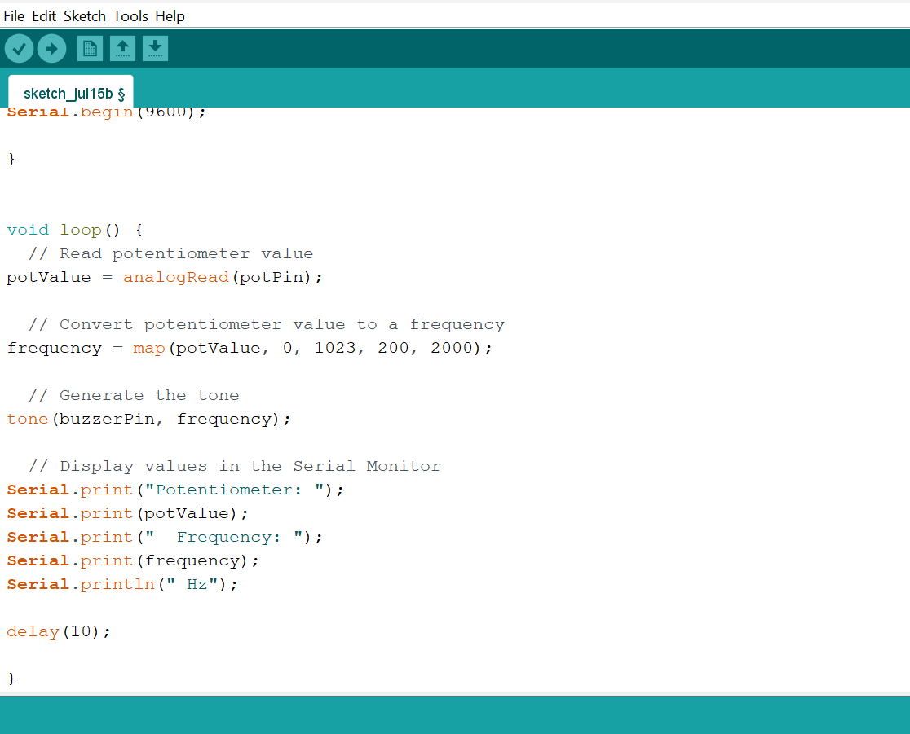

# Project 2.11.4: Potentiometer Frequency Theremin

| **Description** | This project uses a potentiometer to control the pitch of a buzzer, creating a theremin-like musical instrument that produces different tones as the dial is turned. |
|------------------|----------------------------------------------------------------|
| **Use case**     | This project can be used in automation systems, interactive installations, and embedded control applications. |

## Components (Things You will need)

| | | | | | |
|-------------------------|-------------------------|-------------------------|-------------------------|-------------------------|-------------------------|

## Building the circuit

Things Needed:

- Arduino Uno = 1
- Arduino USB cable = 1
- Potentiometer = 1
- Buzzer = 1
-  Breadboard = 1
- Jumper wires 

## Mounting the component on the breadboard

**Step 1:** Place the Potentiometer and the Buzzer on the breadboard.

_**NB:** Make sure all components are securely placed on the breadboard with correct orientation._

## WIRING THE CIRCUIT

**Step 2:**  Connect one outer pin of the Potentiometer to GND pin on the Arduino Uno using male-to-male jumper wires.

**Step 3:**  Connect the other outer pin of the Potentiometer to 5V pin on the Arduino Uno using male-to-male jumper wires.

**Step 4:**  Connect the middle pin of the Potentiometer to Analog pin A0 on the Arduino Uno using male-to-male jumper wires.

**Step 5:**  Connect the positive (+) pin of the Buzzer to Digital pin 8 on the Arduino Uno using male-to-male jumper wires.

**Step 6:**  Connect the GND pin of the Buzzer to GND pin on the Arduino Uno using male-to-male jumper wires.

_Make sure to connect the Arduino USB cable to the Arduino board._

## PROGRAMMING

**Step 1:** Open your Arduino IDE. See how to set up here: [Getting Started](../../Getting Started/Arduino_IDE_Setup.md).

**Step 2:** Type the following code in your Arduino IDE: `const int potPin = A0;`, `const int buzzerPin = 8;`, `int potValue;`, `int frequency;` as shown in the image below.

**Step 3:** Type the following code in your Arduino IDE inside the void setup() `pinMode(buzzerPin, OUTPUT);`, `Serial.begin(9600);` as shown in the image below.

**Step 4:** Type the following code in your Arduino IDE inside the void loop() `potValue = analogRead(potPin);`, `frequency = map(potValue, 0, 1023, 200, 2000);`, `tone(buzzerPin, frequency);`, `Serial.print("Potentiometer: ");`, `Serial.print(potValue);`, `Serial.print("  Frequency: ");`, `Serial.print(frequency);`,`Serial.println(" Hz");`, `delay(10);` as shown in the image below.

**Step 5:** Save your code. _See the [Getting Started](../../Getting Started/Arduino_IDE_Setup.md) section_

**Step 6:** Select the Arduino board and port. _See the [Getting Started](../../Getting Started/Arduino_IDE_Setup.md) section_

**Step 7:** Upload your code.

## CONCLUSION

This project helps learners understand how to combine multiple components with Arduino to create more complex interactive systems and automation solutions.

