# Project 2.11.5: Potentiometer Servo Link

| **Description** | This project uses a potentiometer to control the angular position of a servo motor from 0 to 180 degrees, providing precise manual positioning control. |
|------------------|----------------------------------------------------------------|
| **Use case**     | This project can be used in automation systems, interactive installations, and embedded control applications. |

## Components (Things You will need)

| | | | | | |
|-------------------------|-------------------------|-------------------------|-------------------------|-------------------------|-------------------------|

## Building the circuit

Things Needed:

- Arduino Uno = 1
- Arduino USB cable = 1
- Potentiometer = 1
- Servo motor = 1
- Breadboard = 1
- Jumper wires 

## Mounting the component on the breadboard

**Step 1:** Place the Potentiometer on the breadboard.

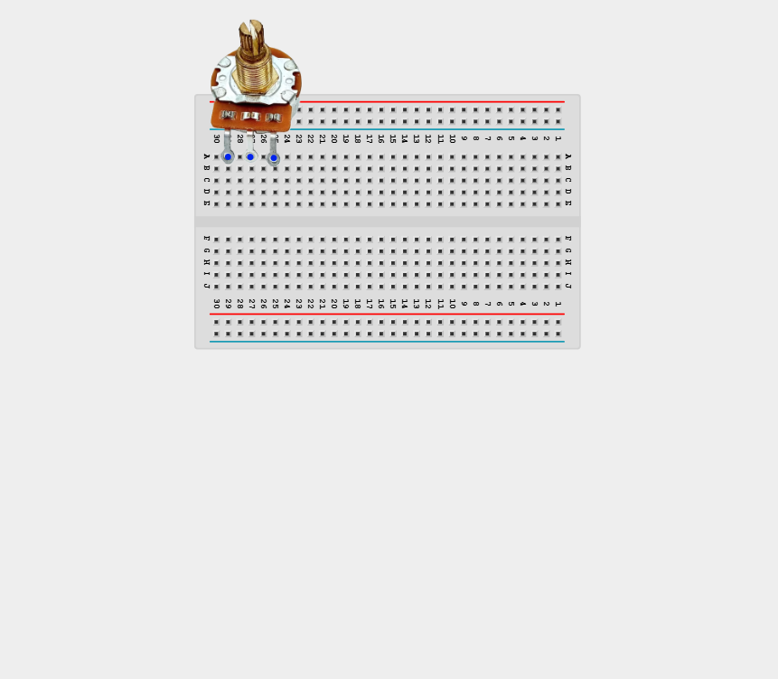

_**NB:** Make sure all components are securely placed on the breadboard with correct orientation._

## WIRING THE CIRCUIT

**Step 2:** Connect the 5V pin on the Arduino to the positive (+) power rail of the breadboard using male-to-male jumper wires.

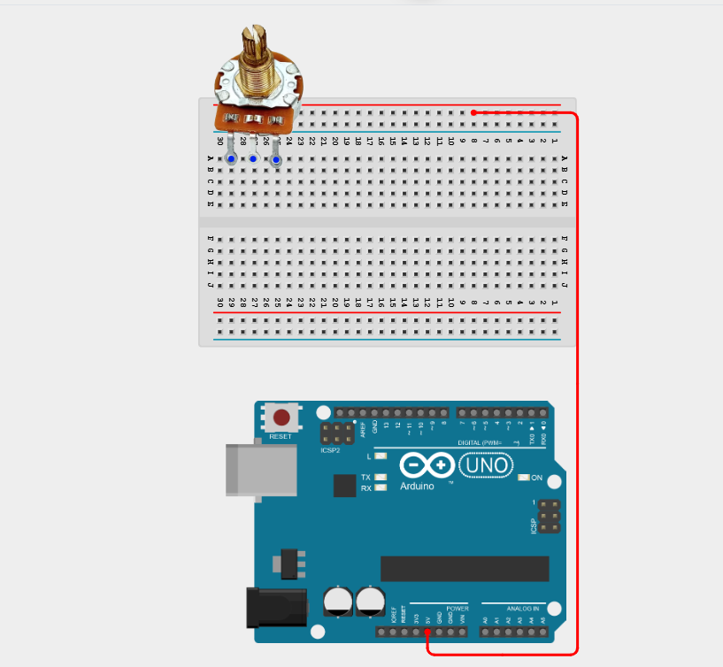

**Step 3:** Connect the GND pin on the Arduino to the negative (–) power rail of the breadboard using male-to-male jumper wires.

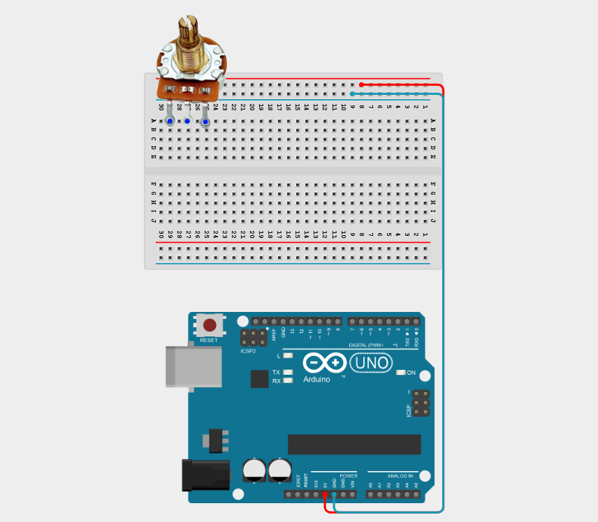

_The power rails will now supply power to multiple components._

**Step 4:** Connect one outer pin of the Potentiometer to the GND (-) rail on the Breadboard using male-to-male jumper wire.

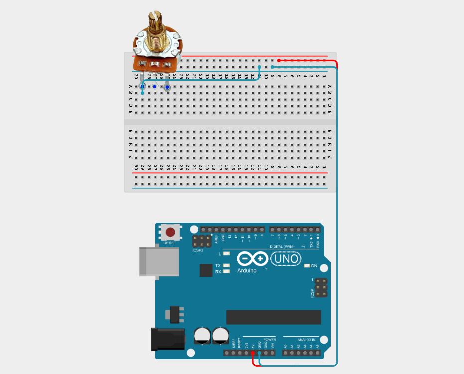

**Step 5:** Connect the other outer pin of the Potentiometer to the 5V (+) rail on the Breadboard using male-to-male jumper wire.
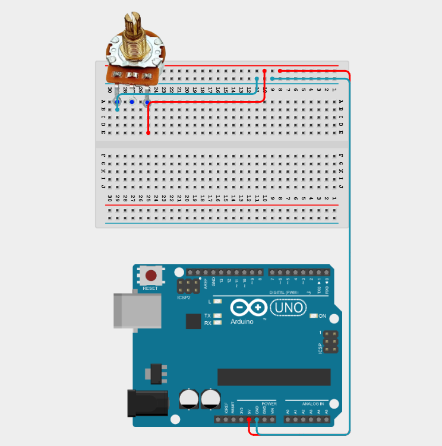

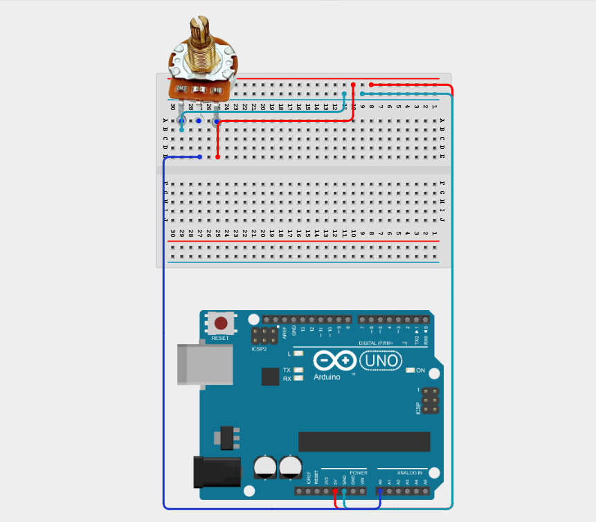

**Step 6:** Connect the middle pin of the Potentiometer to Analog Pin A0 on the Arduino using male-to-male jumper wire.

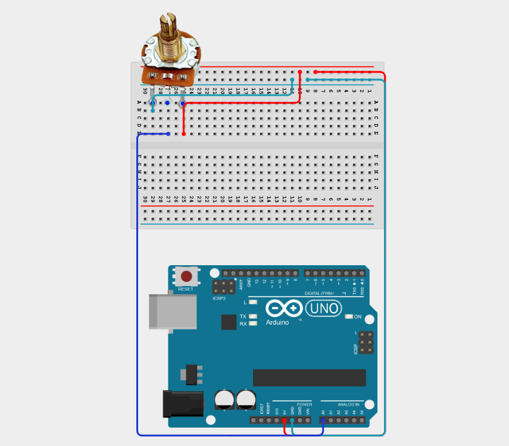

**Step 7:** Connect the Signal (Orange/Yellow)  of the Servo Motor to Digital Pin 9 on the Arduino using male-to-male jumper wire.

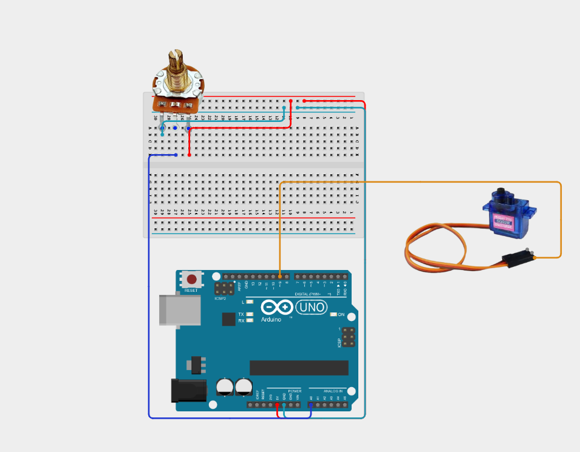

**Step 8:** Connect the VCC (Red) wire of the Servo Motor to the 5V (+) rail on the breadboard using male-to-male jumper wire.

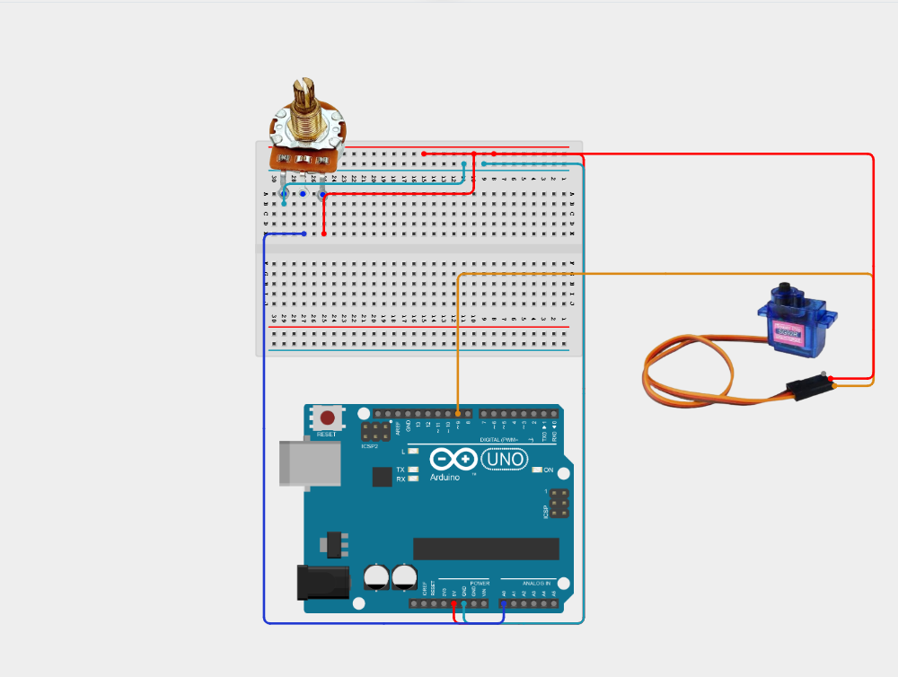

**Step 9:** Connect the GND (Brown/Black) wire to the GND (-) rail on the breadboard using male-to-male jumper wire.

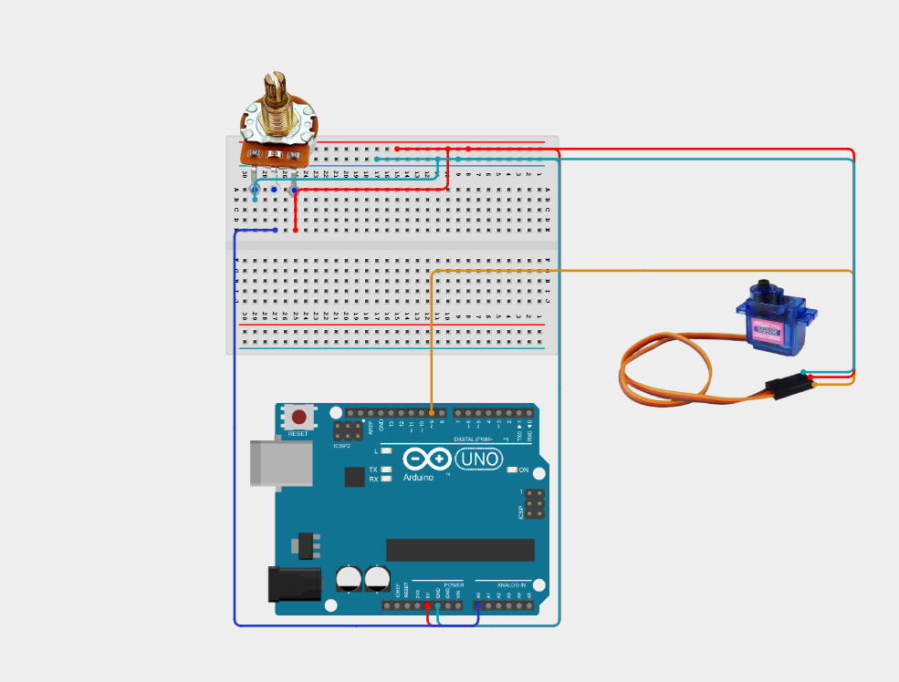

_Make sure to connect the Arduino USB cable to the Arduino board. Place the Servo Blade firmly on the Servo Motor._

## PROGRAMMING

**Step 1:** Open your Arduino IDE. See how to set up here: [Getting Started](../../Getting Started/Arduino_IDE_Setup.md).

**Step 2:** Type the following code in your Arduino IDE: `#include <Servo.h>`,`const int potPin = A0;`, `const int servoPin = 9;`, `Servo myServo;`, `int potValue;`, `int servoAngle;` as shown in the image below.

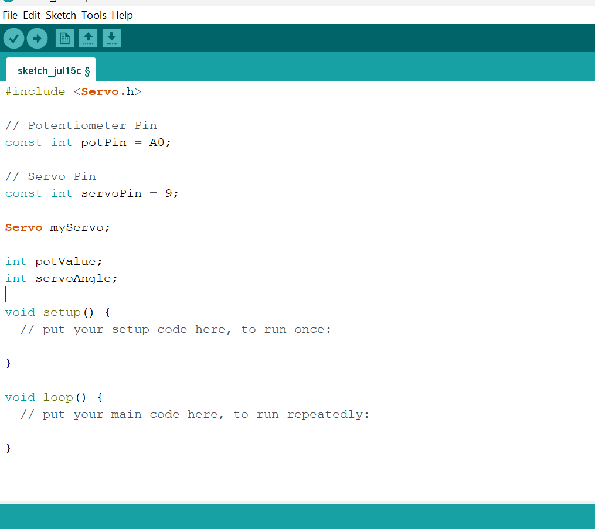

**Step 3:** Type the following code in your Arduino inside the void setup() `myServo.attach(servoPin);`,`Serial.begin(9600);` as shown in the image below.

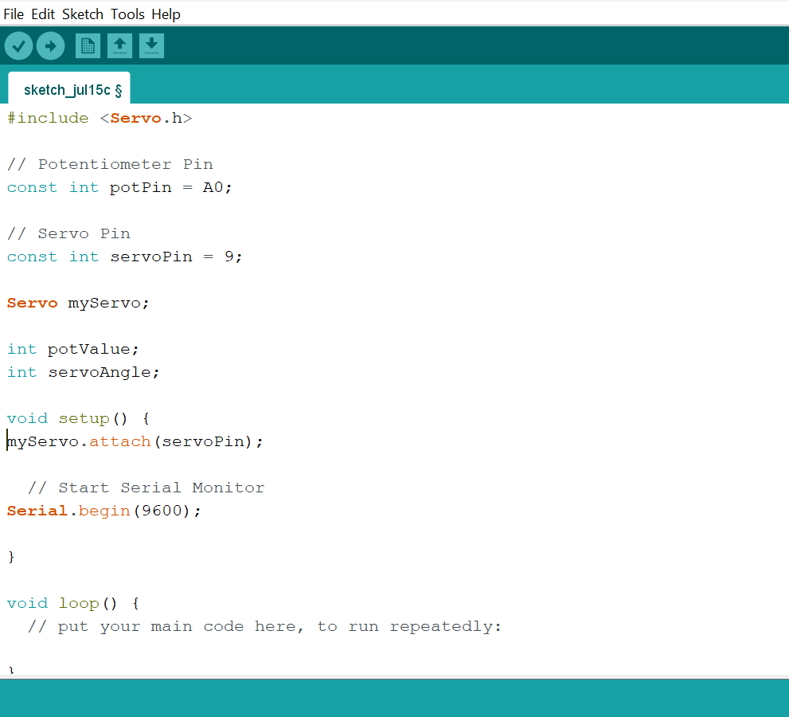

**Step 4:** Type the following code in your Arduino IDE: `potValue = analogRead(potPin);`, `servoAngle = map(potValue, 0, 1023, 0, 180);`, `myServo.write(servoAngle);`, `Serial.print("Potentiometer: ");`, `Serial.print(potValue);`, `Serial.print("    Servo Angle: ");`, `Serial.print(servoAngle);`, `Serial.println("°");`, `delay(15);` as shown in the image below.
  
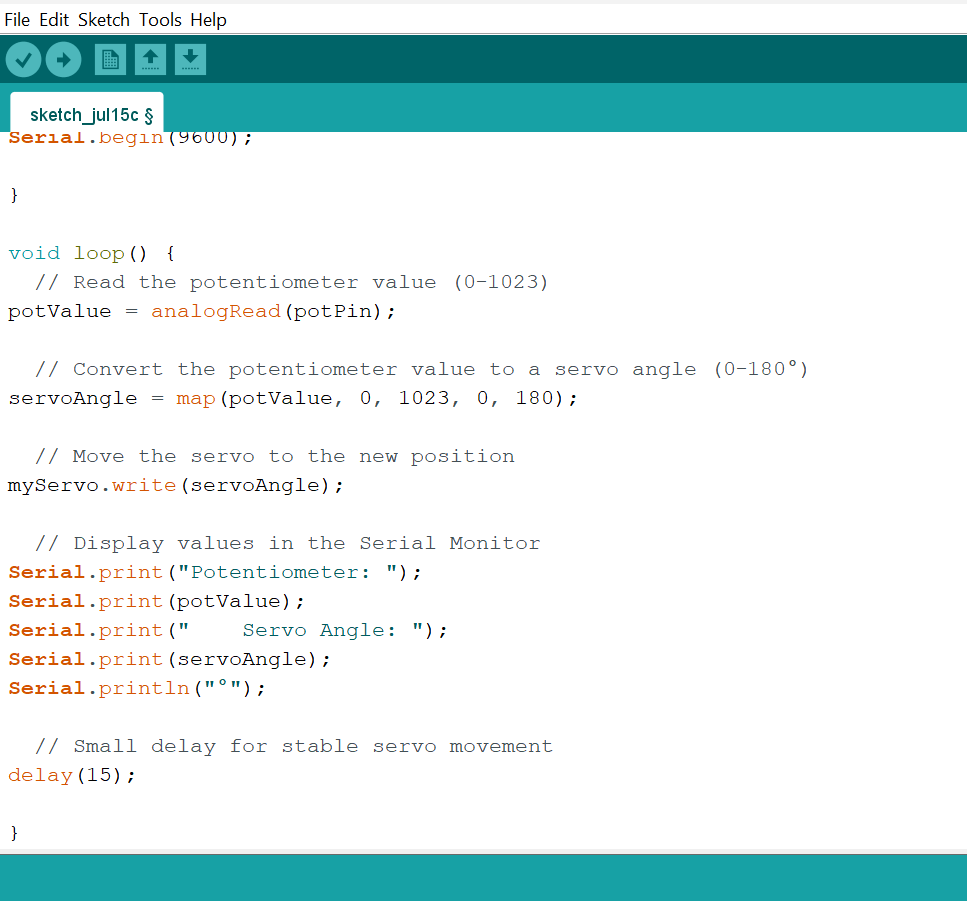

**Step 5:** Save your code. _See the [Getting Started](../../Getting Started/Arduino_IDE_Setup.md) section_

**Step 6:** Select the Arduino board and port. _See the [Getting Started](../../Getting Started/Arduino_IDE_Setup.md) section_

**Step 7:** Upload your code.

## CONCLUSION

This project helps learners understand how to combine multiple components with Arduino to create more complex interactive systems and automation solutions.

