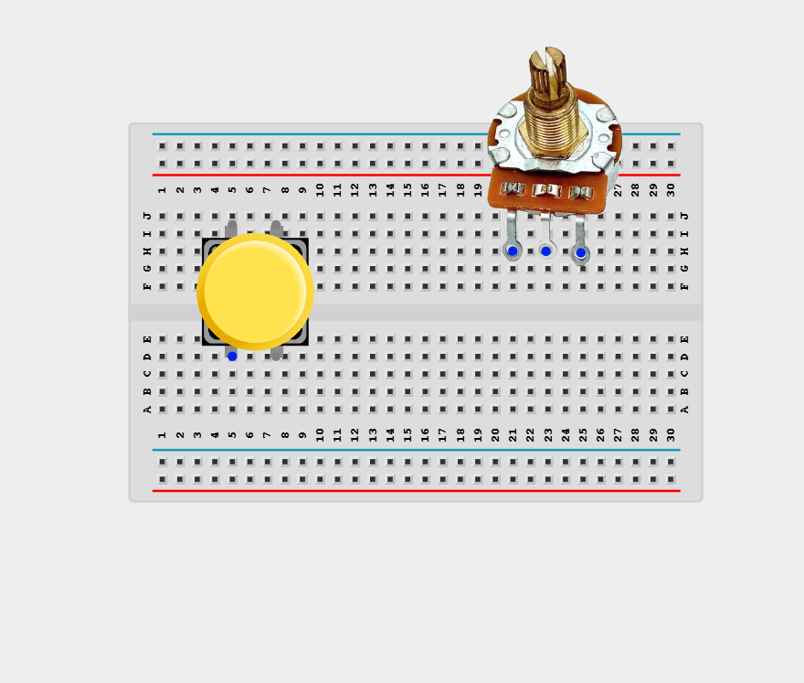
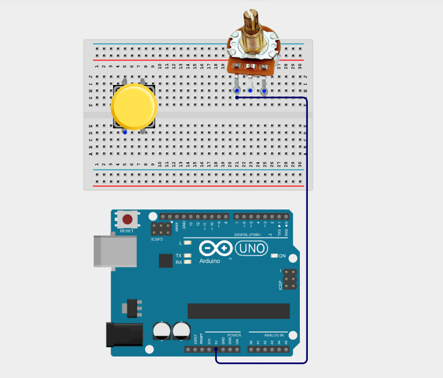
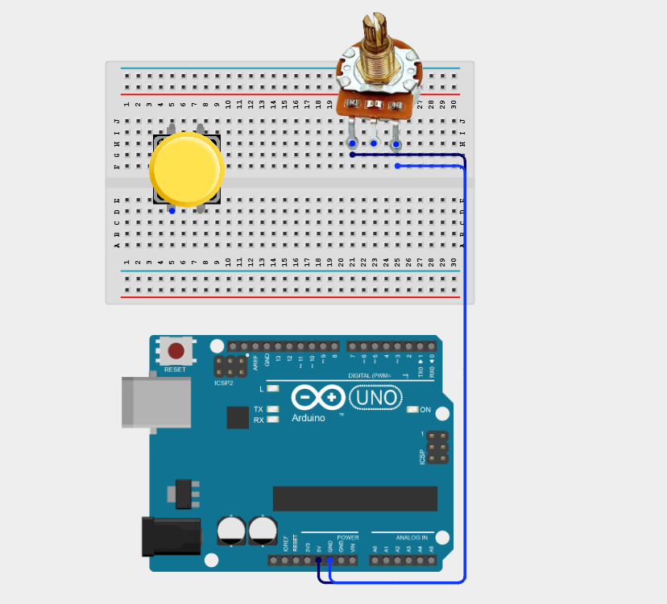
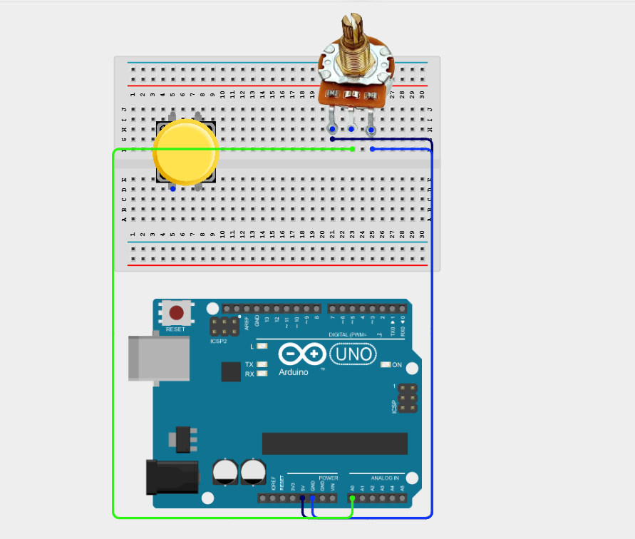
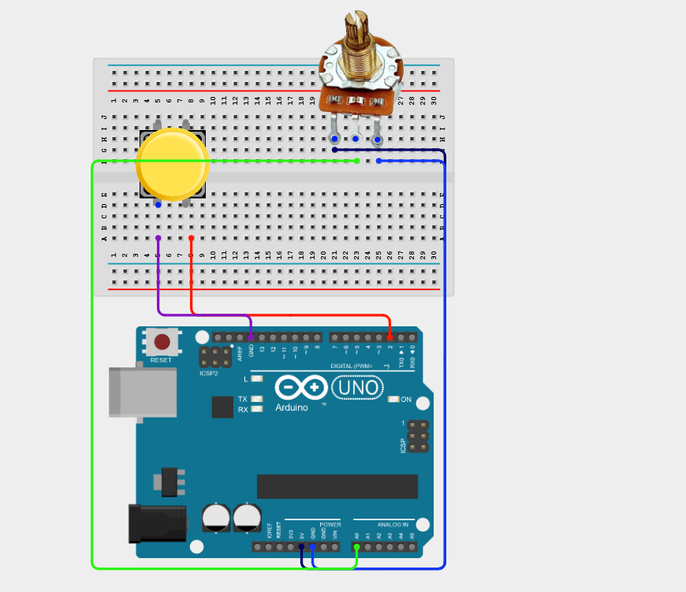
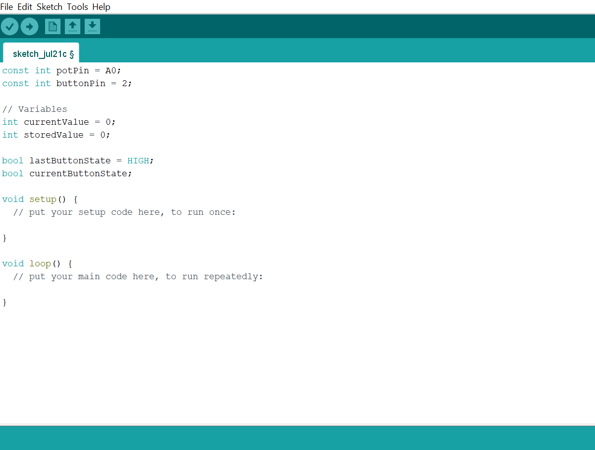
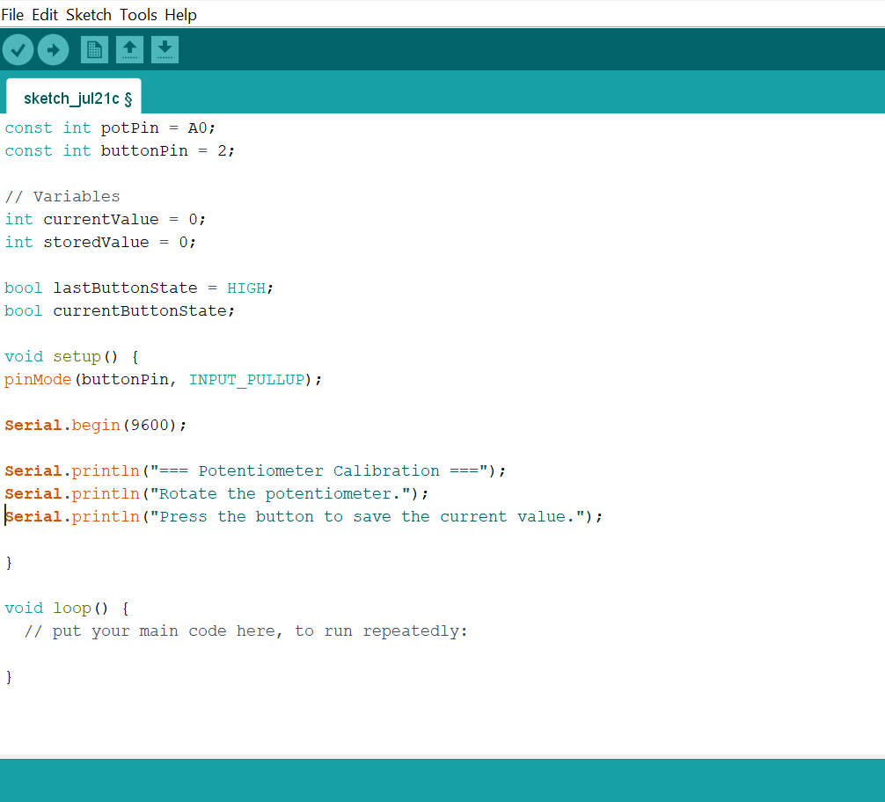
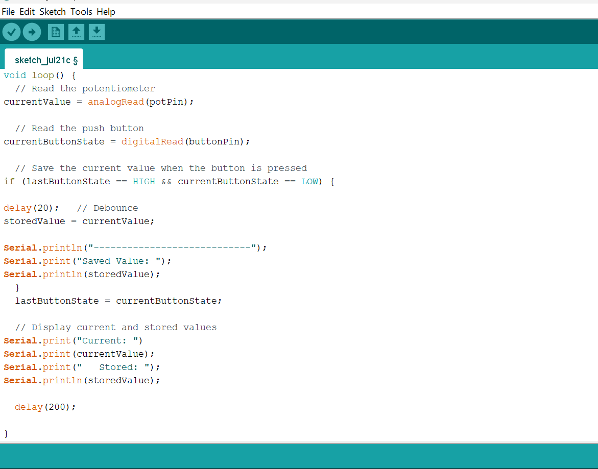

# Project 2.11.6: Menu Calibration Selector

| **Description** | This project uses a push button to save or store the value selected by a potentiometer dial, creating a simple calibration interface. |
|------------------|----------------------------------------------------------------|
| **Use case**     | This project can be used in sensor calibration, equipment configuration, control panel settings, and embedded systems where user-selected values need to be saved for future operation. |

## Components (Things You will need)

|  |  |  |  |  |  |
| --- | --- | --- | --- | --- | --- |

## Building the circuit

Things Needed:

- Arduino Uno = 1
- Arduino USB cable = 1
- Push button = 1
- Potentiometer = 1
- Breadboard = 1
- Jumper wires 

## Mounting the component on the breadboard

**Step 1:** Place the push button  and potentiometer on the breadboard.

_**NB:** Make sure all components are securely placed on the breadboard with correct orientation._

## WIRING THE CIRCUIT

**Step 2:** Connect one outer pin of the potentiometer to the Arduino 5V pin on the Arduino Uno using male-to-male jumper wire.

**Step 3:** Connect the opposite outer pin of the potentiometer to the Arduino GND pin using male-to-male jumper wire.

**Step 4:** Connect the centre (wiper) pin of the potentiometer to Analog Pin A0 on the Arduino Uno using a male-to-male jumper wire.

**Step 5:** Connect one terminal of the push button to Digital Pin 2 and the other to GND on the Arduino Uno using a male-to-male jumper wire.

_Make sure to connect the Arduino USB cable to the Arduino board._

## PROGRAMMING

**Step 1:** Open your Arduino IDE. See how to set up here: [Getting Started](../../Getting Started/Arduino_IDE_Setup.md).

**Step 2:** Type the following code in your Arduino IDE: `const int potPin = A0;`, `const int buttonPin = 2;`, `int currentValue = 0;`, `int storedValue = 0;`,`bool lastButtonState = HIGH;`, `bool currentButtonState;`  as shown in the image below.

**Step 3:** Type the following code in your Arduino IDE inside the void setup() function: `pinMode(buttonPin, INPUT_PULLUP);`, `Serial.begin(9600);`, `Serial.println("=== Potentiometer Calibration ===");`, `Serial.println("Rotate the potentiometer.");`,`Serial.println("Press the button to save the current value.");`  as shown in the image below.

**Step 4:** Type the following code in your Arduino IDE inside the void setup() function: `currentValue = analogRead(potPin);`, `currentButtonState = digitalRead(buttonPin);`, `if (lastButtonState == HIGH && currentButtonState == LOW) {`, `delay(20);`,`storedValue = currentValue;`, `Serial.println("----------------------------");`, `Serial.print("Saved Value: ");`, `Serial.println(storedValue); }`, `lastButtonState = currentButtonState;`, `Serial.print("Current: ");`, `Serial.print(currentValue);`, `Serial.print("   Stored: ");`,`Serial.println(storedValue);`, `delay(20);`  as shown in the image below.

**Step 5:** Save your code. _See the [Getting Started](../../Getting Started/Arduino_IDE_Setup.md) section_

**Step 6:** Select the Arduino board and port. _See the [Getting Started](../../Getting Started/Arduino_IDE_Setup.md) section_

**Step 7:** Upload your code.

_The Arduino continuously reads the potentiometer and monitors the push button. Each button press stores the latest potentiometer value, allowing the user to recalibrate the system whenever needed. The Serial Monitor displays the current and stored values._

## CONCLUSION

This project helps learners understand how to combine multiple components with Arduino to create more complex interactive systems and automation solutions.

