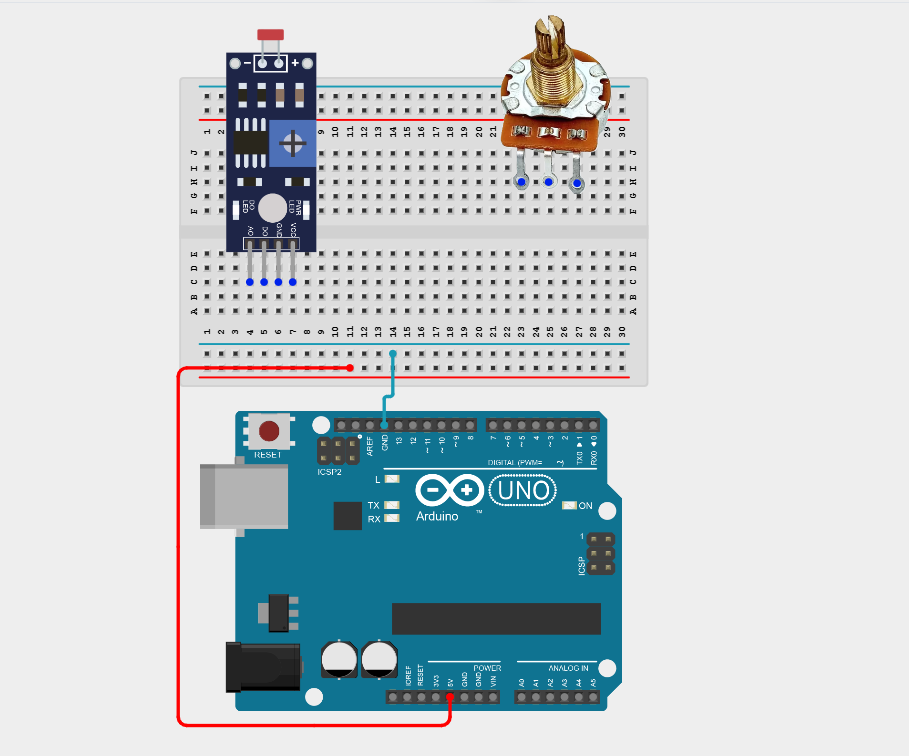
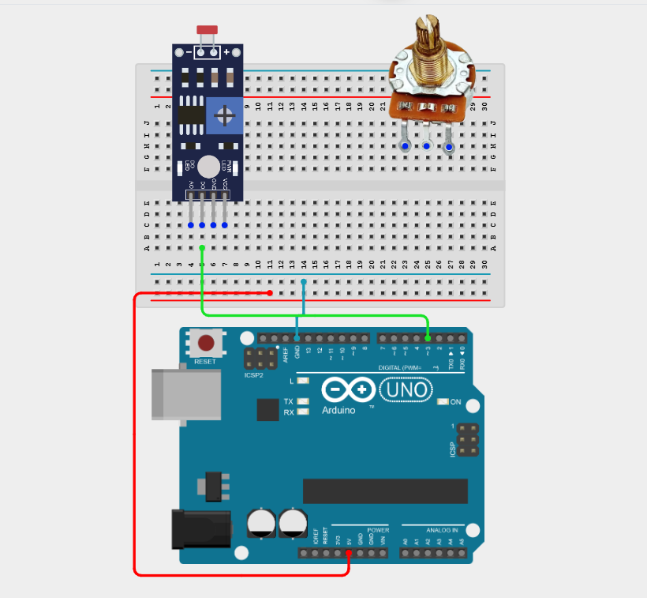
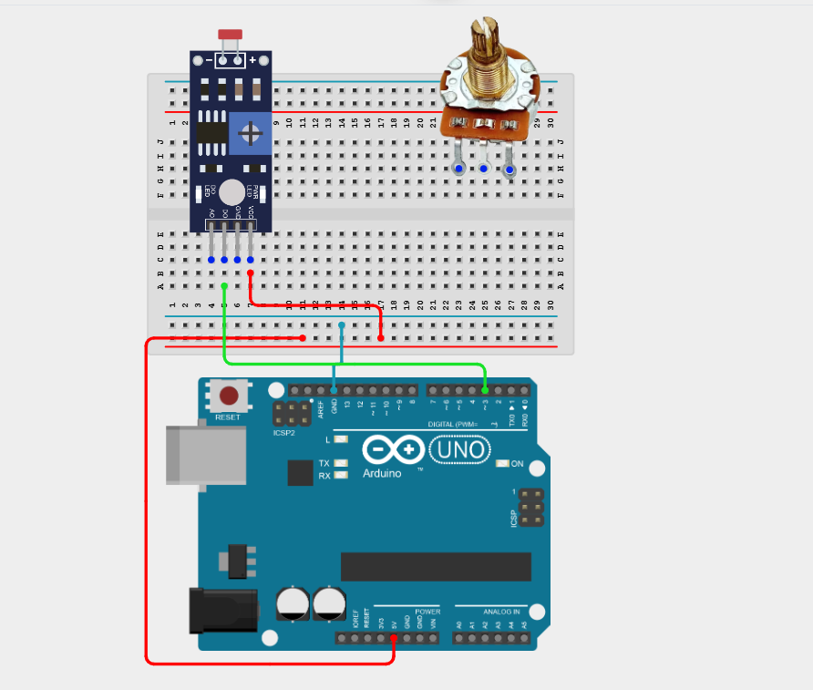
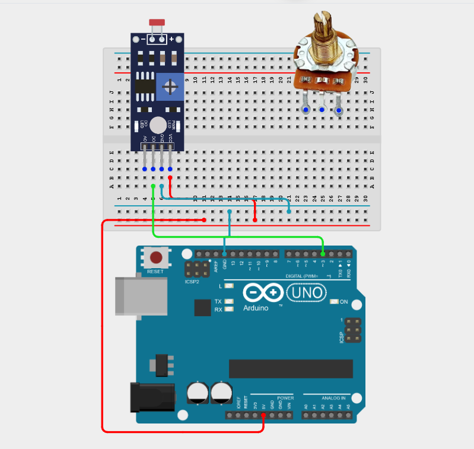
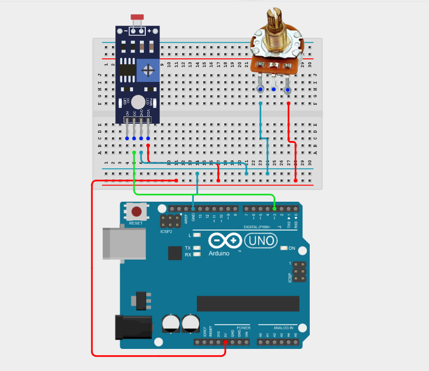
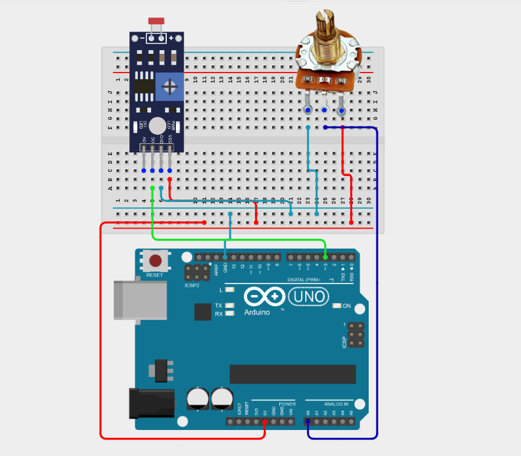
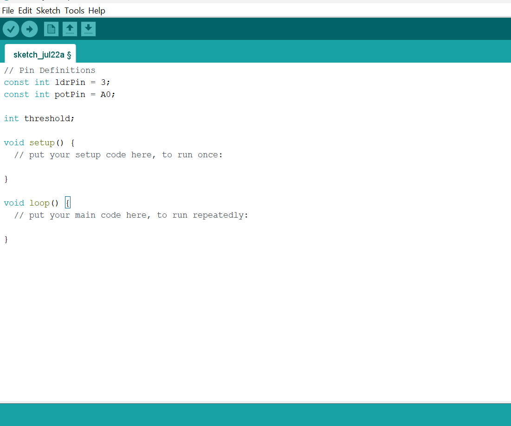
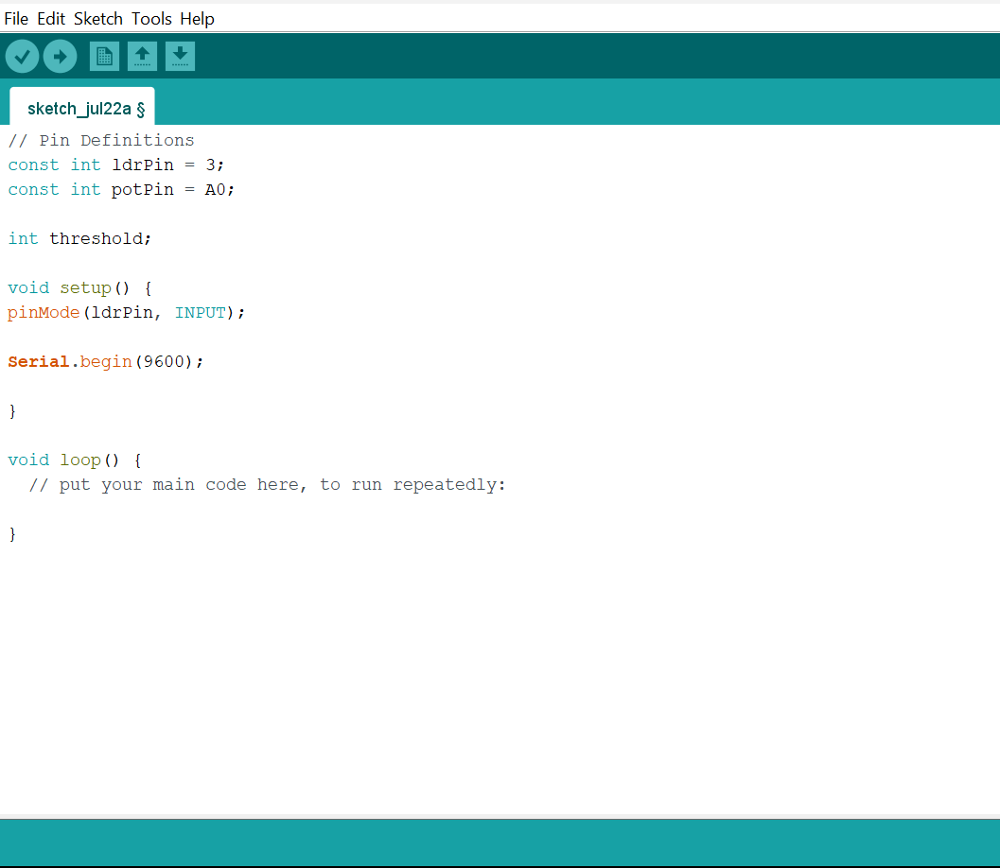
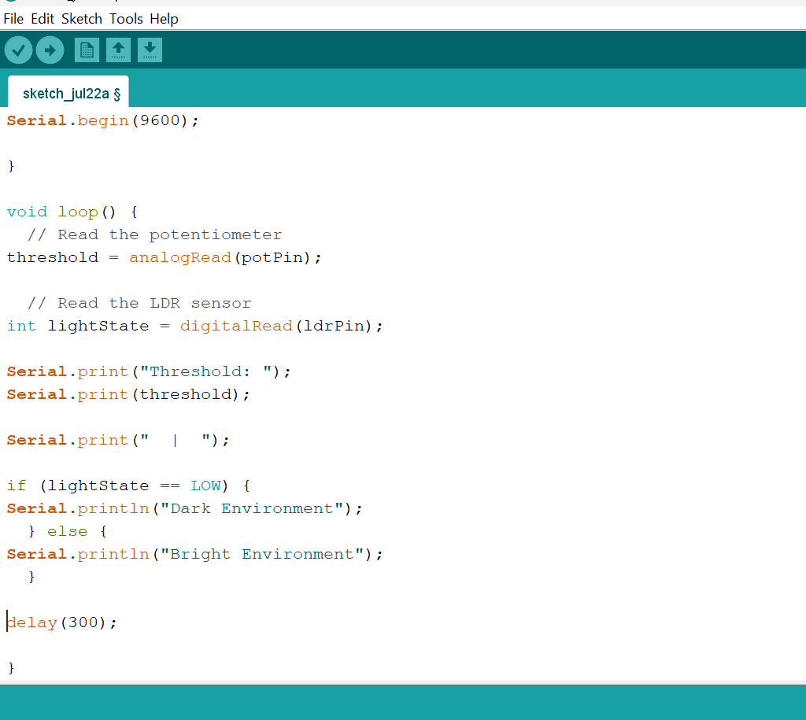

# Project 2.11.7: Lux Threshold Tuner

| **Description** | This project uses a potentiometer to adjust the light/dark threshold of an LDR, creating a user-calibratable light sensor. |
|------------------|----------------------------------------------------------------|
| **Use case**     | This project demonstrates a simple user calibration interface where a preferred light sensitivity setting can be selected and stored for use in future applications, such as automatic lighting systems, security systems, or smart home controllers. |

## Components (Things You will need)

|  |  |  |  |  |  |
| --- | --- | --- | --- | --- | --- |

## Building the circuit

Things Needed:

- Arduino Uno = 1
- Arduino USB cable = 1
- LDR module = 1
- Potentiometer = 1
- Breadboard = 1
- Jumper wires

## Mounting the component on the breadboard

**Step 1:** Place the Potentiometer and the LDR module on the breadboard following the wiring diagram.

_Both the LDR sensor module and the potentiometer require access to 5V and GND. Use the breadboard power rails to distribute power._

_**NB:** Make sure all components are securely placed on the breadboard with correct orientation._

## WIRING THE CIRCUIT

**Step 2:** Connect the D0 pin of the LDR module to Digital Pin 3 on the Arduino Uno using male-to-male jumper wire.

**Step 3:** Connect the VCC pin of the LDR module to the positive rail pin on the breadboard using male-to-male jumper wire.

**Step 4:** Connect the GND pin of the LDR module to GND pin on the breadboard using male-to-male jumper wire.

**Step 5:** Connect one outer pin of the potentiometer to the positive (+) power rail and the other outer pin to the negative (–) power rail on the breadboard using male-to-male jumper wires.

**Step 6:** Connect the centre (wiper) pin of the potentiometer to Analog Pin A0 on the Arduino Uno using male-to-male jumper wire.

_Make sure to connect the Arduino USB cable to the Arduino board._

## PROGRAMMING

**Step 1:** Open your Arduino IDE. See how to set up here: [Getting Started](../../Getting Started/Arduino_IDE_Setup.md).

**Step 2:** Type the following code in your Arduino IDE: `const int ldrPin = 3;`, `const int potPin = A0;`, `int threshold;`  as shown in the image below.

**Step 3:** Type the following code in your Arduino IDE inside the void setup() function: `pinMode(ldrPin, INPUT);`, `Serial.begin(9600);`  as shown in the image below.

**Step 4:** Type the following code in your Arduino IDE inside the void setup() function: `threshold = analogRead(potPin);`, `int lightState = digitalRead(ldrPin);`, `Serial.print("Threshold: ");`, `Serial.print(threshold);`, `Serial.print("  |  ");`, `if (lightState == LOW) {`,`Serial.println("Dark Environment"); }`, `else {`, `Serial.println("Bright Environment"); }`, `delay(300);`   as shown in the image below.

**Step 5:** Save your code. _See the [Getting Started](../../Getting Started/Arduino_IDE_Setup.md) section_

**Step 6:** Select the Arduino board and port. _See the [Getting Started](../../Getting Started/Arduino_IDE_Setup.md) section_

**Step 7:** Upload your code.

## OBSERVATION

 Rotating the potentiometer changes the selected threshold value, while the LDR sensor reports whether the surrounding environment is bright or dark.

## CONCLUSION

This project helps learners understand how to combine multiple components with Arduino to create more complex interactive systems and automation solutions.

