# Project 2.11.8: Safety Distance Calibrator

| **Description** | This project uses a potentiometer to adjust the safety distance boundary of an ultrasonic sensor from 10cm to 100cm. |
|------------------|----------------------------------------------------------------|
| **Use case**     | This project can be used in parking assistance systems, robot obstacle detection, industrial safety zones, and automated machinery, where the minimum safe distance can be adjusted to suit different operating conditions. |

## Components (Things You will need)

|  |  |  |  |  |  |
| --- | --- | --- | --- | --- | --- |

## Building the circuit

Things Needed:

- Arduino Uno = 1
- Arduino USB cable = 1
- Ultrasonic sensor = 1
- Potentiometer = 1
- Breadboard = 1
- Jumper wires 

## Mounting the component on the breadboard

**Step 1:** Place the Ultrasonic sensor and the potentiometer on the breadboard.

_Both the ultrasonic sensor and the potentiometer require access to 5V and GND. Since the Arduino Uno has only one 5V pin, use the breadboard power rails to distribute power._

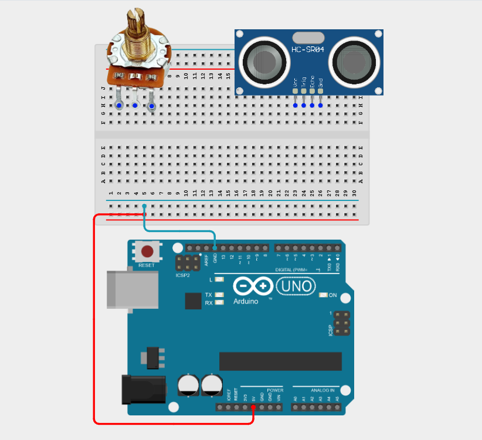

_**NB:** Make sure all components are securely placed on the breadboard with correct orientation._

## WIRING THE CIRCUIT

**Step 2:** Connect the VCC pin of the ultrasonic sensor to the positive (+) power rail on the breadboard using male-to-male jumper wire.

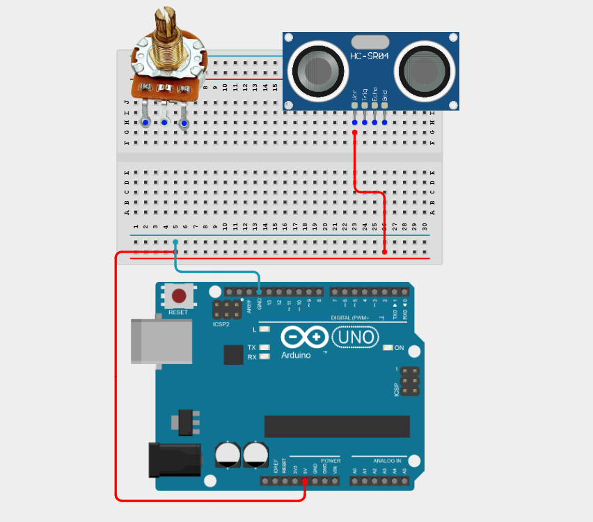

**Step 3:** Connect the GND pin of the ultrasonic sensor to the negative (–) power rail on the breadboard using male-to-male jumper wire.

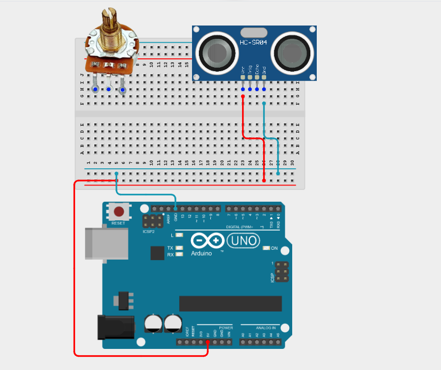

**Step 4:** Connect the TRIG pin of the ultrasonic sensor to Digital Pin 9 on the Arduino Uno using a male-to-male jumper wire.

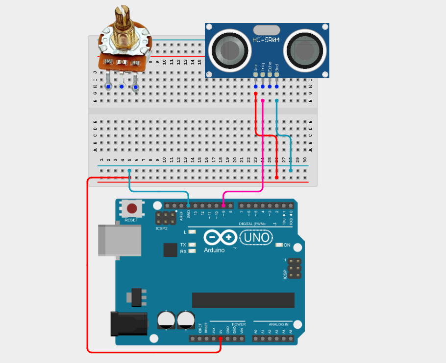

**Step 5:** Connect the ECHO pin of the ultrasonic sensor to Digital Pin 10 on the Arduino Uno using a male-to-male jumper wire.

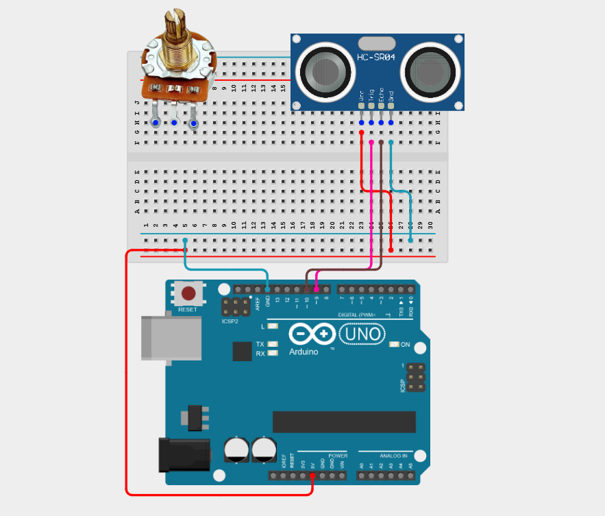

**Step 6:** Connect the centre (wiper) pin of the potentiometer to Analog Pin A0 on the Arduino Uno using male-to-male jumper wire.

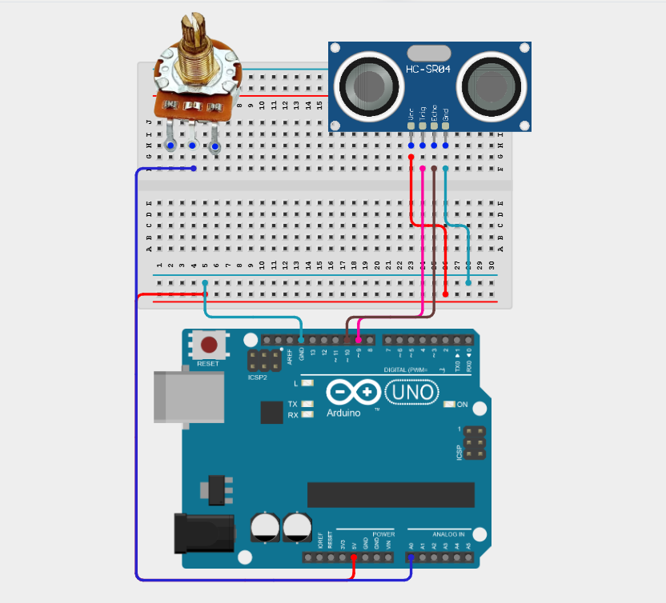

**Step 7:** Connect the outer pin of the potentiometer to the positive (+) power rail and the other outer pin of the potentiometer to the negative (–) power rail on the breadboard using male-to-male jumper wires.

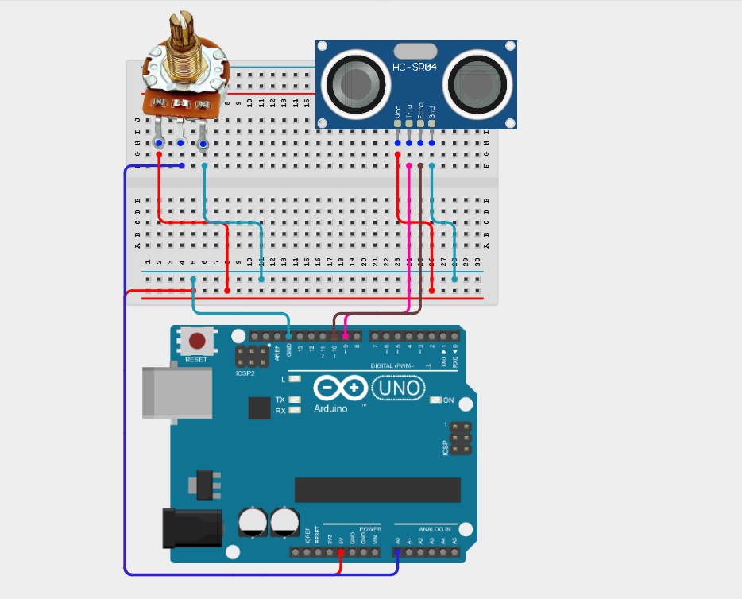

_Make sure to connect the Arduino USB cable to the Arduino board._

## PROGRAMMING

**Step 1:** Open your Arduino IDE. See how to set up here: [Getting Started](../../Getting Started/Arduino_IDE_Setup.md).

**Step 2:** Type the following code in your Arduino IDE: `const int trigPin = 9;`, `const int echoPin = 10;`, `const int potPin = A0;`, `long duration;`, `float distance;`, `int threshold;` as shown in the image below.

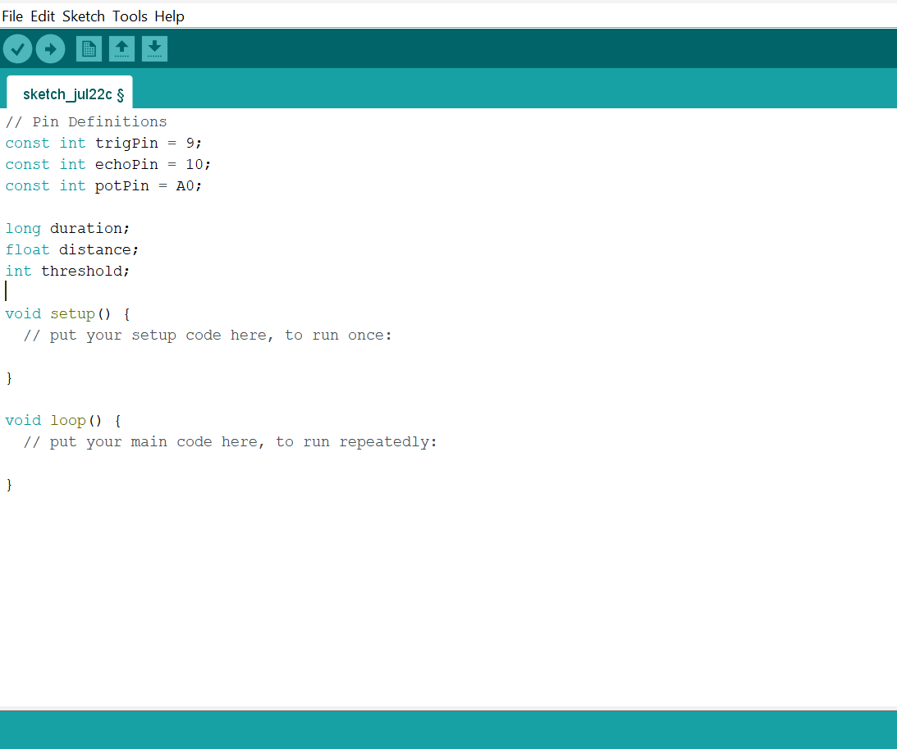

**Step 3:** Type the following code in your Arduino IDE inside the void setup() function: `pinMode(trigPin, OUTPUT);`, `pinMode(echoPin, INPUT);`, `Serial.begin(9600);` as shown in the image below.

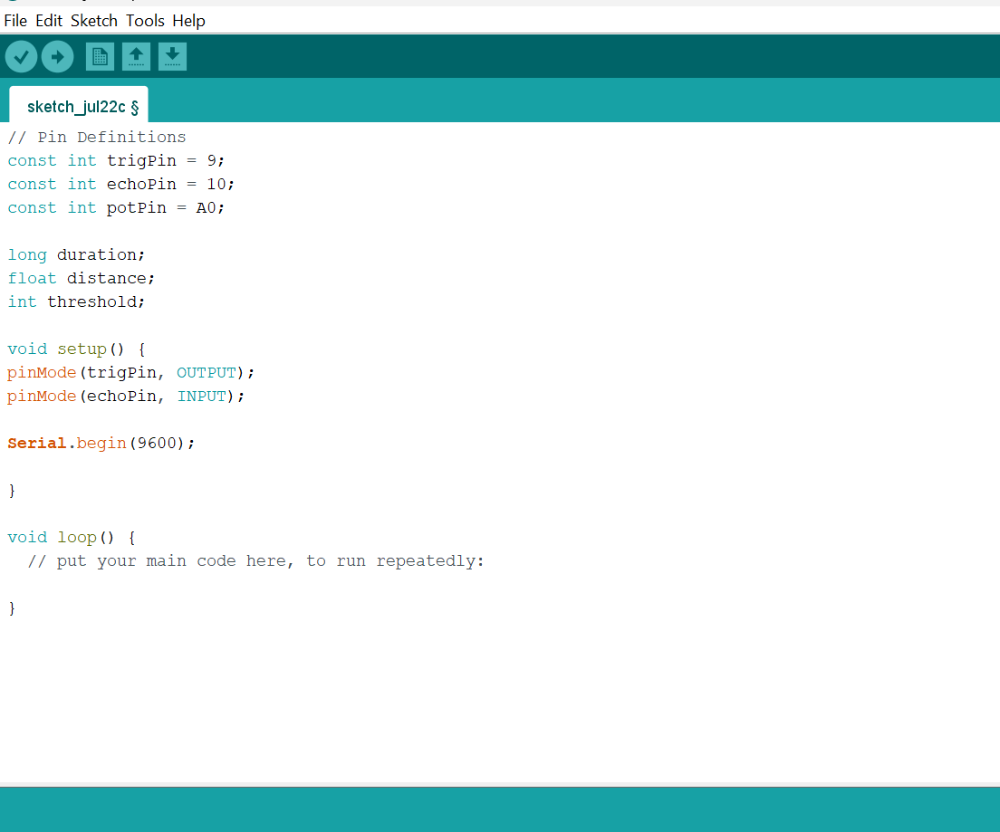

**Step 4:** Type the following code in your Arduino IDE inside the void loop() function: `int potValue = analogRead(potPin);`, `threshold = map(potValue, 0, 1023, 10, 100);`, `digitalWrite(trigPin, LOW);`, `delayMicroseconds(2);`, `digitalWrite(trigPin, HIGH);`, `delayMicroseconds(10);`, `digitalWrite(trigPin, LOW);`, `duration = pulseIn(echoPin, HIGH);` as shown in the image below.

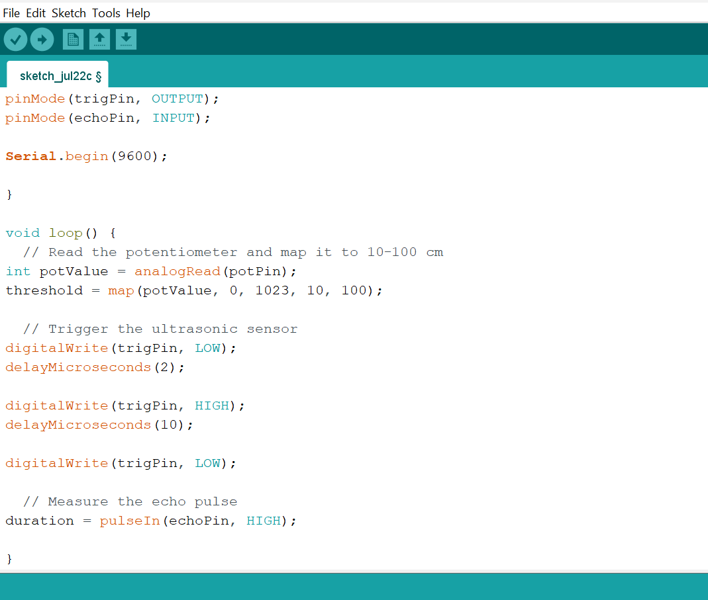

**Step 5:** Type the following code in your Arduino IDE inside the void loop() function: `distance = duration * 0.0343 / 2;`, `Serial.print("Distance: ");`, `Serial.print(distance);`, `Serial.print(" cm | Safety Limit: ");`, `Serial.print(threshold);`, `Serial.print(" cm | ");`, `if (distance <= threshold) {`, `Serial.println("WARNING: Object Inside Safety Zone"); }`, `else {`, `Serial.println("Safe"); }`, `delay(300);` as shown in the image below.

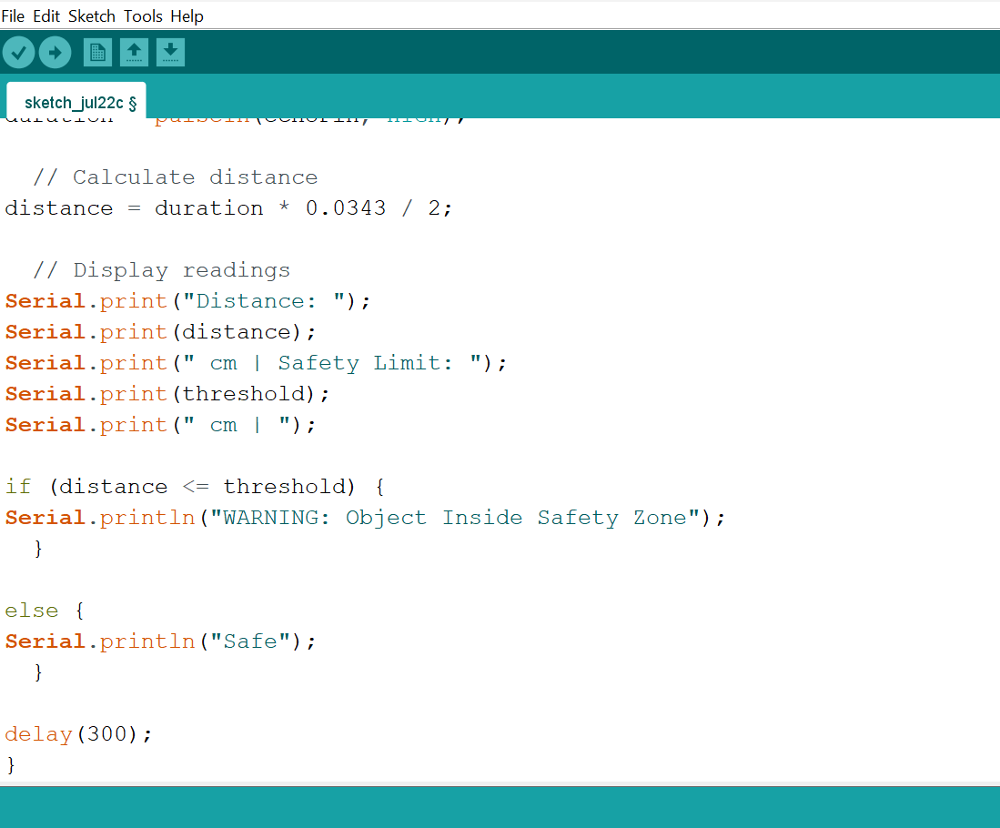

**Step 6:** Save your code. _See the [Getting Started](../../Getting Started/Arduino_IDE_Setup.md) section_

**Step 7:** Select the Arduino board and port. _See the [Getting Started](../../Getting Started/Arduino_IDE_Setup.md) section_

**Step 8:** Upload your code.

## OBSERVATION

Rotating the potentiometer changes the safety distance threshold, and the Arduino continuously reports whether nearby objects are inside or outside the selected safety boundary.

## CONCLUSION

This project helps learners understand how to combine multiple components with Arduino to create more complex interactive systems and automation solutions.

