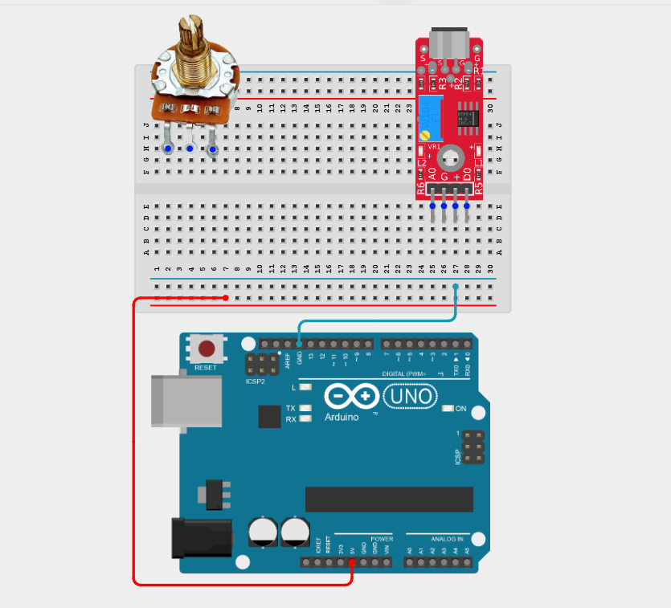
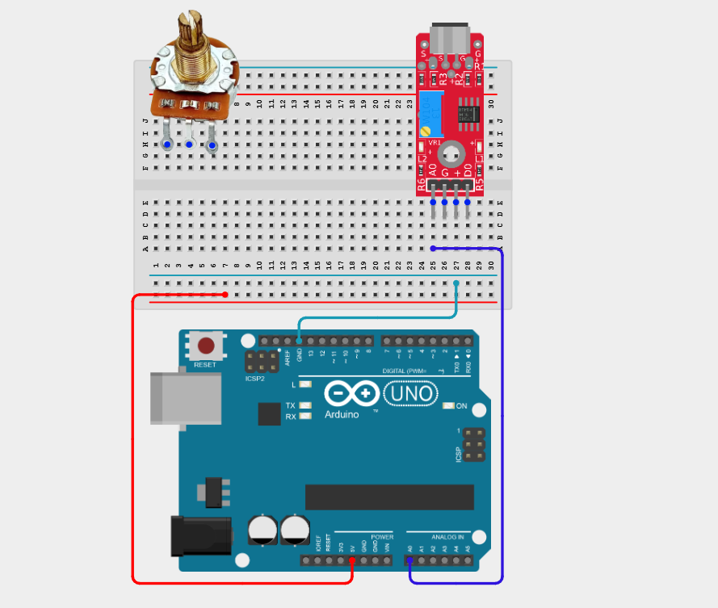
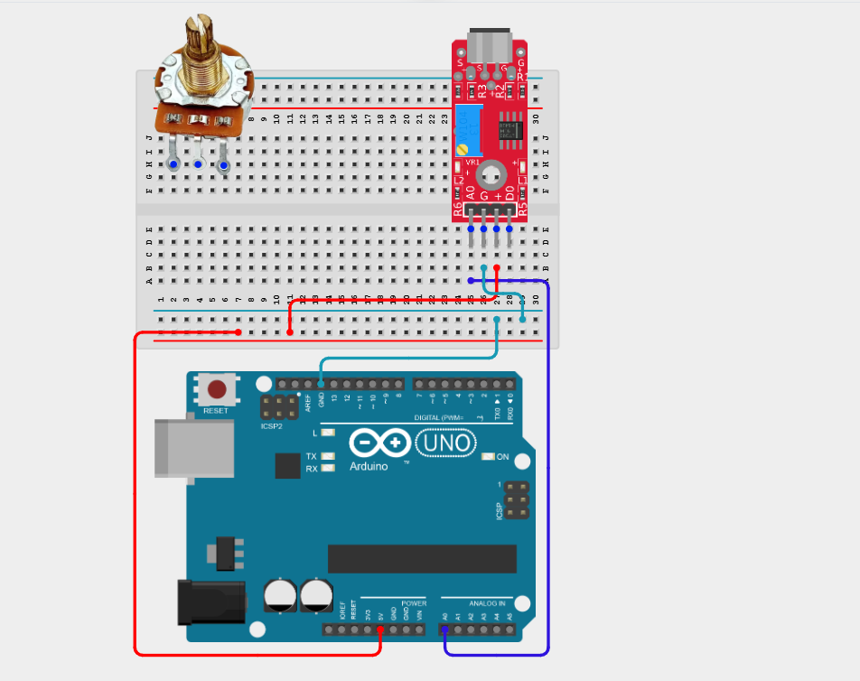
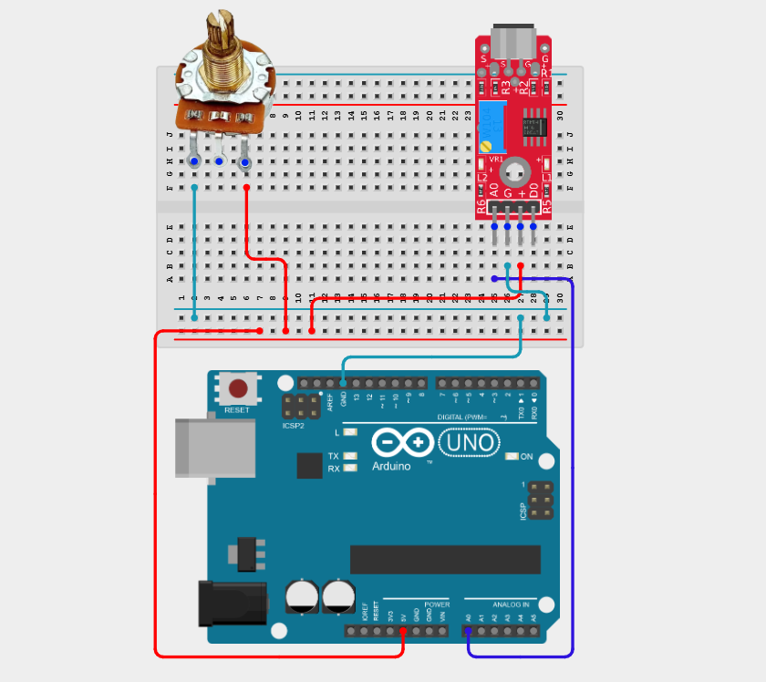
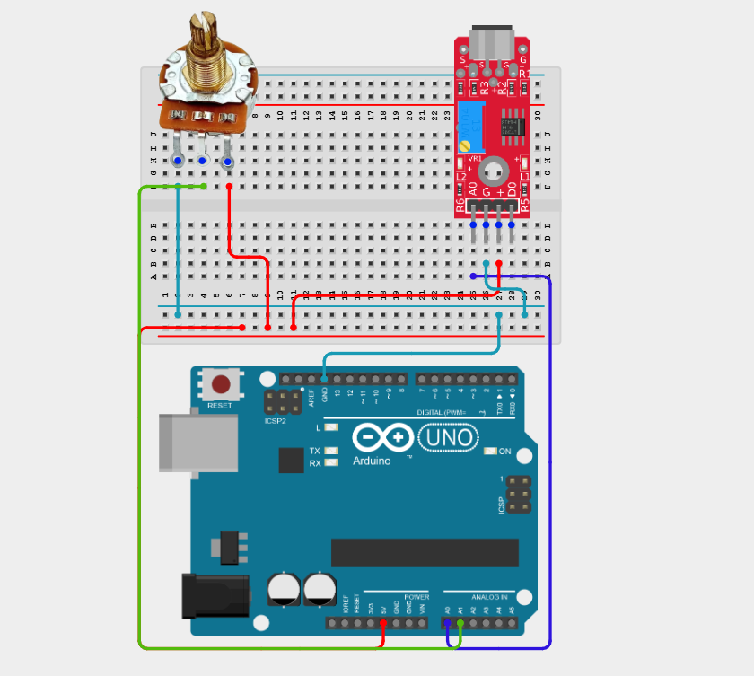
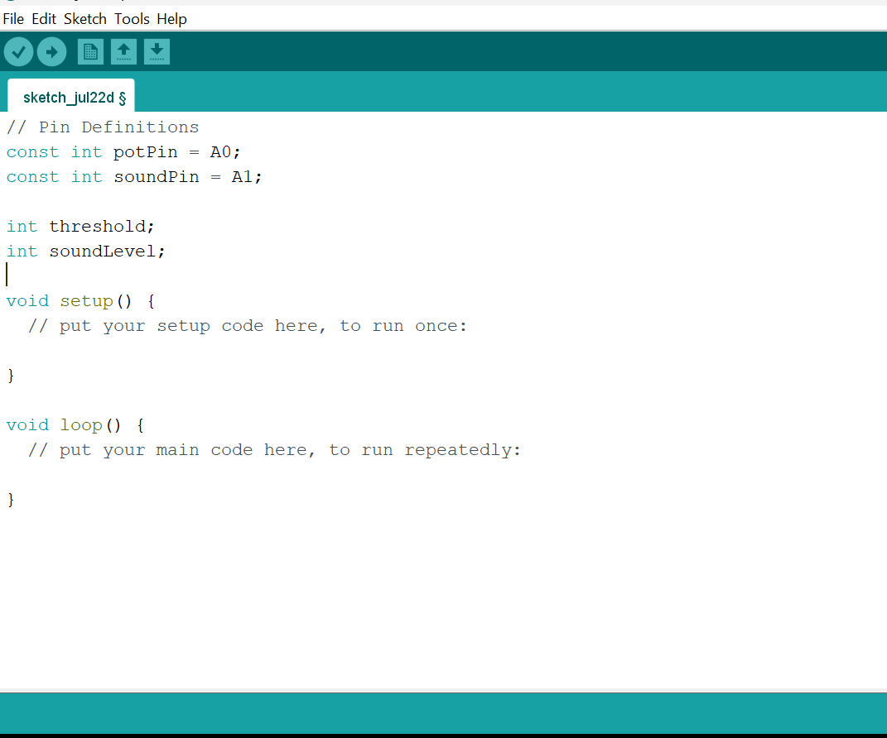
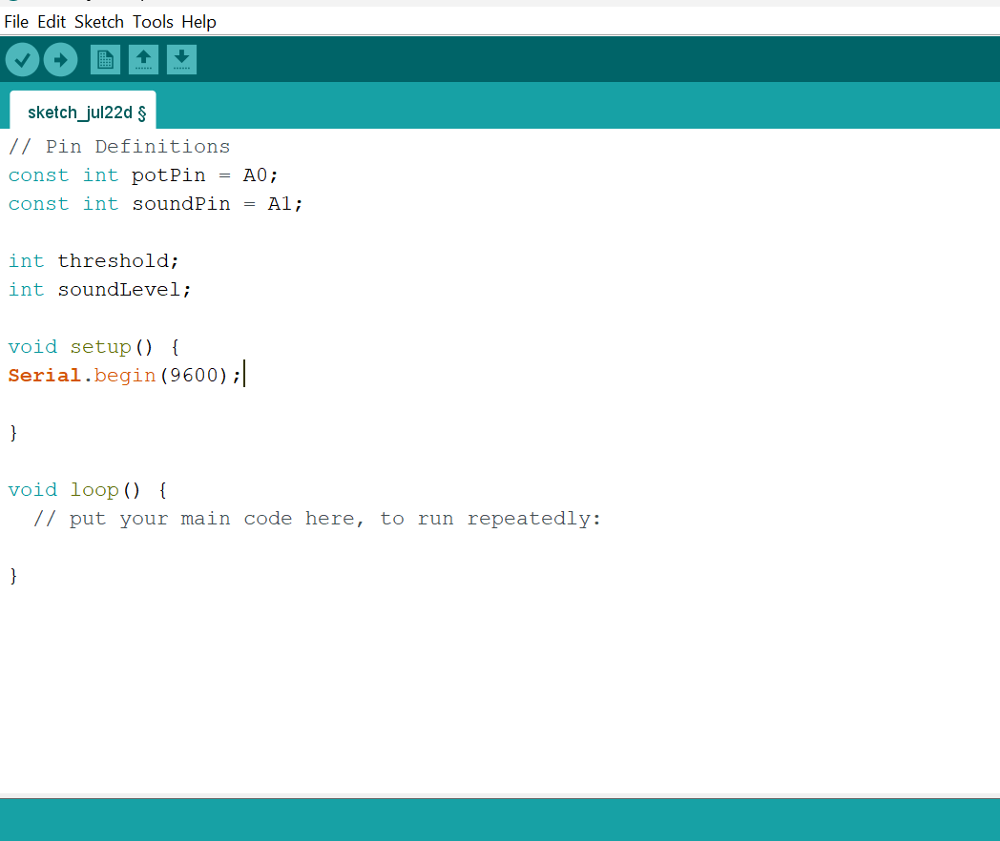
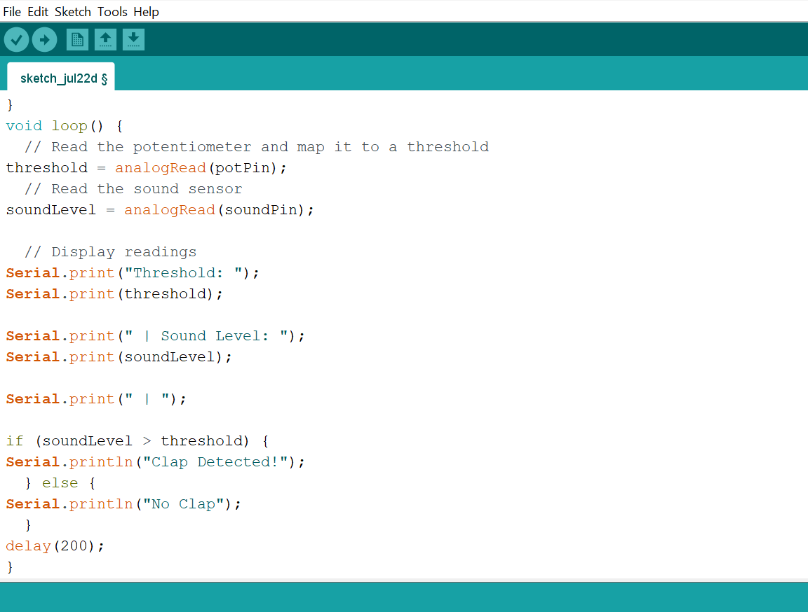

# Project 2.11.9: Clap Sensitivity Dial

| **Description** | This project uses a potentiometer to adjust the clap detection threshold of a sound sensor. The Arduino continuously reads the analog output (A0) of the sound sensor and compares it with a threshold set by the potentiometer. When the sound level exceeds the selected threshold, a clap or loud sound is detected and a message is displayed in the Serial Monitor. |
|------------------|----------------------------------------------------------------|
| **Use case**     | This project can be used in voice-activated lighting, smart home controls, noise-triggered alarms, and interactive installations, where the sound detection sensitivity can be adjusted to suit different environments. |

## Components (Things You will need)

|  |  |  |  |  |  |
| --- | --- | --- | --- | --- | --- |

## Building the circuit

Things Needed:

- Arduino Uno = 1
- Arduino USB cable = 1
- Sound sensor module = 1
- Potentiometer = 1
- Breadboard = 1
- Jumper wires 

## Mounting the component on the breadboard

**Step 1:** Place the Potentiometer and the Sound Sensor on the breadboard.

_Both the sound sensor and the potentiometer require 5V and GND. Since the Arduino Uno has only one 5V pin, use the breadboard power rails to distribute power._

_**NB:** Make sure all components are securely placed on the breadboard with correct orientation._

## WIRING THE CIRCUIT

**Step 2:** Connect the A0 pin of the sound sensor to Analog Pin A0 on the Arduino Uno using male-to-male jumper wire.

**Step 3:** Connect the VCC pin of the sound sensor to the positive (+) power rail and the GND pin to the negative (–) power rail on the breadboard using male-to-male jumper wires.

**Step 4:** Connect one outer pin of the potentiometer to the positive (+) power rail and the other outer pin to the negative (–) power rail on the breadboard using male-to-male jumper wires.

**Step 5:** Connect the centre (wiper) pin of the potentiometer to Analog Pin A1 on the Arduino Uno using male-to-male jumper wire.

_Make sure to connect the Arduino USB cable to the Arduino board._

## PROGRAMMING

**Step 1:** Open your Arduino IDE. See how to set up here: [Getting Started](../../Getting Started/Arduino_IDE_Setup.md).

**Step 2:** Type the following code in your Arduino IDE: `const int potPin = A0;`, `const int soundPin = A1;`, `int threshold;`, `int soundLevel;` as shown in the image below.

**Step 3:** Type the following code in your Arduino IDE inside the void setup() function `Serial.begin(9600);` as shown in the image below.

**Step 4:** Type the following code in your Arduino IDE inside the void loop() function `threshold = analogRead(potPin);`, `soundLevel = analogRead(soundPin);`, `Serial.print("Threshold: ");`, `Serial.print(threshold);`, `Serial.print(" | Sound Level: ");`, `Serial.print(soundLevel);`, `Serial.print(" | ");`, `if (soundLevel > threshold) {`, `Serial.println("Clap Detected!"); }`, `else {`, `Serial.println("No Clap"); }`, `delay(200);` as shown in the image below.
 

**Step 5:** Save your code. _See the [Getting Started](../../Getting Started/Arduino_IDE_Setup.md) section_

**Step 6:** Select the Arduino board and port. _See the [Getting Started](../../Getting Started/Arduino_IDE_Setup.md) section_

**Step 7:** Upload your code.

## OBSERVATION

Rotating the potentiometer changes the clap detection threshold, allowing the Arduino to detect loud sounds based on the user-selected sensitivity.

## CONCLUSION

This project helps learners understand how to combine multiple components with Arduino to create more complex interactive systems and automation solutions.

