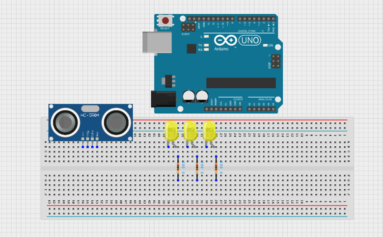
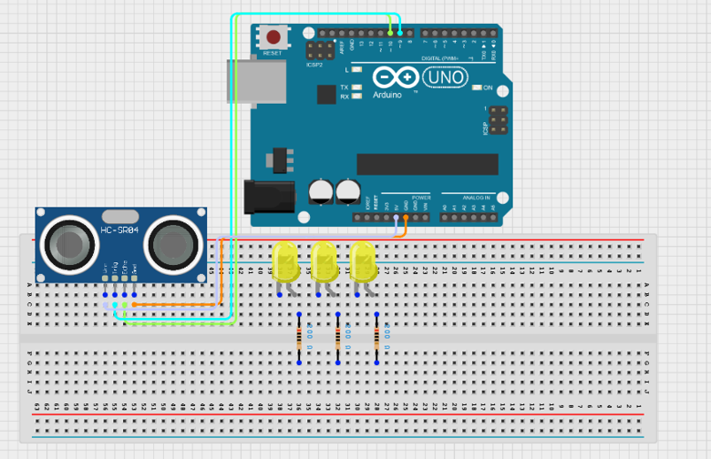
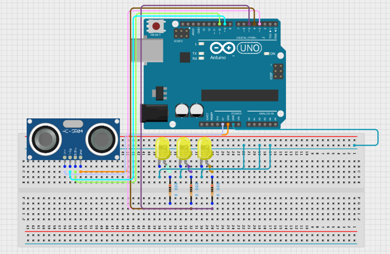

# Project 2.12: Automatic Traffic Detection

| **Description** | This project simulates an intelligent street lighting system that activates at night and responds to approaching vehicles or pedestrians using ultrasonic sensing and LED lighting. |
| --------------- | -------------------------------------------------------------------------------------------------------------------------------------------------------------------------------------------------------------------------------------------------------------------------- |
| **Use case**    | Smart street lighting, energy-saving systems, and smart city applications.                                                                                                                              |

## Components (Things You will need)

|  |  |  |  |  | | |
| --------------------------------------------------- | ------------------------------------------------------ | ----------------------------------------------------------- | --------------------------------------------------------- | ------------------------------------------------------ | ------------------------------------------------------ | ------------------------------------------------------ | 

## Building the circuit

Things Needed:

- Arduino Uno = 1
- Arduino USB cable = 1
- Breadboard = 1
- Jumper Wires = multiple
- Ultrasonic Sensor = 1
- Resistors = 3

## WIRING THE CIRCUIT

**Step 1:** Place the ultrasonic sensor and the three yellow LEDs on the breadboard. Ensure all components are firmly secured before making connections. Each LED must be connected with a 220Ω resistor to prevent damage.

.

**Step 2:** Connect the VCC pin of the HC-SR04 ultrasonic sensor to 5V on the Arduino Uno. Connect the GND pin to GND. Connect the Trig pin to Digital Pin 9 and the Echo pin to Digital Pin 10.

.

**Step 3:** Connect the first yellow LED anode to Digital Pin 3 through a 220Ω resistor and its cathode to GND.
Connect the second yellow LED anode to Digital Pin 4 through a 220Ω resistor and its cathode to GND.
Connect the third yellow LED anode to Digital Pin 5 through a 220Ω resistor and its cathode to GND.

.

**Step 5:** After completing the wiring, connect the Arduino Uno to the computer using the USB cable.

## PROGRAMMING

Below is the Arduino code to make the Sound-Controlled Desk Lamp work.

**Step 1:** Open your Arduino IDE. See how to set up here: [Getting Started](../../Getting Started/Arduino_IDE_Setup.md).

**Step 2:** Copy and paste the following code into a new sketch:

.

.

## Uploading the code

**Step 3:** Save your code. _See the [Getting Started](../../Getting Started/Arduino_IDE_Setup.md) section_.

**Step 4:** Select Arduino Uno from Tools → Board.

**Step 5:** Select the correct COM port from Tools → Port.

**Step 6:** Click Upload.

## OBSERVATION

The ultrasonic sensor continuously measures the distance of approaching vehicles or pedestrians.When an object is detected within 100 cm, all three white LEDs turn ON to simulate street lighting activation.When no object is detected, all LEDs remain OFF to save energy.
 

## CONCLUSION

You have successfully built an automatic traffic detection system using an Arduino Uno, an ultrasonic sensor, and LEDs.

In this project, you learned how to:

- Measure distance using an ultrasonic sensor.
- Detect the presence of approaching vehicles or pedestrians.
- Control multiple LEDs based on sensor input.
- Use conditional statements to automate a simple lighting system.

This project demonstrates how sensors and microcontrollers can work together to create intelligent systems that respond to their surroundings. Similar technology is used in smart street lighting, parking systems, security lighting, and other smart city applications to improve energy efficiency and safety.

