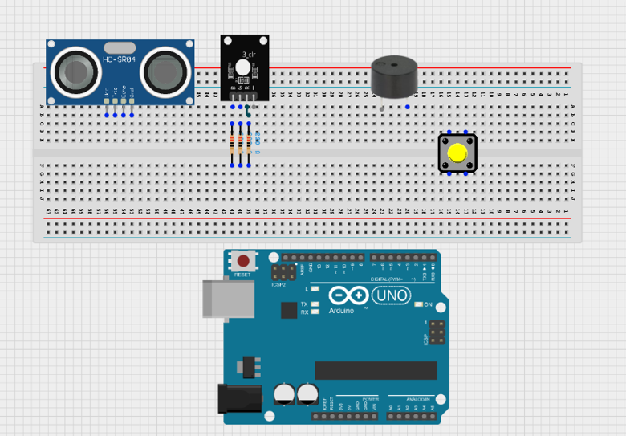
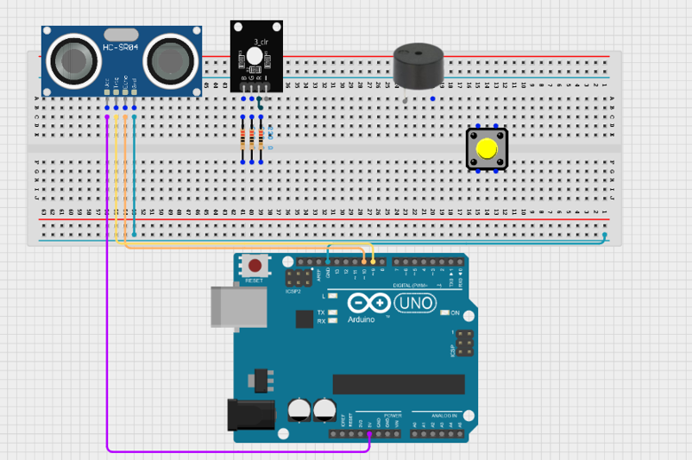
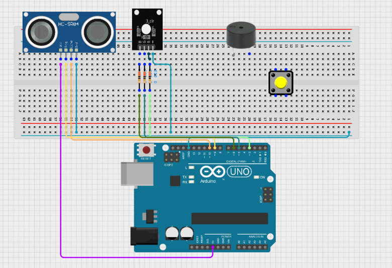
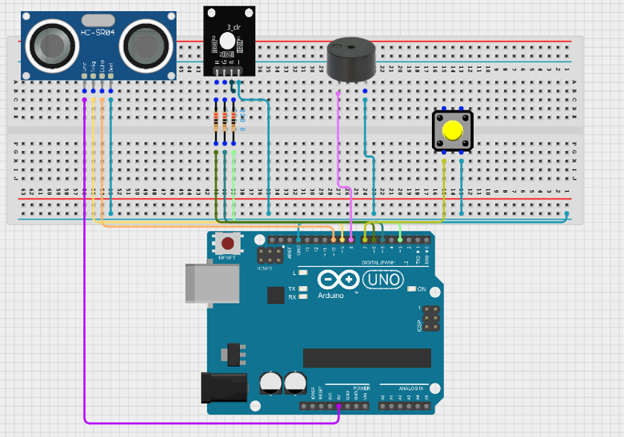
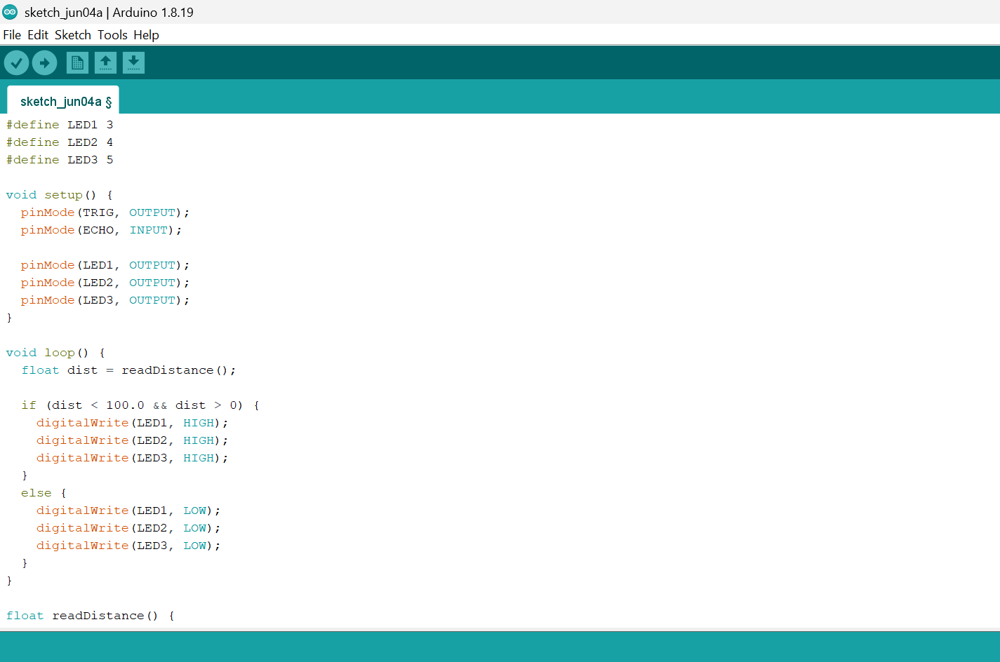
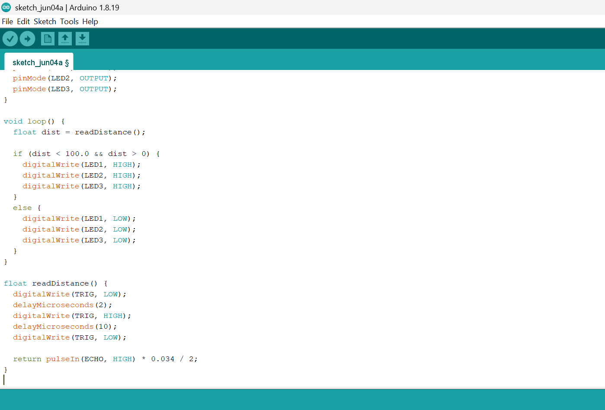

# Project 1.10.0: Sound-Controlled Desk Lamp

| **Description** | This project creates a simple security system that can be armed and disarmed using a pushbutton. When armed, the ultrasonic sensor detects intruders and triggers both visual and audible alarms. |
| --------------- | -------------------------------------------------------------------------------------------------------------------------------------------------------------------------------------------------------------------------------------------------------------------------- |
| **Use case**    | Home security systems, intrusion detection, perimeter monitoring, smart alarm systems.                                                                                                                              |

## Components (Things You will need)

|  |  |  |  |  | | | | | |
| --------------------------------------------------- | ------------------------------------------------------ | ----------------------------------------------------------- | --------------------------------------------------------- | ------------------------------------------------------ | ------------------------------------------------------ | ------------------------------------------------------ | ------------------------------------------------------ | 
## Building the circuit

Things Needed:

- Arduino Uno = 1
- Arduino USB cable = 1
- Breadboard = 1
- Jumper Wires = multiple

## WIRING THE CIRCUIT

**Step 1:** Place the ultrasonic sensor, RGB LED, pushbutton, buzzer, resistors, and jumper wires on the breadboard. Ensure all components are firmly fixed in place. Connect the RGB LED through the resistors to protect it from excessive current.

.

**Step 2:** Connect the VCC pin of the HC-SR04 ultrasonic sensor to 5V on the Arduino Uno. Connect the GND pin to GND. Connect the Trig pin to Digital Pin 9 and the Echo pin to Digital Pin 10.

.

**Step 3:** Connect the red pin of the RGB LED through a 220Ω resistor to Digital Pin 3. Connect the green pin through a 220Ω resistor to Digital Pin 5. Connect the blue pin through a 220Ω resistor to Digital Pin 6. Connect the common cathode pin to GND.

.

**Step 4:** Connect the positive terminal of the buzzer to Digital Pin 8 and the negative terminal to GND. Connect one leg of the pushbutton to Digital Pin 7 and the other leg to GND. Enable the Arduino's internal pull-up resistor through the program. Finally, connect the Arduino Uno to your computer using a USB cable.

.

**Step 5:** After completing the wiring, connect the Arduino Uno to the computer using the USB cable.

## PROGRAMMING

Below is the Arduino code to make the Sound-Controlled Desk Lamp work.

**Step 1:** Open your Arduino IDE. See how to set up here: [Getting Started](../../Getting%20Started/Arduino_IDE_Setup.md).

**Step 2:** Copy and paste the following code into a new sketch:
.

.

## Uploading your code 

**Step 3:** Save your code. _See the [Getting Started](../../Getting%20Started/Arduino_IDE_Setup.md) section_.

**Step 4:** Select Arduino Uno from Tools → Board.

**Step 5:** Select the correct COM port from Tools → Port.

**Step 6:** Click Upload.

## OBSERVATION

• The pushbutton is used to switch the system between armed and disarmed modes.
• When armed, the ultrasonic sensor continuously monitors the area for nearby objects.
• If an object enters the detection range, the alarm is triggered, causing the buzzer to sound and the RGB LED to flash red until the system is disarmed.

 

## CONCLUSION

This project demonstrates ultrasonic sensor being triggered when it detects an obstacle.
