# Project 2.14.1: Double Intersection Simulator

| **Description** | This project coordinates an RGB LED and Traffic Light Module to simulate a two-way intersection with coordinated visual indicators. |
|------------------|----------------------------------------------------------------|
| **Use case**     | This project can be used in automation systems, interactive installations, and embedded control applications. |

## Components (Things You will need)

| | | | | | |
|-------------------------|-------------------------|-------------------------|-------------------------|-------------------------|-------------------------|

## Building the circuit

Things Needed:

- Arduino Uno = 1
- Arduino USB cable = 1
- RGB LED module = 1
- Traffic light module = 1
- Breadboard = 1
- Jumper wires 

## Mounting the component on the breadboard

**Step 1:** Place the RGB LED and Traffic Light Module on the breadboard following the circuit diagram.

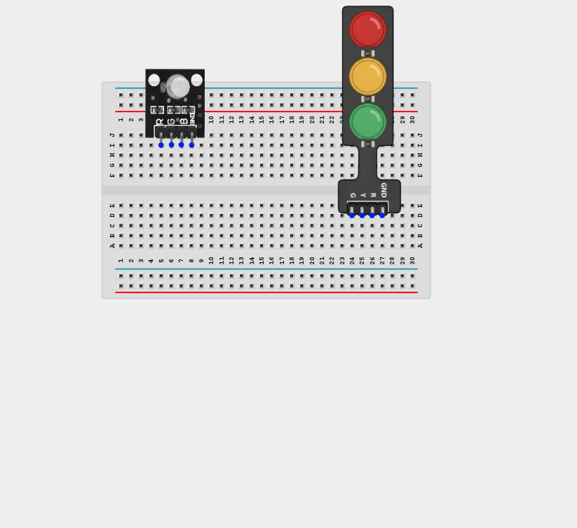

_**NB:** Make sure all components are securely placed on the breadboard with correct orientation._

## WIRING THE CIRCUIT

**Step 2:** Connect the Green LED pin of the Traffic Light Module to Digital Pin 4 on the Arduino Uno using male-to-male jumper wire.

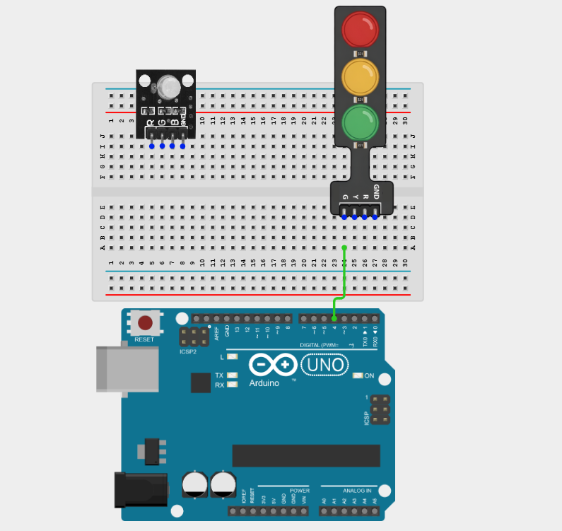

**Step 3:** Connect the Yellow LED pin of the Traffic Light Module to Digital Pin 5 on the Arduino Uno using male-to-male jumper wire.

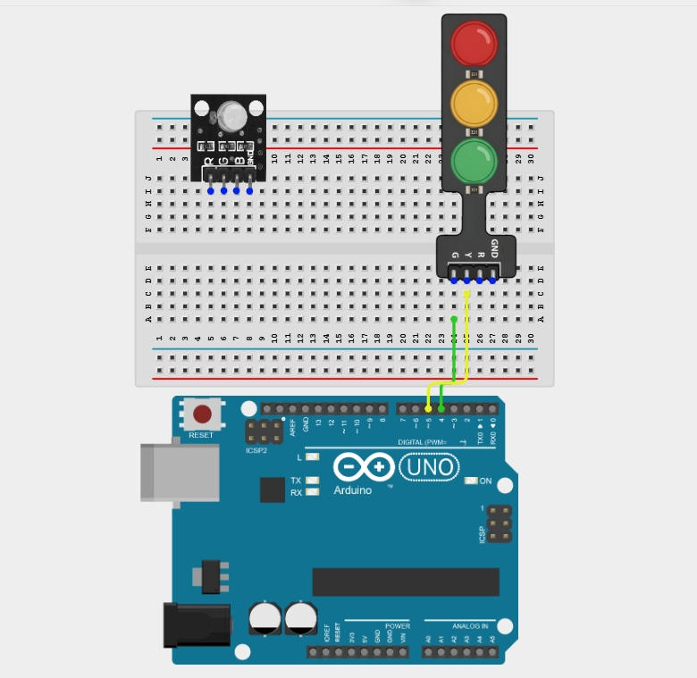

**Step 4:** Connect the Red LED pin of the Traffic Light Module to Digital Pin 6 on the Arduino Uno using male-to-male jumper wire.

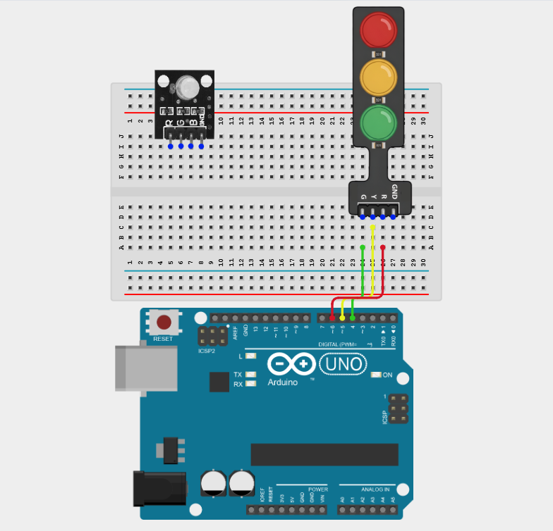

**Step 5:** Connect the GND pin of the Traffic Light Module to the GND pin on the Arduino Uno using a male-to-male jumper wire.

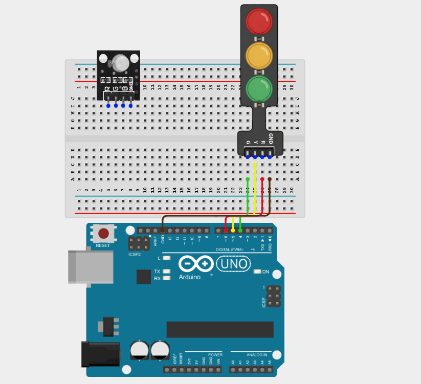

**Step 6:** Connect the GND pin of the RGB LED to the GND pin on the Arduino Uno using a male-to-male jumper wire.

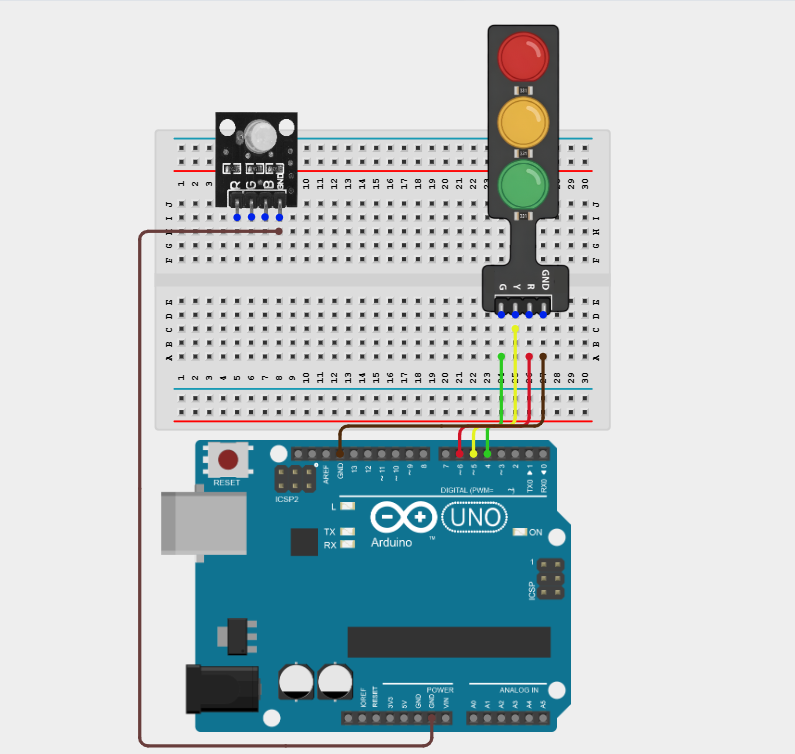

**Step 7:** Connect the Red (R) pin of the RGB LED to Digital Pin 9 on the Arduino Uno using a male-to-male jumper wire.

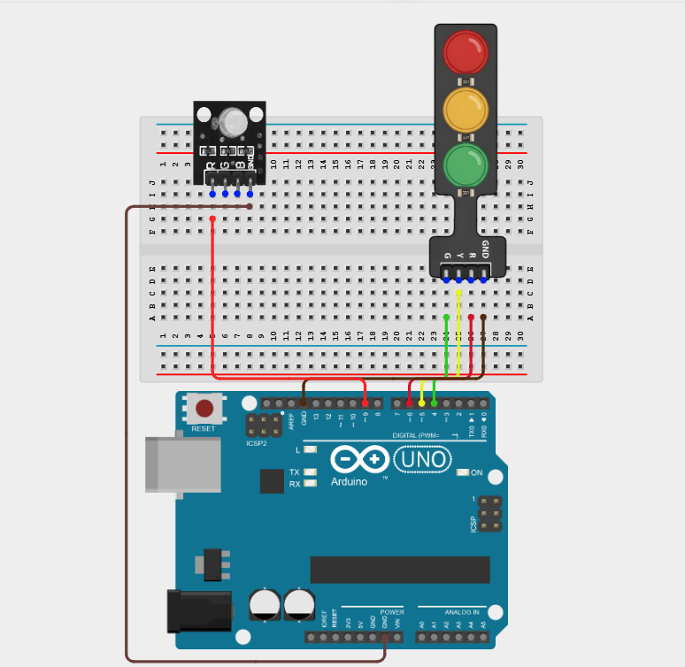

**Step 8:** Connect the Green (G) pin of the RGB LED to Digital Pin 10 on the Arduino Uno using a male-to-male jumper wire.

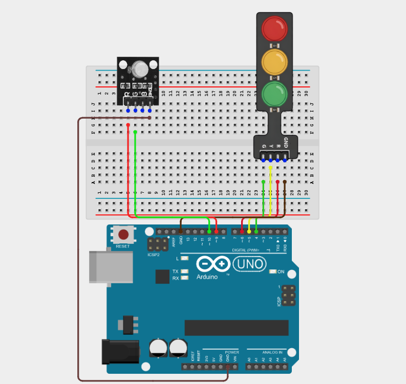

**Step 9:** Connect the Blue (B) pin of the RGB LED to Digital Pin 11 on the Arduino Uno using a male-to-male jumper wire.

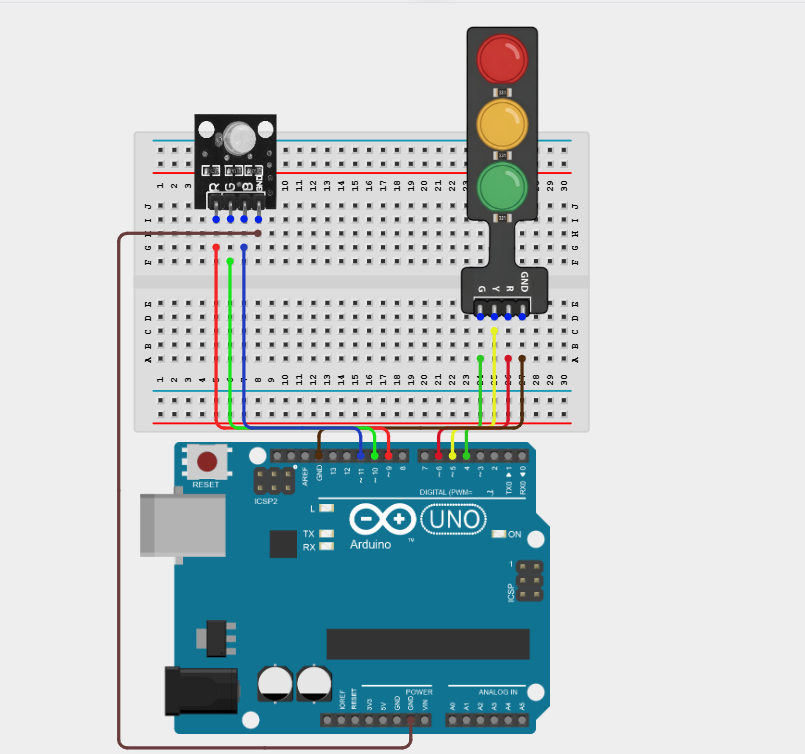

_Make sure to connect the Arduino USB cable to the Arduino board._

## PROGRAMMING

**Step 1:** Open your Arduino IDE. See how to set up here: [Getting Started](../../Getting Started/Arduino_IDE_Setup.md).

**Step 2:** Type the following code in your Arduino IDE: `const int greenA = 4;`, `const int yellowA = 5;`, `const int redA = 6;`, `const int redB = 9;`, `const int greenB = 10;`, `const int blueB = 11;` as shown in the image below.

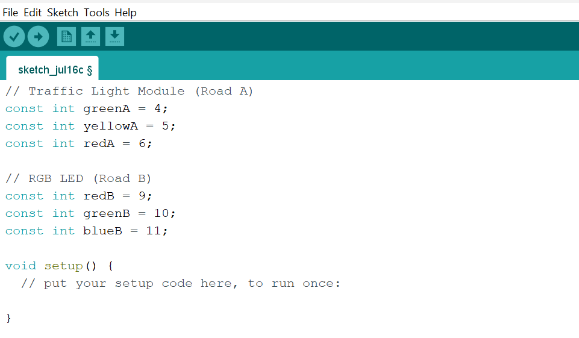

**Step 3:** Type the following code in your Arduino IDE inside the void setup() `pinMode(greenA, OUTPUT);`, `pinMode(yellowA, OUTPUT);`, `pinMode(redA, OUTPUT);`, `pinMode(redB, OUTPUT);`, `pinMode(greenB, OUTPUT);`, `pinMode(blueB, OUTPUT);` as shown in the image below.

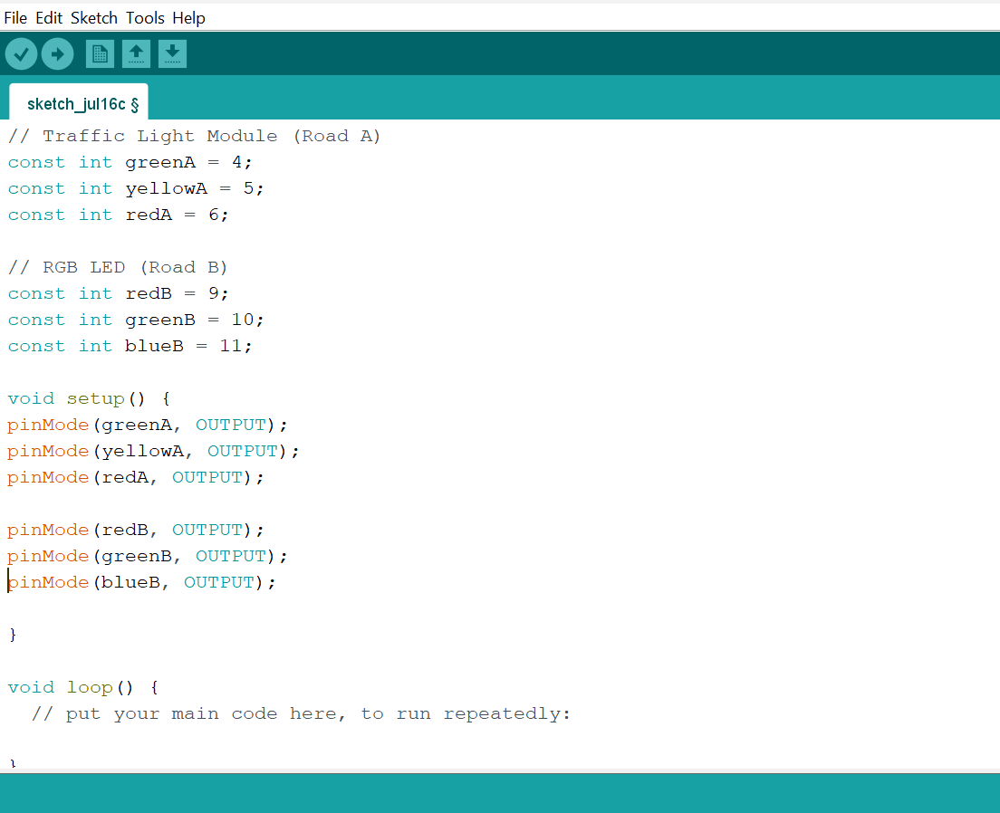

**Step 4:** Type the following code in your Arduino IDE inside the void loop() `digitalWrite(greenA, HIGH);`, `digitalWrite(yellowA, LOW);`, `digitalWrite(redA, LOW);`, `setColor(255, 0, 0);`, `delay(4000);`, `digitalWrite(greenA, LOW);`, `digitalWrite(yellowA, HIGH);`, `digitalWrite(redA, LOW);`, `setColor(255, 0, 0);`, `delay(2000);`  as shown in the image below.

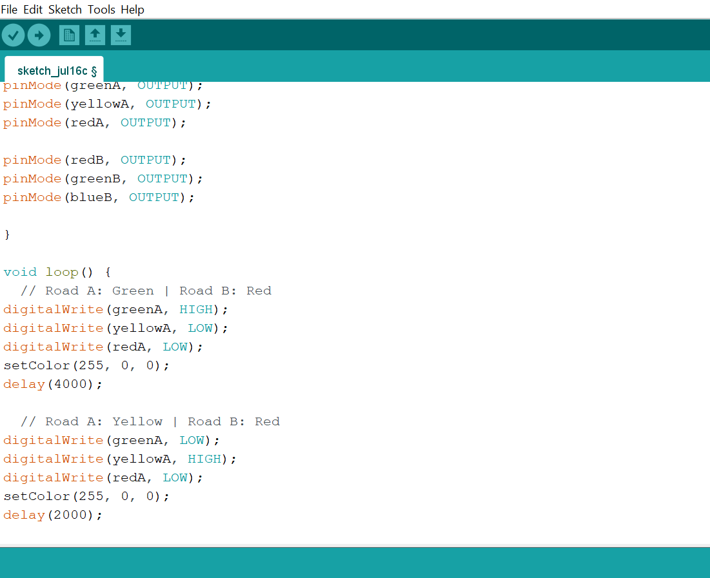

**Step 5:** Type the following code in your Arduino IDE inside the void loop() `digitalWrite(greenA, LOW);`, `digitalWrite(yellowA, LOW);`, `digitalWrite(redA, HIGH);`, `setColor(0, 255, 0);`, `delay(4000);`, `digitalWrite(greenA, LOW);`, `digitalWrite(yellowA, LOW);`, `digitalWrite(redA, HIGH);`, `setColor(255, 255, 0);`, `delay(2000);`, `void setColor(int red, int green, int blue) {`, `analogWrite(redB, red);`, `analogWrite(greenB, green);`, `analogWrite(blueB, blue); }`  as shown in the image below.

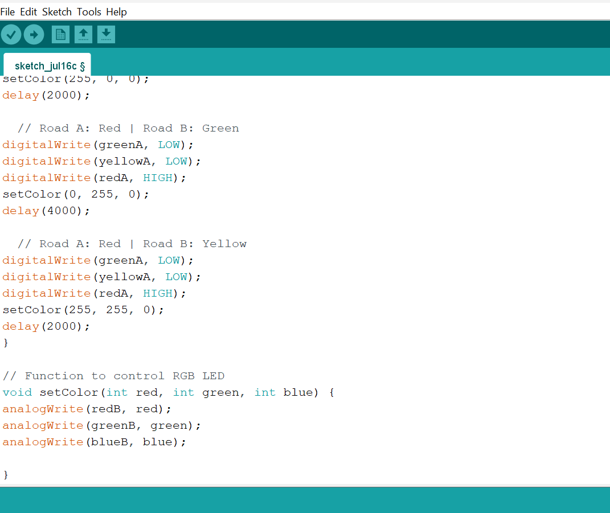

**Step 6:** Save your code. _See the [Getting Started](../../Getting Started/Arduino_IDE_Setup.md) section_

**Step 7:** Select the Arduino board and port. _See the [Getting Started](../../Getting Started/Arduino_IDE_Setup.md) section_

**Step 8:** Upload your code.

## CONCLUSION

This project helps learners understand how to combine multiple components with Arduino to create more complex interactive systems and automation solutions.

