# Project 2.6.1:Push Button with Buzzer

| **Description** | This project demonstrates how to create a simple circuit using a push button and a buzzer. When the push button is pressed, the buzzer produces a sound, making the project useful for alarm systems, doorbells, and alert notifications. |
| --------------- | ------------------------------------------------------------------------------------------------------------------------------------------------------------------------------------------------------------------------- |
| **Use case**    | This project can be used in a quiz competition system where contestants press the push button to activate the buzzer, indicating who answered first.                                                                                                                                                                    |

## Components (Things You will need)

| 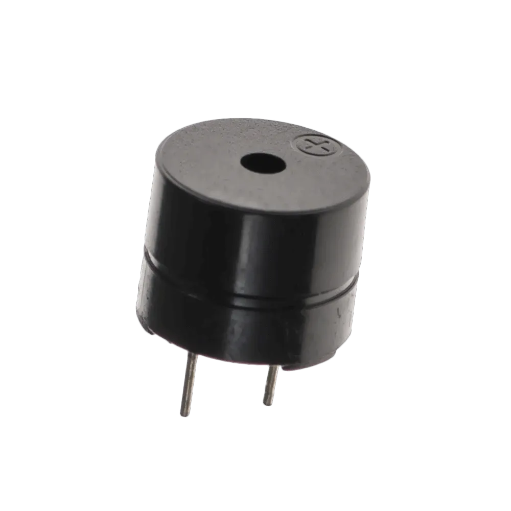 |  |  |  |  | 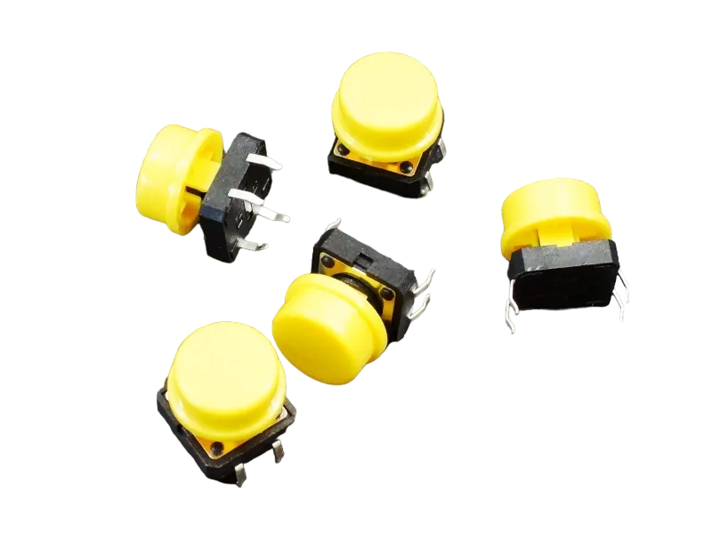 |
| --------------------------------------------------- | --------------------------------------------------- | ----------------------------------------------------------- | ----------------------------------------------------- | ------------------------------------------------------ | ------------------------------------------------------- |

## Building the circuit

Things Needed:

- Arduino Uno = 1
- Arduino USB cable = 1
- Buzzer = 1
- Red jumper wires = 2
- White jumper wire= 1
- Green jumper wire= 1

## Mounting the component on the breadboard

**Step 1:** Insert the push button by placing two pins on the breadboard as shown. Then insert the buzzer into row A on the breadboard, ensuring the longer pin (positive) is correctly aligned.

.

**Note:**Take note of where each of the pins are placed on the bread board


## WIRING THE CIRCUIT

**step 2:** Connect red jumper wire from the pin on row d of the push button to Digital Pin 2 on the Arduino Uno. Then connect the other pin on row d to GND on the Arduino Uno using the white jumper wire.

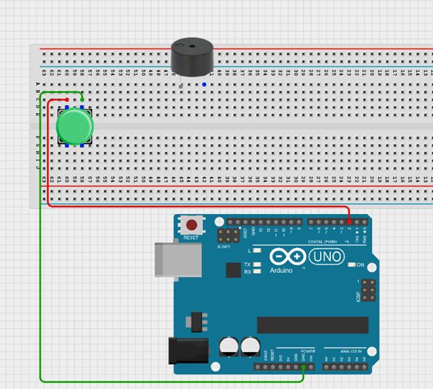.


**step 3:** Connect the positive pin of the buzzer to Digital Pin 3 on the Arduino Uno using the blue jumper wire. Then connect the negative pin of the buzzer to GND on the Arduino Uno using the green jumper wire.

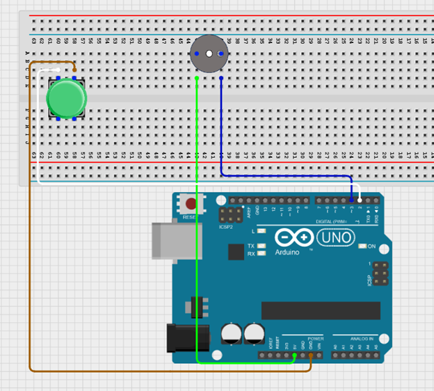.

<!-- **step 2:** White Wire: Connect one end to the other pin on row d and the other end to GND on the Arduino Uno  
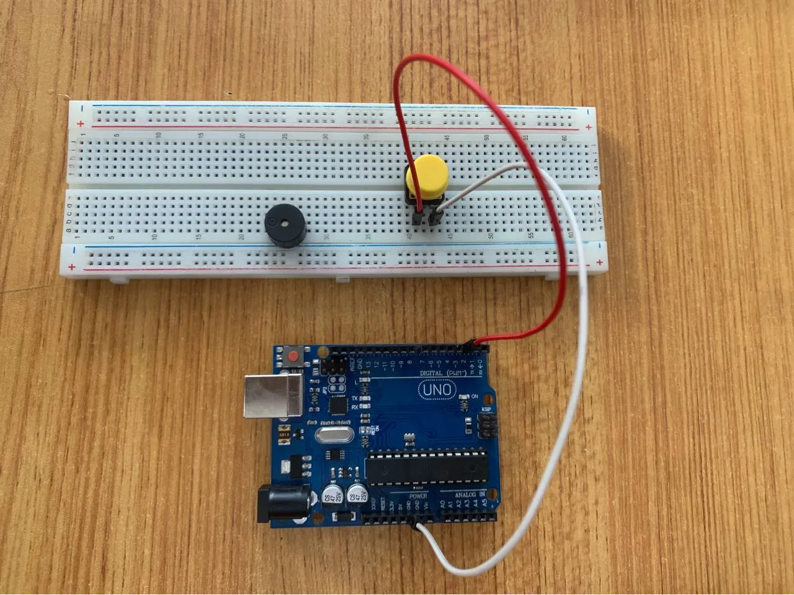.

**step 3:** Red Wire: Connect the positive pin of the buzzer to Digital Pin 3 on the Arduino Uno.  
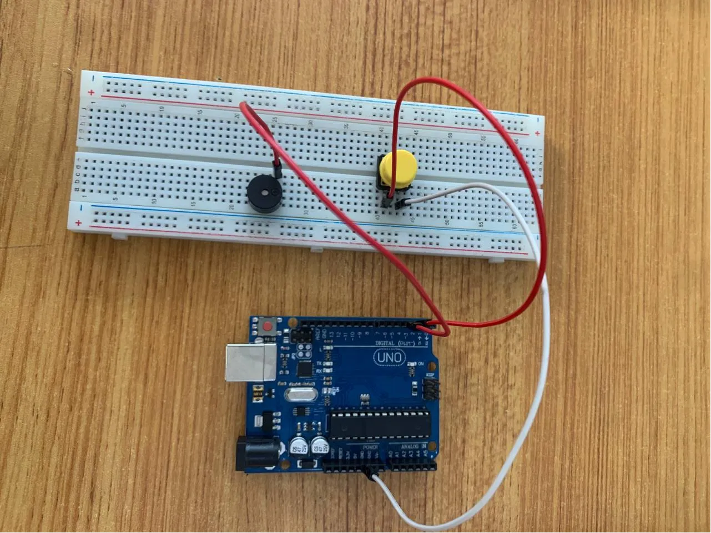 -->

<!-- **step 4:** Green Wire: Connect the negative pin of the buzzer to GND on the Arduino Uno  
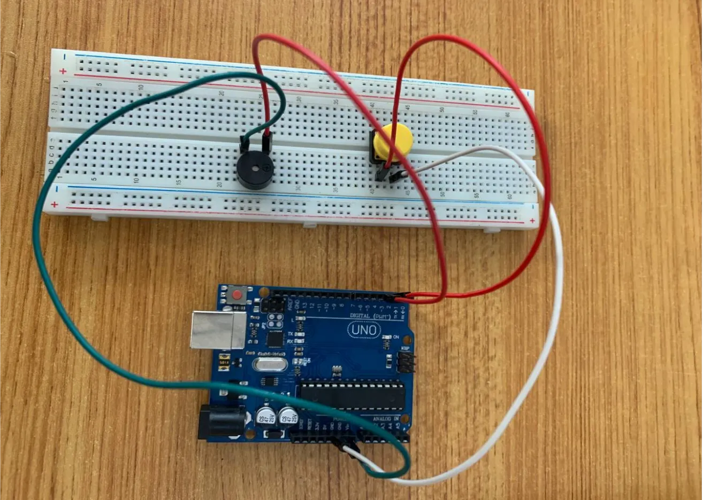 -->

<!-- **step 5:** Connect the one end of the white jumper wire to the GND of the Traffic light on the breadboard and the other end to GND on the Arduino UNO board.
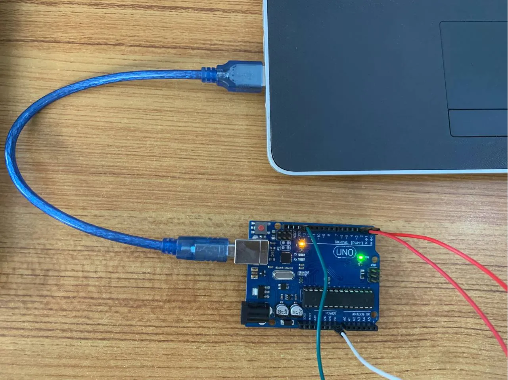 -->

## PROGRAMMING

**Step 1:** Open your Arduino IDE. See how to set up here: [Getting Started](../../Getting Started/Arduino_IDE_Setup.md).

**Step 2:** Type the following codes before the void setup function.

``` cpp
const int ButtonPin= 2;
```

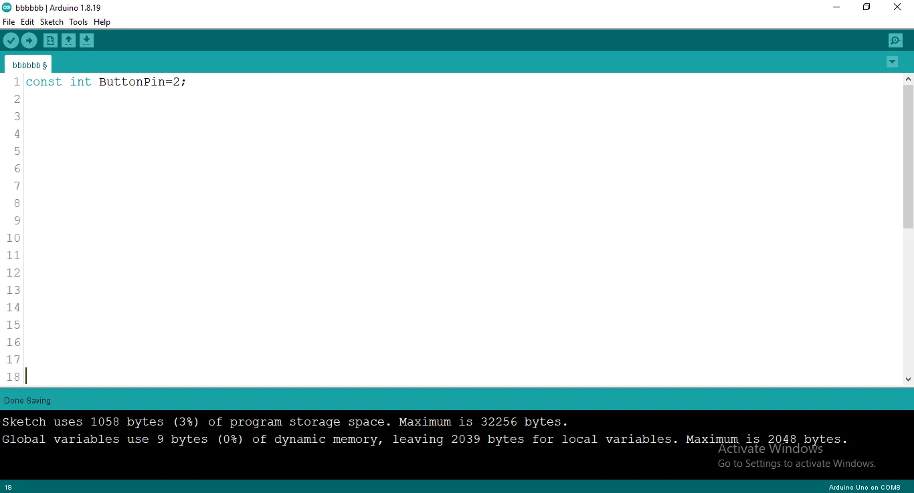.

**Step 3:** type`int B = 3;`as shown in the picture below.

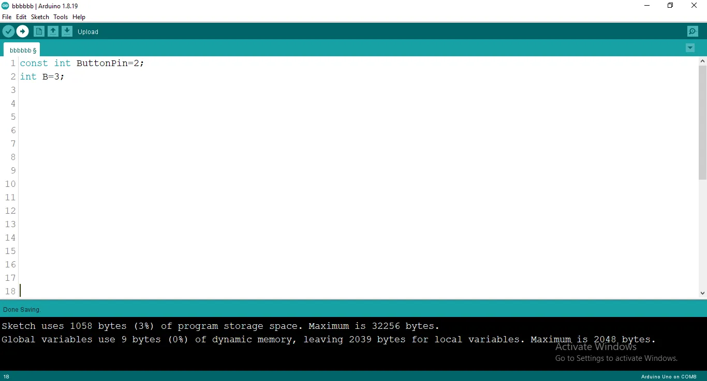.

**Step 4:** Type `int buttonState= 0;` as shown in the picture below.
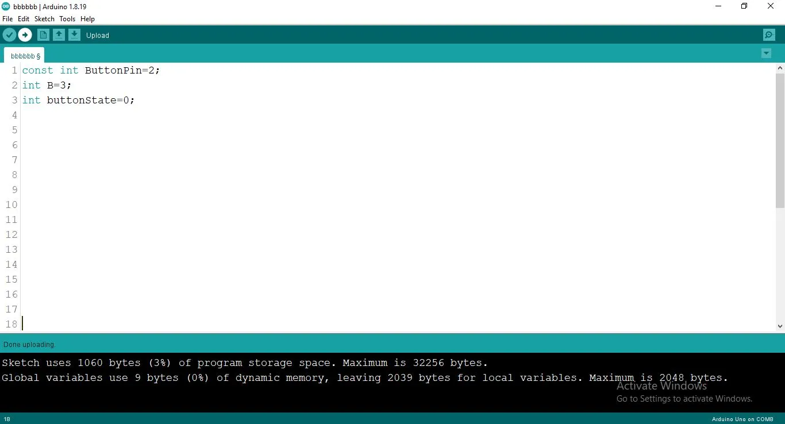.

**Step 5:** After the void setup ()within the curly brackets type the following codes.

``` cpp
pinMode (ButtonPin, INTPUT_PULLUP);
pinMode (B, OUTPUT);
```

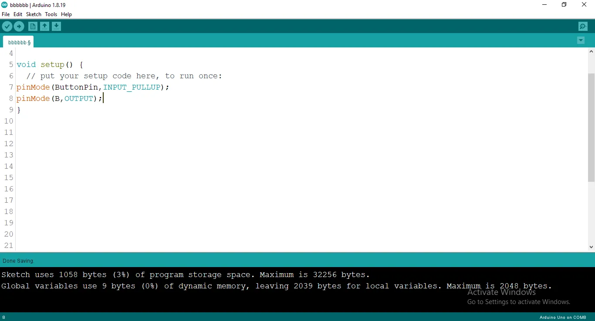.

**Step 6:** : After the (void loop ()) within the curly brackets type

``` cpp
buttonState = digitalRead(ButtonPin);
```

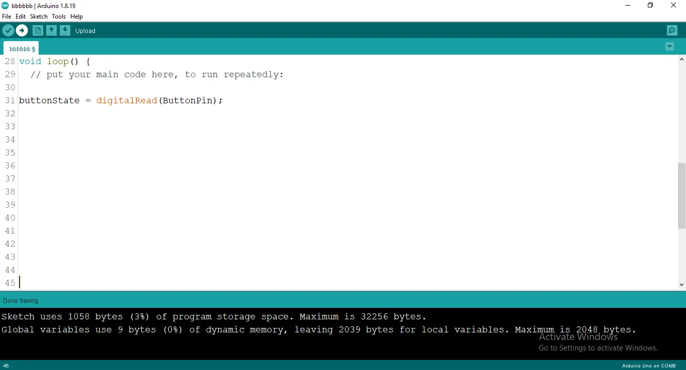.

**Step 7:** :Now let type

``` cpp
 if (buttonState == LOW) {
digitalWrite (B, HIGH);
delay (500);
digitalWrite (B, LOW);
}
```

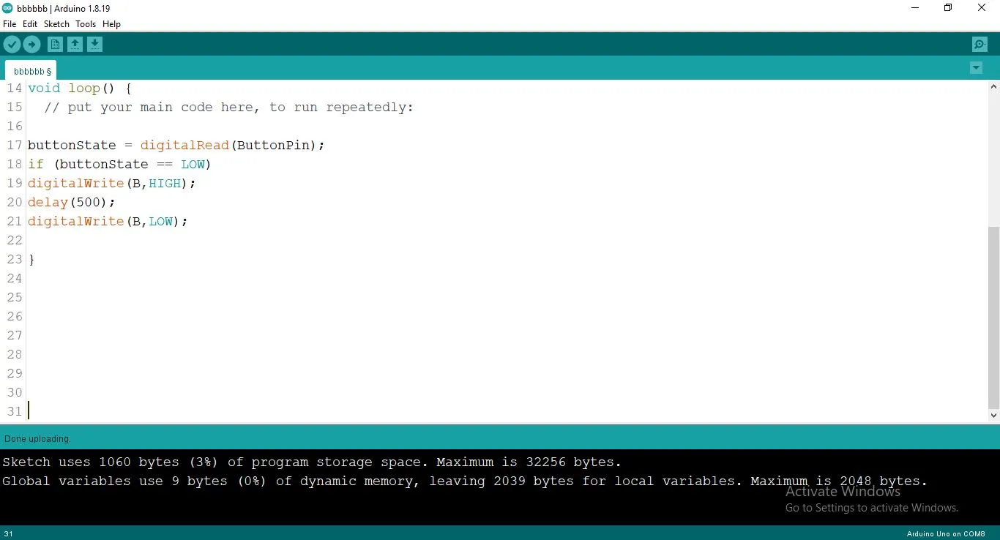.

**Step 8:** After all you are expercted to see this code.

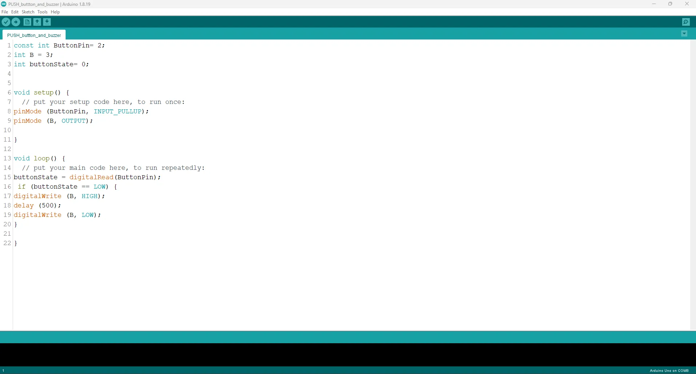.

## Uploading the code

**Step 1:** Save your code. _See the [Getting Started](../../Getting Started/Arduino_IDE_Setup.md) section_

**Step 2:** Select the arduino board and port _See the [Getting Started](../../Getting Started/Arduino_IDE_Setup.md) section:Selecting Arduino Board Type and Uploading your code_.

**Step 3:** Upload your code. _See the [Getting Started](../../Getting Started/Arduino_IDE_Setup.md) section:Selecting Arduino Board Type and Uploading your code_

## CONCLUSION

If any issues arise during the upload, recheck the wiring and code for errors. Upon successful testing, this project demonstrates how to use a push button to control a buzzer, laying the foundation for interactive systems.

