# Project 2.4.1: LDR with RGB

| **Description** | This project teaches you how to use a Light Dependent Resistor (LDR) to detect changes in ambient light intensity and control an RGB LED accordingly. The Arduino continuously reads the amount of light falling on the sensor and changes the RGB LED colour based on the detected light level. Through this project, you will understand how light sensors work, how analog sensor values are read, and how environmental conditions can be used to automate electronic systems.  |
|------------------|----------------------------------------------------------------|
| **Use case**     | Light-sensitive systems such as automatic streetlights, smart home lighting, garden lights, security lighting, daylight monitoring systems, and environmental sensing devices that respond to changes in surrounding light conditions.|

## Components (Things You will need)

|  |  |  |  | 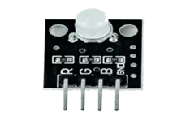 | |
|-------------------------|-------------------------|-------------------------|-------------------------|-------------------------|-------------------------|

## Building the circuit

Things Needed:

- Arduino Uno = 1  
- Arduino USB cable = 1
- Light dependent resistor   = 1
- RGB = 1
- Jumper Wires = 8


## Mounting the component on the breadboard

**Step 1:** Take the LDR Module and the breadboard and insert the LDR Module into the horizontal connectors on the breadboard.

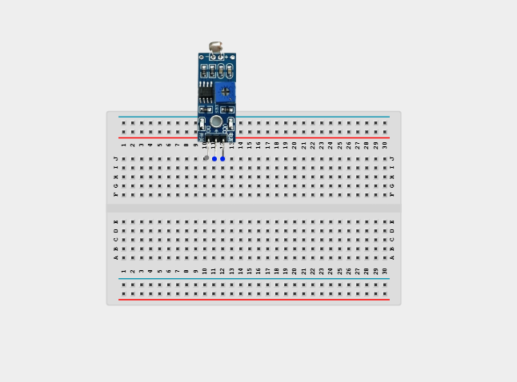

**Step 2:** Take the RGB module and insert it into the horizontal connectors on the breadboard.

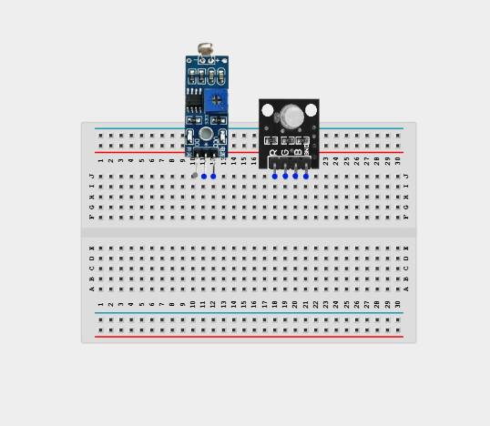


## WIRING THE COMPONENTS

**Step 1:** Connect one end of the wire to the “VCC” port on the LDR module and the other end to the “5V” port on the Arduino UNO.

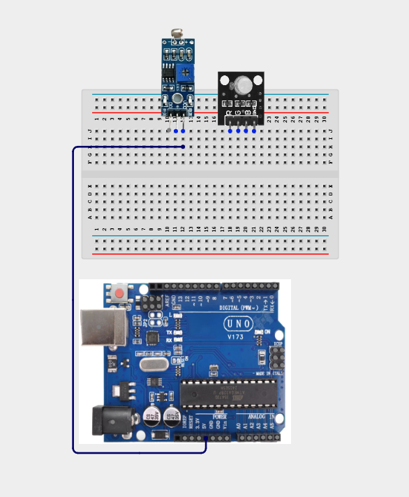


**Step 2:** Connect one end of the wire to the “GND” hole on the Arduino UNO and the other end to the “GND” port on the LDR module.

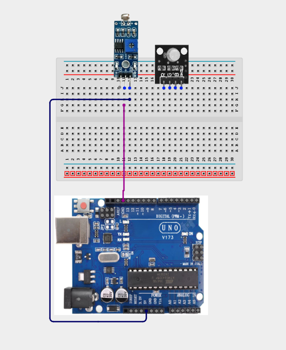

**Step 3:** Connect one end of the wire to the “DO” hole on the LDR module and the other end to hole number 8 on the Arduino UNO.

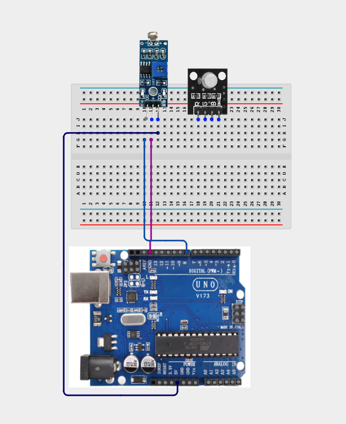

**Step 4:** Connect one end of the wire to the “A0” port on the Arduino UNO to the “A0” port on the resistor

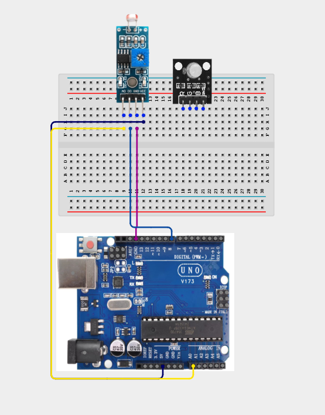

**Step 5:** Connect one end of the wire to the port labelled “R” on the RGB connect the other end to digital pin 5 on the Arduino UNO.

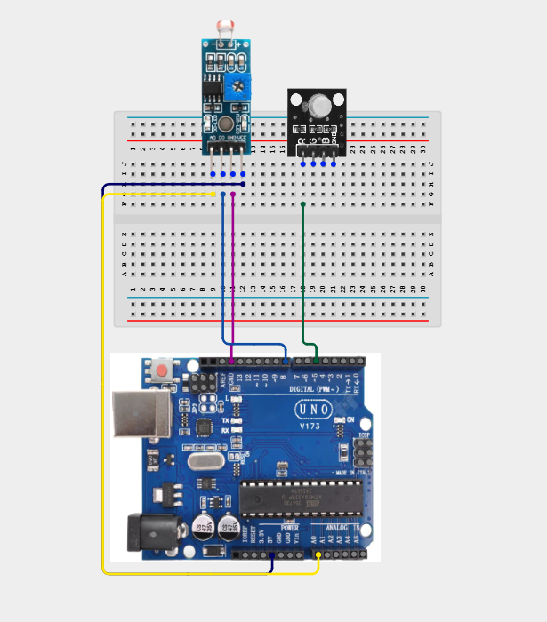

**Step 6:** Connect one end of the wire to the port labelled “G” on the RGB and connect the other end to digital pin 6 on the Arduino UNO.

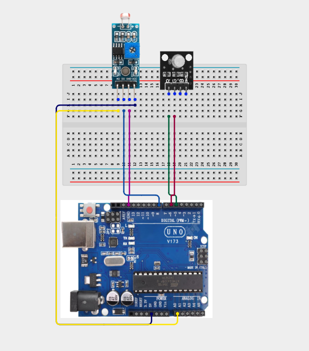

**Step 7:** Connect one end of the wire to the port labelled “B” on the RGB and connect the other end to digital pin 7 on the Arduino UNO.

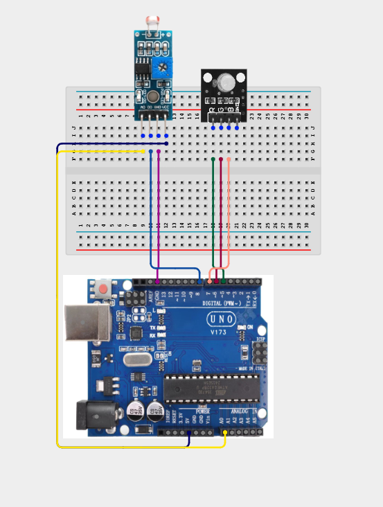

**Step 8:** Connect one end of the wire to the port labelled “-” on the RGB and connect the other end to the “GND” on the Arduino UNO.

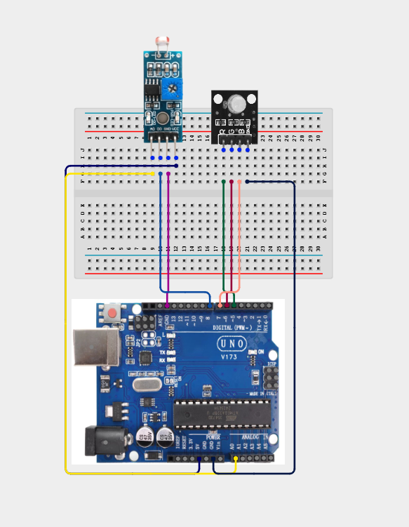


## PROGRAMMING

**Step 1:** Open your Arduino IDE. See how to set up here: [Getting Started](../../Getting Started/Arduino_IDE_Setup.md).

**Step 2:** Type ``` const int LDR_PIN = A0;``` as shown below in the image.


**Step 3:** Type ``` const int DO_PIN = 8; ``` as shown below in the image.


**Step 4:** Type ``` const int RED_PIN = 5; ``` as shown below in the image.


**Step 5:** Type ``` const int GREEN_PIN = 6; ``` as shown below in the image.


**Step 6:** Type ``` const int BLUE_PIN = 6; ``` as shown below in the image.

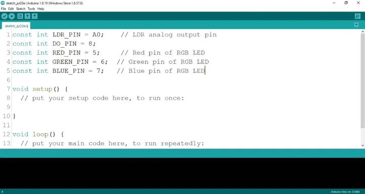


**Step 7:** Type ``` int 1drValue; ``` as shown below in the image.

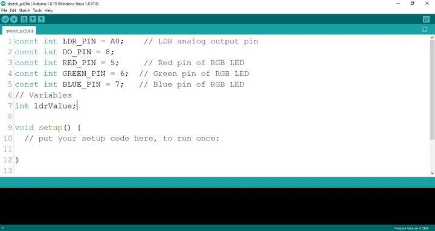

**Step 8:** Type ``` int redValue, greenValue, blueValue; ``` as shown below in the image.

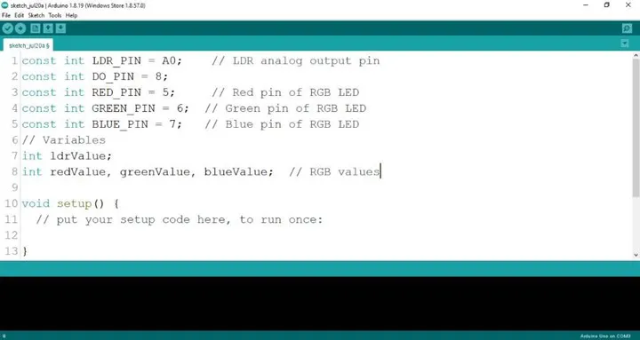

**Step 9:** Type ``` pinMode (DO_PIN, INPUT); ``` as shown below in the image.

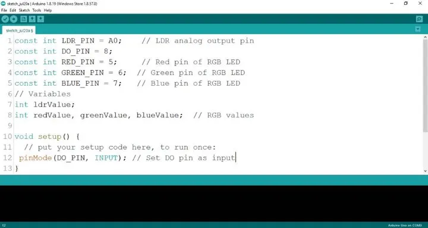

**Step 10:** Type ``` Serial.begin(9600); ``` as shown below in the image.

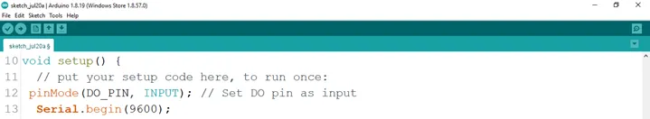

**Step 11:** Type ``` pinMode (RED_PIN, OUTPUT); ``` as shown below in the image.

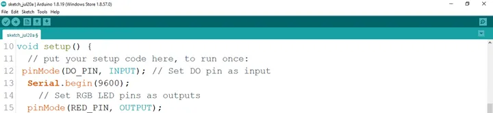

**Step 12:** Type ``` pinMode (GREEN_PIN, OUTPUT); ``` as shown below in the image.

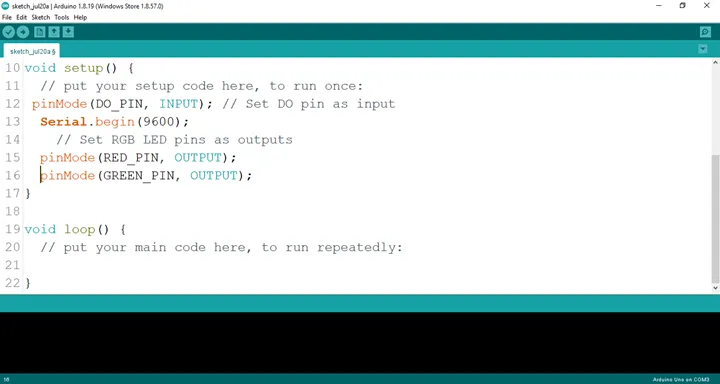

**Step 13:** Type ``` pinMode (BlUE_PIN, OUTPUT); ``` as shown below in the image.

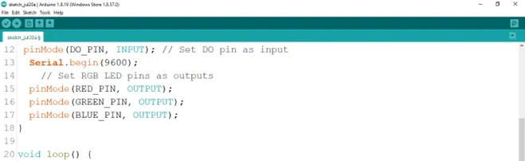

**Step 14:** Type ```ldrValue = analogRead (LDR_PIN) ; ``` as shown below in the image.

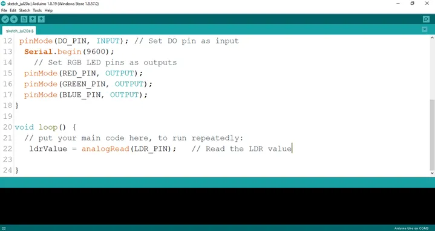

**Step 15:** Type ```int digitalValue = digitalRead (DO_PIN)``` as shown below in the image.

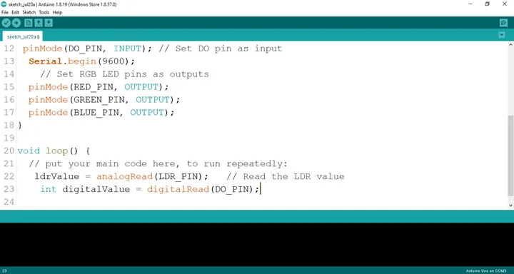

**Step 16:** Type ```Serial.print (“Analog Value:”); ``` as shown below in the image.

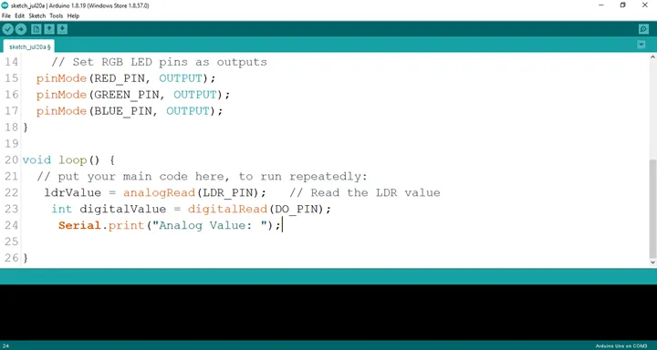

**Step 17:** Type ```Serial.printIn (ldrValue); ``` as shown below in the image.

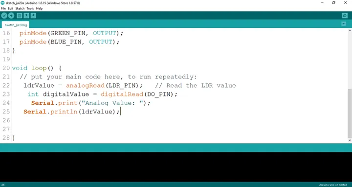.

**Step 18:** Type ```Serial.printIn (“Digital Value:”); ``` as shown below in the image.

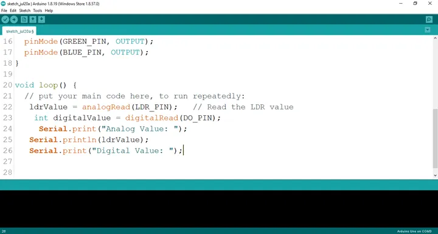.

**Step 19:** Type ```if (ldrValue < 100) {; ``` as shown below in the image.

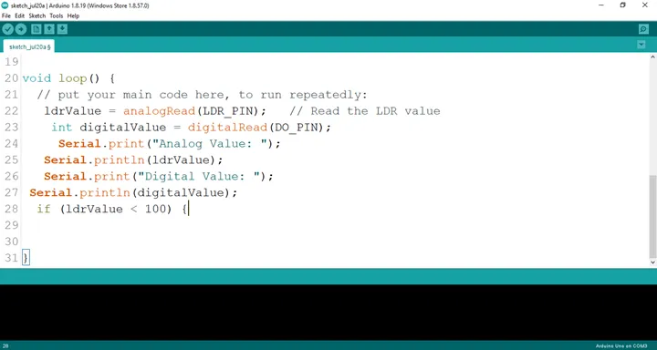.

**Step 20:** Type 
``` cpp
digitalWrite (RED_PIN, HIGH);
delay (200);
digitalWrite (RED_PIN, LOW);
delay (200); 
 ```
 as shown below in the image.

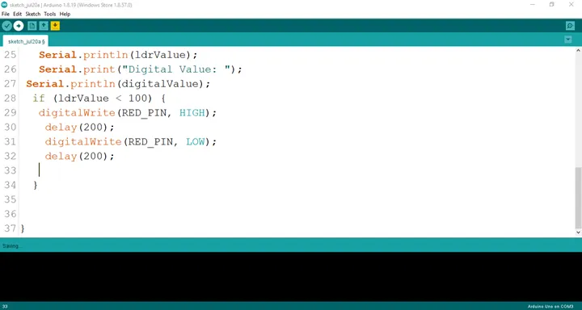

**Step 21:** Type 
``` cpp
digitalWrite (BLUE_PIN, HIGH);
delay (200);
digitalWrite (BLUE_PIN, LOW);
delay (200); 
```
 as shown below in the image.

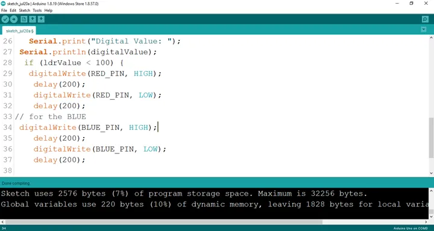.

**Step 22:** Type
``` cpp
digitalWrite (GREEN_PIN, HIGH);
delay (200);
digitalWrite (GREEN_PIN, LOW);
delay (200); 
```
as shown below in the image.

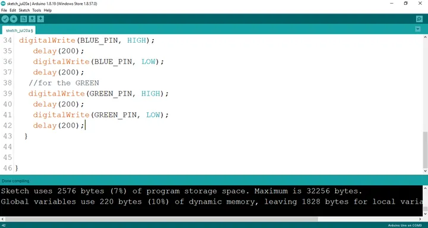.

**Step 23:** Type
 ``` cpp
digitalWrite (BLUE_PIN, HIGH);
digitalWrite (RED_PIN, LOW);
digitalWrite (GREEN_PIN, LOW);  
```  
as shown below in the image.


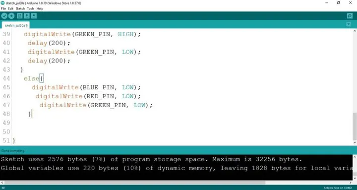

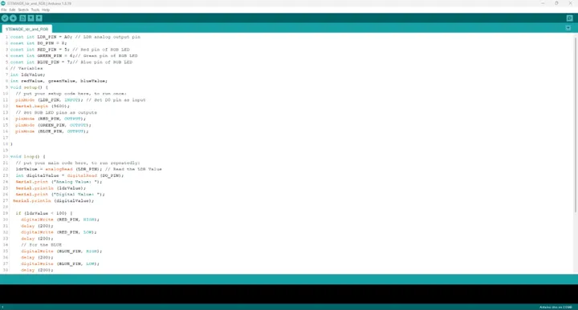

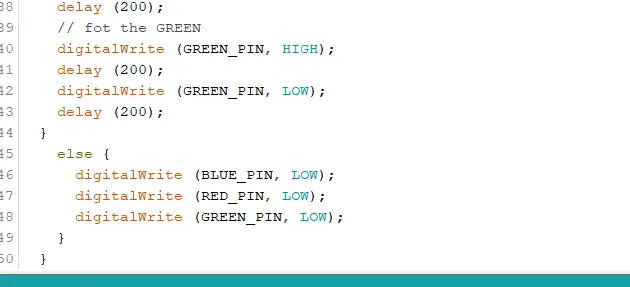


## CONCLUSION
Congratulations! You have successfully built a light-sensitive system using an LDR module and an RGB LED with the Arduino Uno. In this project, you learned how to read analog light intensity values from an LDR, detect changes in ambient lighting, and use those readings to control the colours of an RGB LED. These concepts form the foundation of many real-world automation systems, including smart lighting, security systems, and environmental monitoring devices. Continue experimenting by adjusting the light threshold values or creating your own colour patterns to further develop your Arduino programming and sensor integration skills.
