# Project 2.12.1: Traffic Light with LDR

| **Description** | Learn how to use a Light Dependent Resistor (LDR) to detect changes in light intensity and automatically control a traffic light module. This project demonstrates how sensors enable smart automation by allowing electronic systems to respond to their environment. |
|------------------|----------------------------------------------------------------|
| **Use case**     | Automatic streetlights, smart outdoor lighting, parking lot lights, tunnel lighting systems, and other applications that operate based on surrounding light conditions. |

## Components (Things You will need)

|  |  |  ||||
|-------------------------|-------------------------|-------------------------|-------------------------|-------------------------|--------------------------|

## Building the circuit

Things Needed:

- Arduino Uno = 1  
- Arduino USB cable = 1
- Light dependent resistor   = 1
- Traffic module= 1
- Jumper Wires

## Mounting the component on the breadboard

**Step 1:** Take the light-dependent resistor and the breadboard and insert the light-dependent resistor into the horizontal connectors on the breadboard.


**Step 2:** Take the traffic light and insert it into the horizontal connectors on the breadboard.

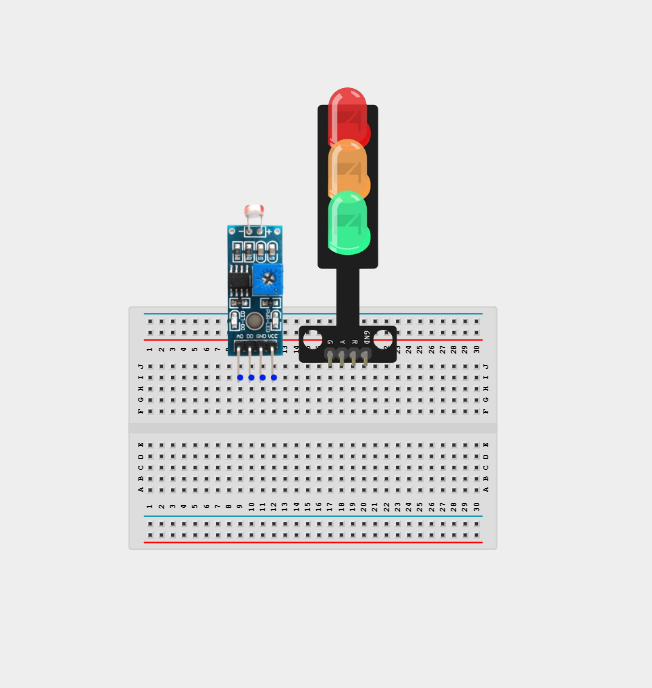


## WIRING THE COMPONENTS

**Step 1:** Connect one end of the wire to the “VCC” port on the LDR module and the other end to the “5V” port on the Arduino UNO.

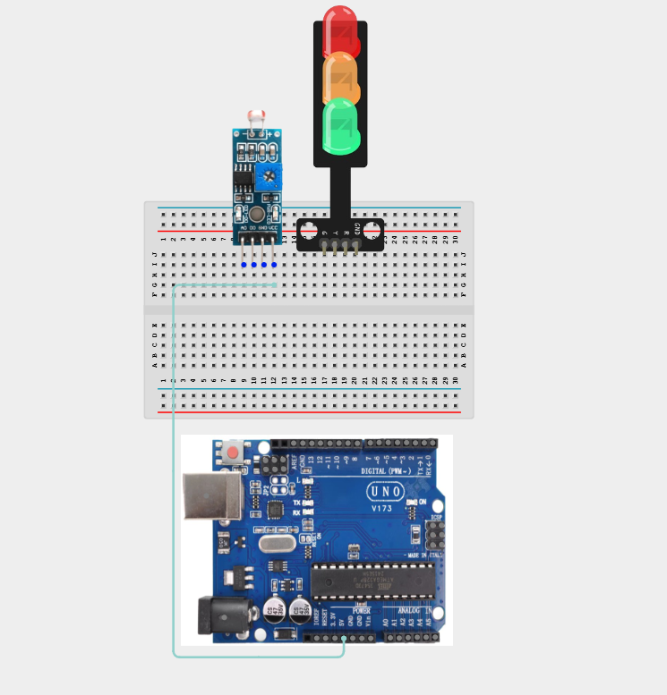


**Step 2:** Connect one end of the wire to the “GND” hole on the Arduino UNO and the other end to the “GND” port on the LDR module.

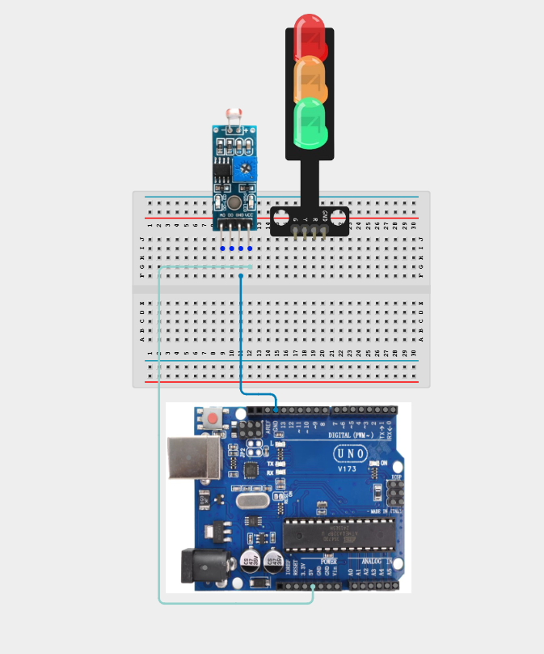

**Step 3:** Connect one end of the wire to the “DO” hole on the LDR resistors and the other end to hole number 8 on the Arduino UNO.

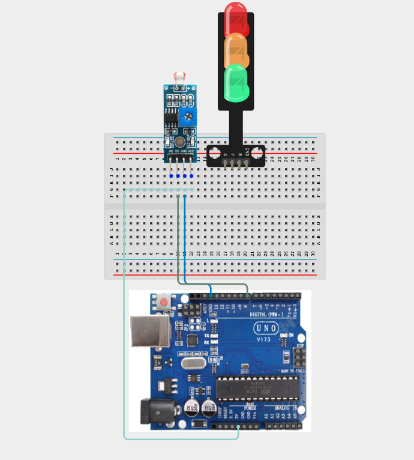

**Step 4:** Connect one end of the wire to the “AO” port on the Arduino UNO to the “AO” port on the LDR module.

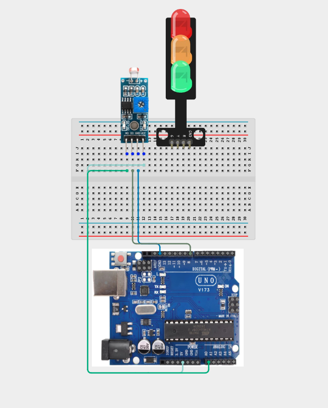

**Step 5:** Connect one end of the wire to the port labelled “R” on the traffic light and connect the other end to digital pin 5 on the Arduino UNO.
p
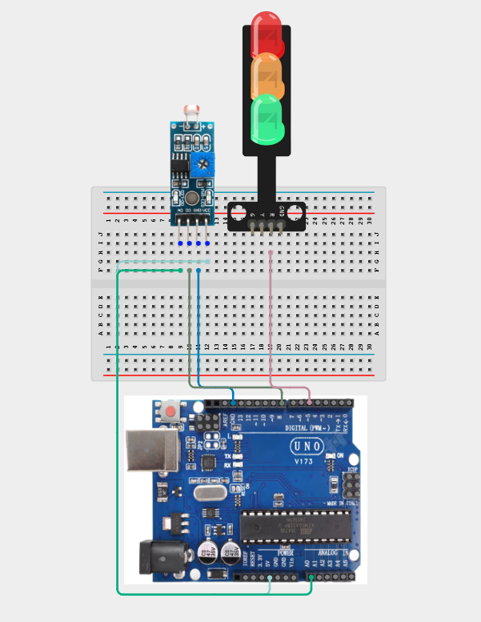

**Step 6:** Connect one end of the wire to the port labelled “Y” on the traffic light and connect the other end to digital pin 6 on the Arduino UNO.

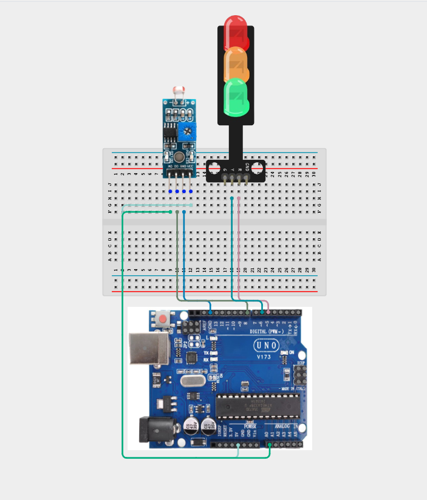

**Step 7:**Connect one end of the wire to the port labelled “G” on the traffic light and connect the other end to digital pin 7 on the Arduino UNO.

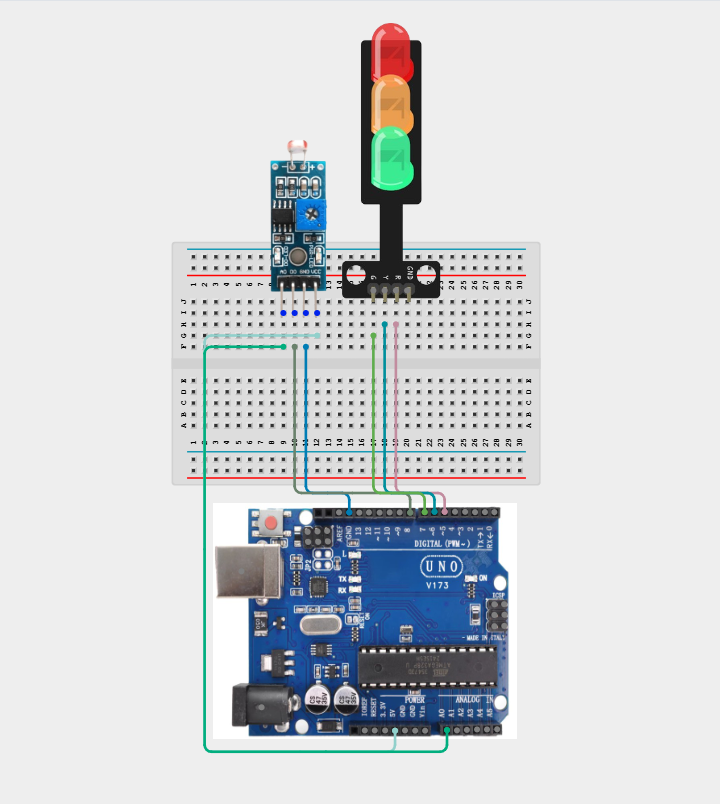

**Step 8:** Connect one end of the wire to the port labelled “GND” on the traffic light and connect the other end to the “GND” on the Arduino UNO.


## PROGRAMMING

**Step 1:** Open your Arduino IDE. See how to set up here: [Getting Started](../../Getting Started/Arduino_IDE_Setup.md).

**Step 2:** Type ``` const int LDR_PIN = A0;``` as shown below in the image

_**NB:** Make sure you avoid errors when typing. Do not omit any character or symbol especially the bracket { }  and semicolons ;  and place them as you see in the image . The code that comes after the two ash backslashes “//” are called comments. They are not part of the code that will be run, they only explain the lines of code. You can avoid typing them._

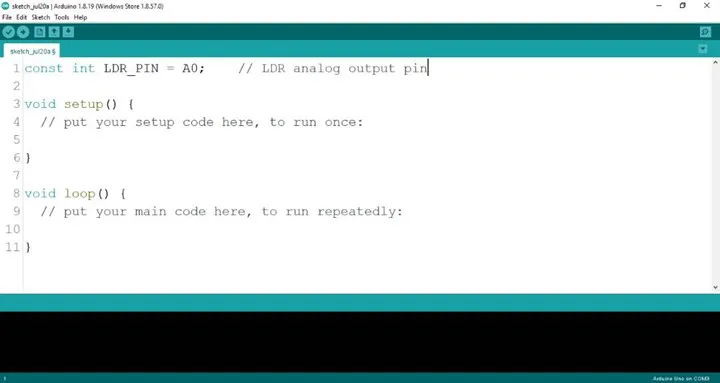

**Step 3:** Type ``` const int DO_PIN = 8; ``` as shown below in the image.

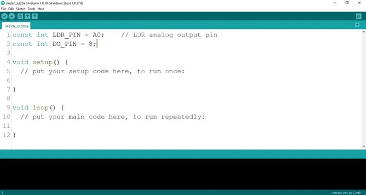

**Step 4:** Type ``` const int RED_PIN = 5; ``` as shown below in the image.

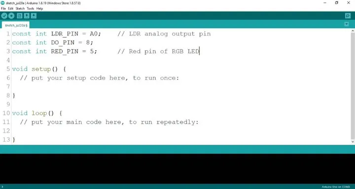

**Step 5:** Type ``` const int GREEN_PIN = 6; ``` as shown below in the image.

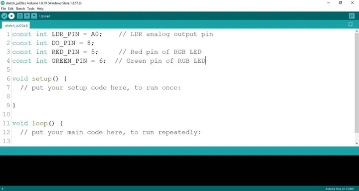


**Step 6:** Type ``` const int YELLOW_PIN = 7; ``` as shown below in the image.

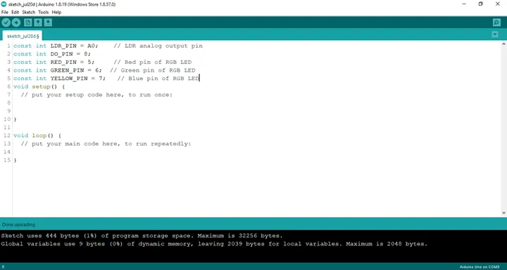


**Step 7:** Type ``` int 1drValue; ``` as shown below in the image.

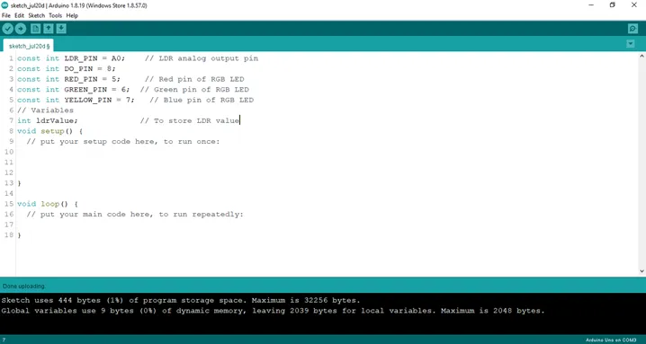


**Step 8:** Type ``` int digitalValue; ``` as shown below in the image.

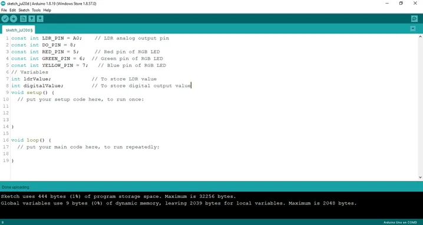

**Step 9:** Type ``` int redValue, greenValue, blueValue; ``` as shown below in the image.

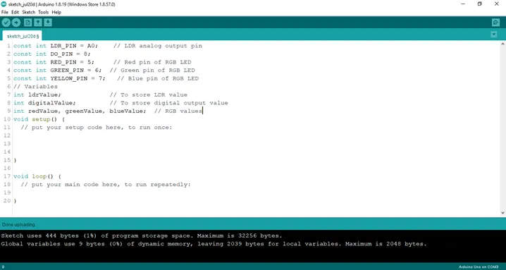

**Step 10:** Type ``` pinMode (DO_PIN, INPUT); ``` as shown below in the image.

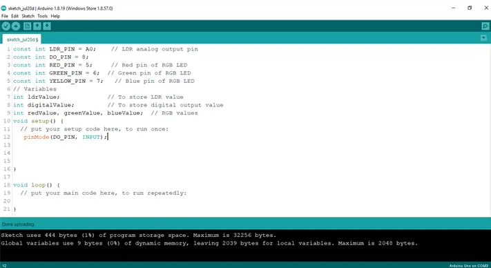

**Step 11:** Type ``` Serial.begin(9600); ``` as shown below in the image.


**Step 12:** Type ``` pinMode (RED_PIN, OUTPUT); ``` as shown below in the image.

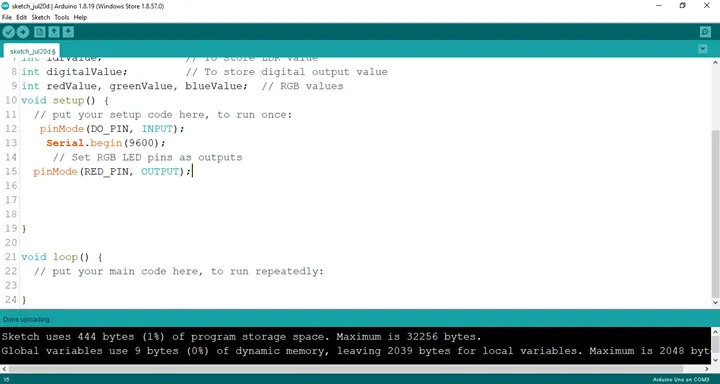

**Step 13:** Type ``` pinMode (GREEN_PIN, OUTPUT); ``` as shown below in the image.

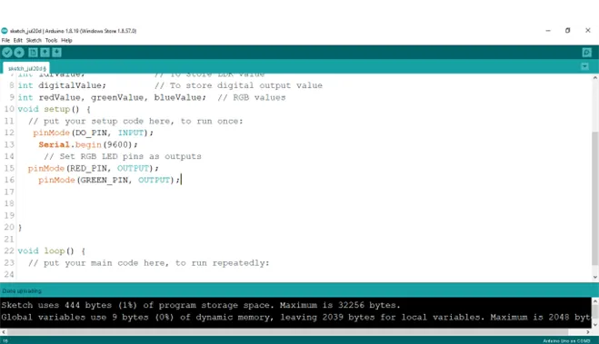

**Step 14:** Type ``` pinMode (YELLOW_PIN, OUTPUT); ``` as shown below in the image.

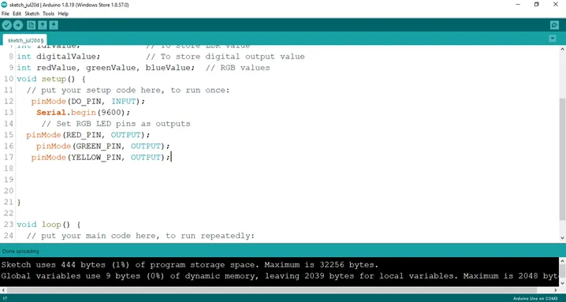

**Step 15:** Type 
```cpp

Serial.print (“Analog Value:”);
	          Serial.printIn (ldrValue);
		       Serial.printIn (“Digital Value:”);
		       Serial.printIn (digitalValue);
             ; 
```
 as shown below in the image.

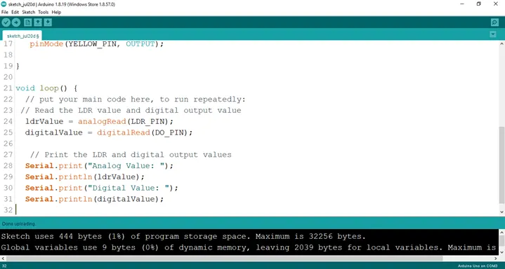

**Step 16:** Type 

```cpp
if (ldrValue < 100) {
		  digitalWrite (RED_PIN, HIGH);
		  delay (1000);
	     digitalWrite (RED_PIN, LOW);
		  delay (1000);
		  digitalWrite (GREEN_PIN, HIGH);
		  delay (1000);
		  digitalWrite (GREEN_PIN, LOW);
		  delay (1000);
		  digitalWrite (YELLOW_PIN, HIGH);
		  delay (1000);
		  digitalWrite (YELLOW_PIN, LOW);
		  delay (1000);
             } as shown below in the image.
```
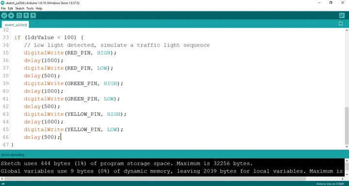

**Step 17:** Type 
   ```cpp
else {
        digitalWrite (RED_PIN, LOW);
        digitalWrite (GREEN_PIN, LOW); 
        digitalWrite (YELLOW_PIN, LOW) ; } as shown below in the image.
  ```
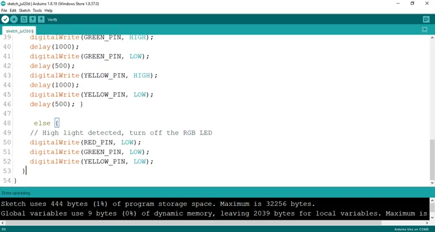

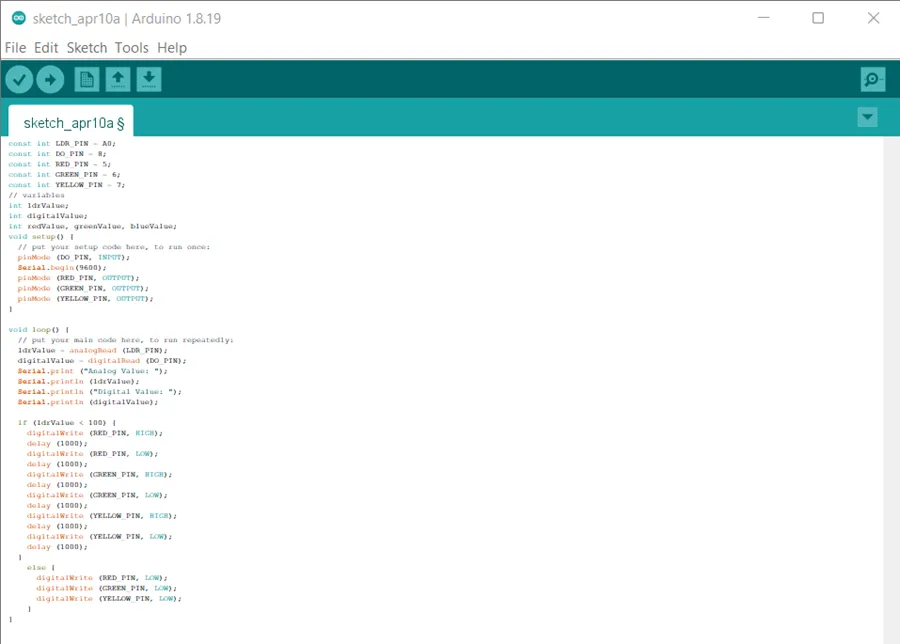


## CONCLUSION
You have successfully built a smart traffic light system that uses a Light Dependent Resistor (LDR) to detect changes in ambient light. You learned how to read analog sensor values, control multiple LEDs, and make decisions using conditional statements (if...else).

This project demonstrates one of the fundamental concepts in embedded systems and the Internet of Things (IoT): using sensors to automate real-world devices. Experiment by changing the light threshold or modifying the traffic light sequence to explore how sensor-based automation works.
