# Project 2.5.2: Solar-Sensing Streetlight

| **Description** | This project uses an LDR to detect ambient light levels and controls a Traffic Light Module to display Green (sunny), Yellow (dusk/dawn), or Red (night) based on the light intensity. |
|------------------|----------------------------------------------------------------|
| **Use case**     | This project can be used in automation systems, interactive installations, and embedded control applications. |

## Components (Things You will need)

| | | | | 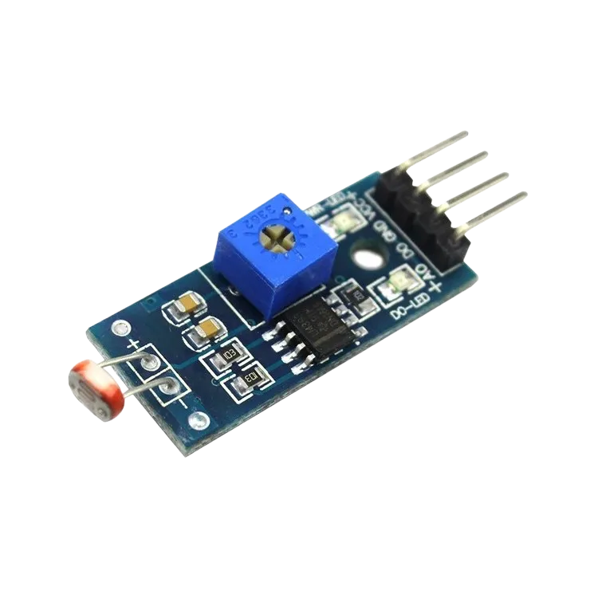| |
|-------------------------|-------------------------|-------------------------|-------------------------|-------------------------|-------------------------|

## Building the circuit

Things Needed:

- Arduino Uno 
- Arduino USB cable 
- LDR module 
- Traffic light module 
- Jumper wires 

## Mounting the component on the breadboard and wiring the circuit.

**Step 1:** Place the LDR on the breadboard.

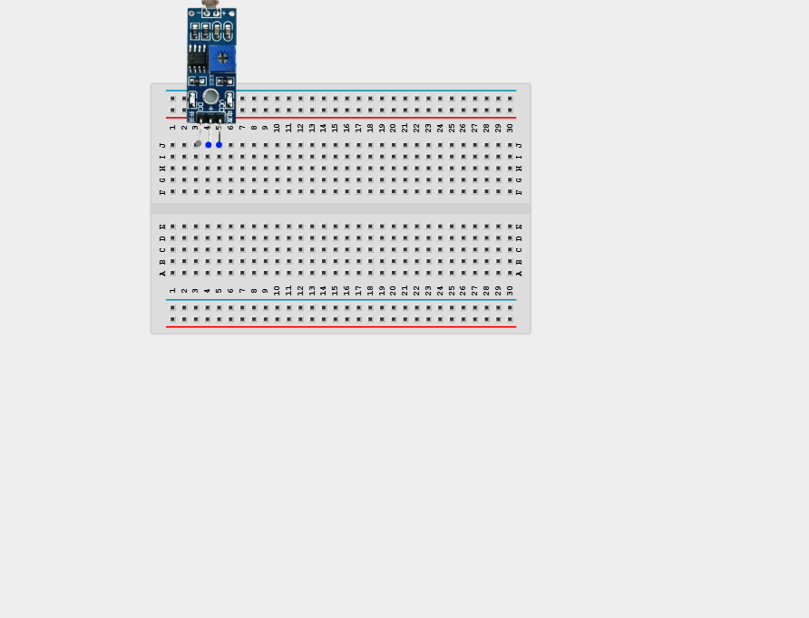

**Step 2:** Connect a jumper wire from VCC of the LDR to the Arduino 5V pin.

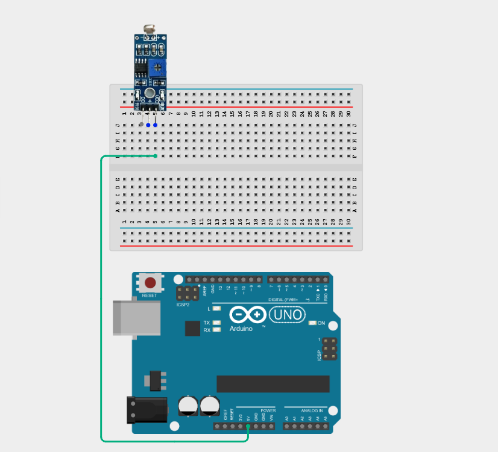

**Step 3:** Connect a jumper wire from D0 of the LDR to Digital pin 11 on the Arduino uno board.

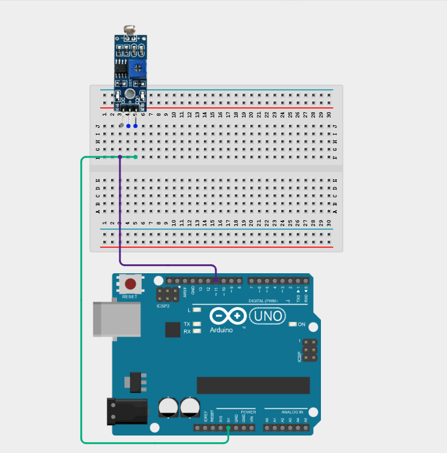

**Step 4:** Connect a jumper wire from GND(+) of the LDR to GND on the Arduino uno board.

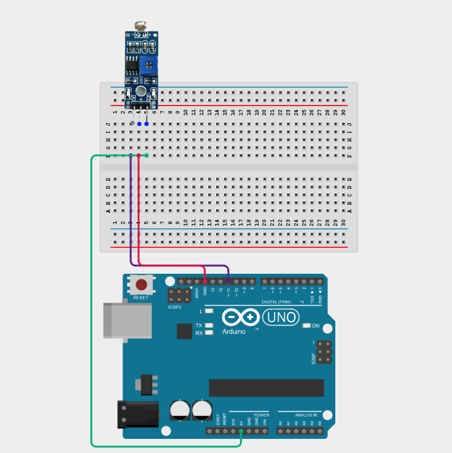

**Step 5:** Place the traffic light module on the breadboard and connect the GND pin of the module to an Arduino GND pin.

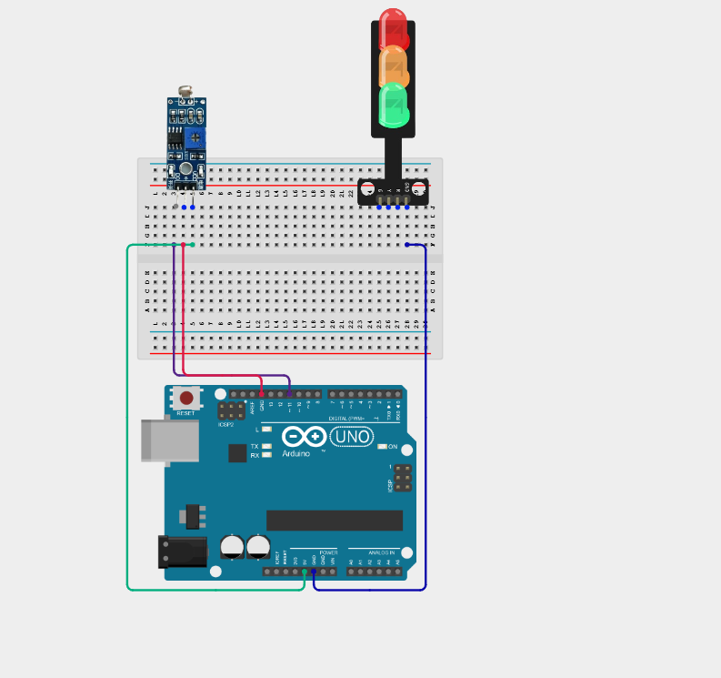

**Step 6:** Connect the G (Green) pin to Digital Pin 3.

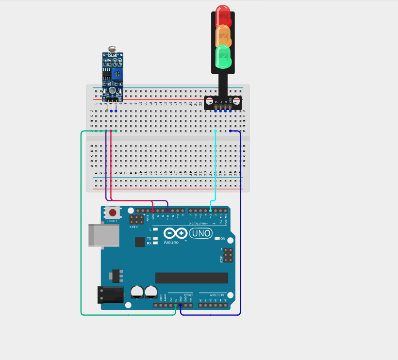

**Step 6:** Connect the Y (Yellow) pin to Digital Pin 4.

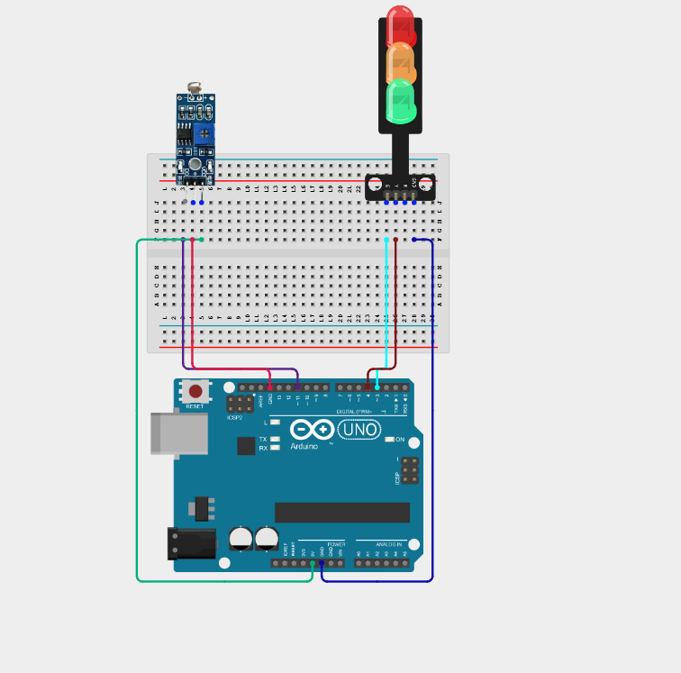

**Step 6:** Connect the R (Red) pin to Digital Pin 5.

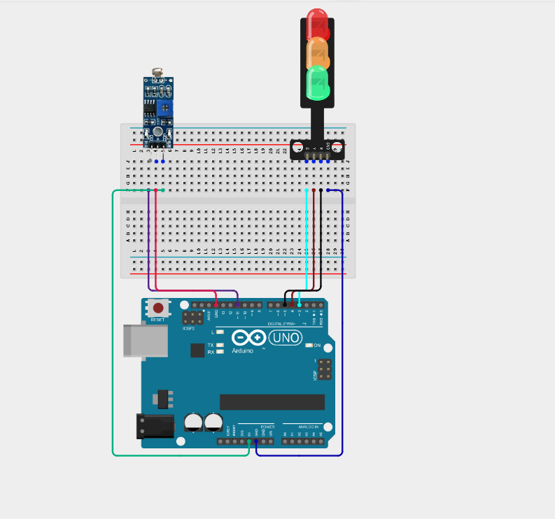

_**NB:** Make sure all components are securely placed on the breadboard with correct orientation._

_Make sure to connect the Arduino USB cable to the Arduino board._

## PROGRAMMING

**Step 1:** Open your Arduino IDE. See how to set up here: [Getting Started](../../Getting Started/Arduino_IDE_Setup.md).

**Step 2:** Type the following code `const int ldrPin = 11;`, `const int greenLED = 3;`, `const int yellowLED = 4;`, `const int redLED = 5;` as shown in the image below.

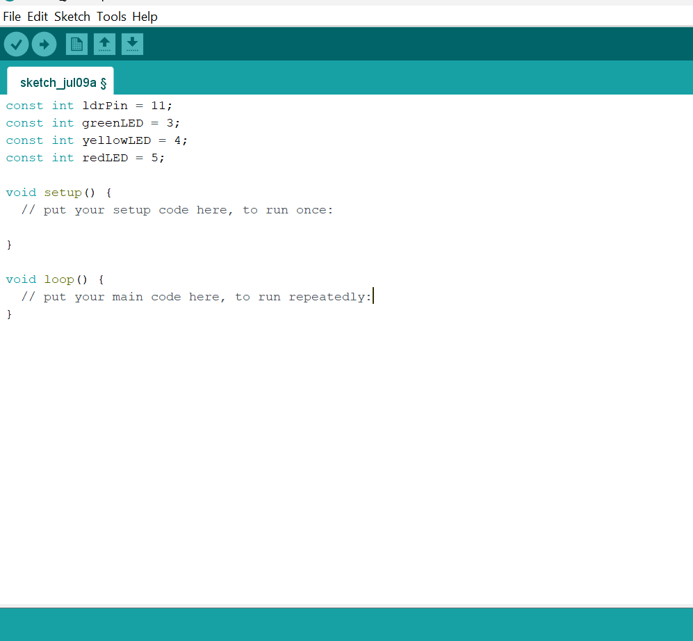

**Step 3:** Type the following code `Serial.begin(9600);`, `pinMode(ldrDigitalPin, INPUT);`, `pinMode(greenLED, OUTPUT);`, `pinMode(yellowLED, OUTPUT);`, `pinMode(redLED, OUTPUT);` inside void setup()  as shown in the image below.
  
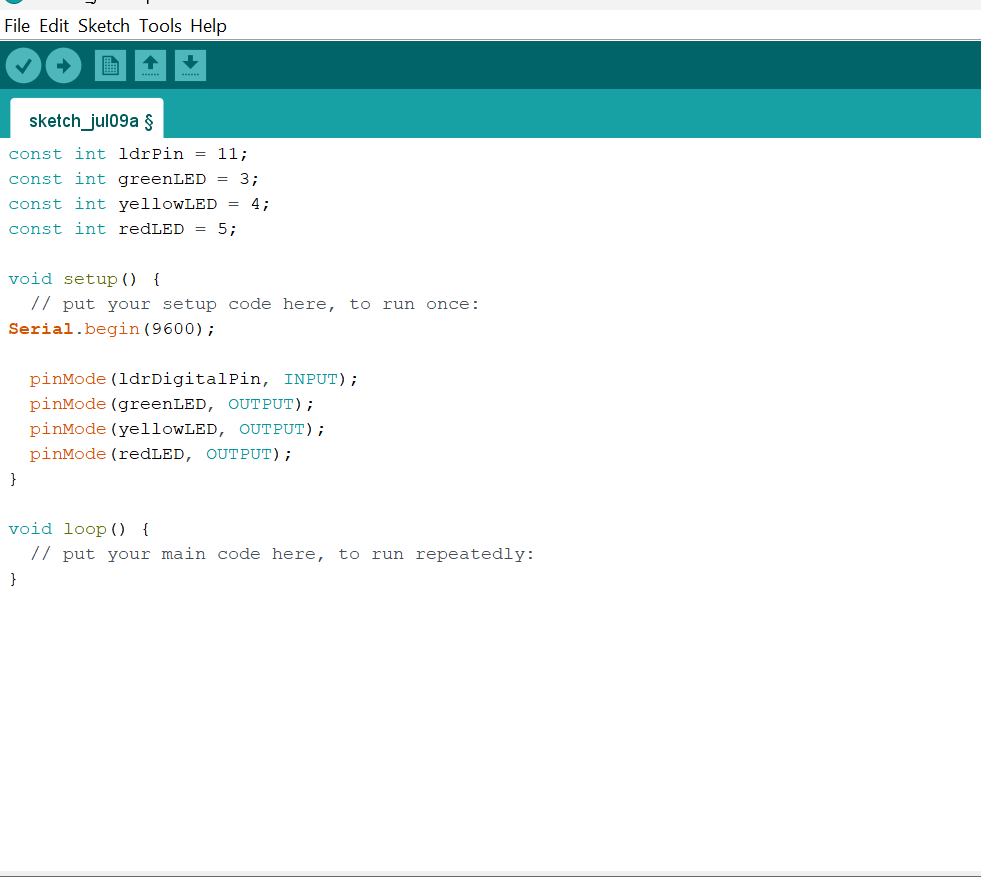

**Step 4:** Type the following code `int isDark = digitalRead(ldrDigitalPin);`, `if (isDark == HIGH)`, `{ Serial.println("Streetlight Status: NIGHT (Red On)");`, `digitalWrite(greenLED, LOW);`, `digitalWrite(yellowLED, LOW);`, `digitalWrite(redLED, HIGH); }`  inside void loop()  as shown in the image below.
  
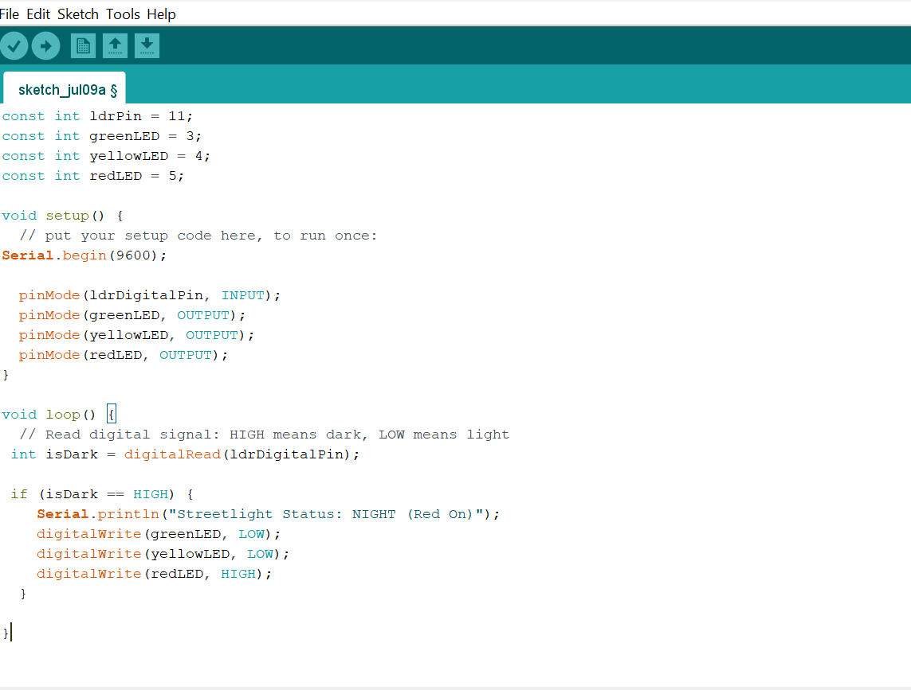

**Step 5:** Type the following code `else { Serial.println("Streetlight Status: DAY (Green On)");`, `digitalWrite(greenLED, HIGH);`, `digitalWrite(yellowLED, LOW);` , `digitalWrite(redLED, LOW); } ` inside void loop()  as shown in the image below.
  
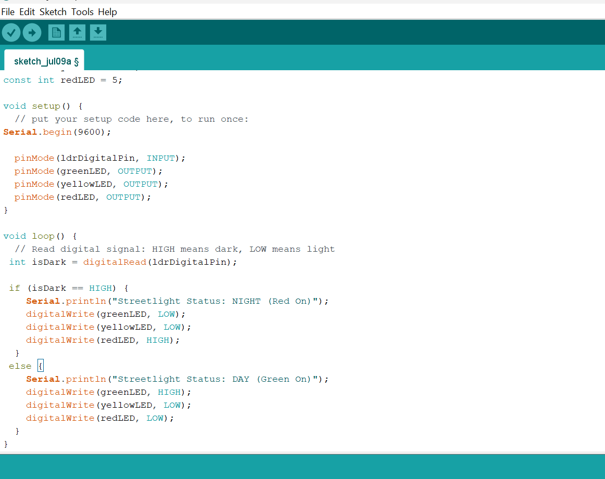

**Step 6:** Save your code. _See the [Getting Started](../../Getting Started/Arduino_IDE_Setup.md) section_

**Step 7:** Select the Arduino board and port. _See the [Getting Started](../../Getting Started/Arduino_IDE_Setup.md) section_

**Step 8:** Upload your code.

## CONCLUSION

This project helps learners understand how to combine multiple components with Arduino to create more complex interactive systems and automation solutions.

