# Project 2.5.3: Light-Sensitive Canopy Controller

| **Description** | This project uses an LDR to detect sunlight intensity and controls a servo motor to extend or retract a shade canopy automatically. |
|------------------|----------------------------------------------------------------|
| **Use case**     | This project can be used in automation systems, interactive installations, and embedded control applications. |

## Components (Things You will need)

| | | | | | |
|-------------------------|-------------------------|-------------------------|-------------------------|-------------------------|-------------------------|

## Building the circuit

Things Needed:

- Arduino Uno = 1
- Arduino USB cable = 1
- LDR module = 1
- Servo motor = 1
- Jumper wires

## Mounting the component on the breadboard

**Step 1:** Place the LDR on the breadboard following the circuit diagram as a guide.

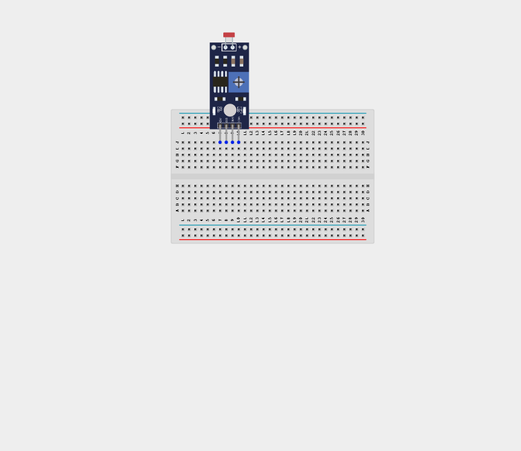

_**NB:** Make sure all components are securely placed on the breadboard with correct orientation._

## WIRING THE CIRCUIT

**Step 2:** Connect a jumper wire from the LDR's VCC pin to the Arduino's 5V pin.

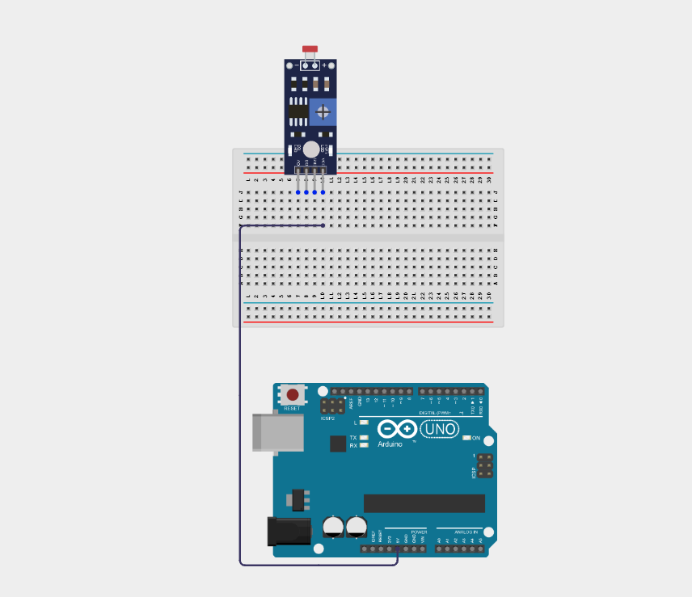

**Step 3:** Connect a jumper wire from the LDR's GND pin to the Arduino's GND pin.

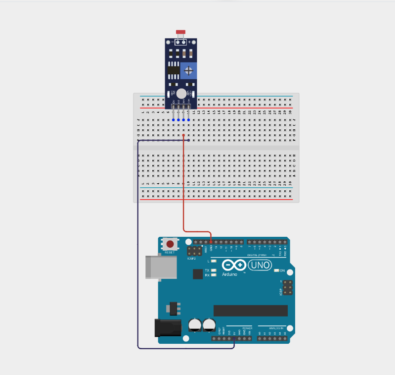

**Step 4:** Connect a jumper wire from the LDR's A0 pin to the Arduino's Analog A0 pin.

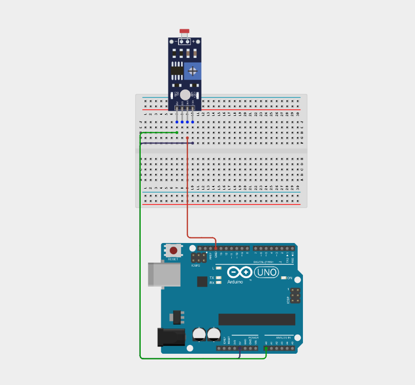

**Step 5:** Connect the servo's Orange/Yellow wire into Arduino Digital Pin 9 using male-to-male jumper wire.

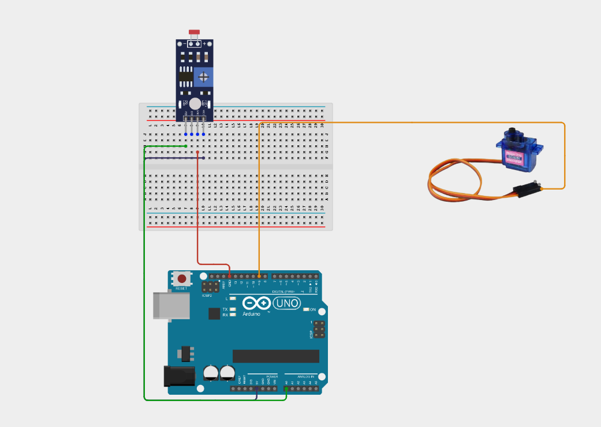

**Step 6:** Connect the servo's Brown/Black wire into the Arduino's GND pin using male-to-male jumper wire.

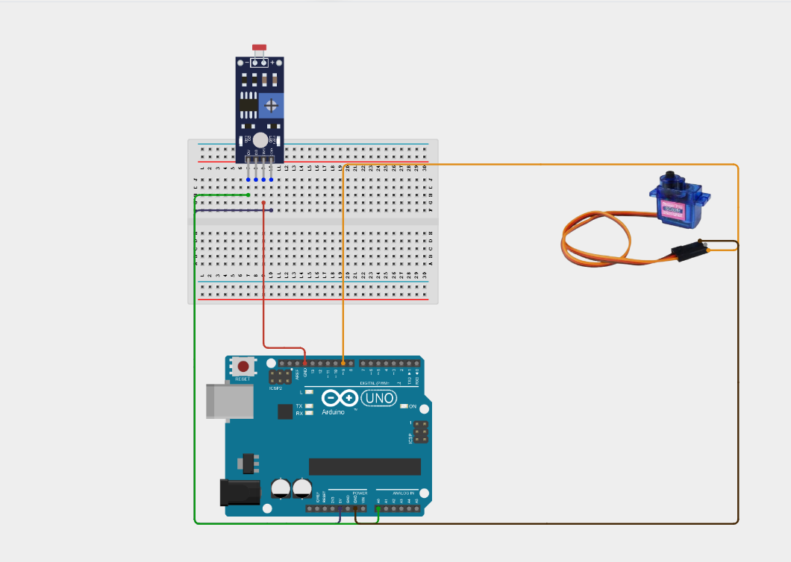

**Step 7:** Connect the servo's Red wire into the Arduino's 5V power line using male-to-male jumper wire.

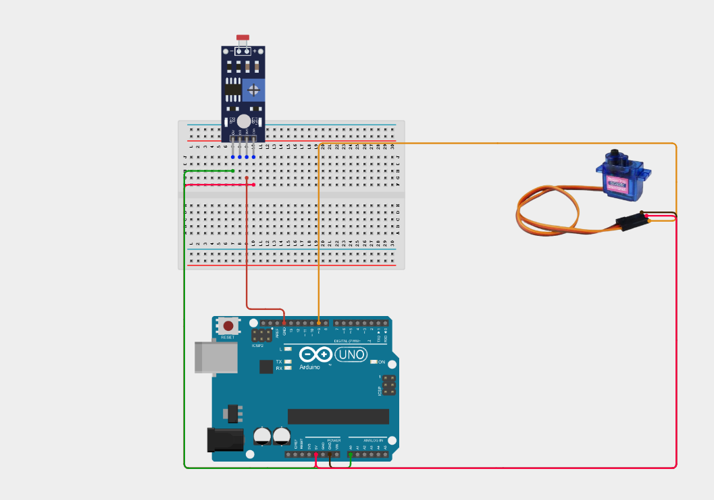

_Make sure to connect the Arduino USB cable to the Arduino board and fix the servo blade firmly on the servo motor_

## PROGRAMMING

**Step 1:** Open your Arduino IDE. See how to set up here: [Getting Started](../../Getting Started/Arduino_IDE_Setup.md).

**Step 2:** Type the following code in your Arduino IDE: `#include <Servo.h>`, `const int ldrAnalogPin = A0;`, `const int servoPin = 9;`, `Servo canopyServo;` as shown in the image below.

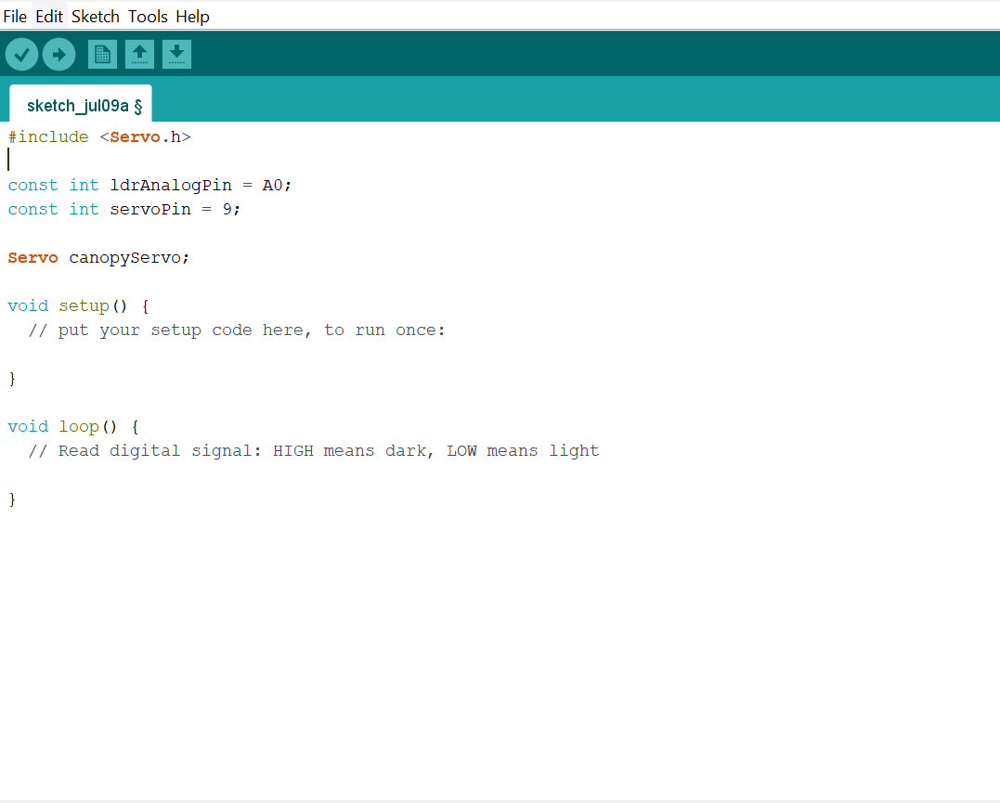

**Step 3:** Type the following code `Serial.begin(9600);`, `canopyServo.attach(servoPin);`, ` canopyServo.write(0);` inside the void setup() as shown in the image below.

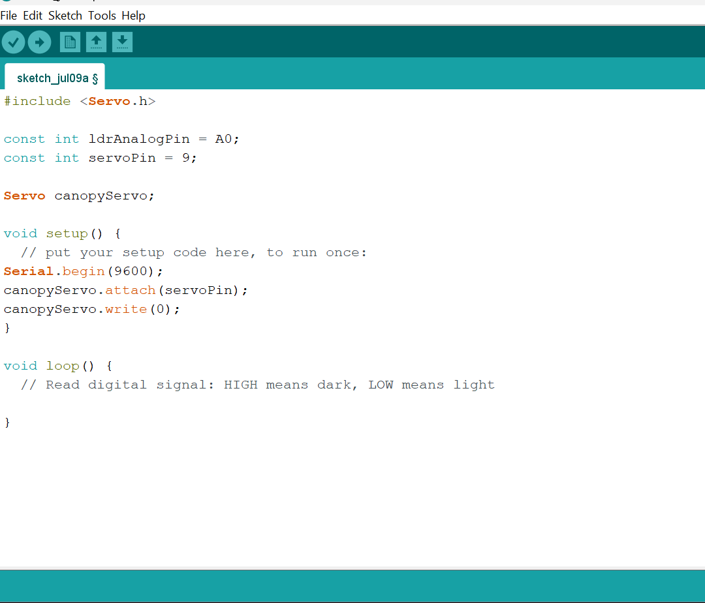

**Step 4:** Type the following code `int lightLevel = analogRead(ldrAnalogPin);`, `Serial.print("Sunlight Value: ");`, `Serial.println(lightLevel);` inside the void loop() as shown in the image below.

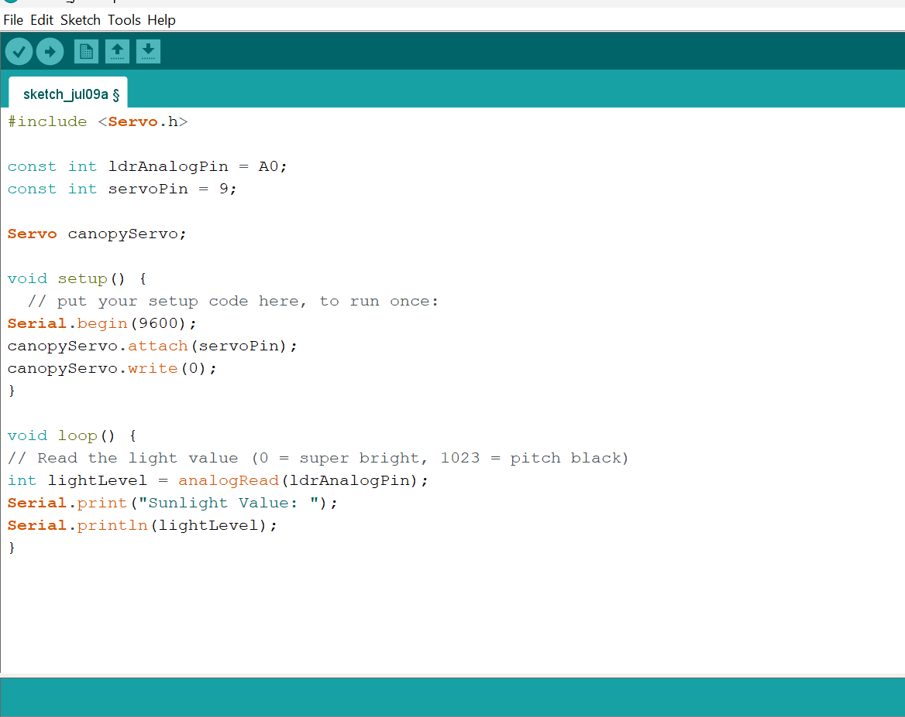

**Step 5:** Type the following code `if (lightLevel < 400) {`, `Serial.println("-> Bright Sunlight! EXTENDING Canopy.");`, `canopyServo.write(180); }` as shown in the image below.

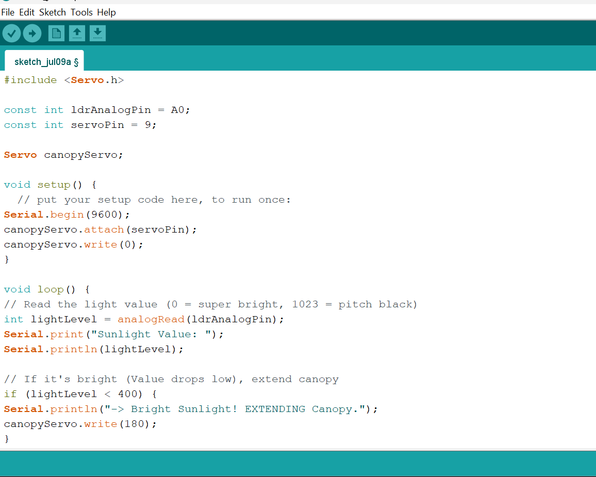

**Step 6:** Type the following code `else if (lightLevel > 700) { `, ` Serial.println("-> Dark/Cloudy. RETRACTING Canopy.");`, `canopyServo.write(0);  }`, `delay(500);`  as shown in the image below.

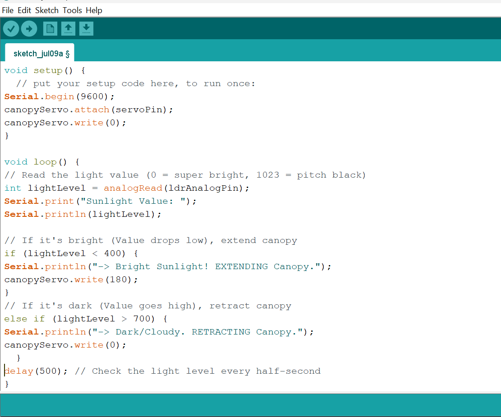

**Step 7:** Save your code. _See the [Getting Started](../../Getting Started/Arduino_IDE_Setup.md) section.

**Step 8:** Select the Arduino board and port. _See the [Getting Started](../../Getting Started/Arduino_IDE_Setup.md) section_

**Step 9:** Upload your code.

## CONCLUSION

This project helps learners understand how to combine multiple components with Arduino to create more complex interactive systems and automation solutions.

