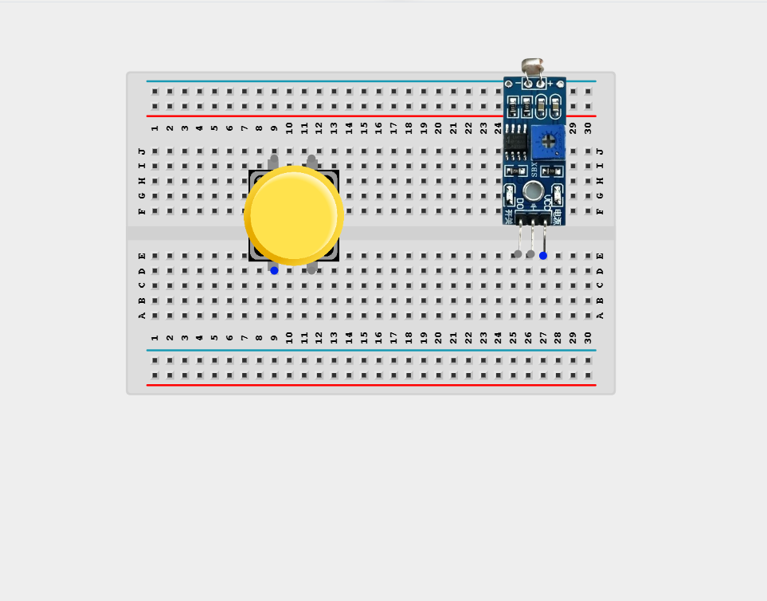
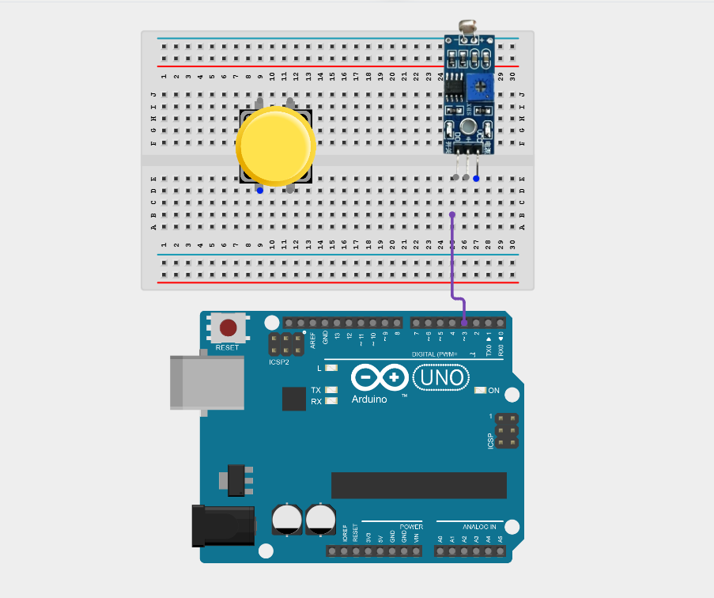
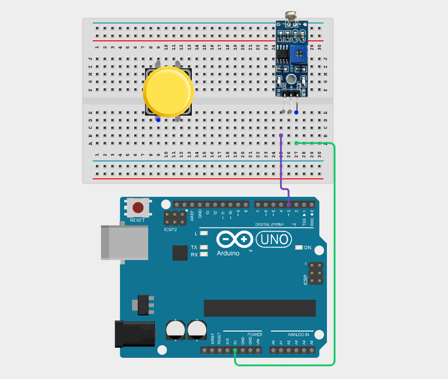
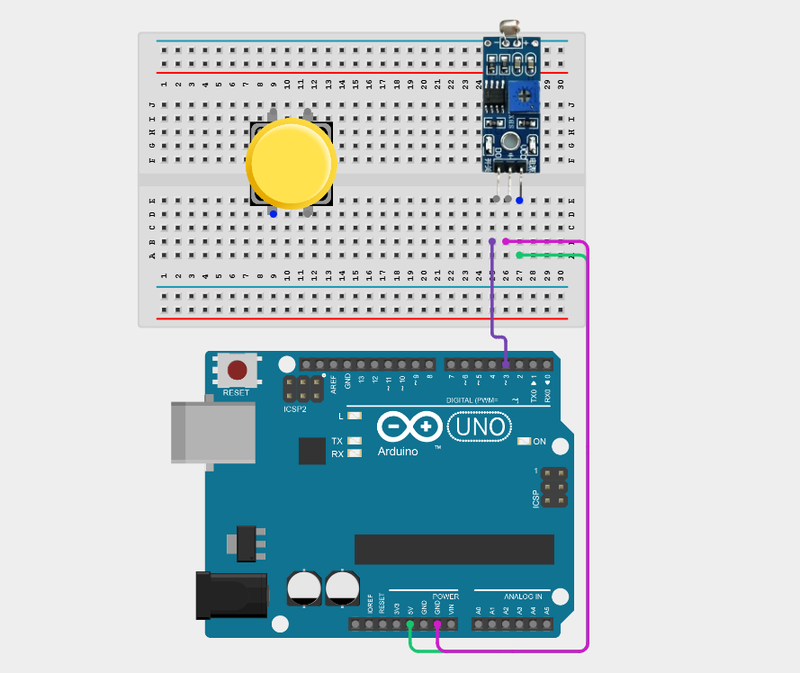
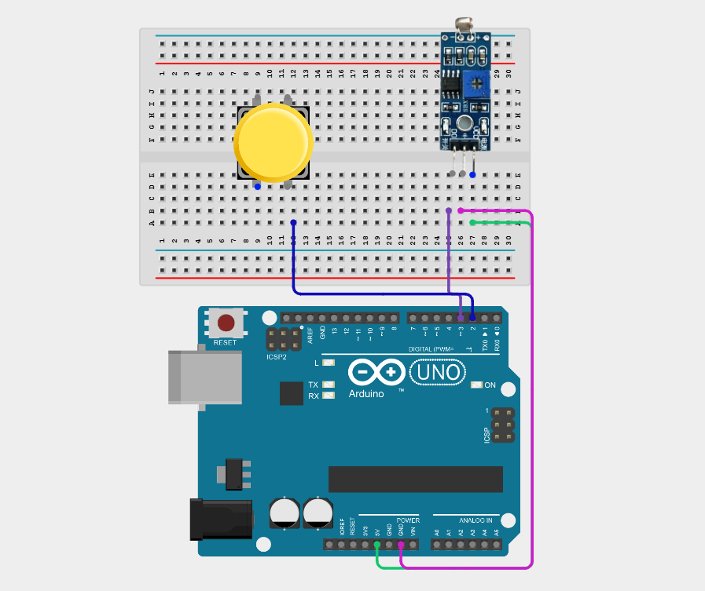
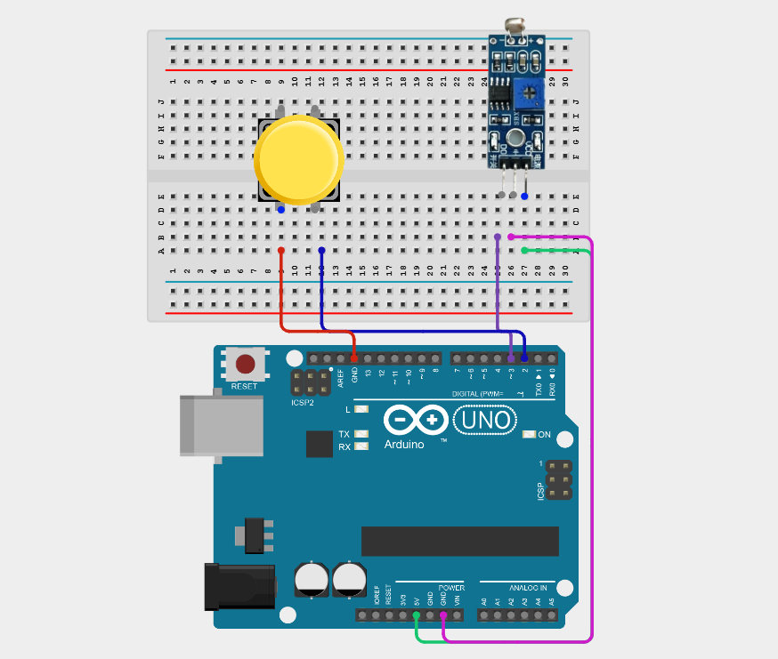
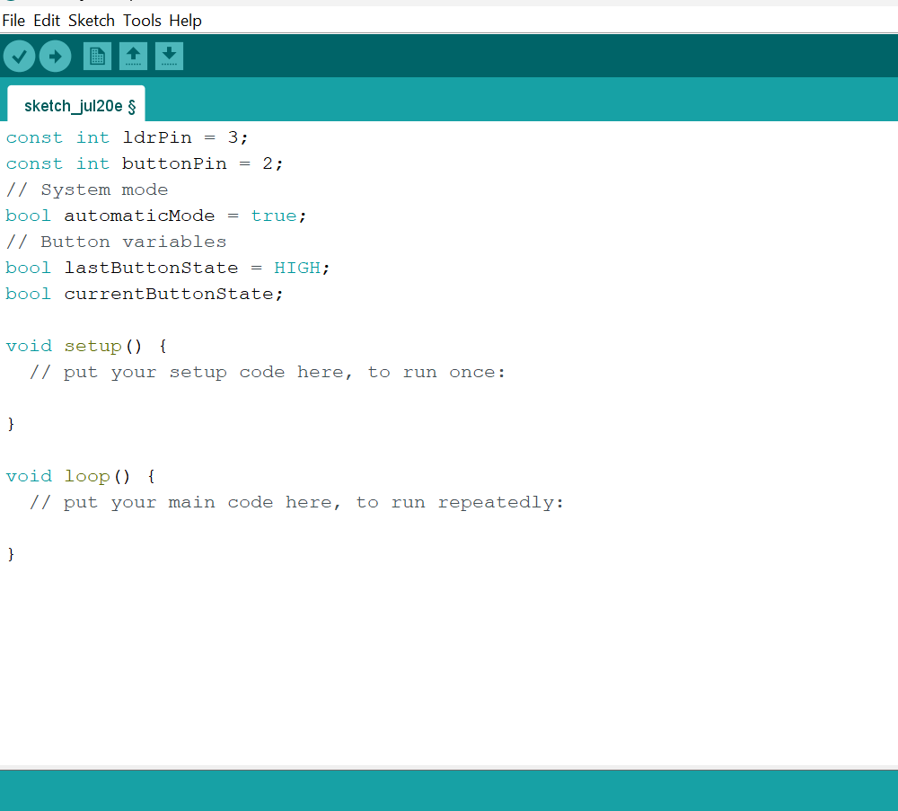
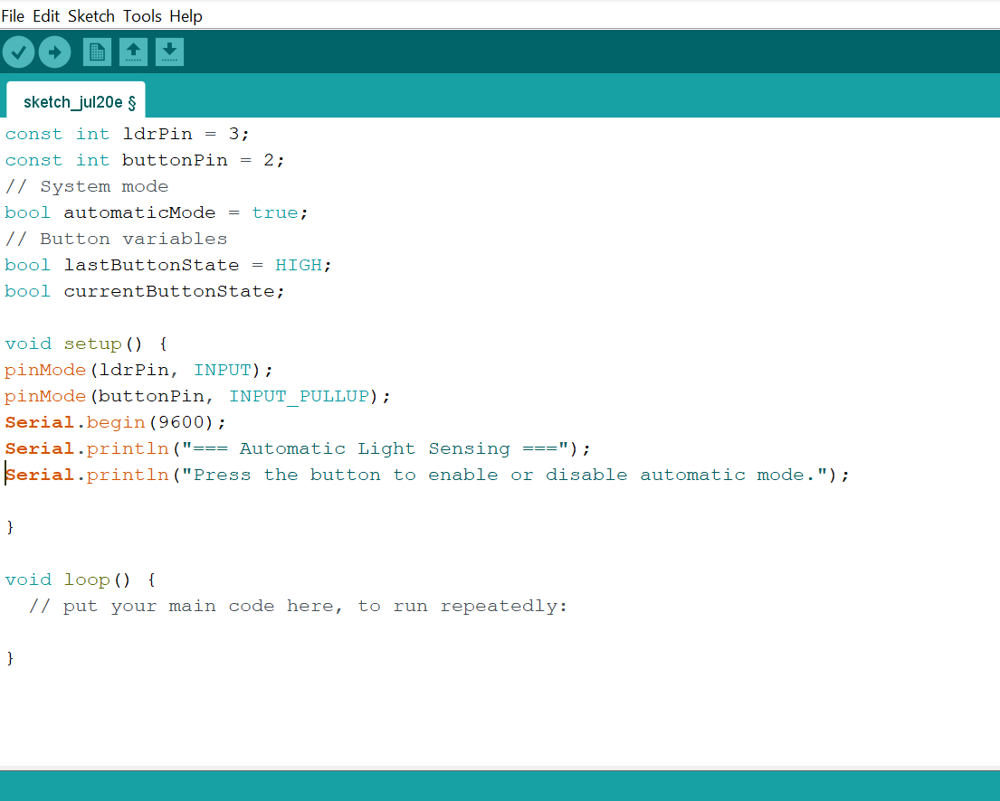
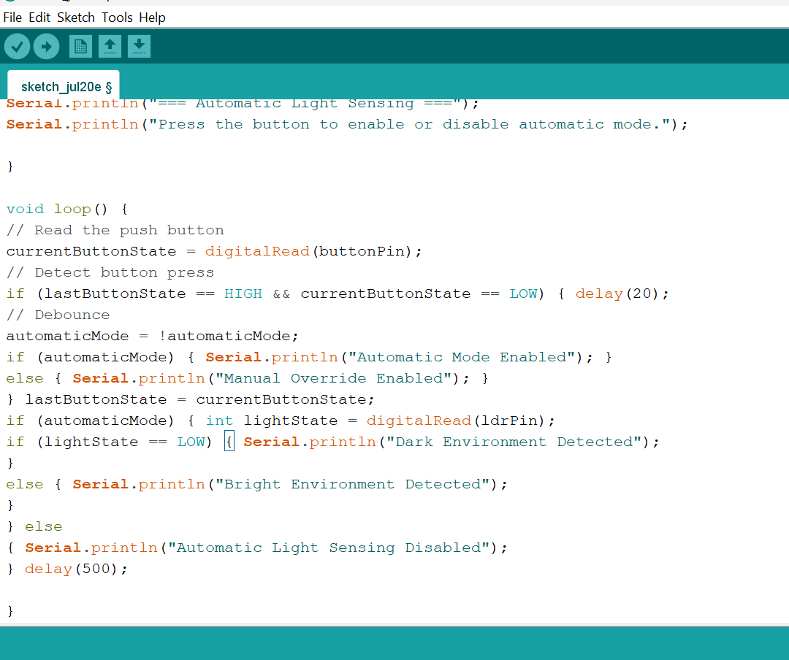

# Project 2.5.4: Manual Night Override

| **Description** | This project uses a push button to override the automatic reading of an LDR, allowing manual control when the automatic light sensing is not desired. |
|------------------|----------------------------------------------------------------|
| **Use case**     | This project can be used in smart lighting systems, home automation, industrial control panels, and energy management systems, where users can manually override automatic light sensing when needed. |

## Components (Things You will need)

|  |  |  |  |  |  |
| --- | --- | --- | --- | --- | --- |

## Building the circuit

Things Needed:

- Arduino Uno = 1
- Arduino USB cable = 1
- Push button = 1
- LDR module = 1
- Breadboard = 1
- Jumper wires

## Mounting the component on the breadboard

**Step 1:** Place the LDR module and the Push button on the breadboard.

_**NB:** Make sure all components are securely placed on the breadboard with correct orientation._

## WIRING THE CIRCUIT

**Step 2:** Connect the D0 pin of the LDR sensor module to Digital Pin 3 on the Arduino using male-to-male jumper wire.

**Step 3:** Connect the VCC pin of the LDR sensor module to the Arduino 5V pin using male-to-male jumper wire.

**Step 4:** Connect the GND or negative (-) pin of the LDR sensor module to the Arduino GND pin using male-to-male jumper wire.

**Step 5:** Connect one terminal of the push button to Digital Pin 2 on the Arduino using male-to-male jumper wire.

**Step 6:** Connect one the other terminal of the push button to GND on the Arduino using male-to-male jumper wire.

_Make sure to connect the Arduino USB cable to the Arduino board._

## PROGRAMMING

**Step 1:** Open your Arduino IDE. See how to set up here: [Getting Started](../../Getting Started/Arduino_IDE_Setup.md).

**Step 2:** Type the following code in your Arduino IDE: `const int ldrPin = 3; `, `const int buttonPin = 2;`, `bool automaticMode = true;`, `bool lastButtonState = HIGH;`,`bool currentButtonState;`  as shown in the image below.

**Step 3:** Type the following code in your Arduino IDE inside the void setup() function: `pinMode(ldrPin, INPUT);`, `pinMode(buttonPin, INPUT_PULLUP);`, `Serial.begin(9600);`, `Serial.println("=== Automatic Light Sensing ===");`,`Serial.println("Press the button to enable or disable automatic mode.");`  as shown in the image below.

**Step 4:** Type the following code in your Arduino IDE inside the void setup() function: `currentButtonState = digitalRead(buttonPin);`, `if (lastButtonState == HIGH && currentButtonState == LOW) { delay(20); `, `automaticMode = !automaticMode;`, `if (automaticMode) { Serial.println("Automatic Mode Enabled"); }`,`else { Serial.println("Manual Override Enabled"); } } `, `lastButtonState = currentButtonState; `, `if (automaticMode) { int lightState = digitalRead(ldrPin);`, `if (lightState == LOW) { Serial.println("Dark Environment Detected"); }`, `else { Serial.println("Bright Environment Detected");} }`, `else `, `{ Serial.println("Automatic Light Sensing Disabled"); }`, `delay(500);`  as shown in the image below.

**Step 5:** Save your code. _See the [Getting Started](../../Getting Started/Arduino_IDE_Setup.md) section_

**Step 6:** Select the Arduino board and port. _See the [Getting Started](../../Getting Started/Arduino_IDE_Setup.md) section_

**Step 7:** Upload your code.

## CONCLUSION

This project helps learners understand how to combine multiple components with Arduino to create more complex interactive systems and automation solutions.

