# Project 2.6.1: SMART SOUND ALERT SYSTEM 

| **Description** | This project shows how to use an ultrasonic sensor and a buzzer with an Arduino Uno to create a smart sound alert system. When an object comes close to the sensor, the buzzer produces a sound alert. |
|------------------|----------------------------------------------------------------|
| **Use case**     |This project can be used as a simple security or obstacle detection system that alerts users when an object is nearby.  |

## Components (Things You will need)

|  |  |  |  |  |  |
| --------------------------------------------------- | ------------------------------------------------------ | ----------------------------------------------------------- | --------------------------------------------------------- | ------------------------------------------------------ | ------------------------------------------------------ |
## Building the circuit

Things Needed:

-	1 Arduino Uno 
-	1 Arduino USB cable 
-	1 Buzzer
-	1 Breadboard 
-	6 Jumper wires

## Mounting the component on the breadboard

**Step 1:** Place the ultrasonic sensor on the breadboard.

.

**Step 2:** Connect the Echo pin of the ultrasonic sensor to pin 2 on the Arduino Uno. 

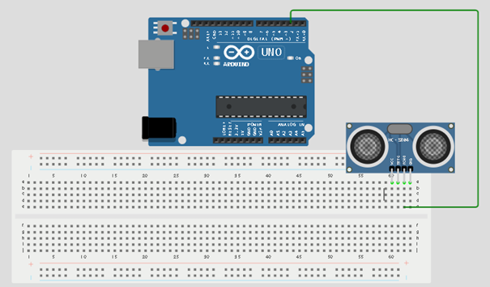.

## WIRING THE CIRCUIT

**Step 3:** Connect the Trig pin of the ultrasonic sensor to pin 3 on the Arduino Uno.

.

**Step 4:** Connect the VCC pin of the ultrasonic sensor to the 5V pin on the Arduino Uno.

.

**Step 5:** Connect the GND pin of the ultrasonic sensor to GND on the Arduino Uno.

.

**Step 6:** Place the buzzer on the breadboard. The longer pin is positive while the shorter pin is negative.

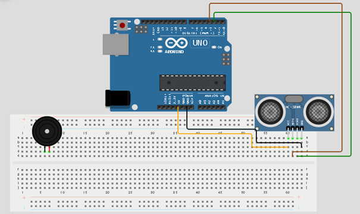.

**Step 7:** Connect the positive pin of the buzzer to pin 4 on the Arduino Uno.

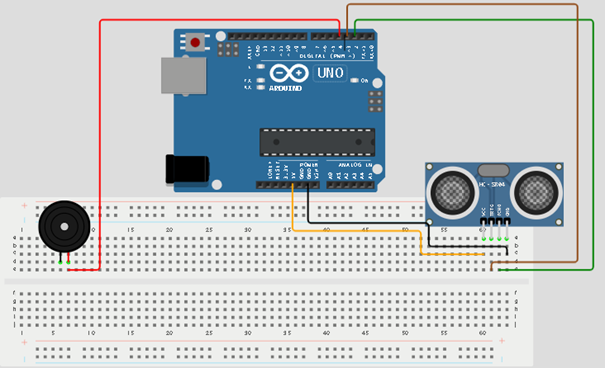.

**Step 8:** Connect the negative pin of the buzzer to GND on the Arduino Uno.

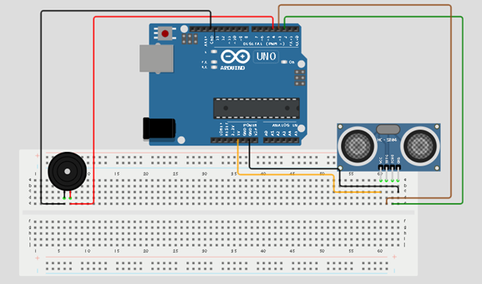.

## PROGRAMMING

**Step 1:** Open your Arduino IDE. See how to set up here: [Getting Started](../../Getting Started/Arduino_IDE_Setup.md).

**Step 2:** Type before the void setup(){}```const int Echo = 2;``` as shown in the picture below.

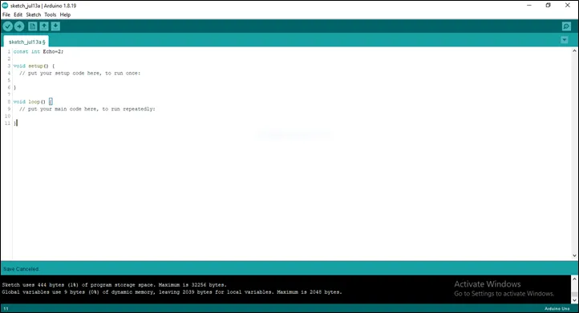.

**Step 3:** Type before the void setup(){} ```int Trig = 3;``` as shown in the picture below.

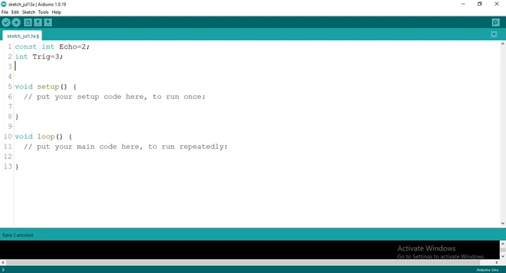.

**Step 4:** Type before the void setup(){} ```int B = 4;``` as shown in the picture below.

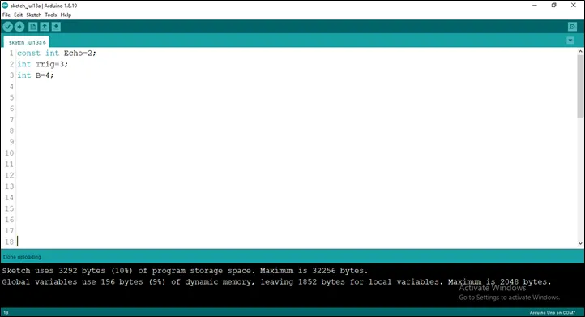.

**Step 5:** Type before the void setup(){} 

    ``` cpp
    long duration;
    int distance;
    ``` 
    as shown in the picture below.

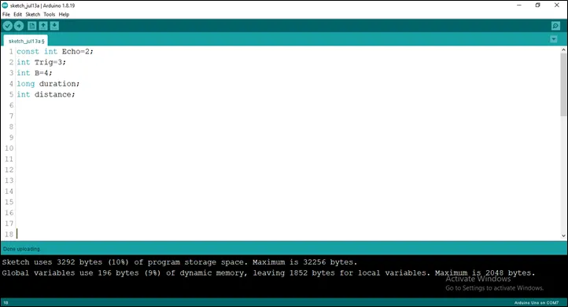.

**Step 6:** Type before the void setup(){} ```const int dist_threshold = 20;``` as shown in the picture below.

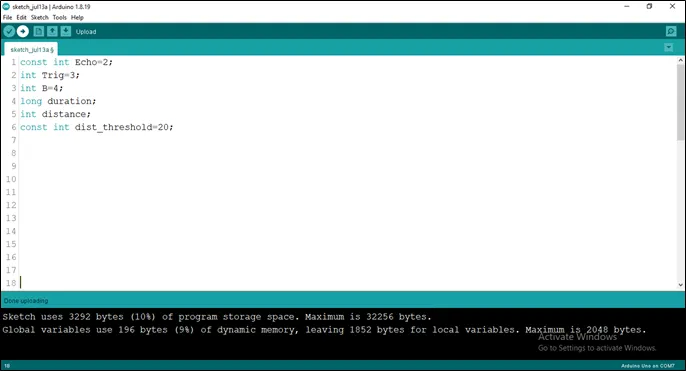.

**Step 7:** After the (void setup ()) within the curly brackets type 

    ``` cpp
    pinMode (Echo, INTPUT); 
    pinMode (Trig, OUTPUT); 
    Serial.begin (9600);
    pinMode (B, OUTPUT);
    ``` 

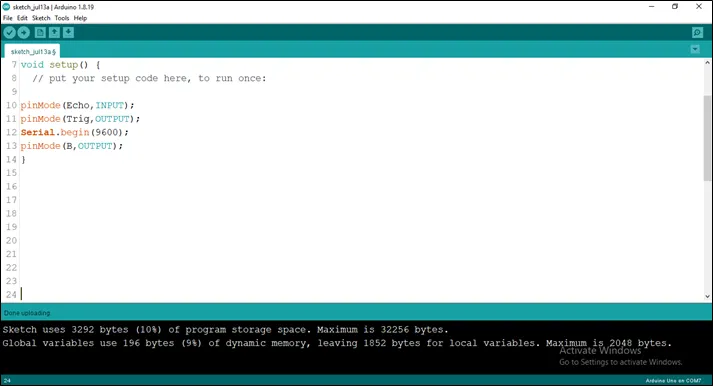.

**Step 8:** After the (void loop ()) within the curly brackets type 

    ``` cpp
    digitalWrite (Trig, LOW); 
    delay (200);
    digitalWrite (Trig, HIGH); 
    delay (100);
    digitalWrite (Trig, LOW); 
    duration = pulseIn (Echo, HIGH);
    distance = duration * 0.034/2;
    ``` 

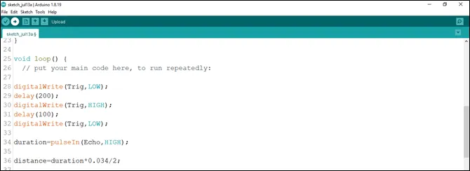.

**Step 9:** Type Function

    ``` cpp
    if (distance < dist_threshold)
    {
        digitalWrite (B, HIGH); 
        delay (200);
        digitalWrite (B, LOW); 
        Serial.print (distance);
        Serial.println (“cm”);
        delay (100);
        distance = duration * 0.034/2;
    }
    ```

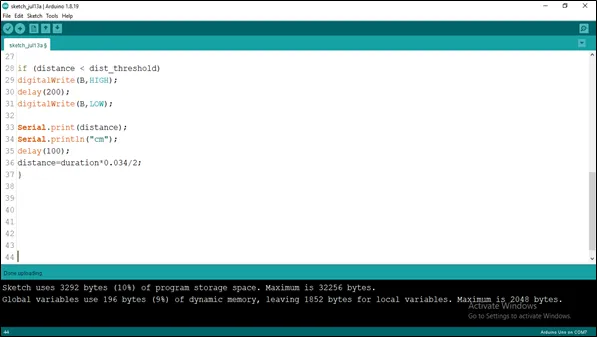.

**Step 10:** Save your code. _See the [Getting Started](../../Getting Started/Arduino_IDE_Setup.md) section_

**Step 11:** Select the arduino board and port _See the [Getting Started](../../Getting Started/Arduino_IDE_Setup.md) section:Selecting Arduino Board Type and Uploading your code_.

**Step 12:** Upload your code. _See the [Getting Started](../../Getting Started/Arduino_IDE_Setup.md) section:Selecting Arduino Board Type and Uploading your code_

 ## OBSERVATION
The Serial Monitor displays distance values continuously. When an object comes closer than 20 centimetres, the buzzer produces a sound alert.

## CONCLUSION

This project helps learners understand how to combine sensors and output devices using Arduino. It introduces distance measurement, object detection, and alarm systems in electronics and programming.
