# Project 2.7.3: Proximity Alarm Radar

| **Description** | This project uses an ultrasonic sensor to measure distance and makes a buzzer beep at a rate that increases as an object approaches, mimicking vehicle parking radar. |
|------------------|----------------------------------------------------------------|
| **Use case**     | This project can be used in automation systems, interactive installations, and embedded control applications. |

## Components (Things You will need)

| | | | | | |
|-------------------------|-------------------------|-------------------------|-------------------------|-------------------------|-------------------------|

## Building the circuit

Things Needed:

- Arduino Uno = 1
- Arduino USB cable = 1
- Ultrasonic sensor = 1
- Buzzer = 1
- Jumper wires

## Mounting the component on the breadboard

**Step 1:** Place the Ultrasonic sensor and the Buzzer on the breadboard.

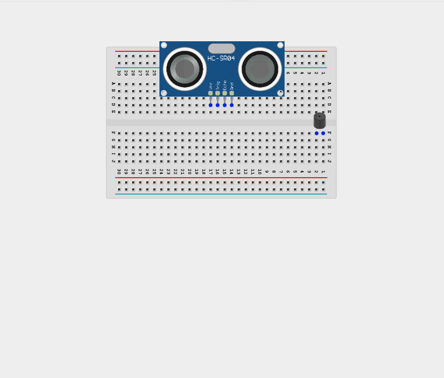

_**NB:** Make sure all components are securely placed on the breadboard with correct orientation._

## WIRING THE CIRCUIT

**Step 2:** Connect the VCC pin of the sensor to the 5V pin on the Arduino using a male-to-male jumper wire.

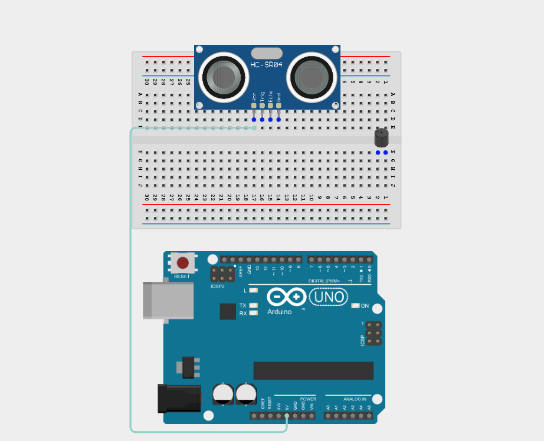

**Step 3:** Connect the GND pin of the sensor to the GND pin on the Arduino using a male-to-male jumper wire.

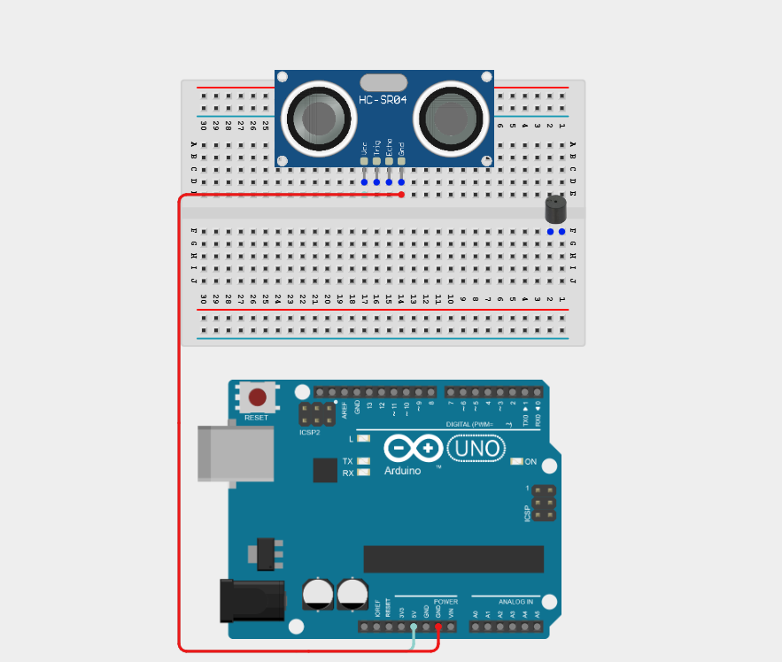

**Step 4:** Connect the TRIG pin of the ultrasonic sensor to Digital Pin 9 on the Arduino using a male-to-male jumper wire.

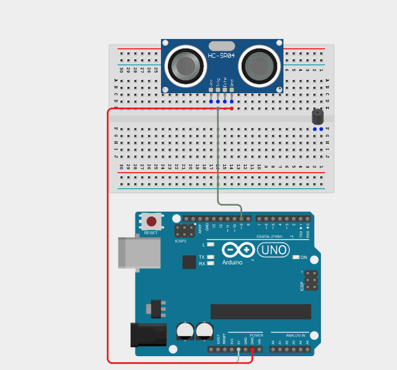

**Step 5:** Connect the ECHO pin of the ultrasonic sensor to Digital Pin 10 on the Arduino using a male-to-male jumper wire.

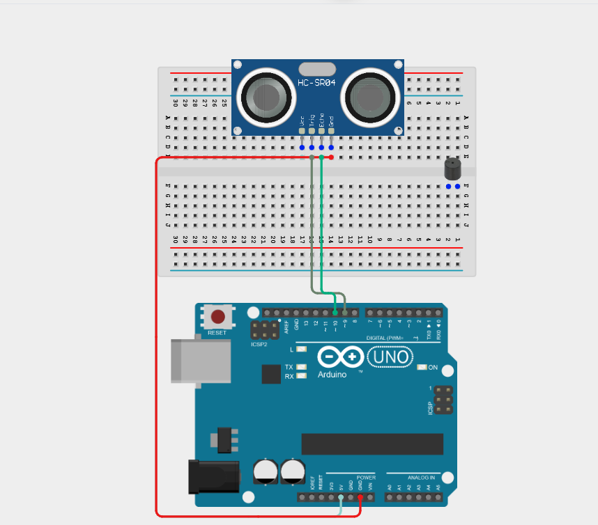

**Step 6:** Connect the positive pin (long pin) of the buzzer to Digital Pin 8 on the Arduino using a male-to-male jumper wire.

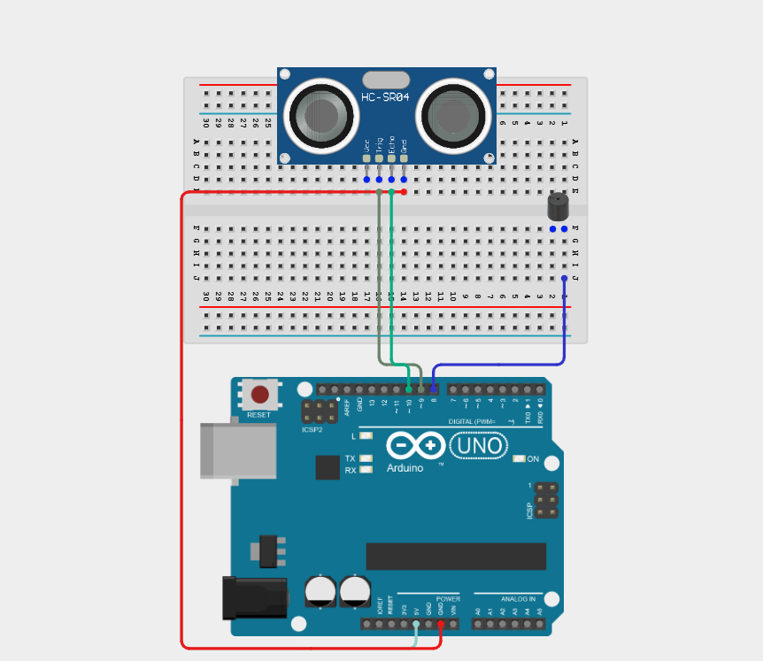

**Step 7:** Connect the GND pin of the buzzer to GND pin on the Arduino using a male-to-male jumper wire.

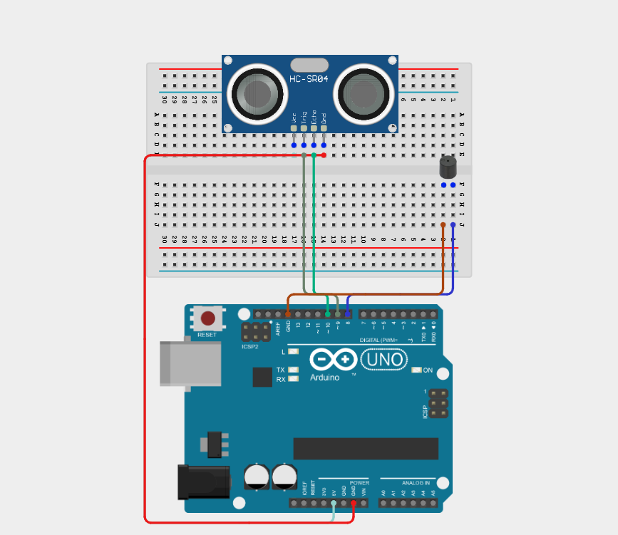

_Make sure to connect the Arduino USB cable to the Arduino board._

## PROGRAMMING

**Step 1:** Open your Arduino IDE. See how to set up here: [Getting Started](../../Getting Started/Arduino_IDE_Setup.md).

**Step 2:** Type the following code in your Arduino IDE: `const int trigPin = 9;`, `const int echoPin = 10;`, `const int buzzer = 8`, `long duration;`, `float distance;` as shown in the image below.

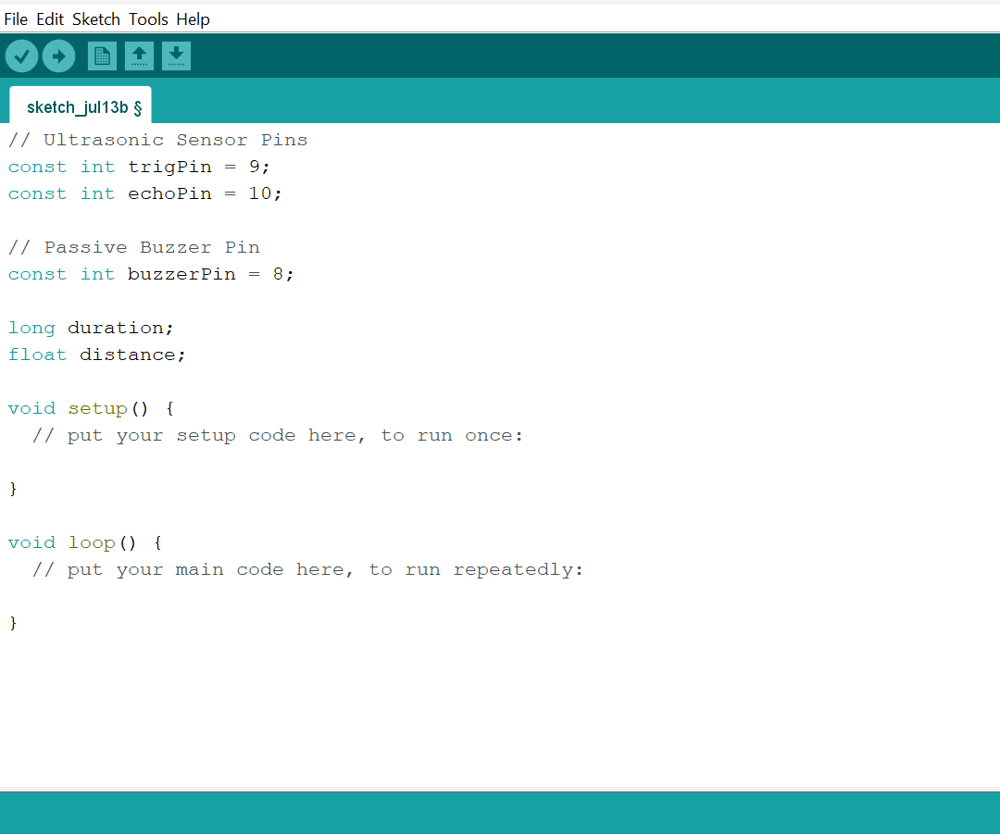

**Step 3:** Type the following code in your Arduino IDE inside the void setup() `pinMode(trigPin, OUTPUT);`, `pinMode(echoPin, INPUT);`, `pinMode(buzzerPin, OUTPUT);`, `  Serial.begin(9600);` as shown in the image below.

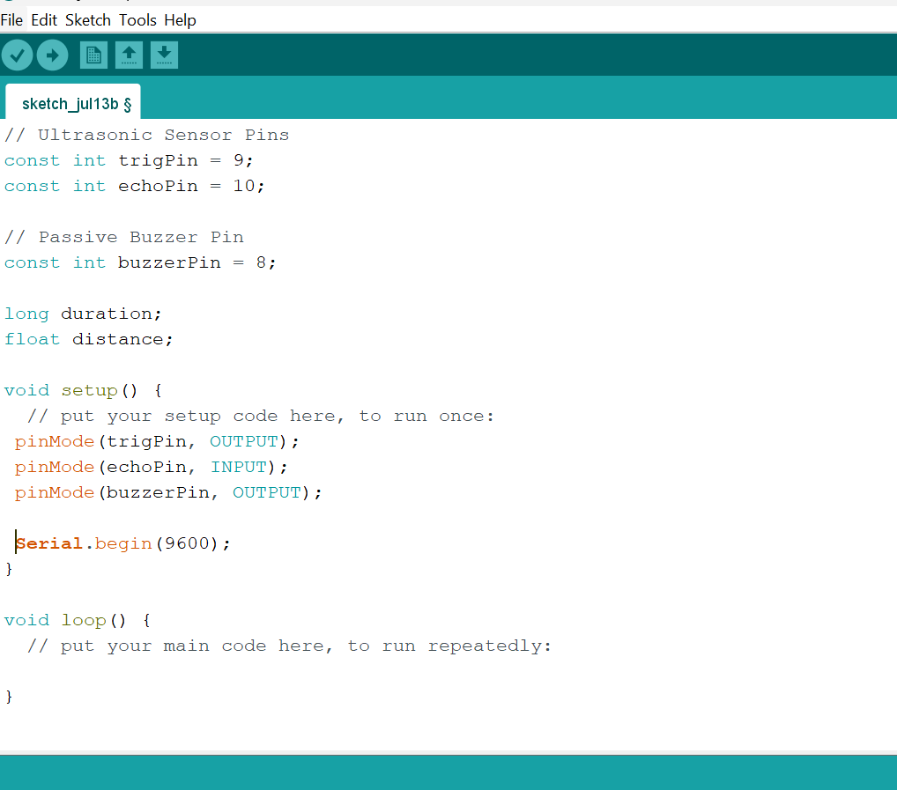

**Step 4:** Type the following code in your Arduino IDE inside the void loop() `digitalWrite(trigPin, LOW);`, `delay(2000);`, `digitalWrite(trigPin, HIGH);`, `delay(1000);`, `digitalWrite(trigPin, LOW);`, `duration = pulseIn(echoPin, HIGH);`, `distance = duration * 0.0343 / 2;`, ` Serial.print("Distance: ");`, `Serial.print(distance);`, `  Serial.println(" cm");` as shown in the image below.

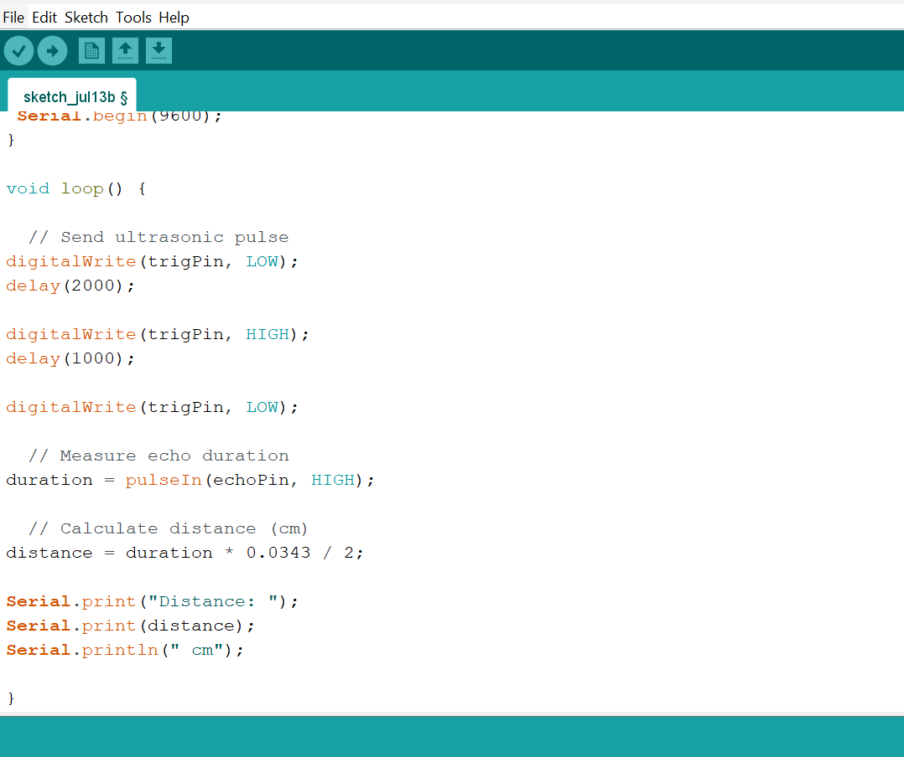

**Step 5:** Type the following code in your Arduino IDE inside the void loop() `if (distance > 50) { `, `noTone(buzzerPin); }`, `else if (distance > 30) { `, ` tone(buzzerPin, 1000);`, `delay(500);`, `noTone(buzzerPin);`, `delay(500); }` as shown in the image below.

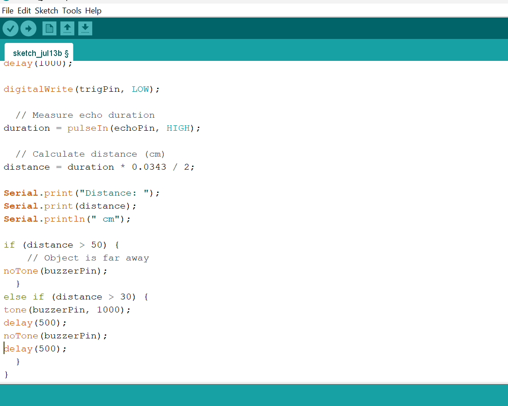

**Step 6:** Type the following code in your Arduino IDE inside the void loop() `else if (distance > 20) {`, `tone(buzzerPin, 1000);`, `delay(300);`, `noTone(buzzerPin);`, `delay(300); }`, `else if (distance > 10) { `, `tone(buzzerPin, 1000);`, `delay(150);`, `noTone(buzzerPin);`, ` delay(150); }`   as shown in the image below.  

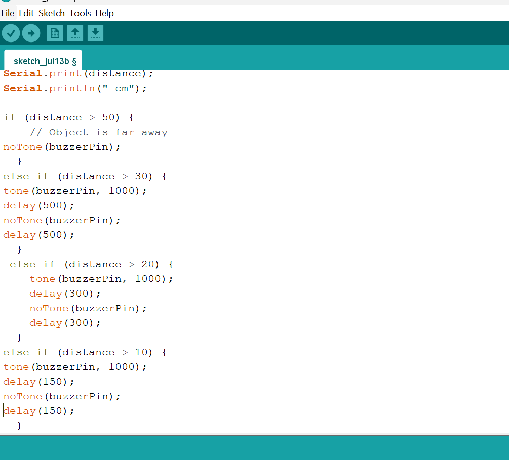

**Step 7:** Type the following code in your Arduino IDE inside the void loop() `else { ` ,  `tone(buzzerPin, 1000); } ` as shown in the image below. 

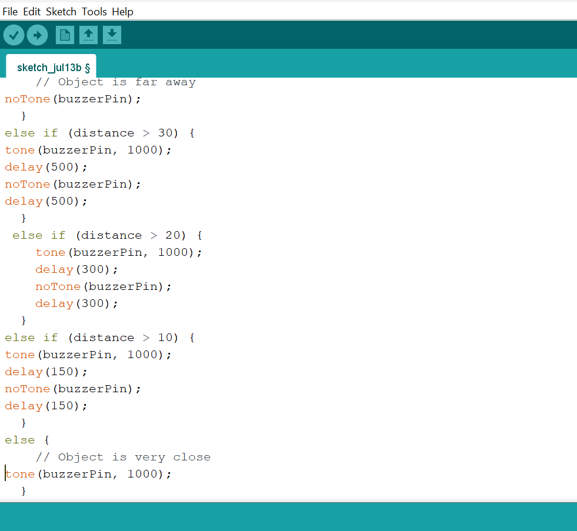

**Step 8:** Save your code. _See the [Getting Started](../../Getting Started/Arduino_IDE_Setup.md) section_

**Step 9:** Select the Arduino board and port. _See the [Getting Started](../../Getting Started/Arduino_IDE_Setup.md) section_

**Step 10:** Upload your code.

## CONCLUSION

This project helps learners understand how to combine multiple components with Arduino to create more complex interactive systems and automation solutions.

